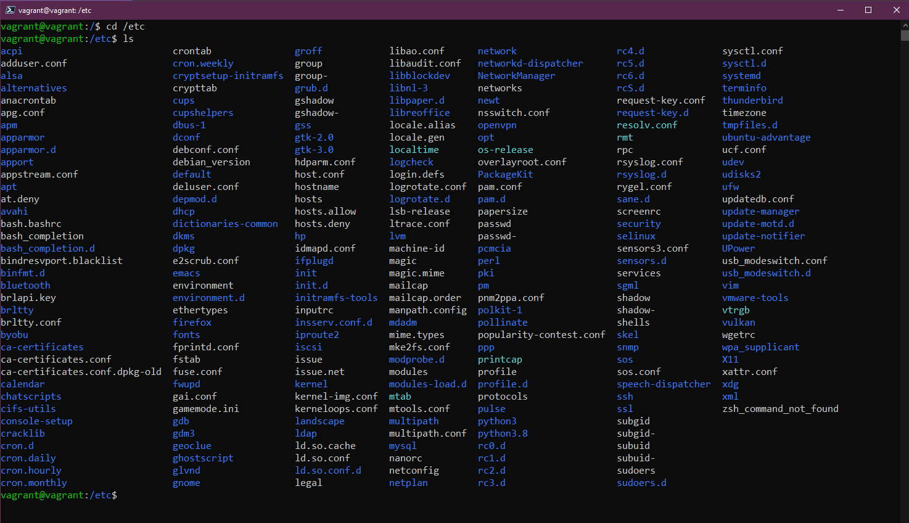

## Linux Sistemi, Dosya Sistemi ve Depolama Yönetimi

Bugüne kadar Linux ve DevOps ile tanıştık. Vagrant ile laboratuvar ortamımızı kurduk [(Gun 14)](day14.md) ve terminalde günlük işlerimiz için kullanacağımız komutlara kısaca göz attık [(Gun 15)](day15.md).

Bugün Linux sistemlerde güncellemeler, genel olarak yazılım kurulumu gibi önemli alanlara bakacağız. Ayrıca sistem dosyaları ve nasıl kullanıldıkları hakkında da biraz bilgi vermeye çalışacağız. Son olarak depolamaya göz atacağız.

## Ubuntu ve Yazılım Yönetimi

İlk olarak, işletim sistemimizi nasıl güncelleyeceğimizi görelim. Windows veya macOS işletim sistemlerinde bu işlemle tanışmış olabilirsiniz. Ancak masaüstü veya sunucu Linux'unda biraz farklıdır.

Güncellemeleri ve yazılım kurulumlarını yapmak için kullanacağımız paket yöneticisi olan apt'yi göreceğiz Ubuntu sanal makinasında.

Genellikle Debian tabanlı dağıtımlarda, yazılım kurulumlarından önce merkezi depoların en son güncellemelerini almak için aşağıdaki komutu kullanırız:

```shell
sudo apt-get update
```


Şimdi, en son işletim sistemi güncellemeleriyle güncellenmiş bir Ubuntu sanal makineye sahibiz. Şimdi bir yazılım kurmak istiyoruz.

figlet adında bir metin bannerları oluşturan bir program seçelim.

Eğer terminalde figlet yazarsanız, sistemimizde yüklü olmadığını göreceksiniz.


Ancak, bize apt ile ilgili bazı kurulum seçenekleri sunar. Bu, varsayılan depolarda figlet adında bir program olduğu anlamına gelir. sudo apt install figlet komutunu deneyelim.


Linux Sistemi, Dosya Sistemi ve Depolama Yönetimi
Bugüne kadar Linux ve DevOps ile tanıştık. Vagrant ile laboratuvar ortamımızı kurduk (Gün 14) ve terminalde günlük işlerimiz için kullanacağımız komutlara kısaca göz attık (Gün 15).

Bugün Linux sistemlerde güncellemeler, genel olarak yazılım kurulumu gibi önemli alanlara bakacağız. Ayrıca sistem dosyaları ve nasıl kullanıldıkları hakkında da biraz bilgi vermeye çalışacağız. Son olarak depolamaya göz atacağız.

Ubuntu ve Yazılım Yönetimi
İlk olarak, işletim sistemimizi nasıl güncelleyeceğimizi görelim. Windows veya macOS işletim sistemlerinde bu işlemle tanışmış olabilirsiniz. Ancak masaüstü veya sunucu Linux'unda biraz farklıdır.

Güncellemeleri ve yazılım kurulumlarını yapmak için kullanacağımız paket yöneticisi olan apt'yi göreceğiz Ubuntu sanal makinasında.

Genellikle Debian tabanlı dağıtımlarda, yazılım kurulumlarından önce merkezi depoların en son güncellemelerini almak için aşağıdaki komutu kullanırız:

shell
Copy code
sudo apt-get update


Şimdi, en son işletim sistemi güncellemeleriyle güncellenmiş bir Ubuntu sanal makineye sahibiz. Şimdi bir yazılım kurmak istiyoruz.

figlet adında bir metin bannerları oluşturan bir program seçelim.

Eğer terminalde figlet yazarsanız, sistemimizde yüklü olmadığını göreceksiniz.

Ancak, bize apt ile ilgili bazı kurulum seçenekleri sunar. Bu, varsayılan depolarda figlet adında bir program olduğu anlamına gelir. sudo apt install figlet komutunu deneyelim.

Kuruldu. Artık aşağıdaki gibi kullanabiliriz.


Si queremos eliminar esa o cualquier otro software también podemos hacerlo a través del gestor de paquetes `apt`.

```shell
sudo apt remove figlet
```


⚠️ _Dikkat etmelisiniz, silmemeniz gereken şeyleri silmekten kaçının. Genellikle, dağıtımlar size uyarı verecektir. Görünüşte kullanmadığınız tüm programları silmek mümkündür, ancak aslında diğer programların bağımlılıklarıdır._

Programı ve bağımlılıklarını tamamen silmek isterseniz --purge seçeneğini kullanabilirsiniz: `--purge`

```shell
sudo apt --purge remove figlet
```

Üçüncü taraf depoları ekleyebiliriz ve bu depolara Ubuntu'nun varsayılan depolarının yanı sıra resmi depolara da erişim sağlayabiliriz.

Örneğin, Ubuntu sanal makinemize Vagrant'ı kurmak istesek, şu anda yapamayız ve bunu aşağıdaki ilk komutta görebilirsiniz. HashiCorp deposuna güvenmek için bir anahtar ekliyoruz ve ardından deposunu sistemimize ekliyoruz.


HashiCorp deposunu ekledikten sonra, `sudo apt install vagrant` komutunu kullanarak Vagrant'ı sistemimize kurabiliriz.


Yazılım yüklemeleri konusunda birçok seçenek bulunmaktadır ve farklı paket yöneticisi seçenekleri mevcuttur. Örneğin, Ubuntu'da yazılım yüklemeleri için Snap paketlerini de kullanabiliriz.

Umarız bu size Linux'ta işletim sistemi ve yazılım yüklemelerini nasıl yöneteceğinize dair bir fikir vermiştir.

## Linux, yapılandırma dosyalarından oluşur; bir şeyi değiştirmek isterseniz, bu yapılandırma dosyalarını değiştirirsiniz. Harika!

Windows'ta C sürücüsüne sahipsiniz ve bu, kök olarak kabul ettiğimiz şeydir. Linux'ta ise / karakteri, Linux sisteminizin önemli klasörlerini bulacağımız yerdir.


- `/bin` -  Binary (ikilik) kelimesinin kısaltmasıdır. Bu klasörde sistemimizin ihtiyaç duyduğu ikilikler, yürütülebilir dosyalar ve araçlar bulunur.


- `/boot` - Sisteminizin başlatılması için gereken tüm dosyaları içerir; nasıl başlayacağını ve hangi sürücüden başlayacağını belirten dosyaları içerir.


- `/dev` -  Bu klasörde cihaz bilgilerini bulabilirsiniz; sda ana işletim sistemi diskinizi temsil eder.


- `/etc` - Muhtemelen Linux'ta en çok gezineceğiniz klasördür. Çoğu yapılandırma dosyası burada bulunur.



- `/home` - Bu, kullanıcı klasörlerinizi ve dosyalarınızı bulacağınız yerdir. "vagrant" kullanıcı klasörümüz bulunur. Ubuntu masaüstü için "Belgeler", "İndirilenler" ve "Masaüstü" gibi klasörleri içerir.


- `/lib` - bin klasöründe ikiliklerin ve yürütülebilir dosyaların bulunduğunu belirtmiştik; işte bu klasörde bu dosyalar için paylaşılan kütüphaneleri bulacaksınız.


- `/media` - Taşınabilir cihazları bulacağımız yerdir.


- `/mnt` - Bu, geçici bir bağlama noktasıdır. Depolama konusunu bir sonraki bölümde daha detaylı ele alacağız.


- `/opt` - İsteğe bağlı yazılım paketleri. Burada vagrant ve virtual box gibi bazı programları bulacaksınız.


- `/proc` -  Çalışan işletim sistemi çekirdeği ve işlemlerle ilgili bilgileri içeren /dev gibi bir sanal dosya sistemidir. Çalışma sırasında oluşturulan ve kapanan bir dosya sistemidir. Özellikle DevOps felsefesine odaklanmak istiyorsanız, /proc içeren dosya sistemleriyle çalışmak önemlidir. Çünkü konteynerleştirme konseptini daha iyi anlamaya yardımcı olur.


- `/root` -  Bu klasöre erişmek için sudo yetkisi gereklidir. Root kullanıcısının ana klasörüdür.


- `/run` - Uygulama durumlarının geçici bir tutucusudur.


- `/sbin` - Sudo bin, bu dizindeki araçlar sistemde yükseltilmiş süper kullanıcı ayrıcalıkları için tasarlanmıştır.


- `/tmp` - Geçici dosyaların bulunduğu bir dizindir.


- `/usr` - Eğer standart bir kullanıcı olarak yazılım paketleri yüklediyseniz, genellikle bu dizine yüklenecektir. Örnek olarak, `/usr/bin` konumunda yüklenebilirler. 


- `/var` - Uygulamalarımızın çalıştığı bir bin dizinidir. Tüm log dosyalarını depolamak için bir yer gereklidir ve bu yer /var dizinidir. 


## Depolama

Linux veya herhangi bir sistemdeyken mevcut diskleri ve bu disklerde ne kadar boş alan olduğunu öğrenmek isteyebilirsiniz. Aşağıdaki komutlar, depolama tanımlamak, kullanmak ve yönetmek için yardımcı olacaktır.

- `lsblk` Blok cihazlarını listeler. sda fiziksel diskimizi temsil eder ve ardından sda1, sda2, sda3 gibi bu diske ait bölümleri gösterir.


- `df` Bölümler hakkında daha fazla ayrıntı sağlar: toplam alan, kullanılan alan ve boş alanı gösterir. df -h gibi seçenekleri kullanarak daha insancıl bir çıktı alabilirsiniz.


Yeni bir diski sisteminize ekliyorsanız -bu Windows'ta da aynıdır-, diski disk yönetiminde biçimlendirmeniz gerekecektir. Linux terminalinde bunu aşağıdaki komutu kullanarak yapabilirsiniz:

```shell
sudo mkfs -t ext4 /dev/sdb
``` 
/dev/sdb'nin yeni eklenen ve biçimlendirmek istediğiniz diskiniz olduğundan emin olmalısınız, çünkü bu komut diskteki verileri siler ve diske ext4 dosya sistemi biçimi verir.
```shell
sudo mkdir /mnt/NewDisk
``` 
Ardından, yeni biçimlendirilmiş diski kullanabilmek için bu diski önceden bahsettiğimiz /mnt dizinine bağlamamız gerekmektedir. Bunu aşağıdaki komutu kullanarak /mnt/NewDisk dizininde yapabiliriz:

```shell
sudo mount /dev/sdb newdisk
```

Sistemin depolamasını güvenli bir şekilde çıkarmak isteyebilirsiniz. Bunu aşağıdaki komutu kullanarak yapabiliriz:
```shell
sudo umount /dev/sdb
```

Eğer bu diski çıkarmak istemiyor ve örneğin bir veritabanı veya başka kalıcı bir kullanım için kullanacaksanız, diskin yeniden başlatma işleminde otomatik olarak bağlı olmasını istersiniz. Bu durumu sağlamak için diski /etc/fstab konfigürasyon dosyasına eklememiz gerekmektedir. Eğer bunu yapmazsanız, makine yeniden başladığında disk kullanılabilir olmayacak ve tekrar manuel olarak işlemi gerçekleştirmeniz gerekecektir. Veriler hala diskte olacak ancak belirtilen dosyaya yapılandırmayı eklemeseniz otomatik olarak bağlanmayacaktır.

fstab konfigürasyon dosyasını düzenledikten sonra, sudo mount -a komutunu kullanarak çalışmasını kontrol edebilirsiniz. Eğer hata yoksa, yapılan değişiklikler yeniden başlatmalar aracılığıyla kalıcı olacaktır.

Bir sonraki oturumda bir metin editörü kullanarak bir dosyayı nasıl düzenleyeceğimizi göreceğiz.

## Recursos

- [Learn the Linux Fundamentals - Part 1](https://www.youtube.com/watch?v=kPylihJRG70)
- [Linux for hackers (don't worry you don't need to be a hacker!)](https://www.youtube.com/watch?v=VbEx7B_PTOE)
- [Webminal](https://www.webminal.org/) 

Gorusmek Uzere [Gun 17](day17.md).
