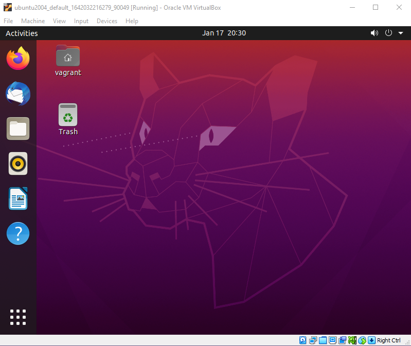
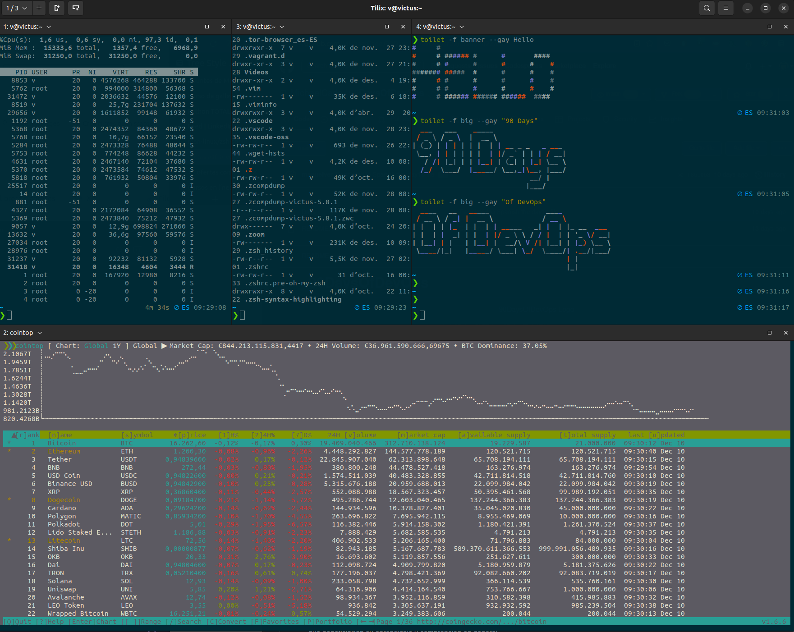

## Dev Workstation Yapılandırması - Tüm güzel şeyler

Linux sunucu yapılandırmasını masaüstü yapılandırmayla karıştırmamalıyız, ancak Linux masaüstünde sahip olabileceğimiz seçenekleri ve esnekliği göstermek önemlidir.

Yazar, neredeyse bir yıl boyunca Linux masaüstü kullanmış ve yapılandırması, SysAdmin çalışmaları için özel bir görünüm perspektifini yansıtmaktadır. Bu özelleştirmeleri görebilmek için Ubuntu sanal makinesinde Virtual Box kullanabiliriz. Çevirmen ise Linux ortamlarında 10 yılı aşkın deneyime sahip olduğundan, İspanyolca sürümde bazı katkılar bulacaksınız.

YouTube üzerinden takip etmek isteyenler için bir video (Resme tıklayın):

[](https://youtu.be/jeEslAtHfKc)

Hatırlayalım, Ubuntu 20.04 sanal makinesimiz Virtual Box'ta şu şekilde görünecektir:



Ayrıca, aşağıda varsayılan bash kabuğunu görebilirsiniz.


Bunların çoğu, dot dosyalarına indirgenir ve 90DaysOfDevOps yolculuğumuzun son Linux oturumunda ele alacağımız dot dosyalarıyla ilgilidir.

### Dot Dosyaları(dotfiles)

Öncelikle dot dosyalarına daha detaylı bir şekilde bakalım. Linux, sistem ve uygulama yapılandırma dosyalarından oluşur, bu dosyalara dot dosyaları denir.

Dot dosyaları, masaüstünüzü özelleştirmek ve daha güzel görünmesini sağlamak için kullanılmaz, aynı zamanda üretkenlikle ilgili değişiklikler ve yapılandırmalar yapmanıza yardımcı olur, işlevsellik ekler veya minimalist bir yaklaşımı tercih ederseniz kaldırır.

Linux için bulabileceğiniz çoğu yazılım, yapılandırmalarını bu dot dosyalarında saklar. Her dot dosyası, gizli kalması ve hata yapmaması için bir nokta `.` ile başlar.

Şimdiye kadar shell olarak bash'i kullandık. Peki, bash, `$HOME` klasörümüzde bazı yapılandırma dosyalarına sahiptir: .bashrc ve .bash_profile. Aşağıda, yeni kurulu sistemimizdeki bazı dot dosyalarını görebilirsiniz.


Shell'imizi zsh olarak değiştireceğiz, bu yüzden ileride `.zshrc` adlı yeni bir yapılandırma dot dosyasını göreceğiz.

Şimdi dot dosyalarından bahsettiğimizde, yapılandırma dosyalarından bahsediyoruz. Örneğin, kabuk (shell) dot dosyalarını, sistem simgenize takma adlar eklemek veya farklı konumlara yol eklemek için kullanabiliriz. Bazı insanlar dot dosyalarını herkese açık olarak paylaşırlar. Yazar, Michael Cade, özelleştirilmiş `.zshrc` dosyasıyla birlikte [MichaelCade/dotfiles](https://github.com/MichaelCade/dotfiles) adresinde dot dosyasını bulabilirsiniz. Seçilen terminal olan Terminator, klasörde bazı yapılandırma dosyalarına ve bazı arka plan seçeneklerine sahiptir.

Ayrıca, çevirmen de kabuk yapılandırmasını [shorttutorials/man-linux/zsh-shell](https://www.shorttutorials.com/apt-get-commands/man-zsh.html) adresinde paylaşmıştır. Burada farklı özelleştirme yöntemleri bulacaksınız, herkes kendi konforunu aramalıdır. Bu durumda, Oh my zsh ile zsh ve [Tilix](https://github.com/gnunn1/tilix) terminali kullanılmaktadır.

### ZSH

Bahsettiğimiz gibi, Ubuntu ile birlikte gelen varsayılan kabuk olan bash'i kullanıyorduk. ZSH, bash'e göre bazı avantajlara sahip benzer bir kabuktur.

Zsh'nin şu gibi özellikleri vardır:

- İnteraktif tamamlama (Tab) özelliği.
- Otomatik dosya arama.
- Regex entegrasyonu.
- Komutların kapsamını tanımlamak için gelişmiş kısaltmalar.
- Kapsamlı bir tema motoru.
- vb.

Zsh'yi `apt` paket yöneticisi ile kurabiliriz. Şunu çalıştıracağız:

```shell
sudo apt install zsh
```
Resimde, SSH üzerinden bağlantı yerine sanal makine konsolu kullanıldığı görülecektir. İstediğiniz gibi yapabilirsiniz, grafik arayüze ihtiyacınız yoktur.

Kurulum komutu tamamlandığında `zsh` komutunu çalıştırabilirsiniz. İlk kez çalıştırıldığında, yeni kabuk için bir yapılandırma komut dosyası başlatacaktır.


Temel olarak, herhangi bir eklenti veya eklenti olmaksızın bile çok yapılandırılabilir. Bir önceki soruya `1` seçeneğiyle yanıt vererek daha fazla seçenek görebiliriz.


ZSH'yi kendi tercihlerinize veya ihtiyaçlarınıza göre yapılandırmak için bazı değişiklikler yapabilirsiniz.

Eğer bir `0` ile yardımcı programı kapatıp ardından

```shell
ls -al | grep .zshrc
``` 

Bu komut, mevcut kullanıcı için zsh kabuğunu varsayılan kabuk olarak ayarlar. 

Komutu çalıştırdıktan sonra parolanızı girmeniz istenebilir. Parolanızı girdikten sonra artık her yeni terminal oturumunda zsh kabuğu kullanılacaktır.

```shell
chsh -s $(which zsh)
``` 

Bu komut, mevcut terminal oturumunda anında zsh kabuğuna geçiş yapmanızı sağlar. Böylece oturumu kapatıp yeniden giriş yapmadan zsh kabuğuna geçiş yapabilirsiniz.

```shell
exec zsh
```

Bu komut `which $SHELL` mevcut kullanılan kabugun yolunu(path) görüntüler. Eğer zsh kabuğuna başarıyla geçiş yapmışsanız, çıktı olarak /usr/bin/zsh veya benzer bir yol gösterilecektir.


Michael Cade, yazar, genellikle her Ubuntu masaüstü başlatıldığında bu adımı atar çünkü zsh kabuğunun bash'ten biraz daha hızlı olduğunu düşünmektedir.

Çevirmen ise genellikle kullandığı sistemlere yalnızca zsh'yı yükler. Bash, zsh'nin içinde, aynı şekilde sh de dahil olmak üzere, ve çevirmen, hız açısından en hafif olanın her zaman üstünlük sağlayacağını düşünür. Bu üç seçenek arasında sh kabuğu yer almaktadır. Ancak zsh'nin kişiselleştirme yetenekleri büyüktür, bu yüzden onunla çalışmak daha üretken olabilir. Bu, betikler oluştururken dikkate alınması gereken önemli bir noktadır; sh her zaman yüklü olacak ve en hızlısı olacak, ancak Ubuntu gibi birçok temel betik ve programın bulunmadığı dağıtımlarla karşılaşabilirsiniz.

### OhMyZSH

Şeyleri biraz daha iyi göstermek ve bazı işlevselliği eklemek için ücretsiz ve açık kaynaklı bir çatı olan OhMyZSH'yi kullanacağız.

Bu frmaework ile zsh'nin yapılandırmasını ve özelleştirmesini astronomik seviyelere kadar yönetebileceğiz. Birçok eklenti, tema ve diğer kaynaklar sayesinde zsh kabuğuyla etkileşim yapmak daha keyifli ve verimli hale geliyor. Bu, projeyle ilgilenen büyük bir topluluk sayesinde gerçekleşiyor.

Tüm potansiyelini incelemek için zaman ayırmanızı şiddetle tavsiye ederim, hem [web](https://ohmyz.sh/) sitesinde hem de [repository](https://github.com/ohmyzsh/ohmyzsh/)de mevcut.

OhMyZSH'yı kurmaya başlayalım. Belgelendirmesine baktığımızda farklı seçeneklerimiz olduğunu göreceğiz: `curl`, `wget` veya `fetch`. İlk ikisi Ubuntu'da varsayılan olarak mevcuttur. `curl` ile kurmak için aşağıdaki gibi yapabilirsiniz.

```shell
sh -c "$(curl -fsSL https://raw.githubusercontent.com/ohmyzsh/ohmyzsh/master/tools/install.sh)"
```

Önceki komutu çalıştırdıktan sonra aşağıdaki ekran görüntüsünde gösterilen gibi bir çıktı görmelisiniz.


Şimdi bir tema kullanmaya başlayabiliriz, OhMyZSH ile birlikte 100'den fazla tema bulunmaktadır. Michael Cade'nin favori teması Dracula temasıdır.

Oh My ZSH için iki vazgeçilmez eklenti aşağıdaki gibi yüklenir:

```shell
git clone https://github.com/zsh-users/zsh-autosuggestions.git $ZSH_CUSTOM/plugins/zsh-autosuggestions
```

```shell
git clone https://github.com/zsh-users/zsh-syntax-highlighting.git $ZSH_CUSTOM/plugins/zsh-syntax-highlighting
```
Ardından tercih ettiğimiz metin düzenleyiciyle dotfile'ı düzenlememiz gerekecek (önceki günlerde gördüğümüz gibi nano veya vim olabilir) `~/.zshrc`

Eklentileri eklemek için şunları yapmalısınız,

```sh
plugins=(
    git
    zsh-autosuggestions
    zsh-syntax-highlighting
)
```

## Gnome Eklentileri(Extensions)

Ayrıca Gnome uzantılarını da kullanabilirsiniz. Özellikle Michael Cade, aşağıdaki listeyle ilgilenmenizi önerir.

[Gnome Eklentileri](https://extensions.gnome.org)

- Caffeine
- CPU Power Manager
- Dash to Dock
- Desktop Icons
- User Themes

## Yazılım Kurulumu

Yazarın `apt` kullanarak yüklediği programların kısa bir listesi.

- VSCode
- azure-cli
- containerd.io
- docker
- docker-ce
- google-cloud-sdk
- insomnia
- packer
- terminator
- terraform
- vagrant

### Dracula Teması

Bu, yazar Michael Cade'in kullandığı tema. Tema açık, temiz ve her şey çok güzel görünüyor. [Dracula Teması](https://draculatheme.com/) birçok farklı programınız olduğunda da uyumlu bir görünüm sağlar.

Yukarıdaki bağlantıdan sitede zsh arayabilir ve en az iki seçenek bulabilirsiniz.

Kılavuzdaki talimatları takip ederek ya manuel olarak ya da git kullanarak kurulum yapabilirsiniz. Ardından `.zshrc` yapılandırma dosyanızı aşağıdaki gibi düzenlemeniz gerekecektir.


Ayrıca [Gnome Terminal Dracula Tema](https://draculatheme.com/gnome-terminal)nı seçebilirsiniz. Her adımı belgelemek oldukça zaman alacağından, işlemi gösteren bir video izleyebilirsiniz. (Resme tıklayın)

[](https://youtu.be/jeEslAtHfKc)

Daha önce bahsettiğim gibi, çevirmenin başka bir kişiselleştirmesini [zsh-shell](https://linuxconfig.org/zsh-shell-installation-and-configuration-on-linux) görebilirsiniz.

Sonucu aşağıdaki ekran görüntüsünde görebilirsiniz.



Buraya kadar geldiysen tebrik etmeliyim, #90DaysOfDevOps'un Linux günlerini tamamladık. Kendi başınıza araştırma yapmayı ve çok fazla pratik yapmayı unutmayın. Öğrenilen bilgiler genellikle kendi kendine kazanılan bilgilerdir ve unutulmazlar.

## Kaynaklar

- [Bash in 100 seconds](https://www.youtube.com/watch?v=I4EWvMFj37g)
- [Bash script with practical examples - Full Course](https://www.youtube.com/watch?v=TPRSJbtfK4M)
- [Client SSH GUI - Remmina](https://remmina.org/)
- [The Beginner's guide to SSH](https://www.youtube.com/watch?v=2QXkrLVsRmk)
- [Vim in 100 Seconds](https://www.youtube.com/watch?v=-txKSRn0qeA)
- [Vim tutorial](https://www.youtube.com/watch?v=IiwGbcd8S7I)
- [Guía básica de Vim](https://gitea.vergaracarmona.es/man-linux/Guia-VIM)
- [Learn the Linux Fundamentals - Part 1](https://www.youtube.com/watch?v=kPylihJRG70)
- [Linux for hackers (don't worry you don't need to be a hacker!)](https://www.youtube.com/watch?v=VbEx7B_PTOE)
- [Webminal](https://www.webminal.org/) 
- [Personal shell configuration with zsh](https://gitea.vergaracarmona.es/man-linux/zsh-shell)

Yarın, 7 günlük network dalışımıza başlıyoruz. Temel network bilgilerini ve DevOps çerçevesinde network anlayışını gözden geçireceğiz. Kemerlerinizi bağlayın ve hazır olun...

Gorusmek Uzere [Gun 21](day21.md) 🦾
