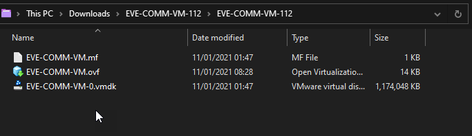
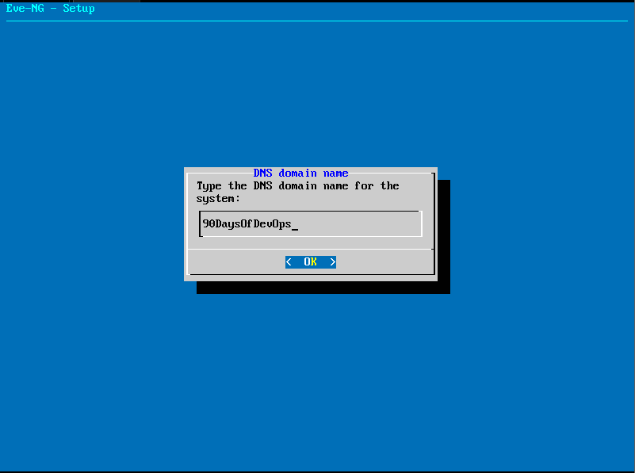

## Python ile Ağ(Network) Otomasyonu

Python, ağ otomasyon işlemleri için kullanılan standart bir dildir.

Ağ otomasyonu için sadece Python kullanılmaz, ancak kaynakları araştırdığınızda ve yukarıda belirtildiği gibi, genellikle Python kullanılır. Aksi takdirde, genellikle Python tabanlı olan Ansible kullanılır.

- Okunabilirlik ve kullanım kolaylığı - Python'un sadece mantıklı görünmesiyle ilgili. Kodda blokları başlatmak ve bitirmek için `{}` gibi gereksinimler yok gibi görünüyor. Bu, [VS Code](https://code.visualstudio.com/) gibi güçlü bir IDE ile birleştirildiğinde Python kodunu çalıştırmak oldukça kolay bir başlangıç sağlar.

[Pycharm](https://www.jetbrains.com/pycharm/) Burada bahsedilmeye değer başka bir IDE olabilir.

- Kütüphaneler - Python'un genişletilebilirliği burada gerçek bir hazine. Ağ otomasyonu için olmasa da, her türlü cihaz ve yapılandırmalar için yeterli sayıda kütüphane mevcuttur. Büyük bir koleksiyonu [PyPi](https://pypi.python.org/pypi) üzerinde görebilirsiniz.

Kütüphaneyi iş istasyonunuza indirmek istediğinizde, genellikle PyPI'ya bağlanarak indirme işlemini gerçekleştirmek için `pip` adında bir araç kullanılır. Cisco, Juniper ve Arista gibi ağ sağlayıcıları, cihazlarına erişimi kolaylaştırmak için kendi kütüphanelerini geliştirmişlerdir.

- Güçlü ve Verimli - Hatırlarsanız, Go günlerinde "Merhaba Dünya" örneğini gerçekleştirirken, sanırım 6 satır kodu geçtik. Python'da ise sadece

```
print('hello world')
```

Yukarıdaki noktaları birleştirirseniz, neden Python'un genellikle otomasyon çalışmalarında birincil araç olarak adlandırıldığını anlamak kolay olmalıdır.

Birkaç yıl öncesine kadar, ağ cihazlarınızla etkileşimde bulunarak yapılandırmalarını otomatikleştiren veya cihazlarınızda kayıtlar toplayan gibi betikler olabilir. Burada bahsettiğimiz otomasyon biraz farklıdır çünkü ağ genel manada bu düşünceye daha iyi uyan ve daha fazla otomasyona izin veren bir şekilde değişti.

- Yazılım Tanımlı Ağ (SDN): SDN denetleyicileri, ağdaki tüm cihazlara kontrol düzlemi yapılandırmasını sağlama sorumluluğunu üstlenir. Bu, ağdaki herhangi bir değişiklik için tek bir iletişim noktası anlamına gelir. Artık her cihaza telnet veya SSH üzerinden bağlanmak ve bunu insanlara bağlı yapmak gerekmeyerek, yapılandırma hatalarının tekrarlanabilir olasılığını ortadan kaldırır.

- Yüksek Seviyeli Orkestrasyon: SDN denetleyicilerinden bir seviye yukarı çıktığınızda, hizmet seviyelerinin orkestrasyonunu sağlar. Ardından, bu orkestrasyon katmanını VMware, Kubernetes, kamu bulutları vb. tercih ettiğiniz platformlara entegre etmek mümkün olur.

- Politika Tabanlı Yönetim: Ne istemektesiniz? Hedeflenen durum nedir? Bunları tanımlarsınız ve sistem, nasıl çözüleceği hakkında tüm detaylara sahip olur ve hedeflenen duruma ulaşmak için nasıl çözüm üreteceğini bilir.

## Laboratuvar Ortamının Yapılandırılması

Herkesin fiziksel yönlendiricilere, anahtarlamalara ve diğer ağ cihazlarına erişimi olmayabilir.

Ağ yapılandırmasını otomatikleştirmeyi öğrenmek için bazı araçlar kullanılabilir. Bunlardan bazıları:

- [GNS3 VM](https://www.gns3.com/software/download-vm)
- [Eve-ng](https://www.eve-ng.net/)
- [Unimus](https://unimus.net/) Unimus bir laboratuvar ortamı olmasa da ilginç bir kavramdır.

Laboratuvarımızı [Eve-ng](https://www.eve-ng.net/) kullanarak oluşturacağız, ancak fiziksel bir cihaz da kullanabilirsiniz. Sanal bir ortam kullanmanın avantajı, farklı senaryoları test etmek için bir sandbox ortamına sahip olabilmenizdir. Ayrıca, ilgi çekebilecek farklı cihazlar ve topolojilerle oynama imkanına sahip olursunuz.

Eve-ng'nin community sürümüyle her şeyi gerçekleştireceğiz.

### Giriş

Topluluk sürümü ISO ve OVF formatlarında [indirilebilir](https://www.eve-ng.net/index.php/download/).

Biz OVF indirmeyi kullanacağız, ancak ISO ile bir hipervizör olmadan bare metal bir sunucuda da kurulum yapabilirsiniz.


Bu kılavuzda VMware Workstation kullanılacak, vExpert aracılığıyla bir lisansa sahip olunacak, ancak VMware Player veya [belgelerde](https://www.eve-ng.net/index.php/documentation/installation/system-requirement/) belirtilen diğer seçenekler de kullanılabilir. Ne yazık ki, daha önce kullanılan Virtualbox'u kullanamıyoruz!

İşte GNS3 ile VirtualBox'ta yaşanan bir sorun olduğu nokta.

[VMware Workstation Player'ı ÜCRETSİZ İndir](https://www.vmware.com/uk/products/workstation-player.html)

[VMware Workstation PRO](https://www.vmware.com/uk/products/workstation-pro.html) Ayrıca ücretsiz değerlendirme süresine sahip!

### VMware Workstation PRO'da Kurulum

Şimdi hipervizör yazılımını indirip kurduk ve EVE-NG'nin OVF dosyasını indirdik. VMware Player kullanıyorsanız, bu sürecin aynı olduğunu lütfen bana bildirin.

Şimdi yapılandırmaya hazırız. VMware Workstation'ı açın ve `file` ve `open` seçeneklerini seçin.


EVE-NG'nin OVF görüntüsünü indirdiğinizde, içeri bir sıkıştırılmış dosyanın içine yerleştirilmiş olacaktır. İçeriği bir klasöre çıkarın ve görüntü aşağıdaki gibi görünmelidir.



EVE-NG'nin OVF görüntüsünü indirdiğiniz yere gidin ve içe aktarmayı başlatın.

Tanınabilir bir ad verin ve sanal makineyi sisteminizde bir yere kaydedin.


İçe aktarma tamamlandığında, işlemci sayısını 4'e ve ayrılan belleği 8 GB'ye artırın. (Bu, en son sürümle birlikte içe aktarmadan sonra otomatik olarak yapılmalıdır. Eğer öyle değilse, sanal makine yapılandırmasını düzenleyin).

Ayrıca, Intel VT-x/EPT veya AMD-V/RVI sanallaştırma seçeneğinin işaretli olduğundan emin olun. Bu seçenek, VMware Workstation'a sanal makineye sanallaştırma bayraklarını geçmesini söyler (yönlendirilmiş sanallaştırma). Bu, Virtual Box ile GNS3'te yaşadığım sorunun nedeni idi, CPU bunu desteklemesine rağmen.


### Acılıs ve Erisim

Dikkat etmeniz gereken bir nokta ve bir yan konu olarak belirtmiştim: Hatırladınız mı? Bu işlem, VirtualBox ile çalışmayacağını belirttiğiniz gibi, VMware Workstation ve EVE-NG ile de aynı sorunu yaşadım, ancak bu sanallaştırma platformlarının suçu değildi.

Windows'ta WSL2 çalıştığından dolayı, ortam içinde herhangi bir şeyi iç içe çalıştırma yeteneğini ortadan kaldırdığını gördüm. WSL2 kullanıldığında, Ubuntu sanal makinesinin çalışması gibi, CPU'nun Intel VT-d sanallaştırma özelliğini ortadan kaldırıyor gibi görünüyor. Bu durumu anlamak için biraz şaşkınım.

Bu sorunu çözmek için aşağıdaki komutu Windows makinenizde çalıştırmanız ve sistemi yeniden başlatmanız gerekiyor. Ancak unutmayın, bu işlem devre dışı olduğunda WSL2'yi kullanamayacaksınız.

`bcdedit /set hypervisorlaunchtype off`

WSL2'yi yeniden kullanmak istediğinizde, bu komutu çalıştırmanız ve sistemi yeniden başlatmanız gerekecektir.

`bcdedit /set hypervisorlaunchtype auto`

Her iki komutu da yönetici olarak çalıştırmanız gerekmektedir.

Şimdi VMware Workstation'da çalışan bir sanal makineniz olmalı ve yukarıdaki resimdeki gibi bir komut satırı beklemesi olmalı.


Yukarıdaki komut satırında aşağıdaki bilgileri kullanabilirsiniz:

username = root
password = eve

Ardından, daha sonra ana bilgisayarda SSH için kullanılacak olan root şifresini yeniden girmeniz istenecektir.

Daha sonra, hostta bir hostname (host adı) belirleyebiliriz.


Sonraki adımda DNS Alan Adı'nı tanımlıyoruz. Aşağıdaki örneği kullandım, ancak ileride değiştirilmesi gerekip gerekmediğinden emin değilim.



Daha sonra ağı yapılandırıyoruz ve IP adresinin yeniden başlatma sonrasında kalıcı olmasını sağlamak için "statik" seçeneğini seçiyorum.


Son adımda, çalışma istasyonunuzdan erişilebilen bir ağın statik IP adresini sağlıyoruz.


Burada, ağınız için alt ağ maskesini, varsayılan ağ geçidini ve DNS'i sağlamanız gereken ek adımlar bulunmaktadır.

Tamamlandığında, sistem yeniden başlatılacak ve tekrar çalıştığında statik IP adresinizi alıp tarayıcınızda kullanabilirsiniz.


GUI için varsayılan kullanıcı adı `admin` ve şifre `eve`, SSH için varsayılan kullanıcı adı ise `root` ve şifre `eve`'dir, ancak bunlar yapılandırma sırasında değiştirilmiş olabilir.


Farklı konsollar arasında gezinirken tarayıcınızda yeni bir sekme açan natif yerine HTML5'ı konsol için seçtim.

Aşağıda yapacaklarımızı sıralayalım:

- EVE-NG istemci paketini kurmak
- EVE-NG'ye bazı ağ görüntülerini yüklemek
- Bir ağ topolojisi oluşturmak
- Düğümler eklemek
- Düğümleri bağlamak
- Python betikleri oluşturmaya başlamak
- telnetlib, Netmiko, Paramiko ve Pexpect'i incelemek

## Kaynaklar

- [Free Course: Introduction to EVE-NG](https://www.youtube.com/watch?v=g6B0f_E0NMg)
- [EVE-NG - Creating your first lab](https://www.youtube.com/watch?v=9dPWARirtK8)
- [3 Necessary Skills for Network Automation](https://www.youtube.com/watch?v=KhiJ7Fu9kKA&list=WL&index=122&t=89s)
- [Computer Networking full course](https://www.youtube.com/watch?v=IPvYjXCsTg8)
- [Practical Networking](http://www.practicalnetworking.net/)
- [Python Network Automation](https://www.youtube.com/watch?v=xKPzLplPECU&list=WL&index=126)

Gorusmek Uzere [Gun 26](day26.md).
