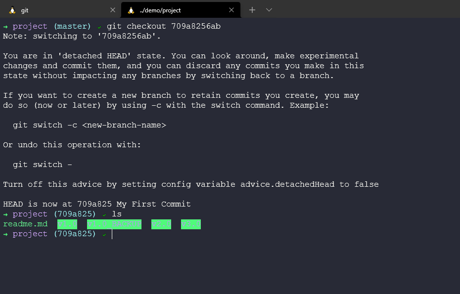

## Git - Versiyon Kontrolü

Git'e girmeden önce, sürüm kontrolünün ne olduğunu ve neden önemli olduğunu anlamamız gerekiyor. Bu Git girişinde, sürüm kontrolünün ne olduğuna ve git'in temellerine bir göz atacağız.

### Versiyon Kontrolü Nedir?

Git, sürüm kontrol sistemlerinden sadece bir tanesidir. Bu nedenle, burada sürüm kontrolü etrafında hangi seçeneklerin ve metodolojilerin bulunduğunu kapsamak istiyoruz.

Sürüm kontrolünün en belirgin ve büyük faydası, bir projenin geçmişini takip etme yeteneğidir. `git log` komutunu kullanarak bu depoya geri dönüp projenin şu ana kadar neler olduğunu görebiliriz. Endişelenmeyin, komutları daha sonra detaylı bir şekilde ele alacağız. Şimdi düşünün, bu gerçek bir yazılım projesi olsaydı ve içinde kaynak kodu bulunan birden fazla kişi farklı zamanlarda, farklı yazarlar tarafından yazılımımıza katkıda bulunuyor olsaydı ve ardından inceleyenler bunların hepsi burada kaydediliyor, böylece neyin ne zaman, kim tarafından ve kimin tarafından gözden geçirildiğini biliriz.

Version Control, "cool" olmadan önce, değişiklik yapmadan önce bir versiyonumuzun manuel olarak bir kopyasını oluşturmanız gibi bir şey olabilirdi. Ayrıca gereksiz eski kodu "belki lazım olur" mantığıyla yorum satırına alabilirsiniz.

Ben, sadece kaynak kodu değil, neredeyse her şeyi içeren sürüm kontrolünü kullanmaya başladım. Projeler gibi (90DaysOfDevOps) böyle konuşuyor. Neden rollback özelliklerini ve her şeyin kaydedildiği bir günlüğü kabul etmeyelim ki.

Ancak, büyük bir uyarı **Sürüm Kontrolü bir Yedekleme Değildir!**

Versiyon Kontrolünün bir başka faydası, bir projenin birden fazla versiyonunu yönetebilme yeteneğidir. Bir örnek oluşturalım: Her işletim sisteminde mevcut olan ücretsiz bir uygulamamız var ve aynı şekilde her işletim sisteminde mevcut olan ücretli bir uygulamamız var. Kodun büyük bir kısmı her iki uygulama arasında paylaşılıyor. Her bir uygulama için her bir taahhütte kodumuzu kopyalayıp yapıştırabiliriz, ancak bu özellikle geliştirmeyi bir kişiden daha fazlasına ölçeklendirdiğinizde çok karışık bir hale gelecektir ve hatalar yapılacaktır.

Premium uygulama, ek özelliklere sahip olacağımız yerdir, onları "premium taahhütler" olarak adlandıralım, ücretsiz sürüm ise yalnızca normal taahhütleri içerecektir.

Bu, Versiyon Kontrolü'nde dal oluşturarak başarılmaktadır.

Dallanma(Branching), yukarıda belirtildiği gibi aynı uygulama için iki kod akışına izin verir. Ancak kaynak kodu ücretsiz olan sürümde yer alan yeni özelliklerin premium sürümde de olmasını isteyeceğiz ve bunu gerçekleştirmek için birleştirme adı verilen bir şeye ihtiyacımız var.

Şimdi, bu kolay gibi görünse de birleştirme karmaşık olabilir çünkü ücretsiz sürüm üzerinde çalışan bir ekip olabilir ve premium ücretli sürüm üzerinde çalışan başka bir ekip olabilir ve her ikisi de genel kodun bazı yönlerini etkileyen kod değişiklikleri yapabilir. Belki bir değişken güncellenir ve bir şeyleri bozar. Sonra, bir özelliği bozan bir çakışma oluşur. Sürüm Kontrolü, sizin tarafınızdan çözümlenmesi gereken çakışmaları düzeltemez. Ancak sürüm kontrolü, bunun kolayca yönetilmesine olanak sağlar.

Bugüne kadar genel olarak sürüm kontrolünün en önemli nedeni, işbirliği yapabilme yeteneğidir. Geliştiriciler arasında kod paylaşma yeteneği ve daha önce de belirttiğim gibi, artık kaynak kontrolü için diğer nedenlerin çok daha fazla kullanım senaryosunu görmeye başlıyoruz, belki bir meslektaşınızla birlikte çalıştığınız ortak bir sunum veya 90DaysOfDevOps gibi bir zorluk, burada topluluk projenin her aşamasında düzeltmelerini ve güncellemelerini sunuyor.

Sürüm kontrolü olmadan, yazılım geliştiricilerinin ekipler halinde nasıl başa çıktığını düşünmek zor. Ben bile kendi projelerim üzerinde çalışırken takip etmekte zorlandığımı düşünüyorum. O dönemde, kodu her bir işlevsel modüle bölebilirlerdi. Belki de parçaları bir araya getirmek için biraz daha zorluklar ve sorunlar yaşanırdı, ancak herhangi bir şey yayınlanmadan önce.

Sürüm kontrolü sayesinde, tek bir gerçek kaynağımız olur. Hala farklı modüller üzerinde çalışabiliriz, ancak işbirliği yapmamızı daha iyi bir hale getirir.

Burada belirtmek istediğim bir başka şey, Sürüm Kontrolünün sadece geliştiricilerin değil, takımın tüm üyelerinin faydalanabileceği, görünürlüğe sahip olabileceği ve aynı zamanda araçların farkındalık veya kullanım sağlayabileceği bir şey olduğudur. Proje Yönetimi araçları buraya bağlanabilir, çalışmayı takip edebilir. Örneğin, Jenkins gibi bir derleme makinesi olabilir, başka bir modülde bundan bahsedeceğiz. Sistemi derleyen ve paketleyen, dağıtım testlerini ve metrikleri otomatikleştiren bir araç.

### Git Nedir?

Git, kaynak kodunun veya herhangi bir dosyanın değişikliklerini izleyen bir araçtır veya Git, açık kaynaklı bir dağıtık sürüm kontrol sistemi olarak da adlandırılabilir.

Git'i sistemlerimizde birçok farklı şekilde kullanabiliriz. En yaygın kullanım şekli komut satırında, ancak görsel kullanıcı arayüzleri ve Visual Studio Code gibi araçlar da git bilincine sahip işlemleri kullanmamıza olanak sağlar.

Şimdi, Git'i local makinemize yüklemeden önce genel bir genel bakış yapacağız.

Daha önce oluşturduğumuz klasörü ele alalım.

Bu klasörü sürüm kontrolü ile kullanmak için, `git init` komutunu kullanarak bu dizini başlatmamız gerekiyor. Şimdilik, bu komutun dizinimizi bilgisayarımızdaki bir veritabanına bir depo olarak yerleştirdiğini düşünelim.

Şimdi bazı dosyalar ve klasörler oluşturabilir ve kaynak kodumuz başlayabilir veya belki zaten başlamıştır ve burada zaten bir şeyler bulunmaktadır. `git add .` komutunu kullanarak tüm dosyaları ve klasörleri anlık bir görüntüye ekliyoruz, ancak henüz bu veritabanına hiçbir şey taşımadık. Sadece tüm dosyaların `.` ile eklenmeye hazır olduğunu söylüyoruz.

Ardından dosyalarımızı taahhüt etmek istiyoruz, bunu `git commit -m "My First Commit"` komutuyla yapıyoruz. Her taahhüt için bir açıklama verebiliriz ve bu önerilir, böylece her taahhütte ne olduğunu bilebiliriz.

Şimdi projenin geçmişinde neler olduğunu görebiliriz. `git log` komutunu kullanarak.

`samplecode.ps1` adında başka bir dosya oluşturursak, durum farklı hale gelir. Ayrıca, depomuzun durumunu `git status` kullanarak kontrol edebiliriz. Bu, taahhüt edecek bir şeyimizin olmadığını ve samplecode.ps1 adlı yeni bir dosya ekleyebileceğimizi gösterir. Ardından aynı git status komutunu çalıştırırsanız, taahhüt edilecek bir dosyanız olduğunu göreceksiniz.

`git add samplecode.ps1` komutunu kullanarak yeni dosyamızı ekleyin ve ardından `git status`komutunu yeniden çalıştırın ve dosyanızın taahhüt edilmeye hazır olduğunu görün.

Ardından `git commit -m "My Second Commit"` komutunu kullanın.

Başka bir `git status` artık her şeyin temiz olduğunu gösterir.

Sonra `git log` komutunu kullanarak en son değişiklikleri ve ilk taahhüdü görebiliriz.

Taahhütlerimiz arasındaki değişiklikleri yani hangi dosyaların eklendiğini veya değiştirildiğini görmek istiyorsak `git diff b8f8 709a` komutunu kullanabiliriz.

Bu, değişikliklerimizde nelerin değiştiğini gösterir, bizim durumumuzda yeni bir dosya ekledik.

Bu konuya daha derinlemesine gireceğiz, taahhütlerimiz arasında geçiş yapabiliriz, yani zamanda yolculuk yapabiliriz! Taahhüt numaramızı kullanarak `git checkout 709a` komutunu kullanarak yeni dosyamızı kaybetmeden geçmişe geri dönebiliriz.

Ancak aynı şekilde ileri gitmek isteyeceğiz ve bunu yine taahhüt numarasıyla yapabiliriz veya burada işlemimizi geri almak için `git switch -` komutunu kullanıyoruz.

Özetlemek gerekirse:

- Bir projenin geçmişini izleme
- Bir projenin birden fazla sürümünü yönetme
- Geliştiriciler arasında ve daha geniş bir ekip ve araç yelpazesinde kod paylaşma
- Ekip çalışmasını koordine etme
- Ayrıca biraz zaman yolculuğu da var!

Belki bu biraz karışık gibi göründü, ancak umarım komutları bilmeden bile Sürüm Kontrolü'nün gücünü ve genel resmi görebilirsiniz.

Şimdi sıradaki adım, git'i yerel makinenize kurmak ve yapılandırmaktır. Daha sonra git'te gerçekleştirebileceğimiz diğer kullanım durumlarına ve komutlara biraz daha derinlemesine dalacağız.

## Kaynaklar

- [What is Version Control?](https://www.youtube.com/watch?v=Yc8sCSeMhi4)
- [Types of Version Control System](https://www.youtube.com/watch?v=kr62e_n6QuQ)
- [Git Tutorial for Beginners](https://www.youtube.com/watch?v=8JJ101D3knE&t=52s)
- [Git for Professionals Tutorial](https://www.youtube.com/watch?v=Uszj_k0DGsg)
- [Git and GitHub for Beginners - Crash Course](https://www.youtube.com/watch?v=RGOj5yH7evk&t=8s)
- [Complete Git and GitHub Tutorial](https://www.youtube.com/watch?v=apGV9Kg7ics)

Gorusmek Uzere [Gun 36](day36.md)
