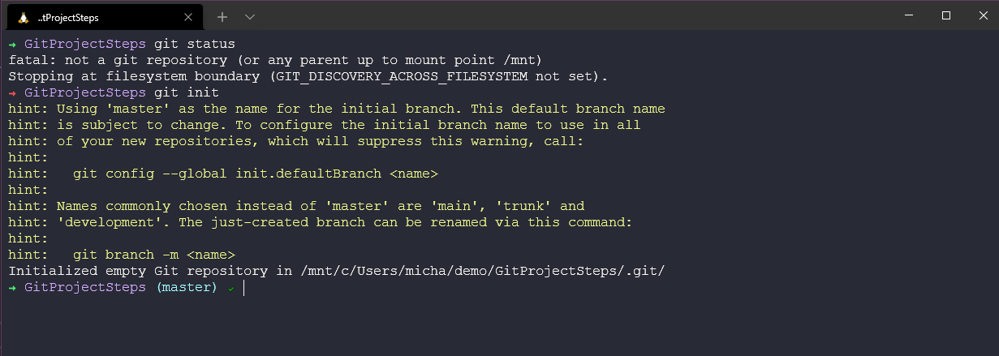
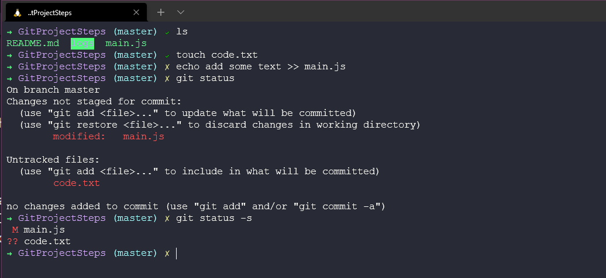

## Staging & Degisiklikler

Temel konuların bazılarını zaten ele aldık, ancak bunları adım adım incelemek, git'i neden bu şekilde yaptığımızı öğrenmemi ve anlamamı daha iyi hale getiriyor. GitHub gibi herhangi bir git tabanlı hizmete girmeden önce, git'in yerel bilgisayarımızda kullanabileceğimiz güçleri vardır.

Git oturumunun başında oluşturduğumuz proje klasörünü alacağız ve git ile yapabileceğimiz bazı basit adımları gözden geçireceğiz. Yerel makinedeki klasörümüzü oluşturduk ve `git init` komutuyla başlattık.

Şimdi başlattığımız klasörde gizli bir klasör olduğunu görebiliriz.

Bu, git deposunun detaylarının ve ayrıca şubelerimiz ve taahhütlerimizle ilgili bilgilerin saklandığı yerdir.

### Staging Dosyaları

Sonra boş klasörümüz üzerinde çalışmaya başlarız ve belki de çalışmanın ilk günlerinde bazı kaynak kodları ekleriz. readme.md dosyasını oluştururuz ve bu dosyayı klasörde görebiliriz, ardından `git status` komutuyla yeni readme.md dosyasının farkında oluruz, ancak henüz dosyayı taahhüt etmedik.

readme.md dosyasını `git add README.md` komutuyla staging alanına ekleyebiliriz, böylece daha önce sahip olmadığımız commit edilecek değişiklikleri ve yeşil bir yeni dosyayı görebiliriz.

Bundan sonra, bu değişiklikleri commit etmek istiyoruz, yani projemizin ilk commit veya ilk anlık görüntüsünü(snapshot) yapmak istiyoruz. Bunun için `git commit -m "meaningful message"` komutunu kullanabiliriz, böylece her taahhüt için neyin değiştiğini kolayca görebiliriz. Ayrıca, sarı çarpı işareti şimdi yeşil tik işaretine dönüşür. Bu, benim terminalimde kullandığım temada bir özelliktir, Linux bölümünde ele aldığımız bir konudur.

### Committing Degisiklikleri

Büyük ihtimalle dizinimizde daha fazla dosya eklemek veya hatta mevcut dosyaları değiştirmek isteyeceğiz. Yukarıda ilk commitimizi zaten yaptık. Ancak şimdi daha fazla ayrıntı ve daha fazla dosya eklemeye devam edeceğiz.

Önceki adımda yaptığımız süreci tekrarlayabiliriz: Dosyayı oluştur veya düzenle > `git add .` komutunu kullanarak tüm dosyaları taahhüt alanına ekle > ardından `git commit -m "meaningful message"` komutunu kullanarak taahhüt et. Bu şekilde de işe yarayacaktır. Ancak taahhüt sırasında neyin değiştiğini belirten anlamlı bir mesaj sunmak için şu şekilde bir şey yazmak istemeyebilirsiniz: `git commit -m "Well, I changed some code because it did not work and when I fixed that I also added something new to the readme.mdto ensure everyone knew about the user experience and then I made a tea."` Yani bu şekilde de işe yarasa da, muhtemelen daha açıklayıcı bir mesaj yazmak tercih edilir, ancak burada tercih edilen yöntem bunu bir metin düzenleyici ile eklemektir.

`git add` komutunu çalıştırdıktan sonra `git commit` komutunu çalıştırırsak, varsayılan metin düzenleyicimiz açılacaktır, bu durumda benim kullandığım nano. İşte dosyaya bazı değişiklikler eklemek için attığım adımlar: `git status` komutunu çalıştırarak hangi dosyaların staging alanında olduğunu gösterdim. Ardından `git add` komutunu kullanarak dosyayı staging alanına ekledim ve son olarak `git commit` komutunu çalıştırdım, böylece nano düzenleyici açıldı.

Nano açıldığında kısa ve uzun açıklamalarınızı ekleyebilir ve ardından dosyayı kaydedebilirsiniz.

### Committing Best Practices(En iyi uygulamaları)

Taahhüt etme zamanlaması ve sıklığı arasında bir denge vardır. Projeyi bitirmeden önce taahhüt etmeyi beklemek istemeyiz, her taahhüt anlamlı olmalı ve birbiriyle ilgisi olmayan görevlerle eşleştirilmemelidir. Bir hata düzeltmesi ve yazım hatası düzeltmesi gibi farklı değişiklikleri iki ayrı taahhüt olarak yapmak en iyi uygulamadır.

Taahhüt mesajını anlamlı hale getirin.

Söz konusu ifadelerde, ekip veya siz kendinizi her taahhüt için aynı ifadeleri kullanmaya özen göstermelisiniz.

### Staging Alanını Atlamak

Her zaman değişikliklerimizi taahhüt etmeden önce staging alanına almak zorunda mıyız?

Cevap evet, ancak bunu bir kısayol olarak görmeyin, bu anlık görüntüye geri dönmeye ihtiyacınız olmadığından emin olmanız gerekmektedir, bu riskli bir işlemdir.

### Dosyaları Silme

Projemizden dosya silmekle ilgili olarak, belki de dizinimizde başka bir dosya vardır ve bu dosyayı taahhüt ettik, ancak projenin artık ihtiyacı yoktur veya kullanmamaktadır, en iyi uygulama olarak onu silmemiz gerekir.

Dosyayı dizinden kaldırmamıza rağmen, git hala bu dosyanın farkındadır ve ayrıca deposundan da kaldırmamız gerekmektedir. Bunun için aşağıdaki işlem akışını görebilirsiniz.

Bu, büyük ve birçok hareketli dosya ve klasöre sahip bir büyük bir projeniz varsa hatırlamanız veya başa çıkmanız gereken biraz zahmetli olabilir. `git rm oldcode.ps1` komutuyla bunu tek bir komutla yapabiliriz.

### Dosya Adı Değiştirme veya Taşıma

İşletim sistemimiz içinde dosya adlarını değiştirebilir ve dosyaları taşıyabiliriz. Projelerimizde zaman zaman bunu yapmamız gerekecektir. Dosyaları kaldırmak gibi, dosya adlarını değiştirmek için de iki adımlık bir işlem bulunur: Dosyalarımızı işletim sistemimizde değiştiririz ve ardından taahhüt alanını düzenlememiz veya dosyaları doğru şekilde eklediğimizden emin olmamız gerekir. Adımlar şöyledir:

Ancak, işletim sisteminden dosyaları kaldırmak ve ardından git deposundan da kaldırmak gibi, bu yeniden adlandırmayı bir git komutu kullanarak da gerçekleştirebiliriz.

### Dosyaları Yoksayma (Ignore Etme)

Projemizde, yerel olarak kullanılan veya genel projeyle paylaşıldığında gereksiz alan oluşturacak dosyaları veya klasörleri yoksayma ihtiyacı olabilir, bunun iyi bir örneği günlüklerdir. Ayrıca, genel olarak paylaşılmak istemeyeceğiniz veya farklı ekipler arasında paylaşılmak istemeyeceğiniz sırları da yoksaymak için bunu kullanmayı düşünebilirsiniz.

Dosya veya klasörleri projemizin dizinindeki `.gitignore` dosyasına ekleyerek dosyaları yoksayabiliriz.

Daha sonra `.gitignore` dosyasını açabilir ve günlükler/ dizininin burada olduğunu görebilirsiniz. Ancak buraya yoksaymak istediğiniz ek dosyaları ve klasörleri de ekleyebilirsiniz.

Sonra `git status` komutunu kullanarak ne olduğunu görebilirsiniz.

Ayrıca, geriye dönüp dosyaları ve klasörleri yoksaymanız gereken durumlar olabilir, belki günlükler dizinini paylaşmak istiyordunuz, ancak daha sonra vazgeçtiğinizi fark ettiniz. Daha önce izlenen bir klasörü şimdi yoksaymak istiyorsanız, bu klasörleri taahhüt alanından kaldırmak için `git rm --cached ` komutunu kullanmanız gerekecektir.

### Short Status(Kısa Durum)

Şimdiye kadar sürekli olarak `git status` komutunu kullanarak taahhüt alanımızda ne olduğunu ve ne olmadığını anlamak için çok fazla kullanım yaptık. Bu komut oldukça kapsamlı ve detaylı bir komuttur. Çoğu zaman sadece değiştirilen veya yeni olan dosyaları bilmek isteyeceksiniz. Bu durumun özetini görmek için `git status -s` komutunu kullanabiliriz. Ben genellikle sistemimde bu kısa komutun kullanımını tercih etmek için bir kısayol ayarlarım.

Yarınki gönderide, bu yaygın git komutlarının kısa örneklerini görmeye devam edeceğiz.

## Kaynaklar

- [What is Version Control?](https://www.youtube.com/watch?v=Yc8sCSeMhi4)
- [Types of Version Control System](https://www.youtube.com/watch?v=kr62e_n6QuQ)
- [Git Tutorial for Beginners](https://www.youtube.com/watch?v=8JJ101D3knE&t=52s)
- [Git for Professionals Tutorial](https://www.youtube.com/watch?v=Uszj_k0DGsg)
- [Git and GitHub for Beginners - Crash Course](https://www.youtube.com/watch?v=RGOj5yH7evk&t=8s)
- [Complete Git and GitHub Tutorial](https://www.youtube.com/watch?v=apGV9Kg7ics)
- [Git cheatsheet](https://www.atlassian.com/git/tutorials/atlassian-git-cheatsheet)

Gorusmek Uzere [Gun 39](day39.md)
