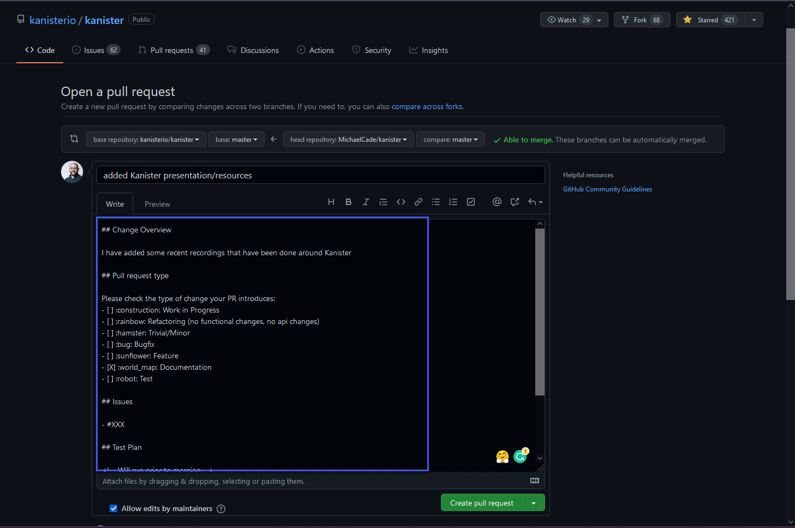

## Açık Kaynak İş Akışı

Umarım, Git'in son 7 bölümünü inceledikten sonra git'in ne olduğunu ve ardından GitHub gibi bir git tabanlı hizmetin, kaynak kodu depolama alanını sağlamanın yanı sıra geniş topluluğun kod ve projeler üzerinde işbirliği yapabileceği bir yol olduğunu daha iyi anlamışsınızdır.

GitHub temellerini incelediğimizde rastgele bir projeyi çatallama ve yerel depomuzda bir değişiklik yapma sürecini geçtik. Burada bir adım daha ileri gitmek ve açık kaynak bir projeye katkıda bulunmak istiyoruz. Unutmayın, katkıda bulunmak hata düzeltmeleri veya kodlama özellikleri olmak zorunda değildir, aynı zamanda belgeleme de olabilir. Her türlü katkı faydalı olur ve ayrıca üzerinde çalıştığımız bazı git işlevselliğiyle pratik yapmanıza olanak tanır.

## Bir Projeyi Çatallama(Forklama)

İlk yapmamız gereken katkıda bulunabileceğimiz bir proje bulmak. Yakın zamanda [Kanister Project](https://github.com/kanisterio/kanister) hakkında sunum yapmıştım ve şimdi YouTube'da bulunan sunumlarımı projenin ana readme.md dosyasında paylaşmak istiyorum.

Öncelikle, projeyi çatalamamız gerekiyor. Bu süreci geçelim. Yukarıda paylaşılan bağlantıya gidip repoyu forklayacağım.

Artık tüm depomuzun bir kopyasına sahibiz.

Referans için, Readme.md dosyasındaki orijinal Sunumlar sadece şunlar, bu nedenle işlemimizi düzeltmemiz gerekiyor.

## Yerel Makineye Klonlama

Şimdi çatalımızı yerelimize getirebilir ve ardından dosyalara düzenlemeler yapmaya başlayabiliriz. Repo üzerindeki kod düğmesini kullanarak URL'yi alabilir ve ardından `git clone url` komutunu, depoyu koymak istediğimiz bir dizinde kullanabiliriz.

## Değişikliklerimizi Yapmak

Projemizi yerelde sahip olduğumuz için, VSCode veya tercih ettiğiniz bir IDE veya metin düzenleyiciyi açarak değişikliklerinizi ekleyebilirsiniz.

readme.md dosyası markdown dilinde yazıldığı için ve başka birinin projesini değiştirdiğimiz için, mevcut proje biçimini takip ederek içeriğimizi eklemek istiyorum.

## Değişikliklerinizi Test Etme

En iyi uygulama olarak değişikliklerimizi test etmeliyiz; bu, bu bir uygulamanın kodunda bir değişiklik olduğunda, kod değişikliğinden sonra uygulamanın hala çalıştığından emin olmak isteyeceğiniz gibi, belgelerin de düzgün biçimlendirilip görünüp görünmediğinden emin olmak anlamına gelir.

VSCode'da birçok eklenti ekleyebiliriz; bunlardan biri markdown sayfalarını önizleme yeteneğidir.

## Değişiklikleri Forklu Repomuzu Geri Yollayalım

Forklu repomuza doğrudan değişiklikleri itmek için kimlik doğrulamamız yok, bu nedenle bu yolu takip etmeliyiz. Değişikliklerimizden memnun olduğumuzda, artık iyi bilinen bazı git komutlarını inceleyebiliriz.

Şimdi GitHub'a geri dönüp değişiklikleri bir kez daha kontrol edip ana projeye katkıda bulunabiliriz.

Görünüşe bakılırsa iyi durumda.

Şimdi, Kanister için forklu repomuzun en üstüne dönebilir ve kanisterio:master dalına göre 1 taahhüt ileride olduğumuzu görebiliriz.

Sonraki adım olarak, yukarıda vurgulanan "Katıl" düğmesine tıklıyoruz. "Pull Talebi Aç" seçeneğini görüyoruz.

## Bir Pull Request Açın

Bu sonraki görüntüde oldukça fazla detay bulunuyor. Sol üst köşede, şu an orijinal veya ana deposunda olduğumuzu görebilirsiniz. Ardından, karşılaştırdığımız şeyi görebilirsiniz ve bu orijinal ana deposu ile forklu repomuzdur. Daha sonra bir pull talebi oluştur düğmesini görebilirsiniz, bu konuya yakında geri döneceğiz. Tek bir commitiniz var, ancak bu daha fazla değişiklik olsaydı, burada birden fazla commitiniz olabilir. Ardından, readme.md dosyasında yaptığımız değişiklikleri görebilirsiniz.

Yukarıdaki değişiklikleri gözden geçirdik ve yeşil düğmeye basarak bir pull talebi oluşturmaya hazırız.

Sonrasında, bir projenin bakımcısı, pull talebi işlevselliğini depolarındaki nasıl düzenlediğine bağlı olarak, size ne görmek istediğini gösteren bir şablonunuz olup olmadığını belirtebilir.

Burada yine, ne yaptığınıza dair anlamlı bir açıklama yapmak istersiniz, net ve öz ama yeterli detay içermeli. Ben basit bir değişiklik özetini yapmışım ve dökümantasyon işaretlemesini seçtim.

## Bir Pull Request Olusturun

Şimdi pull talebi oluşturmaya hazırız. Sayfanın üst kısmındaki "Pull Talebi Oluştur" düğmesine tıkladıktan sonra pull talebinizin bir özetini göreceksiniz.

Aşağı doğru kaydırdığınızda, otomasyonun gerçekleştiğini görebilirsiniz; bu durumda bir inceleme gereklidir ve bazı kontroller gerçekleştirilmektedir. Travis CI'nin devam ettiğini ve bir derleme işleminin başladığını görebiliriz. Bu işlem, eklemelerimizle bir şeylerin bozulmadığından emin olmak için yapılır.

Burada dikkat edilmesi gereken bir diğer nokta, yukarıdaki ekran görüntüsündeki kırmızının biraz korkutucu görünebileceğidir ve sanki hatalar yapmış gibi görünebilir! Endişelenmeyin, herhangi bir şeyi bozmadınız, en büyük ipucum burada, bu sürecin size ve projenin bakımından sorumlu olanlara yardımcı olmak için olduğudur. Hata yapmışsanız, en azından benim deneyimimden yola çıkarak, projenin bakımcısı size ulaşacak ve ne yapmanız gerektiği konusunda tavsiyede bulunacaktır.

Bu pull talebi artık herkes tarafından görülebilir durumda [added Kanister presentation/resource #1237](https://github.com/kanisterio/kanister/pull/1237)

Ben bunu yayımlamadan önce, birleştirme ve pull talepleri (PR) kabul edilmeden önce yayımlayacağım, bu nedenle hala takip eden ve başarılı bir PR'ı ekleyebilen herkese küçük bir ödül kazanmak için bir fırsat sağlayabiliriz.

1. Forkla bu repoyu kendi GitHub hesabına
2. Resminizi ve belki de metni ekleyin.
3. Değişiklikleri forkladıgınız reposuna gönderin.
4. Benim göreceğim ve onaylayacağım bir PR oluşturun.
5. Bir tür ödül düşüneceğim.

Bu, Git ve GitHub'a bakışımızı sonlandırıyor, bir sonraki adım olarak konteynerlere dalıyoruz, bu da büyük resmi bir bakış açısıyla başlıyor, neden konteynerler ve sanallaştırma konularına göz atıyoruz ve nasıl buraya geldiğimize bakıyoruz.

## Kaynaklar

- [Learn GitLab in 3 Hours | GitLab Complete Tutorial For Beginners](https://www.youtube.com/watch?v=8aV5AxJrHDg)
- [BitBucket Tutorials Playlist](https://www.youtube.com/watch?v=OMLh-5O6Ub8&list=PLaD4FvsFdarSyyGl3ooAm-ZyAllgw_AM5)
- [What is Version Control?](https://www.youtube.com/watch?v=Yc8sCSeMhi4)
- [Types of Version Control System](https://www.youtube.com/watch?v=kr62e_n6QuQ)
- [Git Tutorial for Beginners](https://www.youtube.com/watch?v=8JJ101D3knE&t=52s)
- [Git for Professionals Tutorial](https://www.youtube.com/watch?v=Uszj_k0DGsg)
- [Git and GitHub for Beginners - Crash Course](https://www.youtube.com/watch?v=RGOj5yH7evk&t=8s)
- [Complete Git and GitHub Tutorial](https://www.youtube.com/watch?v=apGV9Kg7ics)
- [Git cheatsheet](https://www.atlassian.com/git/tutorials/atlassian-git-cheatsheet)

Gorusmek Uzere [Gun 42](day42.md)
