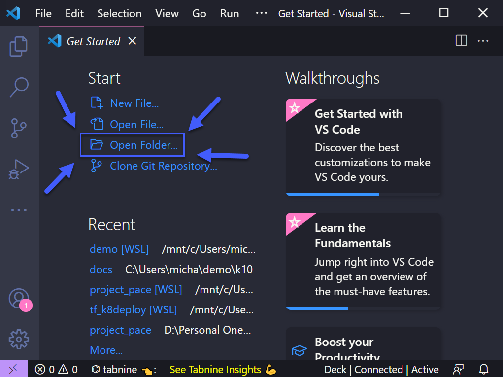
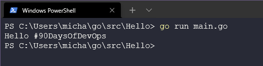
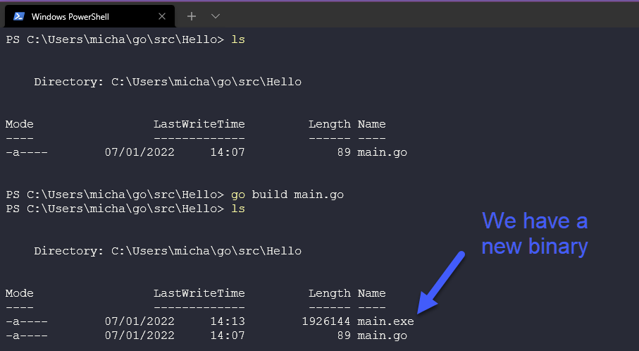

## Thiết lập môi trường DevOps cho Go & Hello World

Trước khi tìm hiểu một số nguyên tắc cơ bản của Go, chúng ta nên cài đặt Go và làm điều mà mọi tiết học đầu tiên của môn "Lập trình 101" có - ứng dụng Hello World. Để cài đặt Go trên máy trạm của bạn, tôi sẽ cố gắng ghi lại toàn bộ quá trình bằng hình ảnh để mọi người có thể theo dõi.

Trước hết, hãy truy cập vào [go.dev/dl](https://go.dev/dl/) và chúng ta sẽ có một số tùy chọn có sẵn để tải xuống.


Nếu bạn đã đi đến ngày hôm này, tôi nghĩ rằng bạn có thể biết hệ điều hành đang chạy trên máy của bạn là hệ điều hành nào.Hãy chọn bản tải xuống thích hợp và sau đó chúng ta có thể bắt đầu cài đặt. **_(Tôi sẽ sử dụng phiên bản mới nhất tại thời điểm viết bài, nhưng khi bạn đọc bài này, các phiên bản mới hơn có thể đã được phát hành)_**


Lưu ý rằng nếu bạn đã cài đặt một phiên bản cũ của Go, bạn sẽ phải gỡ bỏ phiên bản đó trước khi cài đặt, việc này được tính hợp trong trình cài đặt của Windows.

Sau khi hoàn tất, chúng ta sử dụng một dấu nhắc lệnh(command prompt)/terminal để kiểm tra xem chúng ta đã cài đặt Go thành công hay chưa. Nếu bạn không nhận được output như ở bên dưới thì Go chưa được cài đặt và bạn sẽ cần phải kiểm tra lại các bước thực hiện của mình.

`go version`


Tiếp theo, chúng ta sẽ kiểm tra môi trường cho Go để đảm bảo các việc các thư mục làm việc được cấu hình chính xác. Như bạn có thể thấy bên dưới, chúng ta cần đảm bảo rằng những thư mục sau có trên hệ thống của mình.


Bạn đã kiểm tra chưa? Bạn có đang theo kịp không? Bạn có thể sẽ nhận được một lỗi giống như dưới đây khi bạn thử và cố gắng điều hướng đến đó.


Được rồi, hãy tạo thư mục đó bằng cách sử dụng lệnh mkdir trong PowerShell terminal. Chúng ta cũng cần tạo 3 thư mục trong thư mục Go như bạn sẽ thấy bên dưới.


Sau khi chúng ta cài đặt Go và có các thư mục sẵn sàng cho Go hoạt động, chúng ta cần một môi trường phát triển tích hợp (IDE). Có rất nhiều lựa chọn mà bạn có thể sử dụng nhưng phổ biến nhất và IDE mà tôi sử dụng là Visual Studio Code hoặc Code. Bạn có thể tìm hiểu thêm về các IDEs tại [đây](https://www.youtube.com/watch?v=vUn5akOlFXQ).

Nếu bạn chưa tải xuống và cài đặt VSCode trên máy trạm của mình thì bạn có thể thực hiện việc này bằng cách vào [đây](https://code.visualstudio.com/download). Như bạn có thể thấy bên dưới, bạn có các lựa chọn cho các hệ điều hành khác nhau.


Tương tự như với việc cài đặt Go, chúng ta sẽ tải xuống và cài đặt và giữ nguyên các giá trị mặc định. Sau khi hoàn tất, bạn có thể mở VSCode, chọn Open File và điều hướng đến thư mục Go mà chúng ta đã tạo ở trên.



Bạn có thể nhận được một cửa sổ hỏi về việc tin tưởng tác giả của thư mục, hãy đọc nó nếu bạn muốn, nhấn Có và tin tưởng các tác giả (Tôi không chịu trách nhiệm sau này nếu bạn bắt đầu mở những thứ bạn không tin tưởng!)

Bây giờ bạn sẽ thấy ba thư mục chúng ta cũng đã tạo trước đó và những gì chúng ta muốn làm bây giờ là nhấp chuột phải vào thư mục src và tạo một thư mục mới có tên là `Hello`


Cho tới lúc này, mọi thứ khác dễ dàng đúng không? Bây giờ chúng ta sẽ tạo chương trình Go đầu tiên của mình mà không hiểu bất cứ thứ gì trong giai đoạn tiếp theo.

Tiếp theo, tạo một tệp có tên là `main.go` trong thư mục `Hello`. Ngay sau khi bạn nhấn Enter tại file main.go, bạn sẽ được hỏi xem bạn có muốn cài đặt tiện ích mở rộng (extension) cho Go không cũng như các các packages mới. Bạn cũng có thể kiểm tra xem liệu tệp pkg mà chúng ta đã tạo có một số packages mới trong đó hay không?


Bây giờ, hãy bắt đầu ứng dụng Hello World, sao chép mã sau vào tệp main.go mới của bạn và lưu lại.

```
package main

import "fmt"

func main() {
    fmt.Println("Hello #90DaysOfDevOps")
}
```

Bây giờ có thể chúng ta đang không hiểu tất cả những điều ở trên, nhưng chúng ta sẽ đề cập nhiều hơn về các chức năng, packages và các chủ để khác trong những ngày tiếp theo. Trở lại với terminal của bạn và thư mục Hello, chúng ta hãy kiểm tra liệu ứng dụng có chạy đúng hay không sử dụng lệnh bên dưới.

```
go run main.go
```



Tuy nhiên, không chỉ dừng lại tại đây, nếu chúng ta muốn chạy chương trình của mình trên các máy Windows khác thì sao? Chúng ta có thể xây dựng một tệp thực thi nhị phân bằng câu lệnh dưới đây

```
go build main.go
```



Nếu chúng ta chạy tệp đó tại một máy khác, kết quả vẫn sẽ giống như vậy:

```bash
$ ./main.exe
Hello #90DaysOfDevOps
```

## Tài liệu tham khảo

- [StackOverflow 2021 Developer Survey](https://insights.stackoverflow.com/survey/2021)
- [Why we are choosing Golang to learn](https://www.youtube.com/watch?v=7pLqIIAqZD4&t=9s)
- [Jake Wright - Learn Go in 12 minutes](https://www.youtube.com/watch?v=C8LgvuEBraI&t=312s)
- [Techworld with Nana - Golang full course - 3 hours 24 mins](https://www.youtube.com/watch?v=yyUHQIec83I)
- [**NOT FREE** Nigel Poulton Pluralsight - Go Fundamentals - 3 hours 26 mins](https://www.pluralsight.com/courses/go-fundamentals)
- [FreeCodeCamp - Learn Go Programming - Golang Tutorial for Beginners](https://www.youtube.com/watch?v=YS4e4q9oBaU&t=1025s)
- [Hitesh Choudhary - Complete playlist](https://www.youtube.com/playlist?list=PLRAV69dS1uWSR89FRQGZ6q9BR2b44Tr9N)

Hẹn gặp lại vào [ngày 9](day09.md).


