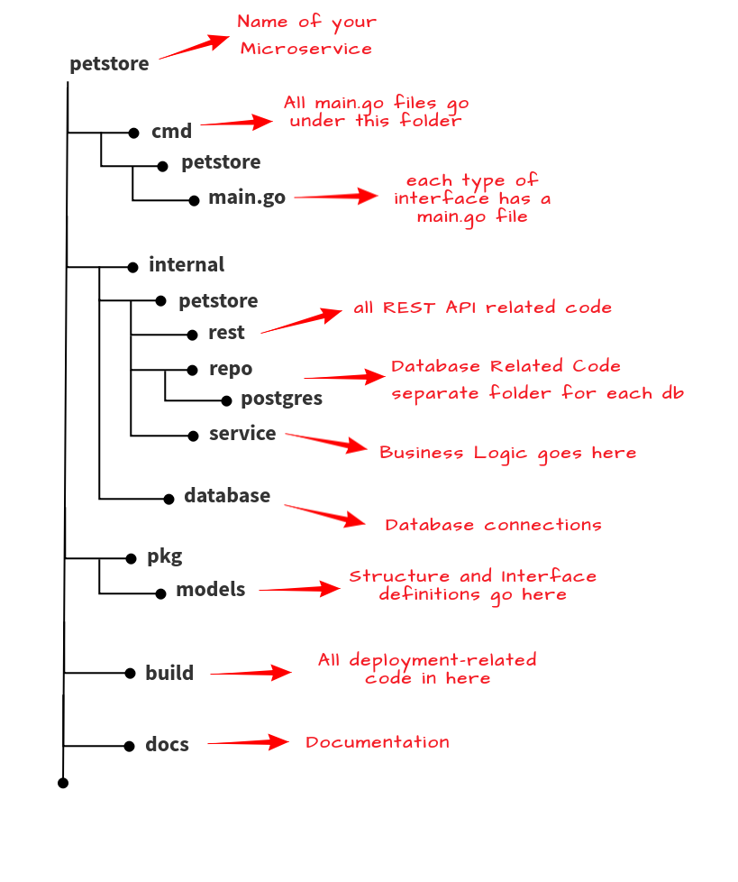

### Không gian làm việc của Go

Vào [Ngày 8](day08.md), chúng ta đã giới thiệu qua về không gian làm việc của Go, khởi động và demo bằng chương trình `Hello #90DaysOfDevOps`. Tuy nhiên cũng nên tìm hiểu kỹ hơn về không gian làm việc Go.

Hãy nhớ rằng chúng ta đã chọn các giá trị mặc định khi cài đặt Go và sau đó đã tạo các thư mục Go trong GOPATH mặc định đó nhưng trên thực tế, GOPATH có thể được thay đổi thành bất cứ nơi nào bạn muốn.

Nếu bạn chạy

```
echo $GOPATH
```

Đầu ra sẽ tương tự như thế này (tên người dùng có thể sẽ khác):

```
/home/michael/projects/go
```
Sau đó, ở đây, chúng ta đã tạo 3 thư mục.  **src**, **pkg** and **bin**


**src** là nơi lưu trữ tất cả các chương trình và dự án Go. Điều này xử lý việc quản lý không gian tên của các gói (packages) cho tất cả các kho lưu trữ (repositories) Go. Ở đây bạn có thể thấy rằng máy trạm của tôi có thư mục Hello cho dự án Hello #90DaysOfDevOps.


**pkg** là một tệp lưu trữ của các gói đã hoặc đang được cài đặt trong chương trình. Điều này giúp tăng tốc quá trình biên dịch dựa trên việc các gói được sử dụng có thay đổi hay không.


**bin** là nơi lưu trữ tất cả các tệp nhị phân đã được biên dịch.


Hello #90DaysOfDevOps không phải là một chương trình phức tạp, đây là một ví dụ về chương trình Go phức tạp hơn được lấy từ một tài nguyên tuyệt vời khác [GoChronicles](https://gochronicles.com/)



Bạn cũng có thể đi sâu vào một số chi tiết về lý do và cách tổ chức một dự án Go. Nó cũng đi sâu hơn một chút về các thư mục khác mà chúng ta chưa đề cập đến [GoChronicles](https://gochronicles.com/project-structure/)

### Biên dịch & Chạy mã

Chúng ta cũng đã giới thiệu sơ qua về việc biên dịch mã ở [ngày 9](day09.md), nhưng hãy đi sâu hơn một chút.

Cần phải **biên dịch** mã trước khi chạy mã. Có 3 cách để làm vậy với Go

- go build
- go install
- go run

Trước khi đến giai đoạn biên dịch ở trên, chúng ta cần xem xét những gì nhận được sau khi cài đặt Go.

Khi cài đặt Go vào ngày 8, chúng ta đã cài đặt một thứ được gọi là công cụ Go bao gồm một số chương trình cho phép xây dựng và xử lý các tệp mã nguồn Go của mình. Một trong số những công cụ đó là `go`

Điều đáng chú ý là bạn có thể cài đặt thêm các công cụ không có trong bản cài đặt Go tiêu chuẩn.

Nếu bạn mở dấu nhắc lệnh của mình và nhập `go`, bạn sẽ thấy như hình ảnh dưới đây và sau đó bạn sẽ thấy "một số những câu lệnh khác" phía bên dưới, tuy nhiên không chưa cần phải quan tâm tới chúng.


Bạn cũng có thể nhớ rằng chúng ta đã sử dụng ít nhất hai công cụ vào ngày 8.


Những thứ chúng ta muốn tìm hiểu thêm là build, install and run.


- `go run` - Lệnh này biên dịch và chạy gói chính bao gồm các tệp .go được chỉ định trên dòng lệnh. Các file biên dịch được lưu trữ trong một thư mục tạm thời.
- `go build` - Để biên dịch các gói và phần phụ thuộc trong thư mục hiện tại. Nếu là gói `main`, sẽ đặt tệp thực thi trong thư mục hiện tại, nếu không, tệp thực thi sẽ được đặt trong thư mục `pkg`. `go build` cũng cho phép bạn tạo một tệp thực thi cho bất kỳ nền tảng, hệ điều hành được hỗ trợ bởi của Go.
- `go install` - Tương tự như go build nhưng sẽ đặt tệp thi hành vào thư mục `bin`

Chúng ta đã chạy qua go build và go run nhưng vui lòng chạy lại chúng ở đây nếu bạn muốn, `go install` như đã nêu ở trên đặt tệp thực thi vào thư mục bin của chúng ta.

Chúng ta đã sử dụng go build và go run nhưng hãy thử lại nếu bạn muốn, `go install` như đã trình bày ở trên, sẽ đặt tệp thực thi trong thư mục `bin`.


Hy vọng rằng bạn vừa theo dõi nội dung các ngày qua cùng lúc với xem một trong những video bên dưới. Tôi ghi lại và tóm tắt những thứ này thành ghi chú của bản thân để có thể hiểu được kiến ​​thức nền tảng về Golang. Các tài nguyên dưới đây có thể giúp bạn hiểu rõ hơn về nhiều kiến thức tổng thể khác mà bạn cần khi học Golang, nhưng tôi sẽ chia sẻ một số điều thú vị mà tôi tìm thấy trong hành trình 7 ngày hay 7 giờ của mình.

## Tài liệu tham khảo

- [StackOverflow 2021 Developer Survey](https://insights.stackoverflow.com/survey/2021)
- [Why we are choosing Golang to learn](https://www.youtube.com/watch?v=7pLqIIAqZD4&t=9s)
- [Jake Wright - Learn Go in 12 minutes](https://www.youtube.com/watch?v=C8LgvuEBraI&t=312s)
- [Techworld with Nana - Golang full course - 3 hours 24 mins](https://www.youtube.com/watch?v=yyUHQIec83I)
- [**NOT FREE** Nigel Poulton Pluralsight - Go Fundamentals - 3 hours 26 mins](https://www.pluralsight.com/courses/go-fundamentals)
- [FreeCodeCamp - Learn Go Programming - Golang Tutorial for Beginners](https://www.youtube.com/watch?v=YS4e4q9oBaU&t=1025s)
- [Hitesh Choudhary - Complete playlist](https://www.youtube.com/playlist?list=PLRAV69dS1uWSR89FRQGZ6q9BR2b44Tr9N)

Hẹn gặp lại tại [ngày 11](day11.md).
