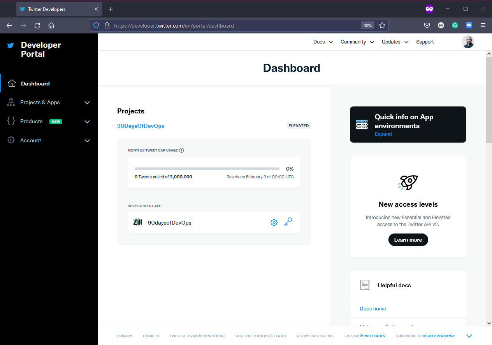
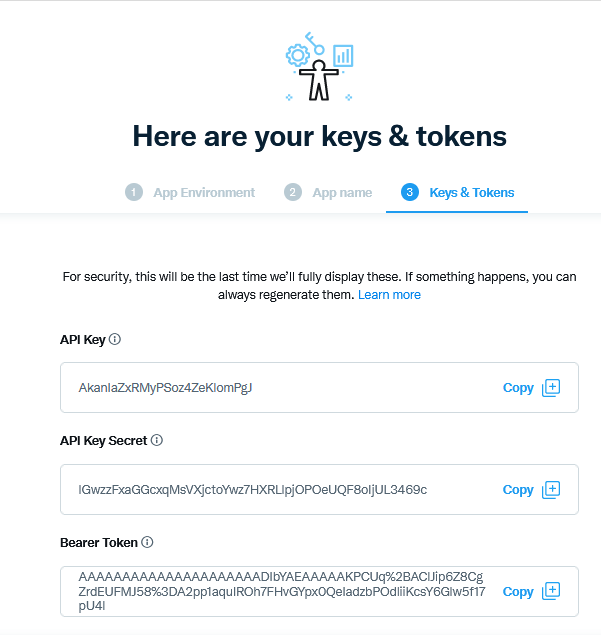

## Tweet tiến trình của bạn với ứng dụng mới của chúng ta

Vào ngày cuối cùng tìm hiểu về ngôn ngữ lập trình này, chúng ta mới chỉ tìm hiểu qua về những vấn đề nổi bật của ngôn ngữ này nhưng đó sẽ là lúc mà chúng ta cần hứng thú và hào hứng để có thể tìm hiểu sâu hơn về nó.

Trong vài ngày qua, chúng ta đã viết một ứng dụng từ ý tưởng nhỏ của chúng ta và đã thêm chức năng cho nó. Trong ngày hôm nay, tôi muốn tận dụng các gói mà chúng ta đã đề cập tới và tạo ra một tính năng giúp chúng ta có thể cập nhận tiến trình của chúng ta trên màn hình mà còn có thể đăng một tweet với thông tin chi tiết về thử thách hiện tại.

## Thêm chức năng tweet tiến trình

Điều đầu tiên chúng ta cần làm là thiết lập quyền truy cập API của Twitter để chức năng này có thể hoạt động.

Truy cập [Twitter Developer Platform](https://developer.twitter.com) và đăng nhập với tài khoản Twitter của bạn và điền các thông tin cần thiết. Sau khi đó, bạn có thể thấy gì đó tương tự như ở dưới.



Sau đó, bạn cũng có thể muốn yêu cầu quyền truy cập nâng cao, việc này có thể mất một chút thời gian nhưng với tôi thì nó rất nhanh.

Tiếp theo, chúng ta nên chọn "Dự án & Ứng dụng" và tạo ứng dụng của mình. Giới hạn tùy thuộc vào quyền truy cập tài khoản mà bạn có, về cơ bản thì bạn sẽ có một ứng dụng và nếu dự án có quyền cao hơn, bạn có thể có 3 ứng dụng.


Đặt tên cho ứng dụng của bạn


Sau đó, bạn sẽ được cấp các mã API này, và bạn phải lưu chúng ở nơi an toàn. (Tôi đã xóa ứng dụng này) Chúng ta sẽ cần mã này ở các bước sau.



Sau khi ứng dụng của chúng ta được tạo (tôi phải thay đổi tên ứng dụng của mình vì tên ứng dụng trong ảnh chụp màn hình đã bị lấy, tên các ứng dụng phải khác nhau)


Các khóa mà chúng ta đã có được gọi là khóa khách hàng và chúng ta cũng sẽ cần mã truy cập và bí mật (access token and secrets). Chúng ta có thể xem thông tin này trong tab "Keys & Tokens".


Bây giờ chúng ta đã hoàn tất việc chuẩn bị trên Twitter. Hãy đảm bảo rằng bạn giữ khóa của mình an toàn vì chúng ta sẽ cần chúng sau này.

## Twitter Bot

Đây là mà chúng ta bắt đầu trong ứng dụng của mình [day13_example1](../../Days/Go/day13_example1.go) nhưng trước tiên, chúng ta cần kiểm tra xem mã có đúng để tạo một tweet không

Chúng ta cần viết mã để đưa đầu ra hoặc tin nhắn tới Twitter dưới dạng một tweet. Chúng ta sẽ sử dụng [go-twitter](https://github.com/dghubble/go-twitter) - một thư viện client viết bằng Go cho Twitter API.

Để kiểm tra trước khi đưa nó vào ứng dụng chính của chúng ta, tôi đã tạo một thư mục mới trong thư mục `src` có tên là `go-twitter-bot`, đã thực hiện lệnh `go mod init github.com/michaelcade/go-Twitter-bot` trên thư mục để tạo tệp `go.mod` để chúng ta có thể bắt đầu viết `main.go` mới của mình và kiểm tra điều này.

Bây giờ chúng ta cần các khóa, các tokens và secrets mà chúng ta lấy từ Twitter. Chúng ta sẽ đặt chúng trong các biến môi trường của hệ điều hành. Việc này sẽ phụ thuộc vào hệ điều hành của bạn:

Windows

```
set CONSUMER_KEY
set CONSUMER_SECRET
set ACCESS_TOKEN
set ACCESS_TOKEN_SECRET
```

Linux/macOS

```
export CONSUMER_KEY
export CONSUMER_SECRET
export ACCESS_TOKEN
export ACCESS_TOKEN_SECRET
```

Ở giai đoạn này, bạn có thể xem mã tại [day13_example2](../../Days/Go/day13_example2.go) nhưng bạn sẽ thấy ở đây rằng chúng ta sẽ sử dụng một cấu trúc (struct) để khai báo khóa, secrts và tokens.

Sau đó, chúng ta có một `func` để phân tích cú pháp các thông tin đăng nhập và tạo kết nối đó với API Twitter và nếu kết nối thành công, chúng ta sẽ gửi một tweet.

```go
package main

import (
    // other imports
    "fmt"
    "log"
    "os"

    "github.com/dghubble/go-twitter/twitter"
    "github.com/dghubble/oauth1"
)

// Credentials stores all of our access/consumer tokens
// and secret keys needed for authentication against
// the twitter REST API.
type Credentials struct {
    ConsumerKey       string
    ConsumerSecret    string
    AccessToken       string
    AccessTokenSecret string
}

// getClient is a helper function that will return a twitter client
// that we can subsequently use to send tweets, or to stream new tweets
// this will take in a pointer to a Credential struct which will contain
// everything needed to authenticate and return a pointer to a twitter Client
// or an error
func getClient(creds *Credentials) (*twitter.Client, error) {
    // Pass in your consumer key (API Key) and your Consumer Secret (API Secret)
    config := oauth1.NewConfig(creds.ConsumerKey, creds.ConsumerSecret)
    // Pass in your Access Token and your Access Token Secret
    token := oauth1.NewToken(creds.AccessToken, creds.AccessTokenSecret)

    httpClient := config.Client(oauth1.NoContext, token)
    client := twitter.NewClient(httpClient)

    // Verify Credentials
    verifyParams := &twitter.AccountVerifyParams{
        SkipStatus:   twitter.Bool(true),
        IncludeEmail: twitter.Bool(true),
    }

    // we can retrieve the user and verify if the credentials
    // we have used successfully allow us to log in!
    user, _, err := client.Accounts.VerifyCredentials(verifyParams)
    if err != nil {
        return nil, err
    }

    log.Printf("User's ACCOUNT:\n%+v\n", user)
    return client, nil
}
func main() {
    fmt.Println("Go-Twitter Bot v0.01")
    creds := Credentials{
        AccessToken:       os.Getenv("ACCESS_TOKEN"),
        AccessTokenSecret: os.Getenv("ACCESS_TOKEN_SECRET"),
        ConsumerKey:       os.Getenv("CONSUMER_KEY"),
        ConsumerSecret:    os.Getenv("CONSUMER_SECRET"),
    }

    client, err := getClient(&creds)
    if err != nil {
        log.Println("Error getting Twitter Client")
        log.Println(err)
    }

    tweet, resp, err := client.Statuses.Update("A Test Tweet from the future, testing a #90DaysOfDevOps Program that tweets, tweet tweet", nil)
    if err != nil {
        log.Println(err)
    }
    log.Printf("%+v\n", resp)
    log.Printf("%+v\n", tweet)
}

```

Đoạn code trên hoặc là sẽ đưa ra một lỗi hoặc sẽ thành công và bạn sẽ có một tweet được gửi với nội dung như được nêu trong mã.

## Kết hợp 2 thứ - Go-Twitter-bot và ứng dụng của chúng ta

Bây giờ chúng ta cần hợp nhất hai thứ này vào một file `main.go`. Chắc chắn sẽ có người cho rằng có cách làm tốt hơn cho việc này nhưng cách làm này có thể giúp chúng ta đạt được mục đích cuối cùng.

Bạn có thể xem được mã đã được gộp tại [day13_example3](../../Days/Go/day13_example3.go) hoặc dưới đây.

```go
package main

import (
    // other imports
    "fmt"
    "log"
    "os"

    "github.com/dghubble/go-twitter/twitter"
    "github.com/dghubble/oauth1"
)

// Credentials stores all of our access/consumer tokens
// and secret keys needed for authentication against
// the twitter REST API.
type Credentials struct {
    ConsumerKey       string
    ConsumerSecret    string
    AccessToken       string
    AccessTokenSecret string
}

// getClient is a helper function that will return a twitter client
// that we can subsequently use to send tweets, or to stream new tweets
// this will take in a pointer to a Credential struct which will contain
// everything needed to authenticate and return a pointer to a twitter Client
// or an error
func getClient(creds *Credentials) (*twitter.Client, error) {
    // Pass in your consumer key (API Key) and your Consumer Secret (API Secret)
    config := oauth1.NewConfig(creds.ConsumerKey, creds.ConsumerSecret)
    // Pass in your Access Token and your Access Token Secret
    token := oauth1.NewToken(creds.AccessToken, creds.AccessTokenSecret)

    httpClient := config.Client(oauth1.NoContext, token)
    client := twitter.NewClient(httpClient)

    // Verify Credentials
    verifyParams := &twitter.AccountVerifyParams{
        SkipStatus:   twitter.Bool(true),
        IncludeEmail: twitter.Bool(true),
    }

    // we can retrieve the user and verify if the credentials
    // we have used successfully allow us to log in!
    user, _, err := client.Accounts.VerifyCredentials(verifyParams)
    if err != nil {
        return nil, err
    }

    log.Printf("User's ACCOUNT:\n%+v\n", user)
    return client, nil
}
func main() {
    creds := Credentials{
        AccessToken:       os.Getenv("ACCESS_TOKEN"),
        AccessTokenSecret: os.Getenv("ACCESS_TOKEN_SECRET"),
        ConsumerKey:       os.Getenv("CONSUMER_KEY"),
        ConsumerSecret:    os.Getenv("CONSUMER_SECRET"),
    }
    {
        const DaysTotal int = 90
        var remainingDays uint = 90
        challenge := "#90DaysOfDevOps"

        fmt.Printf("Welcome to the %v challenge.\nThis challenge consists of %v days\n", challenge, DaysTotal)

        var TwitterName string
        var DaysCompleted uint

        // asking for user input
        fmt.Println("Enter Your Twitter Handle: ")
        fmt.Scanln(&TwitterName)

        fmt.Println("How many days have you completed?: ")
        fmt.Scanln(&DaysCompleted)

        // calculate remaining days
        remainingDays = remainingDays - DaysCompleted

        //fmt.Printf("Thank you %v for taking part and completing %v days.\n", TwitterName, DaysCompleted)
        //fmt.Printf("You have %v days remaining for the %v challenge\n", remainingDays, challenge)
        // fmt.Println("Good luck")

        client, err := getClient(&creds)
        if err != nil {
            log.Println("Error getting Twitter Client, this is expected if you did not supply your Twitter API tokens")
            log.Println(err)
        }

        message := fmt.Sprintf("Hey I am %v I have been doing the %v for %v days and I have %v Days left", TwitterName, challenge, DaysCompleted, remainingDays)
        tweet, resp, err := client.Statuses.Update(message, nil)
        if err != nil {
            log.Println(err)
        }
        log.Printf("%+v\n", resp)
        log.Printf("%+v\n", tweet)
    }

}
```

Kết quả của việc chạy đoạn mã này sẽ là một tweet nhưng nếu bạn không cung cấp các biến môi trường của mình thì bạn có thể sẽ gặp lỗi như bên dưới.


Sau khi bạn đã khắc phục điều đó hoặc nếu bạn chọn không xác thực với Twitter thì bạn có thể sử dụng mã mà chúng ta đã hoàn thành trong ngày hôm qua. Kết quả cuối cùng sẽ giống như sau:


Tweet kết quả sẽ trông giống như sau:


## Cách biên dịch cho nhiều hệ điều hành

Tiếp theo, tôi muốn đề cập đến câu hỏi, "Làm cách nào để bạn biên dịch cho nhiều Hệ điều hành?". Điều tuyệt vời của Go là nó có thể dễ dàng biên dịch cho nhiều Hệ điều hành khác nhau. Bạn có thể nhận được danh sách đầy đủ bằng cách chạy lệnh sau:

```
go tool dist list
```

Việc sử dụng lệnh `go build` của chúng ta cho đến nay là rất tốt, nó sẽ sử dụng các biến môi trường `GOOS` và `GOARCH` để xác định hệ điều hành của máy chủ và bản dựng nên được xây dựng cho hệ điều hành nào. Dưới đây là một ví dụ.

```
GOARCH=amd64 GOOS=darwin go build -o ${BINARY_NAME}_0.1_darwin main.go
GOARCH=amd64 GOOS=linux go build -o ${BINARY_NAME}_0.1_linux main.go
GOARCH=amd64 GOOS=windows go build -o ${BINARY_NAME}_0.1_windows main.go
GOARCH=arm64 GOOS=linux go build -o ${BINARY_NAME}_0.1_linux_arm64 main.go
GOARCH=arm64 GOOS=darwin go build -o ${BINARY_NAME}_0.1_darwin_arm64 main.go
```

Các câu lệnh này sẽ cung cấp cho bạn các tệp nhị phân cho tất cả các nền tảng ở trên. Sau đó, bạn có thể lấy tệp này và tạo một makefile để tạo các tệp nhị phân này bất cứ khi nào bạn thêm các tính năng và chức năng mới vào mã của mình. Tôi đã bao gồm [makefile](../../Days/Go/makefile)

Đây là những gì tôi đã sử dụng để tạo các bản phát hành, bạn có thể tham khảo thêm tại [git repository](https://github.com/MichaelCade/90DaysOfDevOps/releases)

## Tài liệu tham khảo

- [StackOverflow 2021 Developer Survey](https://insights.stackoverflow.com/survey/2021)
- [Why we are choosing Golang to learn](https://www.youtube.com/watch?v=7pLqIIAqZD4&t=9s)
- [Jake Wright - Learn Go in 12 minutes](https://www.youtube.com/watch?v=C8LgvuEBraI&t=312s)
- [Techworld with Nana - Golang full course - 3 hours 24 mins](https://www.youtube.com/watch?v=yyUHQIec83I)
- [**NOT FREE** Nigel Poulton Pluralsight - Go Fundamentals - 3 hours 26 mins](https://www.pluralsight.com/courses/go-fundamentals)
- [FreeCodeCamp - Learn Go Programming - Golang Tutorial for Beginners](https://www.youtube.com/watch?v=YS4e4q9oBaU&t=1025s)
- [Hitesh Choudhary - Complete playlist](https://www.youtube.com/playlist?list=PLRAV69dS1uWSR89FRQGZ6q9BR2b44Tr9N)
- [A great repo full of all things DevOps & exercises](https://github.com/bregman-arie/devops-exercises)
- [GoByExample - Example based learning](https://gobyexample.com/)
- [go.dev/tour/list](https://go.dev/tour/list)
- [go.dev/learn](https://go.dev/learn/)

Đây sẽ là ngày kết thúc cho 7 ngày tìm hiểu về Ngôn ngữ lập trình! Còn rất nhiều điều chúng ta cần tìm hiểu và tôi hy vọng bạn có thể tiếp tục thông qua các tài nguyên ở trên nhằm có thể hiểu một số khía cạnh khác của ngôn ngữ lập trình Go.

Tiếp theo, chúng ta tập trung vào Linux và một số nguyên tắc cơ bản mà tất cả chúng ta nên biết về nó.

Hẹn gặp lại các bạn vào [Ngày 14](day14.md).
