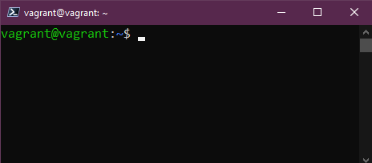
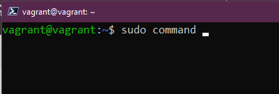
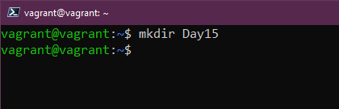
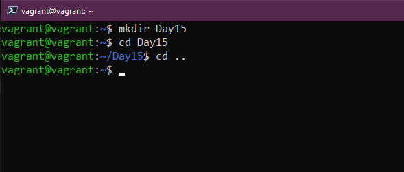
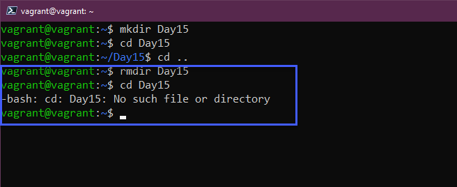
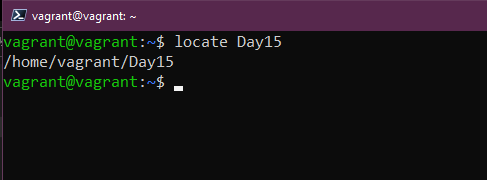
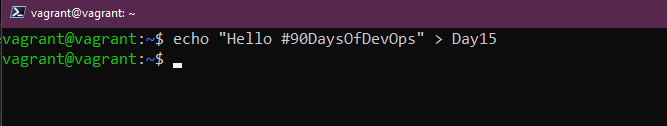

## Các lệnh Linux cho DevOps (thực tế là cho mọi người)

Như tôi đã đề cập [vào ngày hôm qua](day14.md), hôm nay chúng ta sẽ dành nhiều thời gian cùng terminal với một số câu lệnh làm việc.

Tôi cũng đã đề cập rằng với VM được tạo của chúng ta, chúng ta có thể sử dụng `vagrant ssh` và có quyền truy cập vào "box" mà chúng ta đã tạo. Bạn cần phải ở trong cùng thư mục mà chúng ta đã tạo vagrant box từ đó.

Đối với SSH, bạn sẽ không cần tên người dùng và mật khẩu, bạn sẽ chỉ cần điều đó nếu bạn quyết định đăng nhập vào Virtual Box console.

Chúng ta muốn có được kết quả như sau:



## Câu lệnh

Tôi không thể trình bày tất cả các lệnh trong bài viết này, có nhiều trang và tài liệu đề cập đến những điều này nhưng nếu bạn đang ở terminal của mình và muốn tìm hiểu các tùy chọn cho một lệnh cụ thể, chúng ta có trang `man` viết tắt cho manual (hướng dẫn sử dụng). Sử dụng câu lệnh này để xem qua từng lệnh mà chúng ta đề cập trong bài này để biết thêm các tùy chọn cho từng lệnh. Chúng ta có thể chạy `man man` để được trợ giúp cho các chính cách trang hướng dẫn. Nhập `q` để thoát khỏi các trang đó.


`sudo` nếu bạn đã quen thuộc với Windows và nhấp chuột phải, chọn `Run as administrator`, chúng ta có thể coi `sudo` tương tự với hành động đó. Khi bạn chạy một lệnh với lệnh này, bạn sẽ chạy nó dưới quyền `root`, nó sẽ yêu cầu mật khẩu trước khi chạy lệnh.



Đối với một công việc thực hiện một lần như cài đặt ứng dụng hoặc dịch vụ, bạn có thể cần `lệnh sudo` đó nhưng nếu bạn có một số nhiệm vụ cần giải quyết và bạn muốn được thực hiện dưới quyền `sudo` một lúc? Đây là nơi bạn có thể sử dụng `sudo su`, giống như `sudo`, bạn sẽ được yêu cầu nhập mật khẩu `root` của mình. Trong một máy ảo thử nghiệm như của chúng ta, điều này có thể chấp nhật được nhưng tôi thấy không ổn nếu chúng ta ở dưới quyền `root` quá lâu, những điều tồi tệ có thể xảy ra. Để thoát khỏi quyền này, bạn chỉ cần gõ vào `exit`


Tôi thấy mình luôn sử dụng lệnh `clear`, lệnh` clear` thực hiện chính xác những gì nó nói, nó sẽ xóa màn hình của tất cả các lệnh trước đó, đưa dấu nhắc lệnh của bạn lên đầu và trả lại cho bạn một không gian làm việc sạch. Với Windows, tôi nghĩ là `cls` trong .mdprompt.


Bây giờ chúng ta hãy xem xét một số lệnh giúp chúng ta có thể tạo một thứ trong hệ thống của mình và có thể quan sát được chúng trong terminal. Trước hết, chúng ta có `mkdir` cho phép chúng ta tạo một thư mục trong hệ thống của mình. Có thể tạo một thư mục trong thư mục chính có tên Day15 `mkdir Day15`



Với `cd`, chúng ta có thể thay đổi thư mục. Để di chuyển vào thư mục mới tạo của mình, chúng ta có thể thực hiện việc này với lệnh `cd Day15` cũng có thể sử dụng tab để tự động hoàn thành câu lệnh với thư mục có sẵn. Chúng ta có thể quay lại vị trí lúc mới bắt đầu bằng câu lệnh `cd. .`



`rmdir` cho phép chúng ta xóa thư mục, nếu chúng ta chạy `rmdir Day15` thì thư mục sẽ bị xóa (lưu ý rằng điều này sẽ chỉ hoạt động nếu bạn không có gì trong thư mục)
trong


Chắc hẳn chúng ta ai cũng đã từng đi vào rất sâu trong hệ thống tệp của mình đến một thư mục mà không biết chúng ta đang ở đâu. `pwd` cung cấp cho chúng ta địa chỉ của thư mục làm việc, pwd có vẻ như là viết tắt của mật khẩu (password) nhưng nó là viết tắt của print working directory (in ra thư mục làm việc).


Chúng ta đã biết cách tạo thư mục nhưng làm thế nào để có thể tạo một tệp? Chúng ta có thể tạo tệp bằng cách sử dụng lệnh `touch`. Nếu chúng ta dùng lệnh `touch Day15`, thao tác này sẽ tạo một tệp có tên là `Day15`. Bỏ qua `mkdir`, chúng ta sẽ gặp lại điều này sau.


`ls` Tôi có thể chuyển nhà vào đây, bạn sẽ sử dụng lệnh này rất nhiều. Câu lệnh này sẽ liệt kê tất cả các tệp trong thư mục hiện tại. Hãy xem liệu chúng ta có thể thấy tệp mà chúng ta vừa tạo không.


Làm cách nào chúng ta có thể tìm tệp trong Linux? `locate` sẽ cho phép chúng ta tìm kiếm hệ thống tệp của mình. Nếu chúng ta sử dụng `locate Day15`, nó sẽ báo lại vị trí của tệp. Nếu bạn biết rằng tệp tồn tại nhưng bạn nhận được kết quả tìm kiếm rỗng thì hãy chạy lệnh `sudo updatedb` để lập chỉ mục tất cả các tệp trong hệ thống tệp, sau đó chạy lại lệnh `locate`. Nếu bạn không có sẵn gói lệnh `locate`, bạn có thể cài đặt nó bằng lệnh sau `sudo apt install mlocate`



Còn việc di chuyển tệp từ vị trí này sang vị trí khác thì sao? Lệnh `mv` sẽ cho phép bạn di chuyển các tệp của mình. Ví dụ `mv Day15 90DaysOfDevOps` sẽ di chuyển tệp của bạn vào thư mục 90DaysOfDevOps.


Chúng ta đã di chuyển tệp của mình nhưng nếu muốn đổi tên tệp thì sao? Chúng ta có thể làm điều đó bằng lệnh `mv` một lần nữa... Gì cơ!!!? đúng vậy, chúng ta chỉ cần sử dụng `mv Day15 day15` hoặc chúng ta có thể sử dụng `mv day15 AnotherDay` để đổi tên tệp, hãy sử dụng `ls` để kiểm tra lại.


Đủ rồi, bây giờ hãy loại bỏ (xóa) tệp và thậm chí có thể là thư mục mà chúng ta đã tạo. Hãy dùng lệnh `rm`, chỉ cần `rm AnotherDay` sẽ xóa tệp AnotherDay trong thư mục hiện tại. Chúng ta cũng sẽ sử dụng khá nhiều `rm -R` sẽ chạy và sử dụng đệ quy thông qua một thư mục hoặc vị trí. Chúng ta cũng có thể sử dụng `rm -R -f` để xóa tất cả các tệp đó một cách bắt buộc (force). Spoiler nếu bạn chạy `rm -R -f /` và thêm sudo vào, bạn có thể nói lời tạm biệt với hệ thống của mình....!


Chúng ta đã xem xét việc di chuyển tệp nhưng nếu tôi chỉ muốn sao chép tệp từ thư mục này sang thư mục khác, nó rất giống với lệnh `mv`, lệnh `cp` (copy), chúng ta có thể sử dụng `cp Day15 Desktop`


Chúng ta đã tạo các thư mục và tệp nhưng chưa đặt thêm bất cứ nội dung nào vào thư mục của mình, chúng ta có thể thêm nội dung theo một số cách nhưng một cách dễ dàng là `echo`. Chúng ta cũng có thể sử dụng `echo` để in ra nhiều thứ trong terminal của mình. Tôi sử dụng `echo` để in ra các biến hệ thống để biết liệu chúng có được cài đặt hay chưa. Chúng ta có thể sử dụng `echo "Xin chào #90DaysOfDevOps" > Day15` và thao tác này sẽ thêm nó vào tệp của chúng ta. Chúng ta cũng có thể thêm vào tệp của mình bằng cách sử dụng `echo "Commands are fun!" >> Day15`



Một trong những lệnh mà bạn sẽ sử dụng rất nhiều! `cat` viết tắt của nối (concatenate). Chúng ta có thể sử dụng `cat Day15` để xem nội dung bên trong tệp. Rất hữu ích khi bạn muốn đọc nhanh các tệp cấu hình.


Nếu bạn có một tệp cấu hình phức tạp và bạn muốn hoặc cần tìm thứ gì đó trong tệp đó một cách nhanh hơn so với việc phải đọc từng dòng thì lệnh `grep` là bạn của bạn, nó cho phép chúng ta tìm kiếm tệp cho một từ cụ thể bằng cách sử dụng `cat Day15 | grep "#90DaysOfDevOps"`


Nếu bạn giống tôi và sử dụng lệnh `clear` rất nhiều thì bạn có thể sẽ bỏ lỡ một số lệnh đã chạy trước đó, chúng ta có thể sử dụng `history` để tìm ra tất cả các lệnh mà chúng ta đã chạy. `history -c` sẽ xóa lịch sử.

Khi bạn chạy `history` và muốn chọn một lệnh cụ thể, bạn có thể sử dụng `!3` để chọn lệnh thứ 3 trong danh sách.

Bạn cũng có thể sử dụng `history | grep "Command"` để tìm kiếm lệnh nào đó cụ thể.

Trên các máy chủ, để theo dõi thời điểm một lệnh được thực thi, việc thêm ngày và giờ vào từng lệnh trong tệp lịch sử có thể sẽ hữu ích.

Biến hệ thống sau kiểm soát hành vi này:

```
HISTTIMEFORMAT="%d-%m-%Y %T "
```

Bạn có thể dễ dàng thêm vào bash_profile của mình:

```
echo 'export HISTTIMEFORMAT="%d-%m-%Y %T "' >> ~/.bash_profile
```

Có thể sẽ tốt hơn nếu cho phép tệp lịch sử có kích thước lơn hơn lớn hơn:

```
echo 'export HISTSIZE=100000' >> ~/.bash_profile
echo 'export HISTFILESIZE=10000000' >> ~/.bash_profile
```


Cần thay đổi mật khẩu của bạn? `passwd` sẽ cho phép chúng ta thay đổi mật khẩu. Lưu ý rằng khi bạn thêm mật khẩu của mình theo cách này thì khi mật khẩu bị ẩn, nó sẽ không hiển thị trong `history` tuy nhiên nếu lệnh của bạn có `-p PASSWORD` thì mật khẩu này sẽ hiển thị trong `history` của bạn.


Chúng ta cũng có thể muốn thêm người dùng mới vào hệ thống của mình, có thể thực hiện việc này với `useradd`. Chúng ta phải thêm người dùng bằng lệnh `sudo` của mình, và có thể thêm người dùng mới bằng `sudo useradd NewUser`


Tạo nhóm mới cũng yêu cầu `sudo` và chúng ta có thể sử dụng `sudo groupadd DevOps` nếu chúng ta muốn thêm người dùng mới của mình vào nhóm đó, việc này có thể được thực hiện bằng cách chạy `sudo usermod -a -G DevOps` `-a` là add (thêm vào) và `-G` là tên nhóm.


Làm cách nào để chúng ta thêm người dùng vào nhóm `sudo`, đây sẽ là một trường hợp rất hiếm khi xảy ra nhưng câu lệnh để làm điều này là `usermod -a -G sudo NewUser`

### Quyền

Đọc (read), viết (write) và thực thi (execute) là các quyền chúng ta có trên tất cả các tệp và thư mục trên hệ thống Linux.

Danh sách đầy đủ:

- 0 = None `---`
- 1 = Execute only `--X`
- 2 = Write only `-W-`
- 3 = Write & Execute `-WX`
- 4 = Read Only `R--`
- 5 = Read & Execute `R-X`
- 6 = Read & Write `RW-`
- 7 = Read, Write & Execute `RWX`

Bạn cũng sẽ thấy `777` hoặc `775` và các số này đại diện cho các số giống như danh sách ở trên nhưng mỗi số đại diện cho mỗi đối tượng **User - Group - Everyone**(**Người dùng - Nhóm - Mọi người**)

Hãy xem tập tin của chúng ta. `ls -al Day15` bạn có thể thấy 3 nhóm nêu trên, user và group có quyền đọc và ghi (read & write) nhưng mọi người chỉ có quyền đọc read.


Chúng ta có thể thay đổi điều này bằng cách sử dụng `chmod`, bạn có thể thấy sẽ điều này khi tạo nhiều tệp nhị phân trên hệ thống của mình và cần cung cấp quyền thực thi cho các tệp nhị phân đó. `chmod 750 Day15` và bây giờ chạy lệnh `ls -al Day15`. Nếu bạn muốn chạy lệnh này cho toàn bộ thư mục thì sử dụng `-R` để làm điều đó một cách đệ quy.


Vậy còn nếu muốn thay đổi chủ của tập tin? Chúng ta có thể sử dụng `chown` cho thao tác này, nếu muốn thay đổi quyền sở hữu của `Day15` từ người dùng `vagrant` thành `NewUser`, chúng ta có thể chạy lệnh `sudo chown NewUser Day15` và một lần nữa `-R` có thể sử dụng để làm điều này một cách đệ quy.


Một lệnh mà bạn sẽ có thể sẽ gặp nhiều là `awk`. Lệnh này được sử dụng trong thực tế khi bạn chỉ cần dữ liệu cụ thể từ một đầu ra. Giống như chạy lệnh `who` chúng ta sẽ nhận được các dòng có thông tin, nhưng nếu chỉ cần tên người dùng, chúng ta có thể chạy `who | awk '{print $1}'` để chỉ lấy của cột đầu tiên của danh sách đó.


Nếu bạn đang muốn đọc các luồng dữ liệu từ đầu vào tiêu chuẩn (stdin - standard input), thì hãy tạo và thực thi các dòng lệnh; nghĩa là nó có thể lấy đầu ra của một lệnh và dùng nó làm đối số của một lệnh khác. `xargs` là một công cụ hữu ích cho trường hợp sử dụng này. Ví dụ: nếu tôi muốn có danh sách tất cả tài khoản người dùng Linux trên hệ thống, tôi có thể chạy `cut -d: -f1 < /etc/passwd` và lấy danh sách dài như bạn thấy bên dưới.


Nếu tôi muốn thu gọn danh sách đó, tôi có thể sử dụng `xargs` trong một lệnh như thế này `cut -d: -f1 < /etc/passwd | sort | xargs`


Tôi cũng không đề cập đến lệnh `cut`, lệnh này cho phép chúng ta xóa các phần khỏi mỗi dòng của tệp. Nó có thể được sử dụng để cắt các phần của một dòng theo vị trí byte, ký tự và trường. Lệnh `cut -d " " -f 2 list.txt` cho phép chúng ta xóa chữ cái đầu tiên mà và chỉ hiển thị số. Có rất nhiều kết hợp có thể được sử dụng với lệnh này, tôi chắc chắn rằng đã có lúc tôi đã dành quá nhiều thời gian để sử dụng lệnh này trong khi có thể trích xuất dữ liệu nhanh hơn theo cách thủ công.


Ngoài ra, cần lưu ý nếu bạn nhập một lệnh và bạn không muốn thực thi nó nữa và muốn bắt đầu lại, chỉ cần nhấn control + C và thao tác này sẽ hủy dòng lệnh đó và giúp bạn bắt đầu lại từ đầu.

## Tài liệu tham khảo

- [Learn the Linux Fundamentals - Part 1](https://www.youtube.com/watch?v=kPylihJRG70)
- [Linux for hackers (don't worry you don't need to be a hacker!)](https://www.youtube.com/watch?v=VbEx7B_PTOE)

Hẹn gặp lại vào [ngày 16](day16.md)

Đây là một danh sách khá dài nhưng tôi có thể nói rằng tôi đã sử dụng tất cả các lệnh này hàng ngày, có thể là từ một máy chủ Linux mà tôi đang quản trị hoặc trên máy tính để bàn Linux của tôi, việc điều hướng rất dễ dàng trong Windows hoặc macOS nhưng với máy chủ Linux, giao diện người dùng thường không có ở đó, mọi thứ được thực hiện thông qua terminal.
