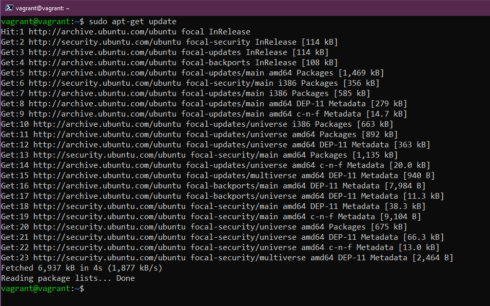
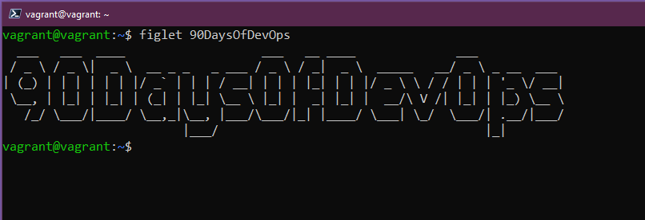
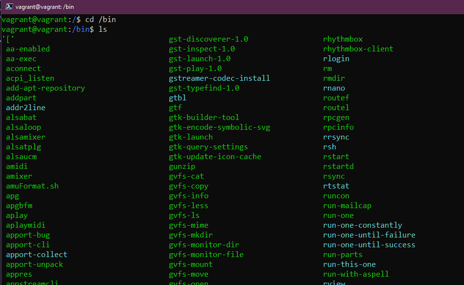
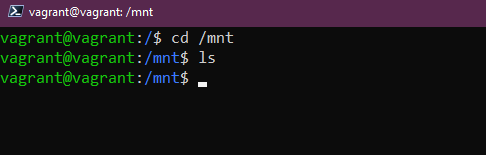
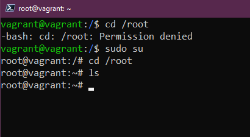
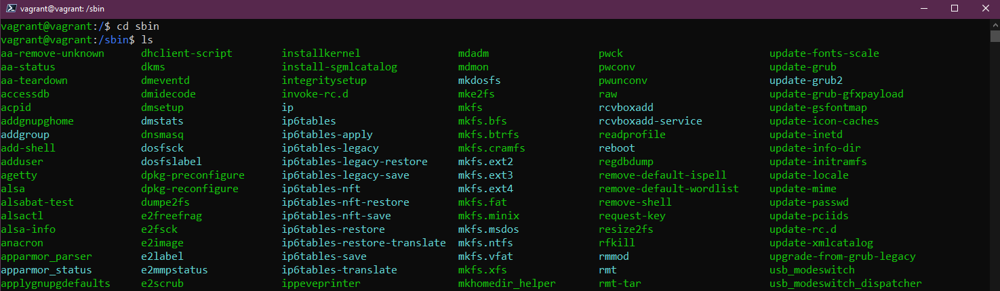
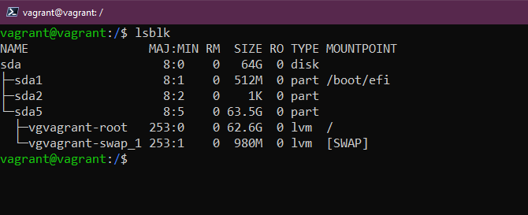

## Quản lý Hệ thống Linux, Hệ thống Tệp & Lưu trữ

Tính cho đến thời điểm này, chúng ta đã có cái nhìn tổng quan ngắn gọn về Linux và DevOps. Sau đó chúng ta đã thiết lập môi trường thử nghiệm của mình sử dụng Vagrant trong [(Ngày 14)](day14.md), cuối cùng chúng ta đã đề cập đến một phần nhỏ các lệnh được sử dụng hàng ngày khi làm việc với terminal vào [(Ngày 15)](day15.md).

Hôm nay, chúng ta sẽ xem xét ba phần chính khi quản lý hệ thống Linux thông qua các bản cập nhật, cài đặt phần mềm, thư mục hệ thống được sử dụng để làm gì và cuối cùng là tìm hiểu về lưu trữ (storage).

## Quản lý Ubuntu & Phần mềm

Điều đầu tiên chúng ta sẽ xem xét cách cập nhật hệ điều hành của mình. Hầu hết các bạn đã quen với quy trình này với Windows và macOS, quy trình này sẽ hơi khác trên máy tính và máy chủ sử dụng Linux.

Chúng ta sẽ xem xét trình quản lý gói apt, nó sẽ sử dụng trên Ubuntu VM để cập nhật và cài đặt phần mềm.

Nói chung, ít nhất là trên các máy trạm của nhà phát triển, tôi chạy lệnh này để đảm bảo mình luôn có các bản cập nhật mới nhất vào thời điểm hiện tại từ các kho lưu trữ trung tâm (central repositories), trước khi cài đặt bất kỳ phần mềm nào.

`sudo apt-get update`

Bây giờ chúng ta đã cập nhật Ubuntu VM với các bản cài đặt mới nhất. Bây giờ chúng ta muốn cài thêm một số phần mềm ở đây.

Hãy chọn `figlet` - một chương trình tạo biểu ngữ văn bản.

Nếu chúng ta nhập `figlet` trong terminal, bạn sẽ thấy rằng chúng ta chưa cài đặt nó trên hệ thống của mình.

You will see from the above though that it does give us some `apt` install options that we could try. This is because in the default repositories there is a program called figlet. Let's try `sudo apt install figlet`

Mặc dù vậy, bạn sẽ thấy rằng hệ thống cung cấp cho chúng ta một số tùy chọn cài đặt `apt` mà chúng ta có thể thử. Điều này có thể thực hiện do trong kho lưu trữ mặc định có một chương trình gọi là figlet. Hãy thử `sudo apt install figlet`

Bây giờ chúng ta có thể sử dụng ứng dụng `figlet` như bạn có thể thấy bên dưới.

Nếu chúng ta muốn xóa phần mềm đó hoặc bất kỳ cài đặt phần mềm nào của mình, chúng ta cũng có thể thực hiện việc đó thông qua trình quản lý gói `apt`.

`sudo apt remove figlet`

Có các kho lưu trữ của bên thứ ba mà chúng ta cũng có thể thêm vào hệ thống của mình, những kho lưu trữ mà chúng ta có quyền truy cập ngay lập tức là các kho lưu trữ mặc định của Ubuntu.

Ví dụ: nếu chúng ta muốn cài đặt vagrant trên Ubuntu VM, chúng ta sẽ không thể thực hiện ngay được và bạn có thể thấy điều này khi thực hiện câu lệnh đầu tiên. Chúng ta sau đó thêm khóa để có thể tin tưởng kho lưu trữ HashiCorp, và cuối cùng là thêm kho lưu trữ của họ vào hệ thống của chúng ta.

Sau khi chúng ta thêm kho lưu trữ HashiCorp, chúng ta có thể tiếp tục và chạy `sudo apt install vagrant` và cài đặt vagrant trên hệ thống.

Có rất nhiều tùy chọn khi cài đặt phần mềm, các tùy chọn khác nhau cho trình quản lý gói, được tích hợp trong Ubuntu, chúng ta cũng có thể sử dụng snaps để cài đặt phần mềm của mình.

Hy vọng rằng điều này mang lại cho bạn cảm nhận về cách quản lý cài đặt hệ điều hành và phần mềm trên Linux.

## Giải thích về hệ thống tệp

Linux được tạo thành từ các tệp cấu hình, nếu bạn muốn thay đổi bất cứ điều gì thì bạn thay đổi các tệp cấu hình này.

Trên Windows, bạn có ổ C: và đó là thứ mà chúng ta coi là gốc. Trên Linux, chúng ta có `/` đây là nơi chúng ta sẽ tìm các thư mục quan trọng trên hệ thống Linux của mình.

- `/bin` - Viết tắt của binary, thư mục bin là nơi các tệp nhị phân mà hệ thống của bạn cần, các tệp thực thi và công cụ hầu như sẽ được tìm thấy ở đây.

- `/boot` - Tất cả các tệp mà hệ thống của bạn cần để khởi động. Làm thế nào để khởi động và khởi động từ ổ đĩa nào.

- `/dev` - Bạn có thể tìm thấy thông tin thiết bị tại đây, đây là nơi bạn sẽ tìm thấy các con trỏ tới các ổ đĩa của mình `sda` sẽ là ổ đĩa hệ điều hành chính của bạn.

- `/etc` Có thể là thư mục quan trọng nhất trên hệ thống Linux của bạn, đây là nơi chứa phần lớn các tệp cấu hình của bạn.

- `/home` - đây là nơi bạn sẽ tìm thấy các tệp và thư mục của người dùng. Chúng ta có thư mục vagrant của chúng ta. Đây là nơi bạn sẽ tìm thấy các thư mục `Documents` và `Desktop` mà chúng ta đã làm việc trong khi tìm hiểu các lệnh lệnh.

- `/lib` - Chúng ta đã đề cập rằng `/bin` là nơi chứa các tệp nhị phân và tệp thực thi, và `/lib` là nơi bạn sẽ tìm thấy các thư viện dùng chung cho các tệp đó.

- `/media` - Đây là nơi chúng ta sẽ tìm thấy các thiết bị di động.

- `/mnt` - Đây là điểm gắn kết tạm thời. Chúng ta sẽ đề cập sâu hơn trong phần tiếp theo về lưu trữ.

- `/opt` - Optional software packages (gói phần mềm tùy chọn). Bạn sẽ nhận thấy ở đây rằng chúng ta có một số phần mềm virtual box và vagrant được lưu trữ ở đây.

- `/proc` - Kernel & thông tin về process, tương tự như `/dev`

- `/root` - Để có quyền truy cập, bạn cần sudo vào thư mục này. Thư mục home của root.

- `/run` - Placeholder cho trạng thái ứng dụng.

- `/sbin` - Sudo bin, tương tự như thư mục bin nhưng các công cụ này dành cho những người dùng có đặc quyền nâng cao trên hệ thống.

- `/tmp` - tệp tạm thời.

- `/usr` - Nếu chúng ttaôi với tư cách là người dùng đã cài đặt các gói phần mềm, gói phần mềm đó thường sẽ được cài đặt ở vị trí `/usr/bin`.

- `/var` - Các ứng dụng của chúng ta được cài đặt trong thư mục `bin`. Chúng ta cần một nơi nào đó để lưu trữ tất cả các tệp logs, đó chính là `/var`

## Lưu trữ (Storage)

Khi đề cập tới một hệ thống Linux hoặc bất kỳ hệ thống nào, chúng ta có thể muốn biết các ổ đĩa có sẵn và chúng ta có bao nhiêu dung lượng trống trên các đĩa đó. Một vài lệnh sau đây giúp xác định và sử dụng cũng như quản lý bộ lưu trữ.

- `lsblk` Liệt kê các thiết bị khối (List Block devices). `sda` là đĩa vật lý của chúng ta và sau đó `sda1, sda2, sda3` là các phân vùng của chúng ta trên đĩa đó.

- `df` cung cấp thông tin chi tiết về các phân vùng đó, dung lượng tổng, dung lượng đã sử dụng và dung lượng khả dụng. Bạn có thể sử dụng thêm các flag trong câu lệnh này. Tôi thường sử dụng `df -h` để lấy đầu ra dữ liệu đễ đọc hơn.

Nếu bạn đang thêm một đĩa mới vào hệ thống của, bạn sẽ cần định dạng đĩa trong trình quản lý đĩa (disk management), trong Linux terminal, bạn có thể thực hiện việc này bằng cách sử dụng lệnh `sudo mkfs -t ext4 /dev/sdb` với sdb liên quan đến đĩa mới được thêm.

Sau đó, chúng ta sẽ cần mount (gắn) đĩa mới được định dạng để nó có thể sử dụng được. Điều này được thực hiện trong thư mục `/mnt` đã đề cập trước đó và chúng ta sẽ tạo một thư mục ở đó bằng câu lệnh `sudo mkdir NewDisk`, sau đó là `sudo mount /dev/sdb newdisk` để mount đĩa vào vị trí đó.

Cũng có thể là bạn sẽ cần unmount một ổ đĩa khỏi hệ thống của mình một cách an toàn thay vì chỉ xoá nó khỏi cấu hình. Chúng ta có thể làm điều này với `sudo umount /dev/sdb`

Nếu bạn không muốn unmount ổ đĩa đó và bạn sẽ sử dụng nó làm cơ sở dữ liệu hoặc cho mục đích lâu dài khác thì bạn muốn khi khởi động lại hệ thống, nó vẫn ở đó. Để có thể làm được điều này, chúng ta cần thêm đĩa này vào tệp cấu hình `/etc/fstab` của mình để nó tồn tại, nếu không, nó sẽ không thể sử dụng được khi máy khởi động lại và bạn sẽ phải thực hiện lại các bước thủ công như ở trên. Dữ liệu sẽ vẫn sẽ ở trên đĩa nhưng nó sẽ không tự động mount lại trừ khi bạn cài đặt trong tệp cấu hình.

Sau khi bạn chỉnh sửa tệp cấu hình `fstab`, bạn có thể kiểm tra hoạt động bằng lệnh `sudo mount -a` nếu không có lỗi thì các thay đổi của bạn sẽ vẫn ở đó dù khởi động lại hệ thống.

Chúng ta sẽ đề cập đến cách bạn chỉnh sửa tệp bằng trình soạn thảo văn bản trong ngày hôm sau

## Tài liệu tham khảo

- [Learn the Linux Fundamentals - Part 1](https://www.youtube.com/watch?v=kPylihJRG70)
- [Linux for hackers (don't worry you don't need to be a hacker!)](https://www.youtube.com/watch?v=VbEx7B_PTOE)

Hẹn gặp lại trong [Ngày 17](day17.md)
