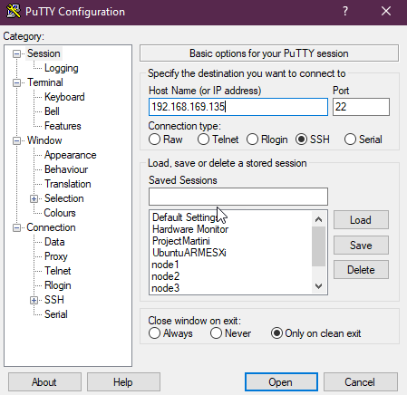
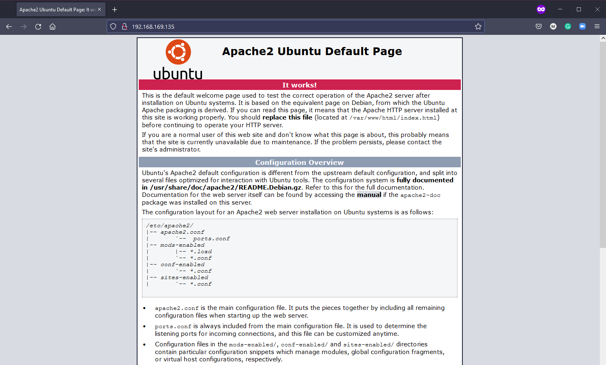

## SSH & Máy chủ Web

Như đã đề cập một vài lần, có thể bạn sẽ cần quản lý rất nhiều máy chủ Linux từ xa. Chính vì điều này, bạn sẽ cần đảm bảo rằng kết nối của mình với các máy chủ này được an toàn. Trong ngày hôm nay, chúng ta sẽ đề cập đến một số kiến ​​thức cơ bản về SSH để giúp bạn tạo đường hầm an toàn (secure tunnel) đến các hệ thống của mình từ xa.

- Thiết lập kết nối với SSH
- Chuyển tập tin
- Tạo khóa riêng của bạn

### Giới thiệu SSH

- Shell an toàn (secure shell)
- Giao thức mạng
- Cho phép liên lạc an toàn
- Có thể bảo mật bất kỳ dịch vụ mạng nào
- Thường được sử dụng với truy cập dòng lệnh (CLI) từ xa

Trong môi trường của chúng ta, nếu bạn đã theo dõi, chúng ta đã sử dụng SSH nhểng tất cả điều này đã được cấu hình và tự động hóa thông qua vagrant, vì vậy chúng ta chỉ phải chạy `vagrant ssh` là đã có thể truy cập vào máy ảo từ xa của mình.

Nếu máy chủ của chúng ta không nằm trên cùng hệ thống và ở rất xa với máy trạm, có thể trên môi trường cloud hoặc trên truvà tâm tâm dữ liệu và chỉ có thể truy cập qua Internet, chúng ta sẽ cần một cách an toàn để có thể truy cập vào hệ thống và quản lý nó.

SSH cung cấp một đường hầm an toàn giữa máy khách và máy chủ để hạn chế sự can thiệp của các tác nhân xấu.


Máy chủ có dịch vụ SSH luôn chạy và nghe trên cổng TCP cụ thể (thường là 22).

Nếu kết nối với thông tin đăng nhập chính xác hoặc một khoá SSH hợp lệ, chúng ta sẽ có quyền truy cập vào máy chủ đó.

### Thêm bộ điều hợp mạng bắc cầu (bridged network adapter) vào hệ thống

Để thực hiện những điều này với Virtual Box VM hiện tại, chúng ta cần thêm bộ điều hợp mạng bắc cầu vào máy của mình.

Tắt nguồn máy ảo của bạn, nhấp chuột phải vào máy của bạn trong Virtual Box và chọn cài đặt.


Bây giờ hãy bật lại máy ảo và bây giờ nó sẽ có một địa chỉ IP trên máy cục bộ của chúng ta. Bạn có thể xác nhận điều này bằng lệnh `IP addr`.

### Xác nhận máy chủ SSH đang chạy

Chúng ta biết SSH đã được định cấu hình trên máy vì chúng ta đã sử dụng nó với vagrant nhưng cũng có thể xác nhận bằng cách chạy

`sudo systemctl status ssh`


Nếu hệ thống của bạn không có server SSH thì bạn có thể cài đặt nó bằng lệnh `sudo apt install OpenSSH-server`

Sau đó, bạn muốn đảm bảo nếu tường lửa đang chạy, nó sẽ cho phép chúng ta kết nối tới server SSH. Việc này có thể được thực hiện với lệnh `sudo ufw allow ssh`, điều này không bắt buộc đối với cấu hình của chúng ta vì nó đã được tự động hóa với việc khi chúng ta khởi tạo bằng vagrant.

### Truy cập từ xa - Mật khẩu SSH

Bây giờ, chúng ta đã có server SSH nghe trên cổng 22 cho mọi yêu cầu kết nối đến và chúng ta đã thêm mạng bắc cầu, chúng ta có thể sử dụng PuTTY hoặc ứng dụng SSH client trên máy cục bộ của mình để kết nối với hệ thống bằng SSH.

[# Hướng dẫn cài đặt PuTTy](https://www.cuit.columbia.edu/putty).



Sau đó nhấn mở, nếu đây là lần đầu tiên bạn kết nối với hệ thống này qua địa chỉ IP này, bạn sẽ nhận được cảnh báo này. Vì biết đây là hệ thống của chính mình nên bạn có thể chọn có.


Sau đó, chúng ta được yêu cầu nhập tên người dùng (vagrant) và mật khẩu (mật khẩu mặc định - vagrant). Bên dưới, bạn sẽ thấy chúng ta hiện đang sử dụng ứng dụng SSH client (Putty) để kết nối với máy ảo của mình bằng tên người dùng và mật khẩu.


Ở giai đoạn này, chúng ta được kết nối với VM từ máy khách từ xa và chúng ta có thể thực hiện các lệnh trên hệ thống của mình.

### Truy cập từ xa - Khóa SSH

Trên đây là cách dễ dàng nhất để có quyền truy cập vào hệ thống của bạn, tuy nhiên nó vẫn dựa vào tên người dùng và mật khẩu. Nếu một kẻ xấu nào đó có quyền truy cập những thông tin này cộng với địa chỉ công khai hoặc IP của hệ thống của bạn thì nó có thể dễ dàng bị xâm phạm. Chính vì lý do đó, khoá SSH được cho là giải pháp tốt hơn.

Khóa SSH có nghĩa là chúng ta cung cấp một cặp khóa để cả máy khách và máy chủ đều biết rằng đây là đối phương là thiết bị đáng tin cậy.

Tạo một khóa rất dễ dàng. Trên máy cục bộ của chúng ta (Windows) chúng ta có thể sử dụng lệnh sau nếu bạn đã cài đặt ssh-client và tôi tin rằng câu lệnh tương tự sẽ hoạt động trên các hệ điều hành khác.

`ssh-keygen -t ed25519`

Tôi sẽ không đi sâu vào `ed25519` là gì và có nghĩa như thế nào nhưng bạn có thể tự tìm kiếm nếu muốn hiểu thêm về [mã hoá](https://en.wikipedia.org/wiki/EdDSA#Ed25519)


Chúng ta đã tạo khóa SSH được lưu trữ trong `C:\Users\micha/.ssh/`

Nhưng để kết nối với máy ảo Linux của chúng ta, chúng ta cần sao chép khóa bằng lệnh `ssh-copy-id vagrant@192.168.169.135`

Tôi đã sử dụng Powershell để tạo khóa trên máy khách Windows của mình nhưng không có `ssh-copy-id` ở đây. Có nhiều cách để bạn có thể thực hiện việc này trên Windows và chỉ cần tìm kiếm trên Google bạn sẽ có một giải pháp thay thế, còn tôi thì chỉ cần sử dụng git bash trên máy Windows của tôi để tạo một bản sao.


Bây giờ, chúng ta có thể quay lại Powershell để kiểm tra xem kết nối của chúng ta hiện có hoạt động với Khóa SSH mà không cần mật khẩu hay không.

`ssh vagrant@192.168.169.135`


Chúng ta có thể nâng cao tính bảo mật hơn nữa nếu cần bằng cách sử dụng cụm mật khẩu (passphrase). Chúng ta cũng có thể tiến thêm một bước nữa khi không cho phép kết nối bằng mật khẩu, có nghĩa là chỉ cho phép kết nối thông qua cặp khóa. Bạn có thể thực hiện điều này trong tệp cấu hình dưới đây

`sudo nano /etc/ssh/sshd_config`

Có một dòng là `PasswordAuthentication yes` và nó đang bị comment với ký tự `#` ở đầu dóng. Bạn nên xoá ký tự này và thay đổi yes thành no, lưu tệp cấu hình và cuối cùng là khởi động lại dịch vụ SSH với `sudo systemctl reload sshd`

## Thiết lập Máy chủ Web

Không liên quan cụ thể đến những gì chúng ta vừa thực hiện với SSH ở trên nhưng tôi muốn bao gồm bước này vì đây lại là một cài đặt khác mà bạn có thể thấy hơi khó khăn nhưng thực sự không khó đến như vậy.

Chúng ta đã có máy ảo Linux và sẽ thêm một máy chủ web apache để có thể host một trang web đơn giản và nó có thể phục vụ các client trong mạng nội bộ của chúng ta. Lưu ý rằng trang web này sẽ không thể truy cập được từ Internet, điều này là có thể nhưng nó sẽ không được đề cập trong bài viết này.

Bạn cũng có thể thấy stack này được gọi là LAMP stack.

- **L**inux: Hệ điều hành
- **A**pache: Máy chủ web
- **m**ySQL: Cơ sở dữ liệu
- **P**HP: Ngôn ngữ lập trình

### Apache2

Apache2 là một máy chủ HTTP mã nguồn mở. Chúng ta có thể cài đặt apache2 với câu lệnh sau

`sudo apt-get install apache2`

Để xác nhận rằng apache2 đã được cài đặt một cách chính xác, chúng ta có thể chạy `sudo service apache2 restart`

Sau đó, sử dụng địa chỉ mạng bắc cầu từ phần trên, mở trình duyệt và truy cập địa chỉ đó. Địa chỉ của tôi là `http://192.168.169.135/`



### mySQL

MySQL là một cơ sở dữ liệu được sử dụng để lưu trữ dữ liệu cho trang web đơn giản của mình. Để cài đặt MySQL, chúng ta nên sử dụng lệnh sau `sudo apt-get install mysql-server`

### PHP

PHP là ngôn ngữ kịch bản phía máy chủ (server-side scripting language), chúng ta sẽ sử dụng ngôn ngữ này để tương tác với cơ sở dữ liệu MySQL.

Thay đổi cấu hình đầu tiên mà chúng ta muốn thực hiện với apache là thay vì file index.html, chúng ta muốn nó sử dụng index.php.

Chúng ta sử dụng lệnh `sudo nano /etc/apache2/mods-enabled/dir.conf` và chuyển index.php lên mục đầu tiên trong danh sách.


Khởi động lại dịch vụ apache2 `sudo systemctl restart apache2`

Bây giờ, hãy xác nhận rằng hệ thống của chúng ta được cấu hình đúng cho PHP. Tạo tệp sau bằng cách sử dụng lệnh này, thao tác này sẽ mở một tệp trống ở định dạng nano.

`sudo nano /var/www/html/90Days.php`

Sau đó sao chép phần sau, sử dụng control + x để thoát và lưu lại tệp của bạn.

```
<?php
phpinfo();
?>
```

Bây giờ, hãy điều truy cập vào IP máy ảo Linux của bạn với 90Days.php ở cuối URL. `http://192.168.169.135/90Days.php` bạn sẽ thấy tương tự như bên dưới nếu PHP được cấu hình chính xác.


### Cài đặt WordPress

Sau đó, tôi đã xem qua hướng dẫn này cài đặt WordPress trên LAMP stack của chúng ta, một số lệnh sẽ có ở bên dưới nếu không được đề cập tới trong hướng dẫn ["cách cài đặt WordPress trên Ubuntu với LAMP"](https://blog.ssdnodes.com/blog/how-to-install-wordpress-on-ubuntu-18-04-with-lamp-tutorial/)

`sudo mysql -u root -p`

`CREATE DATABASE wordpressdb;`

`CREATE USER 'admin-user'@'localhost' IDENTIFIED BY 'password';`

`GRANT ALL PRIVILEGES ON wordpressdb.* TO 'admin-user'@'localhost';`

`FLUSH PRIVILEGES;`

`EXIT;`

`sudo apt install php-curl php-gd php-mbstring php-xml php-xmlrpc php-soap php-intl php-zip`

`sudo systemctl restart apache2`

`cd /var/www`

`sudo curl -O https://wordpress.org/latest.tar.gz`

`sudo tar -xvf latest.tar.gz`

`sudo rm latest.tar.gz`

Tại thời điểm này, bạn đang ở Bước 4 trong bài hướng dẫn được liên kết, bạn sẽ cần làm chính xác theo các bước để đảm bảo có tất cả các quyền cần thiết cho thư mục WordPress.

Vì chỉ sử dụng trong mạng nội bộ nên bạn không cần phải "tạo khóa bảo mật" trong bước này. Chuyển sang Bước 5, là bước thay đổi cấu hình Apache cho WordPress.

Sau đó, nếu mọi thứ được cấu hình chính xác, bạn sẽ có thể truy cập qua địa chỉ mạng nội bộ của mình và trải qua các bước cài đặt WordPress.

## Tài liệu tham khảo

- [Client SSH GUI - Remmina](https://remmina.org/)
- [The Beginner's guide to SSH](https://www.youtube.com/watch?v=2QXkrLVsRmk)
- [Vim in 100 Seconds](https://www.youtube.com/watch?v=-txKSRn0qeA)
- [Vim tutorial](https://www.youtube.com/watch?v=IiwGbcd8S7I)
- [Learn the Linux Fundamentals - Part 1](https://www.youtube.com/watch?v=kPylihJRG70)
- [Linux for hackers (don't worry you don't need to be a hacker!)](https://www.youtube.com/watch?v=VbEx7B_PTOE)

Hẹn gặp lại vào [ngày 19](day19.md)
