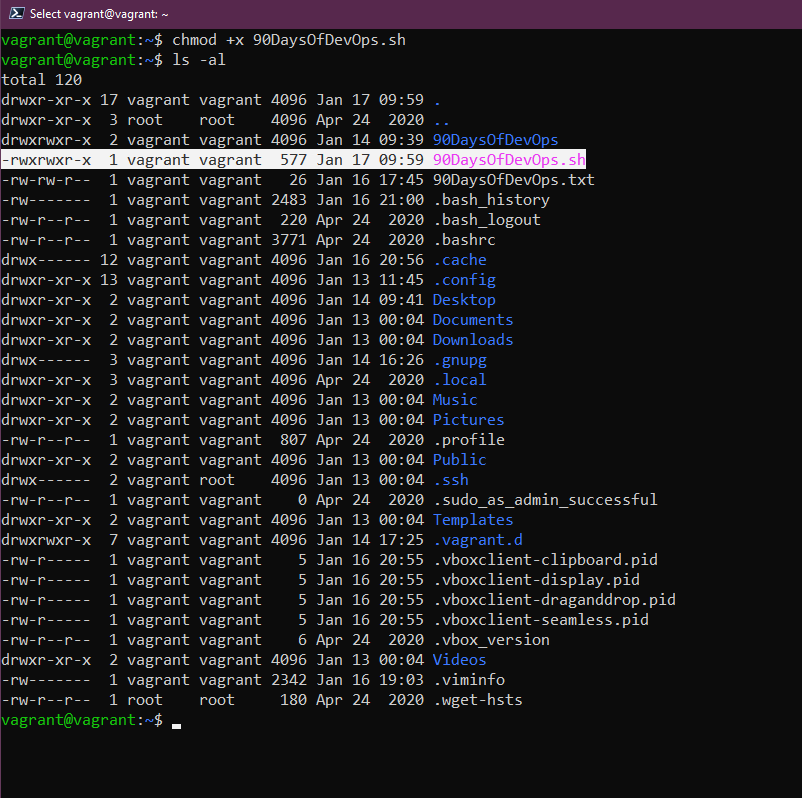
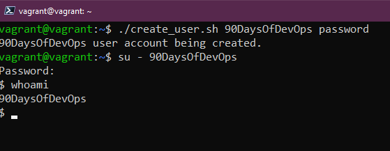

## Tự động hóa các tác vụ với các tập lệnh bash

Shell mà chúng ta sẽ sử dụng hôm nay là bash nhưng chúng ta sẽ sử dụng một shell khác vào ngày mai khi chúng ta hiểu rõ hơn về ZSH.

BASH - **B**ourne **A**gain **Sh**ell

Chúng ta gần như có thể dành toàn bộ thời gian 7 ngày để viết shell script giống với các ngôn ngữ lập trình, bash cho chúng ta khả năng làm việc cùng với các công cụ tự động hóa khác để hoàn thành công việc.

Tôi biết nhiều người đã và đang viết một số tập lệnh shell phức tạp để thực hiện những tác vụ hàng ngày và một số trong số đó có thể là một trong những việc quan trọng nhất đối với doanh nghiệp của họ. Tôi không nói rằng chúng ta cần hiểu tập lệnh shell/bash vì mục đích này, đó không phải là cách tốt nhất. Nhưng chúng ta nên học shell/bash để có thể viết các tập lệnh giúp chúng ta có thể làm việc cùng với các công cụ tự động hóa của mình và cho các tác vụ thường ngày.

Một ví dụ về mà chúng ta đã sử dụng trong phần này có thể là VAGRANTFILE, chúng ta đã sử dụng nó để tạo máy ảo của mình. Chúng ta gó thể đóng gói nó thành một tập lệnh bash đơn giản nhằm xóa và chạy lại nó vào mỗi sáng thứ Hai để có một bản sao mới của máy ảo Linux của mình mỗi tuần. Chúng ta cũng có thể cài đặt tất cả các phần mềm trong LAMP stack đã được sử dụng trên máy ảo Linux thông qua một tập lệnh bash.

Một điều khác mà tôi đã nghe được là các câu hỏi viết các tập lệnh đang ngày càng trở nên phổ biến hơn trong các cuộc phỏng vấn.

### Bắt đầu

Cũng giống như rất nhiều thứ mà chúng ta sẽ đề cập trong suốt 90 ngày, cách duy nhất để học là thông qua thực hành. Kinh nghiệm thực hành sẽ giúp tất cả những điều này in sâu vào trí nhớ cơ bắp của bạn.

Trước hết, chúng ta sẽ cần một trình soạn thảo văn bản. Vào [Ngày 17](day17.md), chúng ta đã đề cập đến hai trình soạn thảo văn bản phổ biến nhất và một chút về cách sử dụng chúng.

Hãy bắt đầu tạo tập lệnh shell đầu tiên của chúng ta.

`touch 90DaysOfDevOps.sh`

Tiếp theo là `nano 90DaysOfDevOps.sh`, thao tác này sẽ mở tập lệnh shell trống mới trong nano. Một lần nữa, bạn có thể chọn trình soạn thảo văn bản mà mình muốn ở đây.

Dòng đầu tiên của tất cả các tập lệnh bash sẽ giống như thế này `#!/usr/bin/bash` đây là đường dẫn đến tệp nhị phân bash của bạn.

Tuy nhiên, bạn nên kiểm tra điều này trong terminal bằng cách chạy `which bash` nếu bạn không sử dụng Ubuntu thì bạn cũng có thể thử `whereis bash` từ terminal.

Bạn có thể thấy các đường dẫn khác được liệt kê trong các tập lệnh shell đã được tạo, có thể bao gồm:

- `#!/bin/bash`
- `#!/usr/bin/env bash`

Ở dòng tiếp theo trong tập lệnh của chúng ta, tôi muốn thêm comment và thêm mục đích của tập lệnh hoặc ít nhất là một số thông tin về tác giả. Bạn có thể làm điều này bằng cách sử dụng ký tự `#`. Điều này cho phép chúng ta comment về các dòng cụ thể trong mã của mình và cung cấp mô tả về những gì mà các lệnh tiếp theo sẽ thực hiện. Tôi nghĩ rằng sẽ tốt hơn cho người dùng nếu các ghi chú rõ ràng và cẩn thận, đặc biệt nếu bạn đang chia sẻ chúng.

Đôi khi tôi sử dụng figlet, một chương trình mà chúng ta đã cài đặt trước đó trong bài về Linux để tạo một số hình vẽ bằng mã ASCI.


Tất cả các lệnh đã được sử dụng trước đó trong bài về Linux [Day15](day15.md) có thể được sử dụng ở đây như một lệnh đơn giản để kiểm tra tập lệnh của chúng ta.

Hãy thêm một đoạn mã sau vào tập lệnh của chúng ta.

```
mkdir 90DaysOfDevOps
cd 90DaysOfDevOps
touch Day19
ls
```

Sau đó, bạn có thể lưu tệp này và thoát trình soạn thảo văn bản của mình, nếu chúng ta chạy tập lệnh của mình với `./90DaysOfDevOps.sh`, bạn sẽ nhận được thông báo lỗi do không có đủ quyền. Bạn có thể kiểm tra quyền của tệp này bằng cách sử dụng lệnh `ls -al` và có thể thấy chúng ta không có quyền thực thi đối với tệp này.


Có thể thay đổi điều này bằng cách sử dụng `chmod +x 90DaysOfDevOps.sh` và sau đó bạn sẽ thấy `x`, có nghĩa là bây giờ chúng ta có thể thực thi tập lệnh của mình.



Bây giờ chúng ta có thể chạy lại tập lệnh của mình bằng cách sử dụng `./90DaysOfDevOps.sh`. Sau khi chạy, tập lệnh hiện đã tạo một thư mục mới, thay thư mục hiện tại thành thư mục đó đó và cuối cùng tạo một tệp mới.


Những câu lệnh khá cơ bản nhưng bạn có thể tưởng tượng ra việc công cụ này có thể được sử dụng như thế nào để gọi các công cụ khác giúp cuộc sống của bạn dễ dàng hơn và có thể tự động hóa mọi thứ.

### Biến, điều kiện

Phần lớn phần này lặp lại những gì chúng ta đã đề cập khi học Golang nhưng tôi nghĩ nó đáng để chúng ta tìm hiểu lại một lần nữa.

- ### Biến

Các biến cho phép chúng ta xác định một giá trị được lặp lại, cụ thể được sử dụng trong toàn bộ tập lệnh.

Để thêm một biến, bạn chỉ cần thêm nó như sau vào một dòng trong tập lệnh của mình.

`challenge="90DaysOfDevOps"`

Bằng cách này, khi nào chúng ta sử dụng `$challenge` trong mã của mình và thay đổi biến thì nó sẽ được cập nhật trong cả tập lệnh.


Nếu bây giờ chúng ta chạy tập lệnh `sh` của mình,bạn sẽ tác vụ in ra dòng chữ đã được thêm vào tập lệnh của chúng ta.


Chúng ta cũng có thể sử dụng đầu vào của người dùng để gán cho các biến của chúng ta bằng cách sau:

```
echo "Enter your name"
read name
```

Sau đó chúng ta định nghĩa đầu vào được nhập là biến `$name` và có thể sử dụng biến từ đó.

- ### Điều kiện

Có thể chúng ta muốn tìm hiểu xem ai đang tham gia thử thách và đã hoàn thành bao nhiêu ngày, chúng ta có thể xác định điều này bằng cách sử dụng các điều kiện `if` `if-else` `else-if`, đây là những gì chúng ta đã định nghĩa trong tập lệnh của mình .

```
#!/bin/bash
#  ___   ___  ____                   ___   __ ____              ___
# / _ \ / _ \|  _ \  __ _ _   _ ___ / _ \ / _|  _ \  _____   __/ _ \ _ __  ___
#| (_) | | | | | | |/ _` | | | / __| | | | |_| | | |/ _ \ \ / / | | | '_ \/ __|
# \__, | |_| | |_| | (_| | |_| \__ \ |_| |  _| |_| |  __/\ V /| |_| | |_) \__ \
#   /_/ \___/|____/ \__,_|\__, |___/\___/|_| |____/ \___| \_/  \___/| .__/|___/
#                         |___/                                     |_|
#
# This script is to demonstrate bash scripting!

# Variables to be defined

ChallengeName=#90DaysOfDevOps
TotalDays=90

# User Input

echo "Enter Your Name"
read name
echo "Welcome $name to $ChallengeName"
echo "How Many Days of the $ChallengeName challenge have you completed?"
read DaysCompleted

if [ $DaysCompleted -eq 90 ]
then
  echo "You have finished, well done"
elif [ $DaysCompleted -lt 90 ]
then
  echo "Keep going you are doing great"
else
  echo "You have entered the wrong amount of days"
fi
```

Bạn cũng có thể thấy từ phần trên rằng chúng ta sử dụng phép so sánh hoặc kiểm tra các giá trị với nhau để chuyển sang giai đoạn tiếp theo. Chúng ta có các một vài điểm đáng chú ý ở đây.

- `eq` - nếu 2 giá trị bằng nhau sẽ trả về TRUE
- `ne` - nếu 2 giá trị không bằng nhau sẽ trả về TRUE
- `gt` - nếu giá trị đầu tiên lớn hơn giá trị thứ hai sẽ trả về TRUE
- `ge` - nếu giá trị đầu tiên lớn hơn hoặc bằng giá trị thứ hai sẽ trả về TRUE
- `lt` - nếu giá trị đầu tiên nhỏ hơn giá trị thứ hai sẽ trả về TRUE
- `le` - nếu giá trị đầu tiên nhỏ hơn hoặc bằng giá trị thứ hai sẽ trả về TRUE

Chúng ta cũng có thể sử dụng tập lệnh bash để xác định thông tin về tệp và thư mục, điều này được gọi là điều kiện tệp.

- `-d file` Đúng nếu tệp là một thư mục
- `-e file` Đúng nếu tệp tồn tại
- `-f file` Đúng nếu chuỗi được cung cấp là một tệp
- `-g file` Đúng nếu id nhóm được đặt trên một tệp
- `-r file` Đúng nếu tệp có thể đọc được
- `-s file` Đúng nếu tệp có kích thước khác 0

```
FILE="90DaysOfDevOps.txt"
if [ -f "$FILE" ]
then
  echo "$FILE is a file"
else
  echo "$FILE is not a file"
fi
```


Chỉ cần chúng ta vẫn ở trong thư mục của mình, lệnh echo đầu tiên sẽ được in ra. Nhưng nếu chúng ta xoá tệp đó đi thì lệnh thứ hai sẽ được in ra.


Hy vọng rằng bạn có thể thấy điều này được sử dụng như thế nào để giúp bạn tiết kiệm thời gian khi tìm kiếm một tệp cụ thể trên hệ thống.

Tôi đã tìm thấy kho lưu trữ tuyệt vời này trên GitHub có rất nhiều tập lệnh hữu ích [DevOps Bash Tools](https://github.com/HariSekhon/DevOps-Bash-tools/blob/master/README.md)

### Ví dụ

**Kịch bản**: Công ty của chúng ta có tên là "90DaysOfDevOps" đã hoạt động được một thời gian và giờ là lúc mở rộng nhóm từ 1 người lên nhiều người hơn trong những tuần tới. Tôi là người duy nhất cho đến nay biết quá trình onboard, vì vậy chúng ta muốn giảm bớt nút thắt cổ chai (bottleneck) đó bằng cách tự động hóa một số tác vụ.

**Yêu cầu**:

- Người dùng có thể được chuyển vào dưới dạng đối số dòng lệnh.
- Một người dùng được tạo với tên của đối số dòng lệnh.
- Mật khẩu có thể nhận được dưới dạng đối số dòng lệnh.
- Mật khẩu được đặt cho người dùng
- Hiển thị thông báo tạo tài khoản thành công.

Hãy bắt đầu với việc tạo tập lệnh shell với `touch create_user.sh`

Trước khi tiếp tục, hãy làm cho tập lệnh có thể thực thi được bằng cách sử dụng `chmod +x create_user.sh`

Sau đó chúng ta có thể sử dụng `nano create_user.sh` để bắt đầu chỉnh sửa tập lệnh của mình cho kịch bản mà chúng ta đã đặt.

Chúng ta có thể xem xét yêu cầu đầu tiên "Người dùng có thể được chuyển vào dưới dạng đối số dòng lệnh", chúng ta có thể làm như sao

```
#! /usr/bin/bash

#A user can be passed in as a command line argument
echo "$1"
```


Tiếp tục chạy phần này bằng cách sử dụng `./create_user.sh Michael` thay thế Michael bằng tên của bạn khi bạn chạy tập lệnh.


Tiếp theo, chúng ta có thể thực hiện yêu cầu thứ hai "Người dùng được tạo với tên của đối số dòng lệnh", điều này có thể được thực hiện bằng lệnh `useradd`. Tuỳ chọn `-m` để tạo thư mục home cho người dùng tại /home/username

```
#! /usr/bin/bash

#A user can be passed in as a command line argument
echo "$1 user account being created."

#A user is created with the name of the command line argument
sudo useradd -m "$1"

```

Cảnh báo: Nếu bạn không cung cấp tên người dùng thì nó sẽ báo lỗi do chúng ta chưa điền biến `$1`

Sau đó, chúng ta có thể kiểm tra xem tài khoản này đã được tạo chưa bằng lệnh `awk -F: '{ print $1 }' /etc/passwd`.


Yêu cầu tiếp theo của chúng ta là "Mật khẩu có thể được nhập dưới dạng đối số dòng lệnh." Trước hết, chúng ta sẽ không bao giờ làm điều này trong môi trường sản xuất.

```
#! /usr/bin/bash

#A user can be passed in as a command line argument
echo "$1 user account being created."

#A user is created with the name of the command line argument
sudo useradd -m "$1"

#A password can be parsed as a command line argument.
sudo chpasswd <<< "$1":"$2"
```

Nếu sau đó chúng ta chạy tập lệnh này với hai tham số `./create_user.sh 90DaysOfDevOps password`

Bạn có thể thấy từ hình ảnh bên dưới rằng chúng ta đã thực thi tập lệnh của mình, tập lệnh này đã tạo người dùng và mật khẩu của chúng ta, sau đó chúng ta chuyển sang người dùng đó theo cách thủ công và xác nhận bằng lệnh `whoami`.



Yêu cầu cuối cùng là "Thông báo tạo tài khoản thành công được hiển thị." Chúng ta đã có dòng này ở dòng trên cùng của mã và có thể thấy ảnh chụp màn hình ở trên có dòng `90DaysOfDevOps user account being created` được hiển thị.

Bây giờ tập lệnh này có thể được sử dụng để nhanh chóng tích hợp và thiết lập người dùng mới trên hệ thống Linux của chúng ta. Nhưng có lẽ thay vì một vài người trong lịch sử phải giải quyết vấn đề này và sau đó phải lấy cho người khác tên người dùng hoặc mật khẩu mới của họ, chúng ta có thể thêm một số đầu vào của người dùng mà chúng ta đã đề cập trước đó để nắm bắt các biến.

```
#! /usr/bin/bash

echo "What is your intended username?"
read  username
echo "What is your password"
read  password

#A user can be passed in as a command line argument
echo "$username user account being created."

#A user is created with the name of the command line argument
sudo useradd -m $username

#A password can be parsed as a command line argument.
sudo chpasswd <<< $username:$password
```

Với các bước tương tác nhiều hơn,


Để kết thúc, chúng ta nên in ra một thông báo để nói rằng tài khoản người dùng mới đã được tạo xong.


Một điều tôi nhận thấy là chúng ta đang hiển thị mật khẩu trên đầu vào của mình, chúng ta có thể ẩn mật khẩu này bằng cách sử dụng cờ `-s` trong dòng mã `read -s password`


Nếu bạn muốn xóa người dùng mà bạn đã tạo cho mục đích thử nghiệm, bạn có thể làm điều đó với `sudo userdel test_user`

[Tập lệnh mẫu](../../Days/Linux/create-user.sh)

Một lần nữa, tôi không nói rằng đây sẽ là thứ mà bạn sẽ viết hàng ngày nhưng đó là thứ có thể sẽ làm nổi bật tính linh hoạt của những gì chúng ta có thể làm với tập lệnh shell.

Hãy nghĩ về bất kỳ nhiệm vụ lặp đi lặp lại nào mà bạn thực hiện hàng ngày, hàng tuần hoặc hàng tháng và cách bạn có thể tự động hóa để làm việc đó tốt hơn. Lựa chọn đầu tiên có thể sẽ là sử dụng tập lệnh bash trước khi chuyển sang thứ gì đó phức tạp hơn.

Tôi đã tạo một tệp bash rất đơn giản giúp tôi tạo cụm Kubernetes bằng cách sử dụng minikube trên máy cục bộ của mình cùng với các dịch vụ dữ liệu. [Project Pace](https://github.com/MichaelCade/project_pace/blob/main/singlecluster_demo.sh) Nhưng tôi không cảm thấy điều này thích hợp để nêu ra ở đây vì chúng ta chưa đề cập đến Kubernetes.

## Tài liệu tham khảo

- [Bash in 100 seconds](https://www.youtube.com/watch?v=I4EWvMFj37g)
- [Bash script with practical examples - Full Course](https://www.youtube.com/watch?v=TPRSJbtfK4M)
- [Client SSH GUI - Remmina](https://remmina.org/)
- [The Beginner's guide to SSH](https://www.youtube.com/watch?v=2QXkrLVsRmk)
- [Vim in 100 Seconds](https://www.youtube.com/watch?v=-txKSRn0qeA)
- [Vim tutorial](https://www.youtube.com/watch?v=IiwGbcd8S7I)
- [Learn the Linux Fundamentals - Part 1](https://www.youtube.com/watch?v=kPylihJRG70)
- [Linux for hackers (don't worry you don't need to be a hacker!)](https://www.youtube.com/watch?v=VbEx7B_PTOE)

Hẹn gặp lại vào [ngày 20](day20.md)
