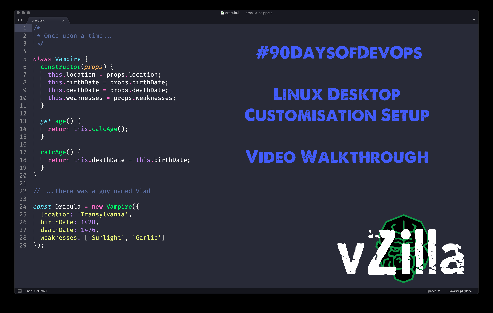

## Thiết lập máy trạm phát triển - những điều tuyệt vời

Đừng nhầm lẫn với việc thiết lập máy chủ Linux theo cách này, tôi chỉ muốn muốn thể hiện tính linh hoạt mà chúng ta có với các máy tính chạy Linux.

Tôi đã sử dụng máy tính chạy Linux gần một năm nay và tôi đã cấu hình nó theo cách tôi muốn từ góc nhìn và cảm nhận. Sử dụng máy ảo Ubuntu của chúng ta trên Virtual Box, chúng ta có thể xem một số tùy chỉnh mà tôi đã thực hiện cho các công việc hàng ngày của mình.

Tôi đã tổng hợp thành một video trên YouTube hướng dẫn phần còn lại để các bạn có thể theo dõi tốt hơn:

Cuối cùng, hệ thống của chúng ta sẽ trông giống như bên dưới:

Chúng ta cũng có thể thấy bash shell mặc định của mình bên dưới:

Phần lớn điều này có được nhờ dotfiles, thứ mà chúng ta sẽ trình bày trong phần cuối cùng của loạt bài về Linux này.

### dotfiles

Đầu tiên, tôi muốn đi sâu vào dotfiles, tôi đã nói vào một ngày trước đây rằng Linux được tạo thành từ các tệp cấu hình.

Nói thêm rằng, tệp dotfile không chỉ được sử dụng để tùy chỉnh và làm cho màn hình của bạn trông đẹp mắt, mà nó còn giúp bạn tăng năng suất.

Như tôi đã đề cập, nhiều chương trình phần mềm lưu cấu hình của chúng trong các tệp dotfile này.

Mỗi tệp dotfile bắt đầu bằng `.` Bạn có thể đoán được cách đặt tên bắt nguồn từ đâu đúng không? (dot là "dấu chấm")

Cho đến bây giờ, chúng ta đã sử dụng bash làm trình shell của mình, điều đó có nghĩa là bạn sẽ có .bashrc và .bash_profile trong thư mục chính của chúng ta. Bạn có thể xem bên dưới một vài tệp dotfile mà chúng ta có trên hệ thống.

Chúng ta sẽ thay đổi trình shell của mình, vì vậy sau này chúng ta sẽ thấy một dotfile cấu hình `.zshrc` mới.

Từ giờ bạn sẽ hiểu rằng nếu chúng ta đề cập đến dotfiles thì chúng là các tệp cấu hình. Chúng ta có thể sử dụng chúng để thêm alias cho dấu nhắc lệnh cũng như thêm các đường dẫn đến các vị trí khác nhau. Một số người chia sẻ dotfiles của họ một cách công khai. Bạn có thể tìm thấy trên GitHub của tôi [MichaelCade/dotfiles](https://github.com/MichaelCade/dotfiles), trong đó tệp `.zshrc` đã được tùy biến. Terminal tôi chọn là terminator cũng có một số tệp cấu hình trong thư mục và cũng có một số nền có thể được tùy chọn.

### ZSH

Như tôi đã đề cập trong suốt quá trình tương tác với hệ thống, chúng ta đã sử dụng bash shell, shell mặc định với Ubuntu. ZSH rất giống với bash shell nhưng nó có một số ưu điểm so với bash.

Zsh có các tính năng như tự động hoàn thành câu lệnh với phím Tab, tìm kiếm tệp tự động, tích hợp biểu thức chính quy (regex) và có số lượng theme rất phong phú.

Chúng ta có thể sử dụng trình quản lý gói `apt` để cài đặt zsh trên hệ thống của mình. Hãy chạy `sudo apt install zsh` từ terminal của chúng ta. Tôi sẽ thực hiện việc này từ bên trong bảng điều khiển VM.

Khi lệnh cài đặt hoàn tất, bạn có thể chạy `zsh` bên trong terminal của mình, sau đó thao tác này sẽ bắt đầu tập lệnh cấu hình trình shell.

Tôi đã chọn `1` cho câu hỏi trên và bây giờ chúng ta có thêm một số tùy chọn.

Bạn có thể thấy từ menu này rằng chúng ta có thể thực hiện một số tuỳ biến để làm cho ZSH được cấu hình theo nhu cầu của.

Nếu bạn thoát khỏi trình hướng dẫn bằng `0` và sau đó sử dụng `ls -al | grep .zshrc`, bạn sẽ thấy chúng ta có một tệp cấu hình mới.

Bây giờ chúng ta muốn đặt zsh là trình shell mặc định của mình mỗi khi mở terminal của mình. Có thể thực hiện việc này bằng cách chạy lệnh sau để thay đổi shell `chsh -s $( which zsh)` sau đó chúng ta cần đăng xuất và đăng nhập lại đẻ các thay đổi được cập nhật.

Khi bạn đăng nhập lại và mở một terminal, nó sẽ giống như thế này. Chúng ta cũng có thể xác nhận trình shell của chúng ta hiện đã được thay đổi bằng cách chạy ` which $SHELL`

Tôi thường thực hiện bước này trên mỗi máy tính để bàn Ubuntu mà tôi khởi tạo và nhìn chung thì cũng không cần làm gì hơn nữa vì zsh nhanh hơn một chút so với bash.

### OhMyZSH

Tiếp theo, chúng ta muốn làm cho mọi thứ trông đẹp hơn một chút và cũng thêm một số chức năng giúp di chuyển dễ dàng hơn trong terminal.

OhMyZSH là một khung mã nguồn mở và miễn phí để quản lý cấu hình zsh của bạn. Có rất nhiều plugin, theme và nhiều thứ khác giúp trình shell zsh trở nên đẹp hơn rất nhiều.

Bạn có thể tìm hiểu thêm về [ohmyzsh](https://ohmyz.sh/)

Hãy cài đặt Oh My ZSH, chúng ta có một vài tùy chọn với `curl` `wget` hoặc `fetch`, chúng ta có sẵn hai tùy chọn đầu tiên trên hệ thống của mình nhưng tôi sẽ bắt đầu với `curl`

`sh -c "$(curl -fsSL https://raw.githubusercontent.com/ohmyzsh/ohmyzsh/master/tools/install.sh)"`

Khi bạn đã chạy lệnh trên, bạn sẽ thấy một số đầu ra như bên dưới.

Bây giờ chúng ta có thể bắt đầu đưa cài đặt theme để trải nghiệm, có hơn 100 theme đi kèm với Oh My ZSH nhưng tôi sẽ luôn cài đặt các ứng dụng của mình với theme Dracula.

Tôi cũng muốn nói thêm rằng hai plugin này là gần như bắt buộc khi sử dụng Oh My ZSH.

`git clone https://github.com/zsh-users/zsh-autosuggestions.git $ZSH_CUSTOM/plugins/zsh-autosuggestions`

`git clone https://github.com/zsh-users/zsh-syntax-highlighting.git $ZSH_CUSTOM/plugins/zsh-syntax-highlighting`

`nano ~/.zshrc`

chỉnh sửa các plugin để nhận các plugins mới `plugins=(git zsh-autosuggestions zsh-syntax-highlighting)`

## Tiện ích mở rộng Gnome

Tôi cũng sử dụng các tiện ích mở rộng của Gnome và cụ thể là danh sách bên dưới

[Tiện ích mở rộng Gnome](https://extensions.gnome.org)

    - Caffeine
    - CPU Power Manager
    - Dash to Dock
    - Desktop Icons
    - User Themes

## Cài đặt phần mềm

Danh sách các chương trình tôi cài đặt trên máy bằng `apt`

    - VSCode
    - azure-cli
    - containerd.io
    - docker
    - docker-ce
    - google-cloud-sdk
    - insomnia
    - packer
    - terminator
    - terraform
    - vagrant

### Theme Dracula

Đây này là thứ duy nhất tôi sử dụng vào hiện tại. Trông rõ ràng, gọn gàng và mọi thứ đều rất dễ nhìn. [Theme Dracula](https://draculatheme.com/) Nó cũng giúp bạn nếu bạn có nhiều chương trình khác mà bạn sử dụng trên máy của bạn và muốn chúng sử dụng theme Dracula.

Từ liên kết ở trên, chúng ta có thể tìm kiếm zsh trên và bạn sẽ tìm thấy ít nhất hai lựa chọn.

Thực hiện theo các hướng dẫn được liệt kê để cài đặt thủ công hoặc sử dụng git. Sau đó, bạn sẽ cần chỉnh sửa tệp cấu hình `.zshrc` của mình như bên dưới.

Tiếp theo, bạn sẽ muốn có [Gnome Terminal Dracula theme](https://draculatheme.com/gnome-terminal) cùng với tất cả các hướng dẫn có sẵn tại đây.

Sẽ mất nhiều thời gian để ghi lại từng bước nên tôi đã tạo một video hướng dẫn quy trình. (**Nhấp vào hình ảnh bên dưới**)

Nếu bạn đã đi tới đây, chúng ta hiện đã hoàn thành phần về Linux của #90DaysOfDevOps. Một lần nữa, tôi luôn chào đón các phản hồi và bổ sung cho các tài nguyên tại đây.

Tôi cũng nghĩ về việc sẽ dễ dàng hơn khi hướng dẫn nhiều bước thông qua video so với việc viết chúng ra đây, bạn nghĩ sao về điều này?

## Tài liệu tham khảo

- [Bash in 100 seconds](https://www.youtube.com/watch?v=I4EWvMFj37g)
- [Bash script with practical examples - Full Course](https://www.youtube.com/watch?v=TPRSJbtfK4M)
- [Client SSH GUI - Remmina](https://remmina.org/)
- [The Beginner's guide to SSH](https://www.youtube.com/watch?v=2QXkrLVsRmk)
- [Vim in 100 Seconds](https://www.youtube.com/watch?v=-txKSRn0qeA)
- [Vim tutorial](https://www.youtube.com/watch?v=IiwGbcd8S7I)
- [Learn the Linux Fundamentals - Part 1](https://www.youtube.com/watch?v=kPylihJRG70)
- [Linux for hackers (don't worry you don't need to be a hacker!)](https://www.youtube.com/watch?v=VbEx7B_PTOE)

Ngày mai, chúng ta bắt đầu 7 ngày tìm hiểu về Mạng máy tính, chúng ta sẽ tìm cách trang bị cho mình kiến ​​thức và hiểu biết cơ bản về Mạng liên quan tới DevOps.

Hẹn gặp lại vào [ngày 21](day21.md)
