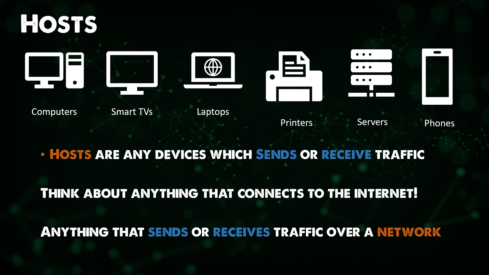

## Bức tranh toàn cảnh: DevOps và Mạng máy tính

Tương tự như những tuần trước, tôi sẽ sử dụng các tài liệu hướng dẫn miễn phí và nguồn mở. Trong phần này, phần lớn nội dung được lấy từ trang [Practical Networking](https://www.practicalnetworking.net/) và sê-ri [Các nguyên tắc cơ bản của Mạng máy tính - Networking Fundamentals series](https://www.youtube.com/playlist?list=PLIFyRwBY_4bRLmKfP1KnZA6rZbRHtxmXi). Dù đã được đề cập trong mục "Tài nguyên tham khảo" nhưng cũng cần thiết để nhấn mạnh tài liệu trên bởi vì từ quan điểm của cộng đồng, tôi đã tận dụng các khóa học này để giúp bản thân hiểu thêm về các lĩnh vực cụ thể. Kho lưu trữ này được dùng để chứa các ghi chú của tôi với hy vọng mọi người có thể thấy nó hữu ích cũng như các nguồn tài nguyên được liệt kê.

Chào mừng bạn đến với Ngày học thứ 21! Chúng ta sẽ tìm hiểu về mạng máy tính trong 7 ngày tới, DevOps và Mạng máy tính là những chủ đề chính của phần này nhưng chúng ta cũng sẽ cần phải tìm hiểu một số kiến thức nền tảng của mạng máy tính.

Như tôi đã nói trước đây, DevOps là sự thay đổi về văn hóa và quy trình trong quá trình phát triển phần mềm. Những thay đổi này có thể là về Virtual Machines, Containers, hoặc Kubernetes, hoặc cũng có thể là ở hệ thống mạng. Nếu chúng ta áp dụng các nguyên tắc của DevOps vào cơ sở hạ tầng vốn đã bao gồm hệ thống mạng, ở khía cạnh của một DevOps, bạn sẽ cần tìm hiểu về mạng máy tính bao gồm cấu trúc, lớp, và công cụ mạng.

Tôi cho rằng chúng ta nên cấu hình các thiết bị trong mạng đã bằng code (infrastructure as code) và mọi thứ nên được tự động hóa như những máy ảo của chúng ta. Tuy nhiên, để đạt được điều này, ít nhất chúng ta phải hiểu rõ về những thứ mà mình muốn nó làm việc tự động.
### NetDevOps là gì | DevOps cho hệ thống mạng?

Bạn cũng có thể nghe thấy thuật ngữ Network DevOps hoặc NetDevOps. Có thể bạn đã là một kỹ sư mạng và có kiến thức vững chắc về các thành phần trong hệ thống mạng bên trong cơ sở hạ tầng của bạn. Bạn hiểu được các thành phần như DHCP, DNS, NAT, v.v. Bạn cũng sẽ hiểu rõ về phần cứng và công nghệ "điều khiển mạng qua phần mềm" (software-defined networking).

Nhưng nếu bạn không phải là một kỹ sư mạng thì có lẽ bạn cần phải có được một số kiến ​​thức nền tảng về mạng để có thể hiểu được mục tiêu cuối cùng của Network DevOps.

Chúng ta có thể hiểu rằng NetDevOps hoặc Network DevOps là việc áp dụng những Nguyên tắc và Thực hành DevOps vào hệ thống mạng, ví dụ như áp dụng các công cụ tự động hóa và kiểm soát phiên bản để tạo, kiểm tra, giám sát và triển khai mạng.

Chúng ta đã đề cập trước đây rằng DevOps phá vỡ sự độc lập giữa các nhóm làm việc và nếu chúng ta quan niệm Network DevOps là việc phải tự động hóa hế thống mạng, nếu nhóm quản lý mạng không thay đổi sang mô hình và quy trình tương tự thì họ sẽ trở thành điểm tắt nghẽn hoặc thậm chí có thể là điểm gây thất bại cho dự án.

Sử dụng các nguyên tắc tự động hóa trong việc cung cấp, cấu hình, thử nghiệm, kiểm soát phiên bản, và triển khai là một khởi đầu tuyệt vời. Tự động hóa về tổng thể sẽ cho phép tăng tốc độ triển khai, sự ổn định của cơ sở hạ tầng mạng và liên tục cải tiến cũng như quy trình sẽ được chia sẻ trên nhiều môi trường sau khi chúng đã được kiểm tra. Ví dụ như một Network Policy đã được kiểm tra đầy đủ trên môi trường thử nghiệm có thể được nhanh chóng áp dụng ở một vị trí khác. Vì bản chất của việc này là chạy lại đoạn mã thay vì cấu hình thủ công như trước đây.
Bạn có thể tìm hiểu thêm về lợi ích của khái niệm này ở đây. [Network DevOps](https://www.thousandeyes.com/learning/techtorials/network-devops)

## Kiến thức cơ bản về mạng

Hãy tạm quên khía cạnh về DevOps ở đây và chúng ta cần tìm hiểu nhanh một số kiến thức nền tảng về mạng máy tính.

### Thiết bị mạng

Nếu bạn thích học qua hình thức xem video, hãy xem các video sau đây:

* [Network Devices - Hosts, IP Addresses, Networks - Networking Fundamentals - Lesson 1a](https://www.youtube.com/watch?v=bj-Yfakjllc&list=PLIFyRwBY_4bRLmKfP1KnZA6rZbRHtxmXi&index=1)
* [Network Devices - Hub, Bridge, Switch, Router - Networking Fundamentals - Lesson 1b](https://www.youtube.com/watch?v=H7-NR3Q3BeI&list=PLIFyRwBY_4bRLmKfP1KnZA6rZbRHtxmXi&index=2)

**Máy chủ (Host)** là bất kỳ thiết bị nào gửi hoặc nhận dữ liệu.

**Địa chỉ IP (IP Address)** là định danh của từng máy chủ.

**Mạng** là hệ thống vận chuyển dữ liệu giữa các máy chủ. Nếu chúng ta không có mạng, chúng ta cần chuyển dữ liệu một cách thủ công!

Một nhóm máy chủ logic yêu cầu kết nối tương tự nhau.

**(Bộ chuyển mạch) Switch** nhằm hỗ trợ giao tiếp **_bên trong_** một mạng. Một Switch sẽ chuyển tiếp các gói dữ liệu giữa các máy chủ.

- Mạng: Một nhóm các máy chủ được kết nối với nhau.
- Các máy chủ trên một mạng chia sẻ cùng một không gian địa chỉ IP.

**Bộ định tuyến (Router)** nhằm giúp giao tiếp giữa các mạng. Như chúng ta đã nói trước đó, một switch hỗ trợ giao tiếp giữa các thiết bị trong cùng một mạng, trong khi đó một bộ định tuyến cho phép chúng ta kết nối các mạng lại với nhau.

Một bộ định tuyến có thể cung cấp các tính năng kiểm soát lưu lượng (bảo mật, lọc, chuyển hướng). Ngày nay càng nhiều thiết bị chuyển mạch (switch) cũng cung cấp các chức năng này.

Bộ định tuyến cần học thông tin về các mạng mà nó kết nối đến. Chúng được gọi đây là các tuyến đường, được lưu trong một bảng định tuyến.

Bộ định tuyến có địa chỉ IP trong mạng (gọi là gateway) mà chúng được gắn vào. Địa chỉ IP này cũng sẽ là địa chỉ đích đến của mỗi máy chủ khi muốn truy cập ra khỏi mạng cục bộ của nó.

Các bộ định tuyến sẽ tạo ra hệ thống phân cấp trong các mạng mà tôi đã đề cập trước đó.

## So sánh Bộ chuyển mạch với Bộ định tuyến

**Định tuyến** là quá trình xác định đường đi dữ liệu giữa các mạng.

- Một Router là một thiết bị có mục đích chính là xác định đường đi.

**Chuyển mạch** là quá trình di chuyển dữ liệu trong một mạng.

- Một switch là một thiết bị có mục đích chính là chuyển mạch.

Đây chỉ là phần tổng quan cơ bản của hai thiết bị quan trọng nhất vì chúng ta biết rằng có nhiều thiết bị mạng khác nhau như:

- Access Points (Các điểm truy cập)
- Firewalls (Tường lửa)
- Load Balancers (Thiết bị cân bằng tải)
- Layer 3 Switches (Bộ chuyển mạch lớp 3)
- IDS / IPS 
- Proxies
- Virtual Switches (Bộ chuyển mạch ảo)
- Virtual Routers (Bộ định tuyến ảo)

Tất cả các thiết bị trên về cơ bản vẫn sẽ thực hiện quá trình Định tuyến và / hoặc Chuyển mạch.

Trong vài ngày tới, chúng ta sẽ tìm hiểu thêm về:

- Mô hình OSI
- Giao thức mạng
- DNS (Hệ thống phân giải tên miền)
- NAT
- DHCP
- Mạng con

## Tài liệu tham khảo

* [Các nguyên tắc cơ bản về mạng](https://www.youtube.com/playlist?list=PLIFyRwBY_4bRLmKfP1KnZA6rZbRHtxmXi)
* [Toàn bộ khóa học Mạng máy tính](https://www.youtube.com/watch?v=IPvYjXCsTg8)

Hẹn gặp lại bạn vào [Ngày 22](day22.md)
