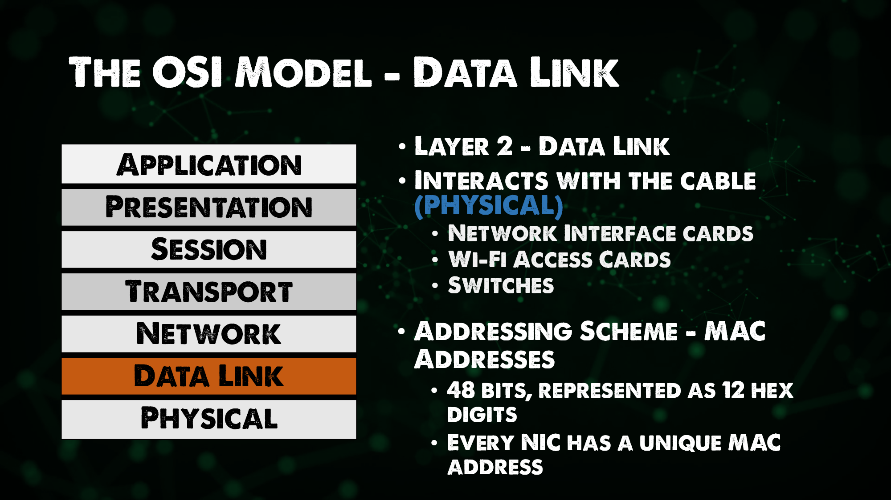
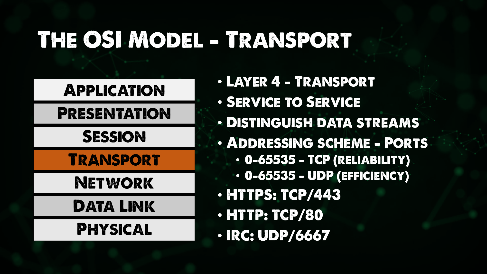

Nội dung của phần này chủ yếu từ sê-ri [Networking Fundamentals series](https://www.youtube.com/playlist?list=PLIFyRwBY_4bRLmKfP1KnZA6rZbRHtxmXi). Nếu bạn thích học bằng video, hãy tham khảo 2 video sau:

* [The OSI Model: A Practical Perspective - Layers 1 / 2 / 3](https://www.youtube.com/watch?v=LkolbURrtTs&list=PLIFyRwBY_4bRLmKfP1KnZA6rZbRHtxmXi&index=3)
* [The OSI Model: A Practical Perspective - Layers 4 / 5+](https://www.youtube.com/watch?v=0aGqGKrRE0g&list=PLIFyRwBY_4bRLmKfP1KnZA6rZbRHtxmXi&index=4)

## Mô hình 7 lớp (tầng) OSI

Mục đích cơ bản của mạng máy tính là cho phép hai máy tính chia sẻ dữ liệu. Trước khi có mạng máy tính, nếu ta muốn chuyển dữ liệu từ một máy tính này đến một máy tính khác, ta cần phải gắn một thiết bị lưu trữ vào một máy tính, sao chép dữ liệu và đưa nó sang máy tính khác.

Mạng máy tính cho phép làm việc này một cách tự động bằng cách cho phép máy tính chia sẻ dữ liệu qua dây mạng (hoặc kết nối không dây). Để cho các máy tính có thể thực hiện việc đó, chúng cần phải tuân thủ một bộ quy tắc.

Nguyên tắc này cũng tương tự như trong giao tiếp bằng ngôn ngữ. Tiếng Anh có một bộ quy tắc mà hai người nói tiếng Anh phải tuân theo. Tiếng Tây Ban Nha hay tiếng Pháp cũng có bộ quy tắc riêng, và mạng máy tính cũng có bộ quy tắc riêng của nó.

Các quy tắc để giao tiếp trong mạng máy tính được chia thành bảy lớp khác nhau và được gọi là mô hình OSI.

### Giới thiệu về mô hình OSI

Mô hình OSI (Mô hình kết nối hệ thống mở) là một khuôn khổ được sử dụng để mô tả các chức năng của một hệ thống mạng. Mô hình OSI mô tả các chức năng tính toán và tạo thành một tập hợp các quy tắc và yêu cầu chung để hỗ trợ khả năng giao tiếp giữa các thiết bị và phần mềm khác nhau. Trong mô hình tham chiếu OSI, giao tiếp giữa một hệ thống máy tính được chia thành bảy lớp trừu tượng khác nhau: **Lớp vật lý (Physical), Lớp liên kết dữ liệu (Data Link), Lớp mạng (Network), Lớp giao vận (Transport), Lớp phiên (Session), Lớp trình diễn (Presentation), và Lớp ứng dụng (Application)**.

### Lớp vật lý (Physical)

Đây là lớp thứ 1 trong mô hình OSI, quy định cách mà chúng ta có thể chuyển dữ liệu từ một máy tính này thông qua máy tính khác về mặt vật lý (ví dụ dây mạng hoặc sóng Wi-Fi). Chúng ta cũng có thể bắt gặp một số thiết bị phần cứng cũ hoạt động ở lớp này như hub hoặc repeater (bộ lặp).

### Lớp liên kết dữ liệu (Data Link)

Lớp thứ 2 là lớp liên kết dữ liệu, nó cho phép đóng gói dữ liệu dưới dạng các frame để truyền từ thiết bị này sang thiết bị khác. Lớp này có thể cung cấp tính năng cho phép sửa lỗi xảy ra ở lớp vật lý. Địa chỉ MAC (Media Access Control) cũng được giới thiệu ở lớp này.

Các thiết bị chuyển mạch (switch) mà chúng ta đã đề cập trong ngày 21 hoạt động ở lớp này [Ngày 21](day21.md)

### Lớp mạng (Network)

Bạn có thể đã nghe đến thuật ngữ thiết bị chuyển mạch (switch) lớp 3 hoặc thiết bị chuyển mạch (switch) lớp 2. Trong mô hình OSI, Lớp mạng có nhiệm vụ phân phối dữ liệu từ điểm đầu đến điểm cuối. Đây là nơi chúng ta thấy các địa chỉ IP của các thiết bị như chúng ta đã đề cập trong [Ngày 21](day21.md).

Bộ định tuyến (router) và máy tính (host) làm việc ở lớp mạng, hãy nhớ bộ định tuyến cung cấp chức năng định tuyến giữa nhiều mạng. Bất kỳ thứ gì có địa chỉ IP đều có thể được coi là thiết bị của lớp 3.

Tại sao chúng ta cần sử dụng địa chỉ ở cả lớp 2 và 3? (địa chỉ MAC và địa chỉ IP)

Nếu chúng ta nghĩ về việc truyền dữ liệu từ máy tính này sang một máy tính khác, mỗi máy tính có một địa chỉ IP riêng nhưng sẽ có một số thiết bị chuyển mạch (switch) và định tuyến (router) nằm giữa hai máy tính. Mỗi thiết bị đó đều có địa chỉ MAC lớp 2.

Địa chỉ MAC lớp 2 chỉ được dùng để liên lạc giữa hai thiết bị kết nối trực tiếp với nhau trong quá trình chuyền dữ liệu, nó chỉ tập trung vào truyền tải đến trạm kế tiếp, trong khi địa chỉ IP lớp 3 sẽ ở lại với gói dữ liệu đó cho đến khi nó đến máy tính cuối của nó. (Điểm đầu đến điểm cuối)

Địa chỉ IP - Lớp 3 = Vận chuyển từ điểm đầu đến điểm cuối

Địa chỉ MAC - Lớp 2 = Vận chuyển đến trạm kế tiếp

Có một giao thức mạng mà chúng ta sẽ tìm hiểu vào các ngày sau có tên là ARP (Address Resolution Protocol, Giao thức phân giải địa chỉ), nhằm giúp liên kết địa chỉ của lớp 2 và lớp 3 trong mạng.

### Lớp giao vận (Transport)

Lớp thứ 4 (lớp giao vận) được tạo ra để phân biệt các luồng dữ liệu, cho phép vận chuyển dữ liệu từ dịch vụ (ứng dụng) đến dịch vụ giữa các máy tính. Theo cách tương tự mà lớp 3 và lớp 2 đều có các cơ chế địa chỉ, trong lớp 4 chúng ta có các cổng (port).

### Lớp phiên, trình diễn, ứng dụng (Session, Presentation, Application)

Sự tách biệt giữa các lớp 5,6,7 có thể hơi mơ hồ.

Bạn nên xem [Mô hình TCP IP](https://www.geeksforgeeks.org/tcp-ip-model/) để hiểu rõ hơn.

Bây giờ chúng ta hãy thử giải thích điều gì sẽ xảy ra khi các máy tính trong mạng giao tiếp với nhau bằng mô hình nhiều lớp này. Máy tính này có một ứng dụng sẽ tạo ra dữ liệu và gửi đến một máy tính khác.

Máy tính nguồn sẽ trải qua quá trình được gọi là quá trình đóng gói dữ liệu (lớp 7 --> 5). Dữ liệu sau đó sẽ được gửi đến lớp 4.

Lớp 4 sẽ thêm một header vào dữ liệu đó, điều này giúp cho việc truyền tải dữ liệu ở lớp 4 (từ ứng dụng đến ứng dụng). Một cổng sẽ được sử dụng để truyền dữ liệu dựa trên TCP hoặc UDP. Header sẽ bao gồm thông tin cổng nguồn và cổng đích.

Thông tin về dữ liệu (data) và cổng (port) có thể được gọi là một segment. 

Segment này sẽ được chuyển xuống cho lớp 3 (lớp mạng). Lớp mạng sẽ thêm một header khác vào dữ liệu này.
Header này sẽ chứa thông tin giúp lớp 3 vận chuyển dữ liệu từ điểm đầu đến điểm cuối. Trong tiêu đề này, bạn sẽ có địa chỉ IP nguồn và IP đích, header ở lới 3 cộng với dữ liệu lớp trên cũng có thể được gọi là một packet (gói tin).

Lớp 3 sau đó sẽ lấy gói tin đó và giao nó cho lớp 2, lớp 2 một lần nữa sẽ thêm một header khác vào dữ liệu đó để thực hiện chuyển tiếp dữ liệu đến trạm kế tiếp trong mạng. Header ở lớp 2 sẽ bao gồm địa chỉ MAC nguồn và đích. Header và dữ liệu lớp 2 được gọi là một frame.

Frame sau đó sẽ được chuyển đổi thành những tín hiệu 0 và 1 được gửi qua cáp vật lý hoặc sóng không dây thuộc lớp 1 .

Tôi đã đề cập ở trên về việc đặt tên cho dữ liệu + header ở mỗi lớp và bạn có thể tham khảo qua hình ảnh tóm lượt bên dưới.

Quá trình gửi và nhận dữ liệu của ứng dụng ở hai máy tính nguồn và đích.

## Tài liệu tham khảo

* [Networking Fundamentals](https://www.youtube.com/playlist?list=PLIFyRwBY_4bRLmKfP1KnZA6rZbRHtxmXi)
- [Computer Networking full course](https://www.youtube.com/watch?v=IPvYjXCsTg8)

Hẹn gặp lại các bạn vào [Ngày 23](day23.md)
