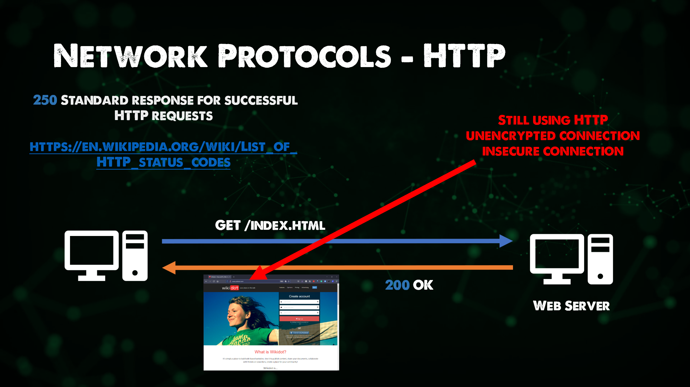
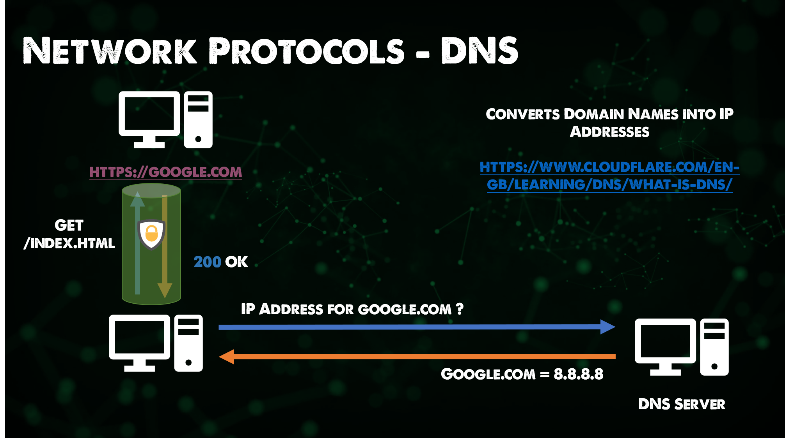
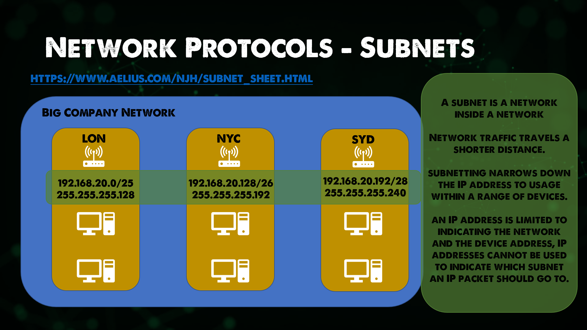

Nội dung của phần này chủ yếu từ sê-ri [Networking Fundamentals series](https://www.youtube.com/playlist?list=PLIFyRwBY_4bRLmKfP1KnZA6rZbRHtxmXi). Nếu bạn thích học thông qua video, bạn có thể xem video sau:

* [Network Protocols - ARP, FTP, SMTP, HTTP, SSL, TLS, HTTPS, DNS, DHCP](https://www.youtube.com/watch?v=E5bSumTAHZE&list=PLIFyRwBY_4bRLmKfP1KnZA6rZbRHtxmXi&index=12)

## Các giao thức mạng

Các giao thức mạng là một tập hợp các quy tắc giao tiếp tạo thành một tiêu chuẩn, tiêu chuẩn Internet.

- ARP (Address Resolution Protocol) - Giao thức phân giải địa chỉ

Nếu bạn muốn tìm hiểu sâu hơn về ARP, bạn có thể đọc về tiêu chuẩn Internet tại đây. [RFC 826](https://datatracker.ietf.org/doc/html/rfc826)

Một địa chỉ IP sẽ được gắn với một địa chỉ vật lý cố định, còn được gọi là địa chỉ MAC trên mạng lớp 2.

- FTP (File Transfer Protocol) - Giao thức truyền tải file

Cho phép truyền tải các tập tin từ một máy nguồn đến máy đích. Về cơ bản, quá trình này được xác thực nhưng vân có thể cấu hình để cho phép quyền truy cập ẩn danh. Bạn sẽ thấy FTPS được sử dùng thường xuyên hơn vì nó cung cấp kết nối SSL/TLS tới các máy tính FTP từ máy khách để đảm bảo bảo mật tốt hơn. Giao thức này hoạt động ở lớp Ứng dụng của Mô hình OSI.

- SMTP (Simple Mail Transfer Protocol) - Giao thức chuyển thư đơn giản

Được sử dụng để truyền email, máy tính sử dụng SMTP để gửi và nhận thư. Bạn vẫn sẽ thấy ngay cả SMTP vẫn đang được sử dụng với Microsoft 365.

- HTTP (Hyper Text Transfer Protocol) - Giao thức truyền tải siêu văn bản

HTTP là giao thức nền tảng cho việc truy cập nội dung trên Internet. Nó cung cấp cho chúng ta khả năng để dễ dàng truy cập các trang web. HTTP vẫn được sử dụng nhiều nhưng HTTPS hiện được sử dụng nhiều hơn để tăng cường khả năng bảo mật.

- SSL (Secure Sockets Layer) - Lớp cổng bảo mật | TLS (Transport Layer Security) - Bảo mật tầng vận chuyển

TLS đã tiếp quản từ SSL, TLS là **Giao thức mật mã** cung cấp thông tin liên lạc an toàn qua mạng. Nó được sử dụng trong các ứng dụng email, tin nhắn, v.v.,  nhưng phổ biến nhất là để bảo mật cho HTTPS.

- HTTPS - HTTP được bảo mật bằng SSL/TLS

Phiên bản mở rộng của HTTP, được sử dụng để cung cấp liên lạc an toàn qua mạng, HTTPS được mã hóa bằng TLS như đã đề cập ở trên. Trọng tâm ở đây là mang lại tính xác thực, quyền riêng tư và tính toàn vẹn trong khi dữ liệu được trao đổi giữa các máy tính.

- DNS (Domain Name System) - Hệ thống tên miền

DNS được sử dụng để ánh xạ các tên miền theo cách thân thiện với con người, chẳng hạn như tất cả chúng ta đều biết [google.com](https://google.com) nhưng nếu bạn mở trình duyệt và nhập [8.8.8.8](https://8.8.8.8) bạn sẽ truy cập được Google như chúng ta vẫn làm. Tuy nhiên, bạn không thể nhớ tất cả các địa chỉ IP cho tất cả các trang web của bạn.

Đây là nơi DNS xuất hiện, nó đảm bảo rằng các máy tính, dịch vụ và các tài nguyên khác có thể truy cập được.

Trên tất cả các máy tính yêu cầu kết nối internet thì phải có DNS để phân giải được các tên miền. DNS là một lĩnh vực bạn có thể dành nhiều ngày và nhiều năm để tìm hiểu. Tôi cũng sẽ nói từ kinh nghiệm rằng DNS là nguyên nhân phổ biến của tất cả các lỗi khi nói đến Mạng. Tuy nhiên, không chắc liệu một kỹ sư mạng có đồng ý với quan điểm này hay không.

- DHCP (Dynamic Host Configuration Protocol) - Giao thức cấu hình máy tính tự động

Chúng ta đã thảo luận rất nhiều về các giao thức cần thiết để làm cho các máy tính của chúng ta hoạt động, có thể là truy cập internet hoặc truyền tải file giữa các máy tính với nhau.

Có 4 điều chúng ta cần trên mọi máy tính để nó có thể đạt được cả hai nhiệm vụ đó.

- Địa chỉ IP
- Subnet Mask
- Gateway mặc định
- DNS

Địa chỉ IP là địa chỉ duy nhất đại diện cho máy tính của chúng ta trên mạng mà nó tham gia, có thể coi đây là số nhà.

Chúng ta có thể coi subnet mask như là mã bưu điện hoặc mã zip.

Gateway mặc định là IP của bộ định tuyến đã cung cấp cho chúng ta kết nối đến Internet hoặc các mạng khác. Bạn có thể coi đây là con đường duy nhất cho phép chúng ta ra khỏi con phố của mình.

Sau đó, chúng ta có DNS để chuyển đổi các địa chỉ IP công khai phức tạp thành các tên miền phù hợp và dễ nhớ hơn. Chúng ta có thể coi đây là văn phòng phân loại khổng lồ để đảm bảo chúng ta nhận được đúng gói hàng của mình.

Như tôi đã nói, mỗi máy tính yêu cầu 4 cài đặt này, nếu bạn có 1000 hoặc 10.000 máy tính thì bạn sẽ mất rất nhiều thời gian để cấu hình tất cả. Chính vì vậy, DHCP xuất hiện và cho phép bạn xác định phạm vi cho mạng của mình và giao thức này sẽ cấp phát những thông tin trên cho tất cả các máy tính trong mạng của bạn.

Một ví dụ khác là bạn đi vào một quán cà phê, lấy một ly cà phê và ngồi xuống với máy tính xách tay hoặc điện thoại của bạn. Bạn kết nối máy tính của mình với Wi-Fi của quán cà phê và có quyền truy cập vào internet, tin nhắn và thư bắt đầu được gửi tới và bạn có thể duyệt web hay truy cập mạng xã hội. Khi bạn kết nối với Wi-Fi của quán cà phê, máy tính của bạn sẽ nhận một địa chỉ DHCP từ máy chủ DHCP chuyên dụng hoặc rất có thể là bộ định tuyến (router) của quán cũng xử lý DHCP.

### Mạng con (Subnet)

Mạng con là một phân khu về mặt logic của một mạng IP.

Mạng con chia các mạng lớn thành các mạng nhỏ hơn, dễ quản lý hơn và hoạt động hiệu quả hơn.

Mỗi mạng con là một phân khu về mặt logic của một mạng lớn hơn. Các thiết bị trong cùng một mạng con có cùng Subnet Mask, cho phép chúng có thể giao tiếp với nhau.

Bộ định tuyến quản lý giao tiếp giữa các mạng con.

Kích thước của mạng con phụ thuộc vào yêu cầu kết nối và công nghệ mạng được sử dụng.

Một tổ chức quốc tế chịu trách nhiệm cho xác định số lượng và kích thước của các mạng con trong không gian địa chỉ IP giới hạn hiện có. Các mạng con cũng có thể được phân đoạn thành các mạng con nhỏ hơn cho những trường hợp như liên kết Điểm tới Điểm hoặc mạng con chỉ hỗ trợ một vài thiết bị.

Bên cạnh một số lợi ích khác, việc phân chia một mạng lớn thành các mạng con cho phép tái sử dụng địa chỉ IP và giảm tắc nghẽn mạng, tăng hiệu quả sử dụng mạng.

Mạng con cũng có thể cải thiện tính bảo mật. Nếu một phần của mạng bị xâm phạm, nó có thể được cô lập khiến những kẻ tấn công khó có thể truy cập được các hệ thống mạng lớn hơn.

## Tài liệu tham khảo

- [Networking Fundamentals](https://www.youtube.com/playlist?list=PLIFyRwBY_4bRLmKfP1KnZA6rZbRHtxmXi)
- [Subnetting Mastery](https://www.youtube.com/playlist?list=PLIFyRwBY_4bQUE4IB5c4VPRyDoLgOdExE)
- [Computer Networking full course](https://www.youtube.com/watch?v=IPvYjXCsTg8)

Hẹn gặp lại các bạn vào [Ngày 24](day24.md)
