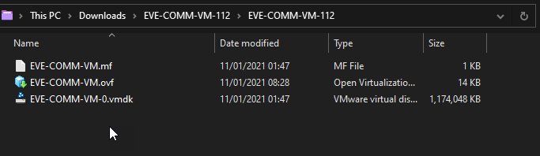
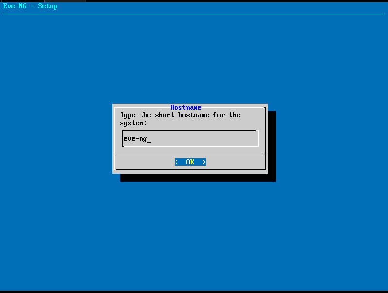
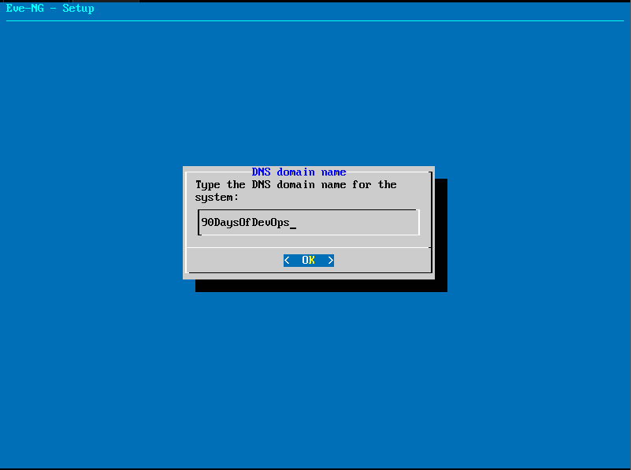

## Lập trình Python trong tự động hóa mạng

Python là ngôn ngữ lập trình tiêu chuẩn được sử dụng trong việc tự động hóa cấu hình mạng.

Mặc dù Python không chỉ dành riêng cho việc tự động hóa mạng nhưng nó dường như được sử dụng ở khắp mọi nơi mỗi khi bạn tìm kiếm công cụ cho mình. Như đã đề cập trước đây nếu nó không phải là chương trình Python thì nó có thể là Ansible (vốn cũng được viết bằng Python).

Tôi nghĩ rằng tôi đã đề cập đến điều này rồi, trong phần "Học ngôn ngữ lập trình", tôi đã chọn Golang thay vì Python vì những lý do xung quanh việc công ty của tôi đang phát triển Go nên đó là lý do chính đáng để tôi học Go, nhưng nếu không phải vì lí do đó thì Python sẽ là lựa chọn lúc đó.

- Dễ đọc và dễ sử dụng: Đây là lí do Python là ngôn ngữ lập trình phổ biến. Python không yêu cầu sử dụng `{}` trong chương trình để bắt đầu và kết thúc các khối mã. Kết hợp điều này với một IDE mạnh như VS Code, bạn sẽ có một khởi đầu khá dễ dàng khi muốn chạy một số mã Python.

Pycharm có thể là một IDE khác đáng được đề cập ở đây.

- Thư viện: Khả năng mở rộng của Python là mỏ vàng thực sự ở đây, tôi đã đề cập trước đây rằng Python không chỉ dành cho tự động hóa mạng mà trên thực tế, có rất nhiều thư viện cho tất cả các loại thiết bị và cấu hình. Bạn có thể xem số lượng lớn tại đây [PyPi](https://pypi.python.org/pypi)

Khi bạn muốn tải một thư viện xuống máy tính của mình, thì bạn sử dụng công cụ có tên `pip` để kết nối với PyPI và tải xuống máy của mình. Các nhà cung cấp mạng như Cisco, Juniper và Arista đã phát triển các thư viện để hỗ trợ việc truy cập vào thiết bị của họ.

- Mạnh mẽ & hiệu quả: Bạn có nhớ trong những ngày học lập trình Go tôi đã viết chương trình "Hello World" với 6 dòng mã không? Trong Python nó là

```
print('hello world')
```

Tổng hợp tất cả các điểm trên lại với nhau bạn sẽ dễ dàng hiểu tại sao Python thường được nhắc đến như một ngôn ngữ tiêu chuẩn khi làm việc về tự động hóa.

Tôi nghĩ có một điều quan trọng cần lưu ý là vài năm trước có thể đã có các chương trình để tương tác với các thiết bị mạng của bạn để có thể tự động thực hiện sao lưu cấu hình hoặc thu thập nhật ký và thông tin chi tiết khác về thiết bị của bạn. Quá trình tự động hóa mà chúng ta đang nói đến ở đây hơi khác một chút và đó là do bối cảnh mạng nói chung cũng đã thay đổi để phù hợp hơn với cách suy nghĩ này và cho phép tự động hóa nhiều hơn.

- Software-Defined Network/Mạng được điều khiển bằng phần mềm) - SDN Controller chịu trách nhiệm là nơi cung cấp cấu hình điều khiển cho tất cả các thiết bị trên mạng, nghĩa là chỉ cần một điểm liên hệ duy nhất cho bất kỳ thay đổi mạng nào, không còn phải telnet hoặc SSH vào mọi thiết bị và việc dựa vào con người để làm điều này có khả năng gây ra lỗi hoặc cấu hình sai.

- High-Level Orchestration/Phối hợp ở mức cao - Thực hiện ở cấp cao hơn SDN Controller và nó cho phép sự điều phối ở cấp độ các dịch vụ, sau đó là sự tích hợp của lớp điều phối này vào các nền tảng bạn chọn, VMware, Kubernetes, dịch vụ điện toán đám mây, v.v.

- Policy-based management/Quản lý dựa trên chính sách - Bạn muốn cài đặt chính sách gì? Trạng thái mong muốn của dịch vụ là gì? Bạn mô tả điều này và hệ thống có tất cả các chi tiết về cách thiết lập nó trở thành trạng thái bạn mong muốn.

## Cài đặt môi trường lab

Không phải ai cũng có thể sở hữu các thiết bị router, swith, và các thiết bị mạng khác.

Chúng ta có thể sử dụng một số phần mềm cho phép chúng ta có thể thực hành và tìm hiểu cách tự động hóa cấu hình mạng của chúng ta.

Có một vài phần mềm mà chúng ta có thể chọn.

- [GNS3 VM](https://www.gns3.com/software/download-vm)
- [Eve-ng](https://www.eve-ng.net/)
- [Unimus](https://unimus.net/) (Không phải công cụ tạo lab nhưng cung cấp các khái niệm thú vị).

Chúng ta sẽ xây dựng lab với [Eve-ng](https://www.eve-ng.net/). Như đã đề cập trước đây, bạn có thể sử dụng thiết bị vật lý nhưng thành thật mà nói, môi trường ảo có nghĩa là chúng ta có thể có môi trường an toàn để thử nghiệm nhiều tình huống khác nhau. Ngoài ra việc có thể thực hành các thiết bị và cấu trúc mạng khác nhau cũng rất thú vị.

Chúng ta sẽ thực hành mọi thứ trên EVE-NG phiên bản cộng đồng.

### Bắt đầu

Bạn có thể tải phiên bản cộng dồng dưới định dạng ISO và OVF tại đây. [download](https://www.eve-ng.net/index.php/download/)

Chúng ta sẽ sử dụng bản tải xuống định dạng OVF, với định dạng ISO, bạn có thể cài đặt trực tiếp trên server của bạn mà không cần chương trình tạo máy ảo.


Đối với hướng dẫn này, chúng ta sẽ sử dụng VMware Workstation vì tôi có giấy phép sử dụng thông qua vExpert nhưng bạn cũng có thể sử dụng VMware Player hoặc bất kỳ tùy chọn nào khác được đề cập trong [documentation](https://www.eve-ng.net/index.php/documentation/installation/system-requirement/). Rất tiếc, chúng ta không thể sử dụng Virtual Box!

Đây cũng là lúc tôi gặp vấn đề khi sử dụng GNS3 với Virtual Box.

[Download VMware Workstation Player - FREE](https://www.vmware.com/uk/products/workstation-player.html)

[VMware Workstation PRO](https://www.vmware.com/uk/products/workstation-pro.html) (Lưu ý rằng nó chỉ miễn phí trong thời gian dùng thử!)

### Cài đặt VMware Workstation PRO

Bây giờ chúng ta đã tải xuống và cài đặt phần mềm ảo hóa và chúng ta cũng đã tải xuống EVE-NG OVF. Nếu bạn đang sử dụng VMware Player, vui lòng cho tôi biết quy trình này có giống như vậy không.

Bây giờ chúng ta đã sẵn sàng để cấu hình mọi thứ.

Mở VMware Workstation rồi chọn `file` và `open`


Khi bạn tải xuống file EVE-NG OVF, nó sẽ nằm trong một tệp nén. Giải nén nội dung vào thư mục và nó trông như thế này.



Chọn thư mục mà bạn đã tải xuống hình ảnh EVE-NG OVF và bắt đầu import.

Đặt cho nó một cái tên dễ nhận biết và lưu trữ máy ảo ở đâu đó trên máy tính của bạn.


Khi quá trình import hoàn tất, hãy tăng số lượng bộ xử lý (CPU) lên 4 và bộ nhớ (RAM) được phân bổ lên 8 GB. (Đây là cài đặt khi bạn import phiên bản mới nhất, nhưng nếu không đúng thì hãy chỉnh sửa lại như vậy).

Ngoài ra, hãy đảm bảo tùy chọn Virtualise Intel VT-x/EPT hoặc AMD-V/RVI đã được bật. Tùy chọn này hướng dẫn VMware chuyển các cờ ảo hóa cho HĐH khách (ảo hóa lồng nhau) Đây là vấn đề tôi gặp phải khi sử dụng GNS3 với Virtual Box mặc dù CPU của tôi hỗ trợ tính năng này.


### Khởi động và truy cập

Hãy nhớ rằng tôi đã đề cập rằng điều này sẽ không hoạt động với VirtualBox! Vâng, có cùng một vấn đề với VMware Workstation và EVE-NG nhưng đó không phải là lỗi của nền tảng ảo hóa!

Tôi có WSL2 đang chạy trên Máy Windows của mình và điều này dường như loại bỏ khả năng chạy bất kỳ thứ gì được lồng trong môi trường ảo của bạn. Tôi thắc mắc không biết tại sao Ubuntu VM lại chạy vì nó dường như vô hiệu hóa tính năng Intel VT-d của CPU khi sử dụng WSL2.

Để giải quyết vấn đề này, chúng ta có thể chạy lệnh sau trên máy Windows của mình và khởi động lại hệ thống, lưu ý rằng trong khi lệnh này tắt thì bạn sẽ không thể sử dụng WSL2.

`bcdedit /set hypervisorlaunchtype off`

Khi bạn muốn quay lại và sử dụng WSL2, bạn sẽ cần chạy lệnh này và khởi động lại.

`bcdedit /set hypervisorlaunchtype auto`

Cả hai lệnh này nên được chạy với quyền administrator!

Ok quay lại hướng dẫn, bây giờ bạn sẽ có một máy ảo đang được chạy trong VMware Workstation và bạn sẽ có một lời nhắc tương tự như thế này trên màn hình.


Trên lời nhắc ở trên, bạn có thể sử dụng:

username = root
password = eve

Sau đó, bạn sẽ được yêu cầu cung cấp lại mật khẩu root, mật khẩu này sẽ được sử dụng để SSH vào máy chủ sau này.

Sau đó chúng ta có thể thay đổi hostname của máy chủ.



Tiếp theo, chúng ta thiết lập DNS Domain Name, tôi đã sử dụng tên bên dưới nhưng tôi không chắc liệu điều này có cần thay đổi sau này hay không.



Sau đó, chúng ta cấu hình mạng, tôi chọn sử dụng địa chỉ IP tĩnh (static) để nó không thay đổi sau khi khởi động lại.


Bước cuối cùng, thiết lập một địa chỉ IP tĩnh trong mạng mà bạn có thể truy cập được từ máy tính của mình.


Có một số bước bổ sung ở đây, trong đó bạn sẽ phải cung cấp subnet mask, default gateway và DNS.

Sau khi hoàn tất, máy ảo sẽ khởi động lại, lúc này bạn có thể điền địa chỉ IP tĩnh đã thiết lập vào trình duyệt của mình để truy cập.


Tên người dùng mặc định cho GUI là `admin` và mật khẩu là `eve` trong khi tên người dùng mặc định cho SSH là `root` và mật khẩu là `eve` nhưng bạn có thể thay đổi trong quá trình thiết lập.


Tôi đã chọn HTML5 cho bảng điều khiển thay vì native vì nó cho phép sẽ mở một tab mới trong trình duyệt của bạn khi bạn điều hướng qua các bảng điều khiển khác nhau.

Phần tiếp theo chúng ta sẽ tìm hiểu:

- Cài đặt gói ứng dụng EVE-NG
- Tải một số file hệ điều hành vào EVE-NG
- Xây dựng mô hình mạng
- Thêm node
- Kết nối các node
- Bắt đầu viết chương trình Python
- Tìm hiểu các thư viện telnetlib, Netmiko, Paramiko và Pexpect

## Tài nguyên tham khảo

- [Free Course: Introduction to EVE-NG](https://www.youtube.com/watch?v=g6B0f_E0NMg)
- [EVE-NG - Creating your first lab](https://www.youtube.com/watch?v=9dPWARirtK8)
- [3 Necessary Skills for Network Automation](https://www.youtube.com/watch?v=KhiJ7Fu9kKA&list=WL&index=122&t=89s)
- [Computer Networking full course](https://www.youtube.com/watch?v=IPvYjXCsTg8)
- [Practical Networking](http://www.practicalnetworking.net/)
- [Python Network Automation](https://www.youtube.com/watch?v=xKPzLplPECU&list=WL&index=126)

Hẹn gặp lại các bạn ngày [Ngày 26](day26.md)
