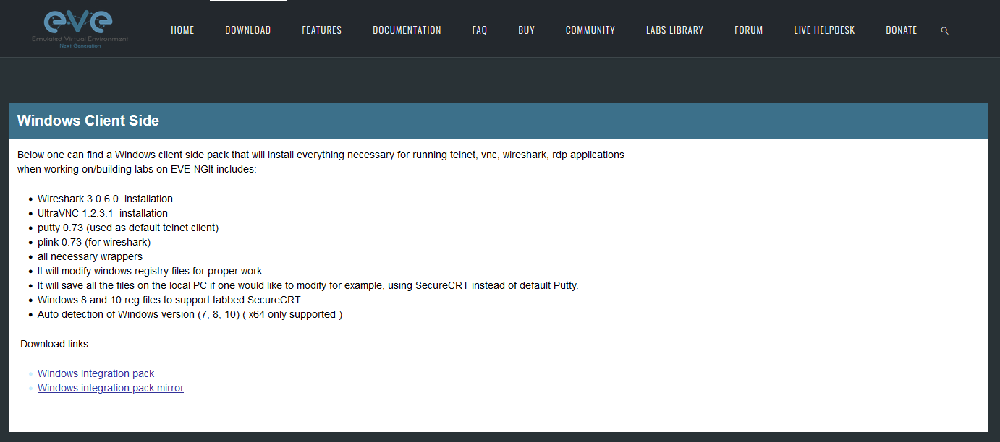
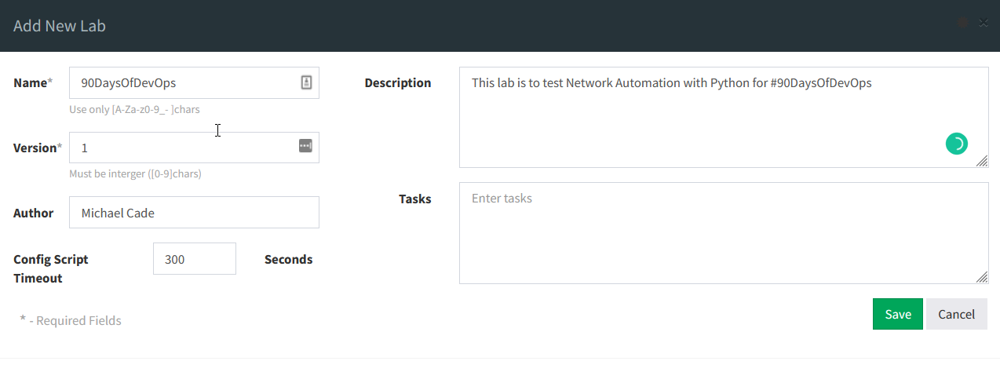
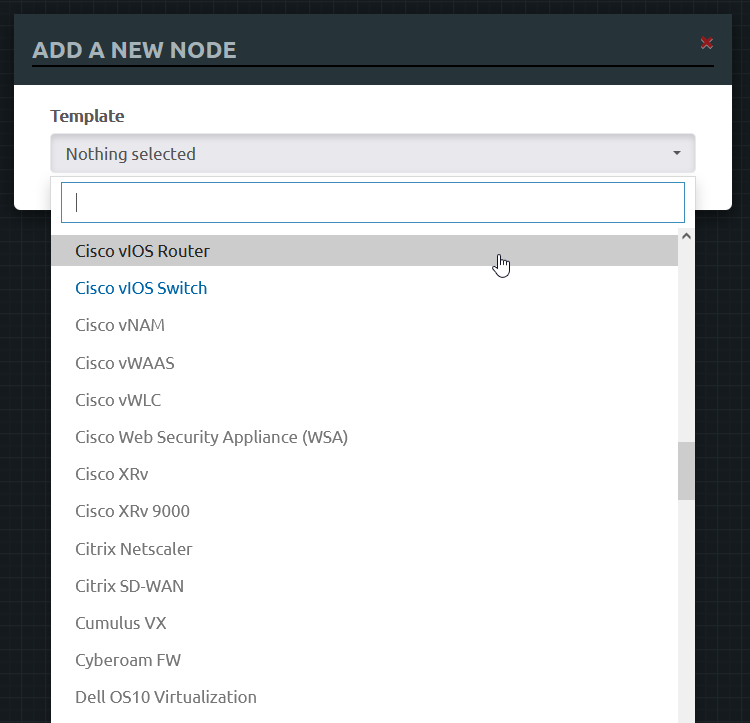
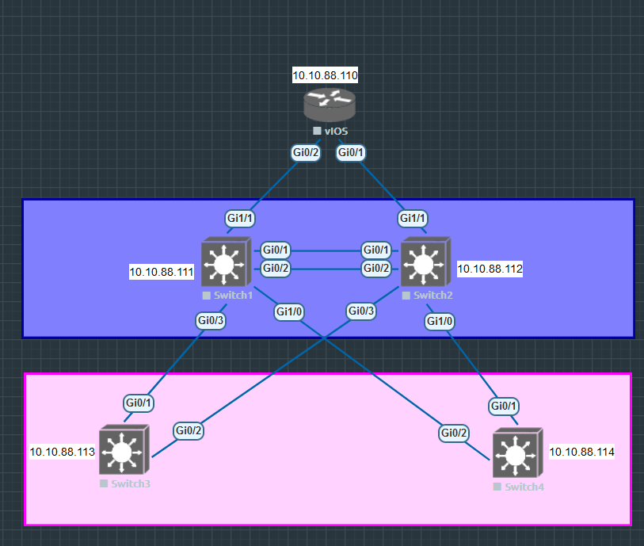

## Xây dựng Lab

Chúng ta sẽ tiếp tục thiết lập mạng mô phỏng của mình bằng phần mềm EVE-NG và sau đó hy vọng sẽ triển khai một số thiết bị và bắt đầu suy nghĩ về cách chúng ta có thể tự động hóa cấu hình của các thiết bị này. Vào [Ngày 25](day25.md), chúng ta đã đề cập đến việc cài đặt EVE-NG trên máy của mình bằng VMware Workstation.

### Cài đặt ứng dụng EVE-NG

Ngoài ra còn có một gói ứng dụng cho phép chúng ta chọn ứng dụng nào sẽ được sử dụng khi chúng ta SSH tới các thiết bị. Nó cũng sẽ cài đặt Wireshark để bắt gói tin giữa các mạng. Bạn có thể tải về gói ứng dụng cho hệ điều hành của mình (Windows, macOS, Linux).

[EVE-NG Client Download](https://www.eve-ng.net/index.php/download/)

Mẹo: Nếu bạn đang sử dụng Linux thì có thể tải [client pack](https://github.com/SmartFinn/eve-ng-integration).

Quá trình cài đặt diễn ra khá đơn giản và tôi khuyên bạn nên chọn các thiết lập mặc định.

### Tải network images

Bước này là một thách thức, tôi đã làm theo một số video mà tôi để link ở cuối bài để tải xuống image (file cài) cho switch và router và cách để tải nó vào các thiết bị trên.

Điều quan trọng cần lưu ý là tôi sử dụng mọi thứ cho mục đích giáo dục. Tôi khuyên bạn nên tải xuống image chính thức từ các nhà cung cấp thiết bị.

[Blog & Links to YouTube videos](https://loopedback.com/2019/11/15/setting-up-eve-ng-for-ccna-ccnp-ccie-level-studies-includes-multiple-vendor-node-support-an-absolutely-amazing-study-tool-to-check-out-asap/)

[How To Add Cisco VIRL vIOS image to Eve-ng](https://networkhunt.com/how-to-add-cisco-virl-vios-image-to-eve-ng/)

Nhìn chung, các bước ở đây hơi phức tạp và có thể dễ dàng hơn nhiều nhưng các blog và video ở trên hướng dẫn quy trình thêm image vào EVE-NG của bạn.

Tôi đã sử dụng FileZilla để chuyển qcow2 sang các máy ảo VM dựa trên SFTP.

Chúng ta sẽ dùng switch Cisco vIOS L2 và router Cisco vIOS trong lab này.

### Tạo Lab

Bên trong giao diện web EVE-NG, chúng ta sẽ tạo network topology mới. Chúng ta sẽ có bốn switch và một router đóng vai trò là gateway với các mạng bên ngoài.

| Node    | Địa chỉ IP   |
| ------- | ------------ |
| Router  | 10.10.88.110 |
| Switch1 | 10.10.88.111 |
| Switch2 | 10.10.88.112 |
| Switch3 | 10.10.88.113 |
| Switch4 | 10.10.88.114 |

#### Thêm các Nodes trong EVE-NG

Khi bạn đăng nhập lần đầu vào EVE-NG, bạn sẽ thấy một màn hình như bên dưới, chúng ta muốn bắt đầu bằng cách tạo lab đầu tiên của mình.

Đặt tên cho lab của bạn và các mục khác là tùy chọn.

Sau đó, bạn sẽ được chào đón bằng một khung vẽ trống để bắt đầu tạo mạng của mình. Nhấp chuột phải vào canvas của bạn và chọn thêm node.

Từ đây, bạn sẽ có một danh sách dài các tùy chọn node. Nếu bạn đã làm theo hướng dẫn ở trên, bạn sẽ có hai node màu xanh lam hiển thị bên dưới và các node khác sẽ có màu xám và không thể chọn được.

Chúng ta sẽ thêm những thiết bị sau vào lab:

- 1 x router Cisco vIOS
- 4 x switch Cisco vIOS

Chạy qua trình hướng dẫn để thêm node vào lab của bạn và nó sẽ giống như thế này.

#### Liên kết các nodes

Bây giờ chúng ta cần kết nối giữa các router và switch. Chúng ta có thể thực hiện việc này khá dễ dàng bằng cách di chuột qua thiết bị và xem biểu tượng kết nối như bên dưới rồi kết nối thiết bị đó với thiết bị mà chúng ta muốn kết nối.

Khi bạn kết nối xong môi trường của mình, bạn cũng có thể muốn thêm một số cách để xác định ranh giới hoặc vị trí vật lý bằng cách sử dụng các hộp hoặc vòng tròn cũng có thể tìm thấy trong menu chuột phải. Bạn cũng có thể thêm ghi chú hữu ích khi chúng ta muốn xác định tên hoặc địa chỉ IP trong lab của mình.

Tôi đã tiếp tục và làm cho lab của mình trông giống như hình dưới.

Bạn cũng sẽ nhận thấy rằng tất cả lab ở trên đều bị tắt, chúng ta có thể bắt đầu lab của mình bằng cách chọn mọi thứ và nhấp chuột phải và chọn "start selected".

Sau khi chúng ta thiết lập và chạy lab, bạn có thể điều khiển từng thiết bị và bạn sẽ nhận thấy ở giai đoạn này, chúng khá ngu ngốc khi không có cấu hình. Chúng ta có thể thêm một số cấu hình cho mỗi node bằng cách sao chép hoặc tạo cấu hình của riêng của bạn trong mỗi thiết bị đầu cuối.

Tôi sẽ để cấu hình của mình trong thư mục Networking của kho lưu trữ để bạn tham khảo.

| Node    | Configuration                    |
| ------- | -------------------------------- |
| Router  | [R1](../../Days/Networking/R1)   |
| Switch1 | [SW1](../../Days/Networking/SW1) |
| Switch2 | [SW2](../../Days/Networking/SW2) |
| Switch3 | [SW3](../../Days/Networking/SW3) |
| Switch4 | [SW4](../../Days/Networking/SW4) |

## Tài liệu tham khảo

- [Free Course: Introduction to EVE-NG](https://www.youtube.com/watch?v=g6B0f_E0NMg)
- [EVE-NG - Creating your first lab](https://www.youtube.com/watch?v=9dPWARirtK8)
- [3 Necessary Skills for Network Automation](https://www.youtube.com/watch?v=KhiJ7Fu9kKA&list=WL&index=122&t=89s)
- [Computer Networking full course](https://www.youtube.com/watch?v=IPvYjXCsTg8)
- [Practical Networking](http://www.practicalnetworking.net/)
- [Python Network Automation](https://www.youtube.com/watch?v=xKPzLplPECU&list=WL&index=126)

Vì tôi không phải là một kỹ sư mạng nên phần lớn các ví dụ tôi sử dụng ở trên đến từ cuốn sách này (không miễn phí):

- [Hands-On Enterprise Automation with Python (Book)](https://www.packtpub.com/product/hands-on-enterprise-automation-with-python/9781788998512)

Hẹn gặp lại các bạn vào [Ngày 27](day27.md)
