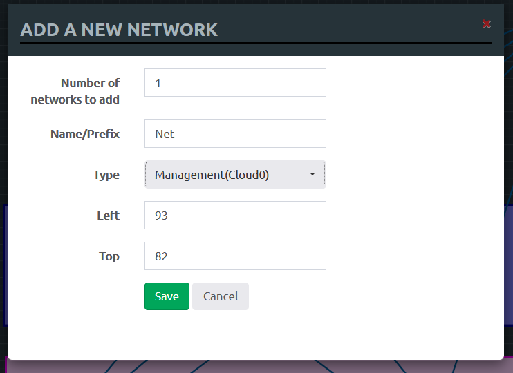
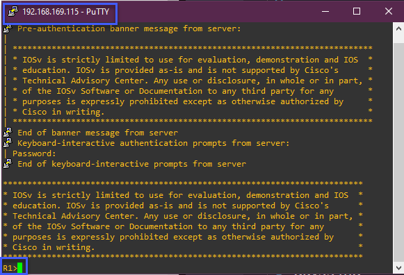
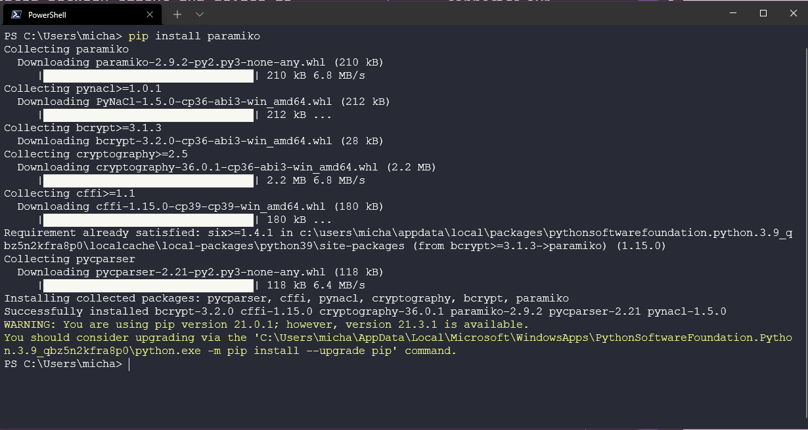

## Thực hành với Python

Trong phần cuối của loạt bài về mạng máy tính, chúng ta sẽ tìm hiểu một số tác vụ và công cụ tự động hóa dựa trên môi trường lab đã được tạo ra trong [Ngày 26](day26.md)

Chúng ta sẽ sử dụng SSH để kết nối đến các thiết bị trong mạng. Giao tiếp dựa trên SSH sẽ được mã hóa như đã giới thiệu trước đây trong loạt bài về hệ điều hành Linux. Xem lại [Ngày 18](day18.md).

## Truy cập môi trường giả lập ảo

Để tương tác với các switch, bạn có thể thiết lập một máy chủ bên trong mạng EVE-NG hoặc bạn có thể thiết lập một máy tính chạy Linux có cài đặt Python trong EVE-NG ([Resource for setting up Linux inside EVE-NG](https://www.youtube.com/watch?v=3Qstk3zngrY)), hoặc bạn cũng có thể làm theo cách của tôi là tạo một server quản lý từ xa. 


Để thiết lập như trên, chúng ta nhấp chuột phải vào giao diện ứng dụng, chọn Network, và sau đó chọn "Management(Cloud0)", thao tác này sẽ tạo ra một mạng riêng mới kết nối với máy tính đang dùng (máy host).



Tuy nhiên, chúng ta vẫn cần phải kết nối các thiết bị hiện tại với mạng mới này. (Kiến thức về mạng của tôi vẫn còn hạn chế và tôi cảm thấy rằng bạn có thể thực hiện bước tiếp theo này theo một cách khác bằng cách kết nối router với các switch và sau đó có kết nối với phần còn lại của mạng?)

Tiếp theo bạn hãy truy cập vào từng thiết bị và chạy các lệnh sau trên card mạng được dùng để kết nối với "Management(Cloud0)".


```
enable
config t
int gi0/0
IP add DHCP
no sh
exit
exit
sh ip int br
```

Lệnh trên nhằm cấp phát địa chỉ IP cho card mạng kết nối với Home Network. Địa chỉ IP của các thiết bị được liệt kê trong bảng sau:

| Node    | IP Address   | Home Network IP |
| ------- | ------------ | --------------- |
| Router  | 10.10.88.110 | 192.168.169.115 |
| Switch1 | 10.10.88.111 | 192.168.169.178 |
| Switch2 | 10.10.88.112 | 192.168.169.193 |
| Switch3 | 10.10.88.113 | 192.168.169.125 |
| Switch4 | 10.10.88.114 | 192.168.169.197 |

### Kết nối SSH đến thiết bị mạng

Với các thông tin địa chỉ IP ở trên, chúng ta có thể kết nối đến các thiết bị trong mạng từ máy host. Tôi sử dụng Putty, tuy nhiên bạn cũng có thể sử dụng bất kì phần mềm hỗ trợ kết nối SSH nào khác.

Bạn có thể thấy tôi đang kết nối SSH đến router của mình trong hình dưới. (R1)



### Sử dụng Python để thu thập thông tin từ các thiết bị

Ví dụ đầu tiên là sử dụng Python để thu thập thông tin từ tất cả các thiết bị của mình. Cụ thể hơn, tôi sẽ kết nối đến từng thiết bị và chạy một lệnh đơn giản để lấy thông tin cấu hình của mỗi card mạng. Tôi đã lưu chương trình này tại đây [netmiko_con_multi.py](../../Days/Networking/netmiko_con_multi.py)

Khi tôi chạy chương trình này, tôi có thể thấy cấu hình của mỗi cổng trên tất cả các thiết bị của mình.


Việc này rất hữu ích nếu bạn có nhiều thiết bị khác nhau, hãy tạo một chương trình tương tự để bạn có thể kiểm soát tập trung và tìm hiểu nhanh tất cả các cấu hình chỉ với một lần chạy.

### Sử dụng Python để cấu hình các thiết bị

Ví dụ trước đó là rất hữu ích nhưng còn việc sử dụng Python để định cấu hình thiết bị của chúng ta thì sao? Trong kịch bản này, chúng ta có một cổng trunk giữa `SW1` và `SW2`, một lần nữa hãy tưởng tượng nếu điều này được thực hiện trên nhiều switch và chúng ta muốn tự động hóa việc này mà không phải kết nối thủ công đến từng switch để thực hiện thay đổi cấu hình.

Chúng ta có thể sử dụng chương trình [netmiko_sendchange.py](../../Days/Networking/netmiko_sendchange.py) để thực hiện điều này. Thao tác này sẽ kết nối qua SSH và thực hiện thay đổi cần thiết trên `SW1` và `SW2`.


Nếu bạn đã xem code, bạn sẽ thấy thông báo xuất hiện và cho chúng ta biết `sending configuration to device` nhưng không có xác nhận rằng điều này đã được thực hiện, chúng ta có thể thêm đoạn code bổ sung vào chương trình để thực hiện kiểm tra và xác thực việc cấu hình trên các switch hoặc chúng ta có thể sửa đổi đoạn code của ví dụ thứ nhất để cho chúng ta thấy điều đó. [netmiko_con_multi_vlan.py](../../Days/Networking/netmiko_con_multi_vlan.py)


### Sao lưu cấu hình của các thiết bị

Một ví dụ khác là sao lưu các cấu hình mạng của các thiết bị. Nếu bạn không muốn kết nối với mọi thiết bị có trên mạng của mình, bạn có thể chỉ định thiết bị mà bạn muốn sao lưu. Bạn có thể tự động hóa việc này bằng cách sử dụng chương trình [backup.py](../../Days/Networking/backup.py). Bạn sẽ cần điền vào file [backup.txt](../../Days/Networking/backup.txt) các địa chỉ IP mà bạn muốn sao lưu.

Chạy chương trình trên và bạn sẽ thấy nội dung như bên dưới.


Đây chỉ là vài thông tin đơn giản được in ra màn hình, tôi sẽ cho bạn xem các file sao lưu.


### Paramiko

Một thư viên Python được sử dụng rộng rãi cho kết nối SSH. Bạn có thể tìm hiểu thêm [tại đây](https://github.com/paramiko/paramiko)

Chúng ta có thể cài đặt thư viện này bằng lệnh `pip install paramiko`.



Chúng ta có thể kiểm tra kết quả cài đặt bằng cách import thư viện paramiko trong Python.


### Netmiko

Thực viện netmiko chỉ tập trung vào các thiết bị mạng trong khi paramiko là một thư viện lớn hơn nhằm phục vụ các thao tác trên SSH nói chung.

Netmiko mà tôi đã sử dụng ở trên cùng với paramiko có thể được cài đặt bằng lệnh `pip install netmiko`

Netmiko hỗ trợ thiết bị của nhiều nhà sản xuất, bạn có thể tìm thấy danh sách các thiết bị được hỗ trợ tại [GitHub Page](https://github.com/ktbyers/netmiko#supports)

### Các thư viện khác

Cũng cần đề cập đến một số thư viện khác mà chúng ta chưa có cơ hội xem xét nhưng chúng cung cấp nhiều tính năng liên quan đến tự động hóa các thiết lập mạng.

Thư viện `netaddr` được sử dụng để làm việc với các địa chỉ IP, có thể được cài đặt bằng lệnh `pip install netaddr`

Nếu bạn muốn lưu trữ cấu hình của nhiều switch trong một bảng tính excel, thư viện `xlrd` sẽ cung cấp các phương thức để làm việc với excel và chuyển đổi các hàng và cột thành ma trận. Cài đặt nó bằng lệnh `pip install xlrd`.

Bạn cũng có thể tìm thấy một số ví dụ khác về tự động hóa mạng mà tôi chưa có cơ hội giới thiệu [tại đây](https://github.com/ktbyers/pynet/tree/master/presentations/dfwcug/examples)

Tôi sẽ kết thúc phần loạt bài về Mạng máy tính trong sê-ri #90DaysOfDevOps tại đây. Mạng máy tính là một lĩnh vực mà tôi thực sự đã không làm đến trong một thời gian và còn rất nhiều điều cần đề cập nhưng tôi hy vọng các ghi chú của mình và các tài nguyên được chia sẻ trong những ngày qua sẽ hữu ích với một số bạn.

## Tài nguyên tham khảo

- [Free Course: Introduction to EVE-NG](https://www.youtube.com/watch?v=g6B0f_E0NMg)
- [EVE-NG - Creating your first lab](https://www.youtube.com/watch?v=9dPWARirtK8)
- [3 Necessary Skills for Network Automation](https://www.youtube.com/watch?v=KhiJ7Fu9kKA&list=WL&index=122&t=89s)
- [Computer Networking full course](https://www.youtube.com/watch?v=IPvYjXCsTg8)
- [Practical Networking](http://www.practicalnetworking.net/)
- [Python Network Automation](https://www.youtube.com/watch?v=xKPzLplPECU&list=WL&index=126)

Vì tôi không phải là một kỹ sư mạng nên phần lớn các ví dụ tôi sử dụng ở trên đến từ cuốn sách này.

- [Hands-On Enterprise Automation with Python (Book)](https://www.packtpub.com/product/hands-on-enterprise-automation-with-python/9781788998512)

Hẹn gặp lại các bạn vào [Ngày 28](day28.md), nơi mà chúng ta sẽ tìm hiểu về điện toán đám mây (cloud computing) và các kiến thức cơ bản xoay quanh chủ đề này.
