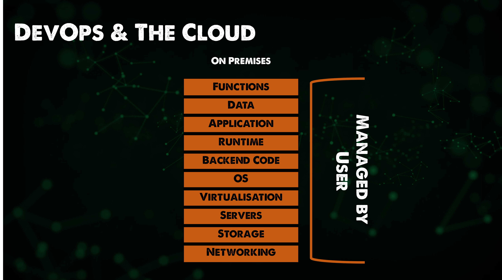
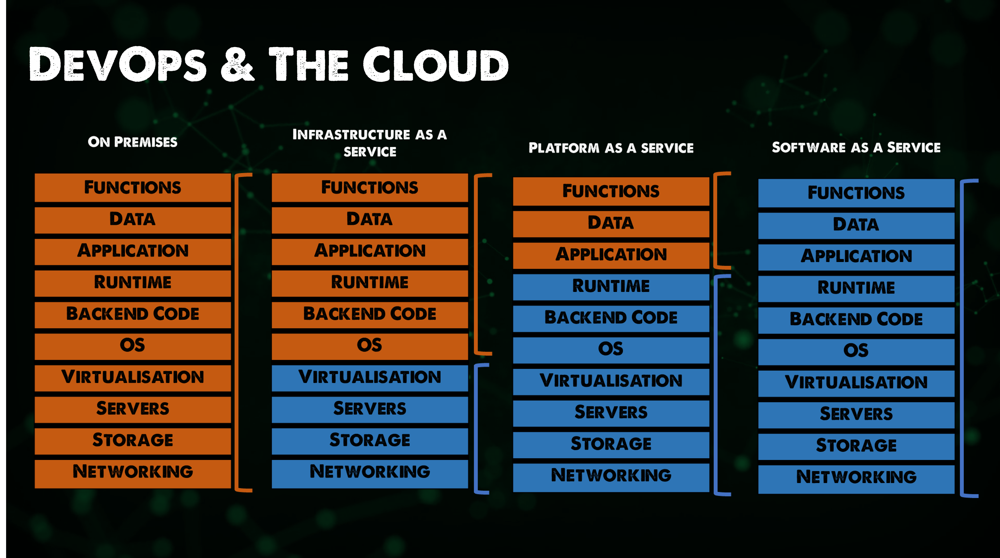

## Bức tranh toàn cảnh: DevOps & The Cloud

Khi nói đến điện toán đám mây và những gì nó cung cấp, nó rất phù hợp với các đặc tính và quy trình của DevOps. Chúng ta có thể coi điện toán đám mây mang đến công nghệ và dịch vụ trong khi DevOps như chúng ta đã đề cập nhiều lần trước đây là về quy trình và cải tiến quy trình.

Nhưng việc bắt đầu tìm hiểu về điện toán đám mây sẽ là một hành trình khó khăn và nhất là việc đảm bảo rằng bạn biết và hiểu tất cả các thành phần và dịch vụ tốt nhất để lựa chọn với mức giá phù hợp lại càng khó hơn nữa.

Vậy các dịch vụ public cloud (đám mây công cộng) có yêu cầu tư duy DevOps không? Câu trả lời của tôi ở đây là không, nhưng để thực sự tận dụng được những lợi thế của điện toán đám mây và để tránh những hoá đơn khổng lồ cho dịch vụ điện toán, việc nghĩ đến DevOps và Cloud cùng với nhau là điều rất quan trọng.

Nếu chúng ta xem xét ý nghĩa của public cloud từ góc độ high level, thì có thể nói nó loại bỏ trách nhiệm quản lý các máy chủ và giúp chúng ta tập trung hơn vào những khía cạnh khác quan trọng hơn đó là ứng dụng và người sử dụng. Xét cho cùng, đám mây công cộng cũng chỉ là máy tính của người khác. 

Trong phần đầu tiên này, tôi muốn tìm hiểu và mô tả thêm một chút về đám mây công cộng là gì và một số khối cấu trúc của đám mây công cộng nói chung.

### SaaS

Lĩnh vực cần nhắc tới đầu tiên là Phần mềm dưới dạng dịch vụ (Software as a Service), dịch vụ này sẽ loại bỏ gần như toàn bộ chi phí quản lý của một dịch vụ mà bạn có thể đã từng chạy on-premises. Hãy nghĩ nó giống như Microsoft Exchange cho email của chúng ta, đây từng là một máy chủ vật lý nằm trong trung tâm dữ liệu của bạn. Bạn sẽ cần phải cung cấp các tài nguyên cần thiết cho máy chủ đó. Điều đó có nghĩ là bạn sẽ cần cập nhật nó, chịu trách nhiệm quản lý và nâng cấp phần cứng máy chủ, rất có thể là cài đặt hệ điều hành, cài đặt các ứng dụng cần thiết và nếu có sự cố xảy ra, bạn sẽ phải khắc phục sự cố, cài đặt bản sao lưu và chạy lại dịch vụ.

Ồ, và bạn cũng sẽ phải đảm bảo rằng bạn đang sao lưu dữ liệu của mình, mặc dùng điều này cũng không quá thay đổi khi sử dụng SaaS.

Thứ mà Saas làm và cụ thể trong trường hợp này là Microsoft 365 vì tôi đã đề cập tới Exchange là loại bỏ chi phí quản trị đó cho chung ta và họ cung cấp chức năng trao đổi thư cũng như có nhiều tuỳ chọn lưu trữ (OneDrive) và các công cụ làm việc khác (Office 365) mà tổng thể mang lại một trải nghiệm tuyệt vời cho người dùng cuối.

Các ứng dụng SaaS khác cũng được sử dụng rộng rãi, chẳng hạn như Salesforce, SAP, Oracle, Google và Apple. Tất cả đều loại bỏ gánh nặng phải quản lý nhiều hệ thống hơn.

Tôi chắc chắn rằng có một câu chuyện liên quan giữ DevOps và các ứng dụng SaaS nhưng vẫn đang cố gắng tìm xem chúng có thể là gì. Tôi biết Azure DevOps có một số tích hợp tuyệt vời với Microsoft 365 mà tôi có thể xem xét và thêm vào sau.

### Đám mây công cộng (Public cloud)

Tiếp theo, chúng ta có đám mây công cộng, hầu hết mọt người sẽ nghĩ về nó theo một số cách khác nhau. MỘt số người sẽ chỉ coi đây là công cụ có tính mở rộng cao ví dụ như Microsoft Azure, Google Cloud platform hay AWS.

Một số người cũng sẽ coi đám mây công cộng là một dịch vụ lớn hơn nhiều bao gồm bộ mở rộng siêu lớn cũng như hàng ngàn các dịch vụ được quản lý trên toàn thế giới. Và trong khuôn khổ bài viết này, chúng ta sẽ xem xét đám mây công cộng là một bộ mở rộng khổng lồ và một nhà cung cấp dịch vụ được quản lý. Mặc dù sau này, chúng ta cũng sẽ đi sâu vào một hoặc nhiều những bộ mở rộng siêu lớn để tìm hiểu các kiến thức cơ bản.

_hàng ngày công ty khác đã có thể làm việc này, tôi chỉ chọn lựa từ các thương hiện địa phương, khu vực, công ty viễn thông và các thương hiệu toàn cầu mà tôi đã làm việc cùng và biết đến._

Chúng ta đã đề cập trong phần SaaS rằng điện toán đám mây đã loại bỏ trách nhiệm hoặc gánh nặng phải quản lý các thành phần của hệ thống. Nếu SaaS, chúng ta thấy rất nhiều lớp trừu tượng bị loại bỏ, tức là hệ thống vật lý, mạng, bộ lưu trữ, hệ điều hành và thậm chí là bản thân ứng dụng ở một mức độ nào đó. Khi nói tới điệu toán đám mây, có nhiều mức độ trừu tượng khác nhau mà chúng ta có thể xoá hoặc giữ tuỳ thuộc vào yêu cầu của bạn.

Chúng ta đã đề cập đến SaaS nhưng có ít nhất hay đề cập nữa liên quan tới đám mây công cộng.

- Cơ sở hạ tầng dưới dạng dịch vụ (IaaS - Infrastructure as a service) - bạn có thể coi nó như một máy ảo. Nếu nó là hệ thống on-premise, bạn phải chăm sóc lớp vật lý của nó, nhưng điều này không cần thiết với điện toán đám mây. Lớp vật lý là trách nhiệm của nhà cung cấp dịch vụ và bạn sẽ chỉ quản lý hệ điều hành, dữ liệu và các ứng dụng bạn muốn chạy trên máy ảo đó.

- Nền tảng dưới dạng dịch vụ (PaaS - Platform as a service) - Tiếp tục giúp bạn bớt được trách nhiệm của các lớp và điều bạn thực sự cần lo là việc kiểm soát dữ liệu và ứng dụng chứ không phải về phần cứng hay hệ điều hành.

Có rất nhiều các dịch vụ *aaS ngoài kia nhưng đây là 2 dịch vụ cơ bản. Bạn có thể thấy các dịch vụ xung quang SaaS (Strorage as a Service: lưu trữ dưới dạng dịch vụ) cung cấp cho bạn lớp lưu trữ và bạn không phải lo lắng về phần cứng bên dưới. Hoặc bạn có thể đã nghe nói tới CaaS (Container as a Service) cho các dịch vụ liên quan tới container mà chúng ta sẽ đề cập tới, hơn nữa, có một dịch vụ nữa mà chúng ta sẽ đề cập trong 7 ngày tới là Faas (Function as a Service - hàm dưới dạng dịch vụ) thậm chí còn không cần một hệ thống chạy liên tục mà bạn chỉ muốn một hàm, chức năng được thực thi vào một thời điểm nhất định.

Có nhiều cách mà đám mây công cộng có thể cung cấp các lớp kiểm soát trừ tượng mà bạn muốn bỏ qua và trả tiền cho điều đó.

### Đám mây riêng (Private cloud)

Việc có một trung tâm dữ liệu của riêng bạn không phải chỉ có trong quá khứ.  Tôi nghĩ rằng điều này đã trở thành sự trỗi dậy của rất nhiều công ty nhận thấy sự khó quản lý trong mô hình OPEX cũng như việc bộ skillsets chỉ sử dụng đám mây công cộng.

Điều quan trọng cần lưu ý ở đây là đám mây công cộng có thể sẽ thuộc trách nhiệm của bạn và nó sẽ trở thành một phần của hệ thống on-premises của bạn. 

Có một số điều thú vị xảy ra trong lĩnh vực này, không chỉ với VMware, công ty đã thống trị kỉ nguyên ảo hoá và cơ sở hạ tầng tại chỗ. Chúng ta cũng có các nhà cung cấp điện toán đám mây đã có phiên bản on-premise của hệ thống đám mây công cộng.

### Đám mây hỗn hợp (Hybrid cloud)

Để tiếp tục câu chuyện đám mây công cộng và đám mây riêng, chúng ta có thể mở rộng trên cả hai môi trường này để tận dụng sự linh hoạt của chúng, vừa có thể tận dụng các dịch vụ có sẵn trong đám mây công cộng nhưng sau đó cũng tận dụng các tính năng và chức năng on-premises hoặc cũng có thể đó là quy định bắt buộc bạn phải lưu trữ dữ liệu một cách cục bộ. 

Tổng hợp các mô hình này, chúng ta có rất nhiều lựa chọn về nơi lưu trữ và chạy các workloads của mình.

Trước khi chúng ta đi vào một nhà cung cấp cụ thể, tôi đã tạo một poll trên Twitter của mình rằng chúng ta nên tìm hiểu về nhà cung cấp dịch vụ nào? 

[Link to Twitter Poll](https://twitter.com/MichaelCade1/status/1486814904510259208?s=20&t=x2n6QhyOXSUs7Pq0itdIIQ)

Bất kỳ nhà cung cấp nào nhận được tỷ lệ phần trăm cao nhất, chúng tôi sẽ tìm hiểu sâu hơn về cách dịch vụ của nhà cung cấp đó. Tôi nghĩ điều quan trọng cần đề cập là các dịch vụ từ các nhà cung cấp này đều khá giống nhau, đó là lý do tại sao tôi nói là hãy bắt đầu với một nhà cung cấp bất kì. Tôi nhận thấy rằng, khi biết nền tảng của một nhà cung cấp như cách tạo máy ảo, thiết lập mạng,... thì tôi đã có thể sử dụng dịch vụ của các nhà cung cấp khác và có thể nhanh chóng sử dụng chúng.

Dù như thế nào, tôi cũng sẽ chia sẻ một số tài nguyên **MIỄN PHÍ** về cả ba nhà cung cấp lớn nhất.

Tôi cũng sẽ xây dựng một kịch bản như tôi đã làm trong các phần khác, nơi chúng ta có thể xây dựng một thứ gì đó cụ thể qua từng ngày.

## Tài liệu tham khảo

- [Hybrid Cloud and MultiCloud](https://www.youtube.com/watch?v=qkj5W98Xdvw)
- [Microsoft Azure Fundamentals](https://www.youtube.com/watch?v=NKEFWyqJ5XA&list=WL&index=130&t=12s)
- [Google Cloud Digital Leader Certification Course](https://www.youtube.com/watch?v=UGRDM86MBIQ&list=WL&index=131&t=10s)
- [AWS Basics for Beginners - Full Course](https://www.youtube.com/watch?v=ulprqHHWlng&t=5352s)

Hẹn gặp bạn vào [ngày 29](day29.md)
