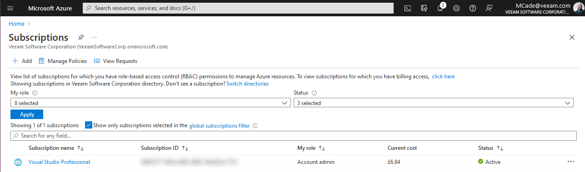
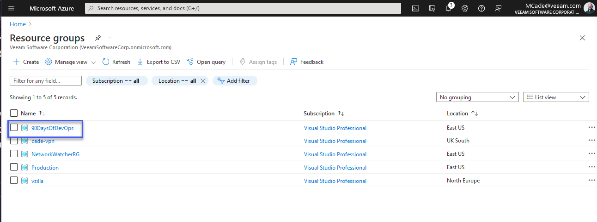

## Kiến thức cơ bản về Microsoft Azure

Trước khi chúng ta bắt đầu, nhà cung cấp chiến thắng trong cuộc thăm dò trên twitter là Microsoft Azure, do đó, nó sẽ là chủ đề xuyên suốt tuần này. Kết quả rất gần nhau và rất vui khi thấy nó chỉ trong 24 giờ.

Khi đề cập đến chủ đề này, nó sẽ giúp tôi hiểu rõ và biết đến những dịch vụ đang có của Microsoft Azure, dù vậy tôi vẫn nghiêng về Amazon AWS trong thời gian gần đây. Tuy nhiên, tôi cũng đã để lại các tài liệu tham khảo cho cả ba nhà cung cấp dịch vụ điện toán đám mây lớn nhất.

Tôi đánh giá cao rằng dù cuộc thăm dò chỉ có 3 lựa chọn nhưng có một số bình luận về Oracle cloud. Tôi rất muốn biết thêm về các nhà cung cấp đám mây nào khác đang được sự dụng.

### Cơ bản

- Cung cấp dịch vụ đám mây công cộng
- Phân bố theo khu vực địa lý (hơn 60 regions trên toàn thế giới)
- Truy cập qua internet hoặc kết nối riêng
- Mô hình multi-tenant 
- Thanh toán dựa trên sử dụng (consumption-based billing) - (chỉ trả tiền cho phần bạn sử dụng)
- Một số lượng lớn các loại dịch vụ cho các yêu cầu sử dụng khác nhau.

- [Cơ sở hạ tầng toàn cầu của Microsoft Azure](https://infrastructuremap.microsoft.com/explore)

Như đã nói về SaaS và đám mây hỗn hợp (hybrid cloud), chúng ta sẽ không đề cập đến những chủ đề đó trong phần này. 

Cách tốt nhất để bắt đầu và có thể làm theo là vào đường link sau, nó cho phép bạn tạo một [tài khoản Microsoft Azure miễn phí](https://azure.microsoft.com/en-gb/free/)

### Regions

Tôi đã để lại bản đồ ở trên, nhưng chúng ta có thể thấy hình ảnh bên dưới về độ rộng của các khu vực được cung cấp trong nền tảng của Microsoft Azure trên toàn thế giới.

_hình ảnh được lấy từ [Microsoft Docs - 01/05/2021](https://docs.microsoft.com/en-us/azure/networking/microsoft-global-network)_

Bạn cũng có thể thấy một số đám mây "có chủ quyền" có nghĩa là chúng không được liên kết hoặc không thể giao tiếp với các khu vực khác, ví dụ như những đám mây này sẽ được liên kết với các chính phủ như `AzureUSGovernment` cũng như `AzureChinaCloud` và một số đám mây khác.

Khi chúng ta triển khai các dịch vụ của mình trên Microsoft Azure, chúng ta sẽ chọn một region cho hầu hết mọi thứ. Tuy nhiên, điều quan trọng cần lưu ý là không phải tất cả các dịch vụ đều có sẵn ở mọi region. Bạn có thể thấy [sản phẩn có sẵn theo region](https://azure.microsoft.com/en-us/global-infrastructure/services/?products=all), tại thời điểm viết bùa, region West Central US không thể sử dụng Azure Databricks.

Tôi cũng đã đề cập đến "hầu hết mọi thứ" ở trên, có một số dịch vụ nhất định được liên kết với region chẳng hạn như Azure Bot Services, Bing Speech, Azure Virtual Desktop, Static Web App,...

Phía sau đó, một region có thể được tạo thành từ nhiều trung tâm dữ liệu. Chúng được nhắc đến với tên gọi Availability Zones.

Trong hình ảnh dưới đây được lấy từ tài liệu chính thức của Microsoft, bạn sẽ thấy một region được tạo từ nhiều Availability Zones như thế nào. Tuy nhiên, không phải tất cả các khu vực đều có nhiều Availability Zones.

Tài liệu của Microsoft rất đầy đủ và bạn có thể đọc thêm về [Regions và Availability Zones](https://docs.microsoft.com/en-us/azure/availability-zones/az-overview) tại đây.

### Subscriptions

Hãy nhớ rằng Microsoft Azure là một đám mây tính phí theo mô hình tiêu thụ, bạn sẽ thấy rằng tất cả các nhà cung cấp đám mây lớn đều áp dụng mô hình này.

Nếu bạn là một Doanh nghiệp thì bạn có thể muốn hoặc có một thoả thuận Doanh nghiệp với Microsoft để cho phép công ty của bạn sử dụng các dịch vụ của Azure.

Nếu bạn giống tôi và bạn đang sử dụng Microsoft Azure cho mục đích học tập thì chúng ta có một số tùy chọn khác.

Chúng ta có [tài khoản Microsoft Azure miễn phí](https://azure.microsoft.com/en-gb/free/) và thường sẽ có một số tín dụng (tiền) miễn phí để bạn có thể sử dụng Azure trong một khoảng thời gian.

Ngoài ra bạn cũng có thể lấy một số tín dụng miễn phí hàng tháng cùng với subscription hàng năm của Visual Studio, điều này thường được biết tới là MSDN nhiều năm trước. [Visual Studio](https://azure.microsoft.com/en-us/pricing/member-offers/credit-for-visual-studio-subscribers/)

Cuối cùng là đăng ký một thẻ tín dụng và trả tiền cho những dịch vụ bạn sử dụng theo [pay-as-you-go](https://azure.microsoft.com/en-us/pricing/purchase-options/pay-as-you-go/) model.

Một subscription có thể được coi là ranh giới giữa các cost center khác nhau hoặc các môi trường hoàn toàn khác nhau. Subscription là nơi các tài nguyên được tạo.

### Management Groups

Các management groups cung cấp cho chúng ta khả năng tách biệt quyền trên Azure Active Directory (AD) hoặc môi trường tenant của chúng ta. Management groups cho phép chúng ta kiểm soát các policies, kiểm soát truy cập dựa trên vai trò (RBAC) và ngân sách (budget).

Các subscriptions thuộc về các management groups, do đó, bạn có thể có nhiều đăng ký trông Azure AD tenant của mình, các subscriptions này cũng có thể kiểm soát các policies, RBAC và ngân sách.

### Resource Manager and Resource Groups

#### Azure Resource Manager

- API sử dụng JSON được xây dựng theo các cung cấp tài nguyên.
- Các tài nguyên thuộc một resource group chia sẻ một vòng đời chung.
- Song song
- Triển khai theo dạng khai báo với format JSON, idempotent (kết quả như nhau kể cả được gọi nhiều lần) và hiểu được sự phụ thuộc giữa các tài nguyên để điều chỉnh việc tạo và đặt hàng.

#### Resource Groups

- Mọt tài nguyên trong Azure Resource Manager tồn tại trong một và chỉ một nhóm tài nguyên!
- Các resource groups được tạo trong một region có thể chứa các tài nguyên từ bên ngoài region đó.
- Tài nguyên có thể được dịch chuyển giữa các resource group
- Các resource group không bị ngăn cách với các resource group khác, giữa các resource groups có thể có sự giao tiếp với nhau.
- Các resource group cũng có thể kiểm soát cách chính sách, RBAC và ngân sách.

### Thực hành

Hãy bắt đầu, tạo tài khoản và hãy chắc chắn rằng chúng ta có một **Subscription**. Chúng ta có thể kiểm tra **Management Group** được tạo và sau đó có thể tạo một **Resource Group** mới trong **Region** tuỳ ý.

Khi chúng ta đăng nhập lần đầu vào [Azure portal](https://portal.azure.com/#home), bạn sẽ thấy thanh tìm kiếm ở trên cùng của trang, nó có khả năng giúp chúng ta tìm kiếm các tài nguyên, dịch vụ và tài liệu hướng dẫn.

Trước tiên, chúng ta hãy xem subscription của mình, bạn sẽ thấy ở đây rằng tôi đang sử dụng đăng ký Visual Studio Professional của mình để lấy một khoản tín dụng miễn phí hàng tháng.

Nếu chúng ta đi vào đó, bạn sẽ có một cái nhìn bao quát hơn và xem được những gì đang xả ra hoặc những gì có thể làm với subscription của mình, chúng ta có thể thấy thông tin thanh toán với các chức năng kiểm soát ở bên trái, nơi bạn có thể xác định "IAM Access Control" và nhiều hơn nữa là các tài nguyên có sẵn.

Có thể có trường hợp bạn có nhiều subscriptions và bạn muốn quản lý tất cả chúng dưới một thứ duy nhất, đây là nơi có thể sử dụng các management group để chia ra các nhóm tuỳ vào mục đích của các group đó. Bạn có thể thấy chỉ có nhóm "tenant root group" đối với subscription của tôi.

Bạn cũng sẽ thấy trong hình ảnh trước đó rằng management group chính có cùng id với "tenant root group"

Tiếp theo, chúng ta có resource group, đây là nơi chúng ta kết hợp các tài nguyên của mình và có thể dễ dành quản lý chúng ở một nơi duy nhất. Tôi có một số resource groups được tạo cho một vài dự án khác.

Với những gì chúng ta có thể làm trong vài ngày tới, chúng ta muốn tạo resource group của riêng mình. Điều này được thực hiện dễ dàng trong console bằng cách nhấn "Create" trong hình ảnh ở trên.

Bước xác thực diễn ra ngay sau đó và cuối cùng bạn cũng có thể xem lại các yêu cầu tạo tài nguyên của mình và tạo chúng. Bạn cũng sẽ thấy ở dưới cùng là dòng "Download a template for automation", điều này cho phép chúng ta lấy file JSON để có thể thực hiện tác vụ này một cách tự động nếu muốn, chúng ta cũng sẽ đề cập đến vấn đề này sau.

Nhấn "create", sau đó trong danh sách resource groups của chúng ta đã có nhóm "90DaysOfDevOps" sẵn sàng cho những buổi tiếp theo.

## Tài liệu tham khảo 

- [Hybrid Cloud and MultiCloud](https://www.youtube.com/watch?v=qkj5W98Xdvw)
- [Microsoft Azure Fundamentals](https://www.youtube.com/watch?v=NKEFWyqJ5XA&list=WL&index=130&t=12s)
- [Google Cloud Digital Leader Certification Course](https://www.youtube.com/watch?v=UGRDM86MBIQ&list=WL&index=131&t=10s)
- [AWS Basics for Beginners - Full Course](https://www.youtube.com/watch?v=ulprqHHWlng&t=5352s)

Gặp lại bạn vào [ngày 30](day30.md)
