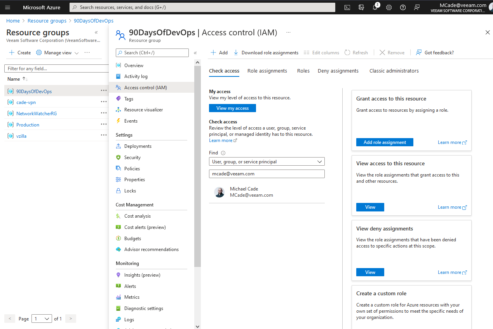
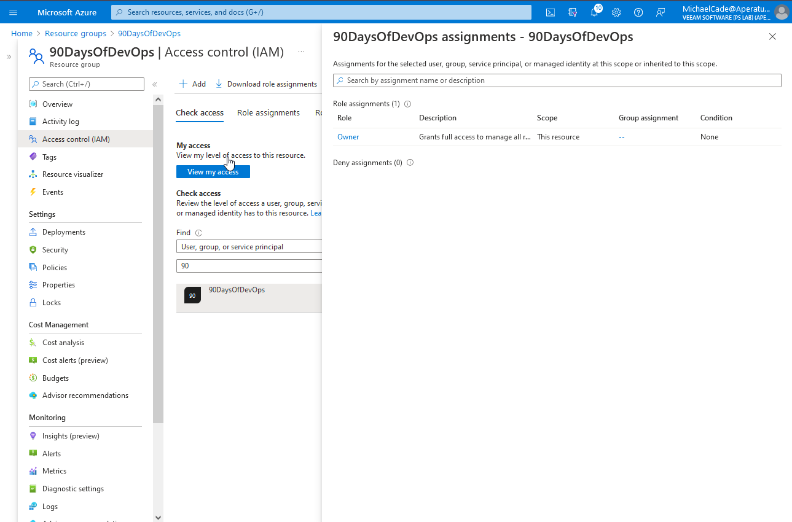

## Mô hình bảo mật Microsoft Azure

Tiếp sau tổng quan về Microsoft Azure, chúng ta sẽ thảo luận về bảo mật trên Azure và thử xem điều này có thể giúp ích gì cho chúng ta hàng ngày. Đối với hầu hết các trường hợp, tôi thấy các role được tích hợp sẵn đã đáp ứng được nhu cầu bình thường. Tuy nhiên, chúng ta cũng nên biết rằng có thể tạo và làm việc với nhiều kiểu xác thực và cấu hình khác nhau. Tôi nhận thấy Microsoft Azure khá ưu việt với nền tảng Active Directory so với các nhà cung cấp khác.

Đây là một lĩnh vực mà Microsoft Azure dường như hoạt động khác so với các nhà cung cấp đám mây công cộng khác, trong Azure, LUÔN LUÔN có Azure AD.

### Directory Services

- Azure Active Directory lưu trữ các nguyên tắc bảo mật được sử dụng bởi Microsoft Azure và các dịch vụ đám mây khác của Microsoft.
- Quá trình xác thực được thực hiện thông qua các giao thứ chứ SAML. WS-Foundation, OpenID Connect và OAuth2.
- Các truy vấn được thực hiện thông qua REST API được gọi là Microsoft Graph API.
- Các tenants có một tên mặc định tại tenant.onmicrosoft.com nhưng cũng có thể có tên miền tuỳ chỉnh.
- Subscriptions được liên kết với một Azure Active Directory tenant.

Nếu chúng ta so sánh với các dịch vụ tương đương của AWS thì nó sẽ là AWS IAM (Identity & Access Management) mặc dù chúng rất khác nhau.

Azure AD Connect cung cấp khả năng sao chép tài khoản từ AD sang Azure AD. Điều này cũng có thể bao gồm các nhóm và đôi khi là các đối tượng. Điều này có thể được lọc chi tiết và có hỗ trợ nhiều forests và domains.

Có thể tạo tài khoản đám mây trong Microsoft Azure Active Directory (AD) nhưng hầu hết các tổ chức đã tạo tài khoản cho người dùng của họ trong Active Directory của riêng họ ở on-premises.

Azure AD Connect không chỉ cho phép bạn xem các máy chủ Windows AD mà còn các Azure AD khác, Google và các máy chủ khác. Điều này cũng cung cấp khả năng cộng tác với những cá nhân và tổ chức bên ngoài, đây được gọi là Azure B2B.

CÓ thể có các tuỳ chọn xác thực giữa dịch vụ Azure Directory Domain và Microsoft Azure Active Directory với đồng bộ hoá danh tính sử dụng hàm băm mật khẩu.

Việc chuyển hàm băm mật khẩu là tuỳ chọn, nếu điều này không được sử dụng thì cần phải xác thực theo kểu pass-through.

Video dưới đâu đi sâu vào chi tiết về xác thực pass-through.

[Người dùng đăng nhập với Azure Active Directory thông qua xác thực Pass-through](https://docs.microsoft.com/en-us/azure/active-directory/hybrid/how-to-connect-pta)

### Federation

Công bằng mà nói, nếu bạn đang sử dụng Microsoft 365, Microsoft Dynamics cùng với Active Directory ở on-premises thì khá là dễ hiểu và tích hợp vào Azure AD cho việc đăng nhập. Tuy nhiên, bạn có thể sử dụng các dịch vụ ở ngoài hệ sinh thái của Microsoft.

Azure AD có thể đóng vai trò là một federation broker cho các ứng dụng không phải của Microsoft và các directory services khác.

Bạn có thể thấy điều này trong Azure Portal dưới dạng Enterprise Applications với rất nhiều tuỳ chọn khác nhau.

Nếu bạn cuộn xuống trên trang ứng dụng doanh nghiệp (enterprise application), bạn có thể thấy một danh sách các ứng dụng nổi bật.

Tuỳ chọn này cũng cho phép bạn tích hợp với các ứng dụng của riêng bạn, một ứng dụng bạn đang phát triển hoặc không nằm trong thư viện.

Tôi chưa từng xem xét vấn đề này trước đây nhưng tôi có thể thấy rằng đây là bộ tính năng hoàn toàn phù hợp khi so sánh với các dịch vụ của các nhà cung cấp đám mây khác.

### Role-Based Access Control

Chúng ta đã đề cập vào [ngày 29](day29.md) phạm vi mà chúng ta sẽ đề cập ở đây, chúng ta có thể đặt kiểm soát RBAC của mình cho một trong những dịch vụ dưới đây.

- Subscriptions
- Management Group
- Resource Group
- Resources

Role có thể được chia thành ba vai trò nhỏ hơn, có nhiều vai trò được tính hợp sẵ trong Microsoft Azure. Ba người đó là:

- Owner
- Contributor
- Reader

Owner and Contributor gần giống nhau về ranh giới và phạm vi, tuy nhiên, Owner có thể thay đổi quyền.

Các role khác dành riêng cho một số loại tài nguyên của Azure cũng như các custom roles.

Chúng ta nên tập trung vào việc gán quyền cho nhóm với gán quyền cho người dùng.

Quyền(Permissions) được kế thừa.

Nếu chúng ta quay lại nhóm tài nguyên "90DaysOfDevOps" và kiểm tra Access Control (IAM) của nó, bạn có thể thấy chúng ta có danh sách Contributors và một customer User Access Administrator, và chúng ta cũng có một danh sách các owners (nhưng tôi không thể công khai)

Chúng ta cũng có thể kiểm tra các roles mà chúng ta đã chỉ định ở đây xem chúng có phải role được tích hợp hay chúng đang ở danh mục nào.

Chúng ta cũng có thể sử dụng tab "Check access" nếu muốn kiểm tra một tài khoản với nhóm tài nguyên này và đảm bảo rằng tài khoản mà chúng ta muốn có quyền truy cập đó có đúng quyền hoặc có thể kiểm tra xem một người dùng có quá nhiều quyền truy cập hay không.

### Microsoft Defender cho Cloud

- Microsoft Defender cho Cloud (trước đây là Azure Security Center) cung cấp thông tin chuyên sâu về bảo mật cho toàn bộ môi trường trên Azure.
- Một bảng điều khiển duy nhất để hiện thị tình trạng bảo mật tổng thể của tất cả các tài nguyên Azure và không phải Azure (thông qua Azure Arc) và hướng dẫn tăng cường bảo mật.
- Bậc miễn phí của dịch vụ có chức năng đánh giá bảo mật liên tục và đề xuất bảo mật.
- Gói trả phí cho các loại tài nguyên được bảo vệ (ví dụ như là máy chủ, AppService, SQL, Storage, Containers, KeyVault).

Tôi đã chuyển sang một subscription khác để xem Azure Security Center và bạn có thể thấy tại đây với rất ít tài nguyên, tôi có vài đề xuất về bảo mật tại cùng một nơi.

### Azure Policy

- Azure Policy là một dịch vụ native của Azure giúp thực thi các tiêu chuẩn của tổ chức và đánh giá compliance (quy định) trên quy mô lớn.
- Được tích hợp và Microsoft Defender cho Cloud. Azure Policy kiểm tra các tài nguyên không tuân thủ quy tắc, tiêu chuẩn và áp dụng các biện pháp khắc phục.
- Thường được sử dụng để quán lý tính nhất quán của tài nguyên, tuân thủ các quy định, bảo mật, chi phí và tiêu chuẩn quản lý.
- Sử dụng định dạng JSON để lưu trữ logic đánh giá và xác định xem tài nguyên có tuân thủ hay không và bất kỳ hành động nào cần thực hiện khi không tuân thủ (ví dụ: Audit, AuditIfNotExists, Deny, Modify, DeployIfNotExists)
- Sử dụng miễn phí. Ngoại lệ là các tài nguyên được kết nối với Azure Arc được tính phí trên mỗi máy chủ/tháng cho việc sử dụng Azure Policy Guest Configuration.

### Thực hành

Tôi đã mua tên miền www.90DaysOfDevOps.com và tôi muốn thêm tên miền này vào Azure Active Directory portal của mình, [Thêm tên miền tuỳ chọn của bạn bằng Azure Active Directory portal](https://docs.microsoft.com/en-us/azure/active-directory/fundamentals/add-custom-domain)

Sau khi thực hiện điều này, chúng ta có thể tạo một người dùng mới trên Azure Directory domain của mình.

Giờ chúng ta muốn tại một nhóm cho tất cả những người dùng của 90DaysOfDevOps trong một nhóm. Chúng ta có thể tạo một nhóm theo hướng dẫn bên dưới, lưu ý rằng tôi đang sử dụng "Dynamic User", điều đó có nghĩa là Azure AD sẽ truy vấn các tài khoản và thêm chúng một cách tự động so với việc được chỉ định - khi đó bạn phải thêm người dùng và nhóm của mình một cách thủ công.

Có rất nhiều tuỳ chọn khi bạn tạo truy vấn của mình, tôi dự định chỉ cầm tìm tên chính và đảm bảo rằng tên đó chứa @90DaysOfDevOps.com.

Vì tôi đã tạo tài khoản người dùng của mình dưới tên michael.cade@90DaysOfDevOps.com (thay bằng tên của các bạn ở đây) chúng ta có thể xác nhận xem các quy tắc có đang hoạt động hay không. Để so sánh, tôi cũng đã thêm một tài khoản khác liên kết với một tên miền khác tại đây và bạn có thể thấy do quy tắc này, người dùng của chúng ta sẽ không được đưa vào nhóm này.

Sau đó, tôi thêm một người dùng user1@90DaysOfDevOps.com và nếu chúng ta kiểm tra nhóm, chúng ta có thể thấy các thành viên của nhóm mình.

Nếu có khoảng 100 yêu cầu như thế này, chúng ta sẽ không muốn thực hiện tất cả điều này trong bảng điều khiển mà chúng ta muốn tận dụng hoặc là các tuỳ chọn hàng loạt (bulk options) để tạo, mời, và xoá người dùng hoặc bạn có thể muốn sử dụng Powershell để làm điều này một cách tự động để có thể scale.

Bây giờ, chúng ta có thể vào Resource group của mình và chỉ định rằng trong nhóm tài nguyên 90DaysOfDevOps, chúng ta muốn chủ sở hữu (owner) của nó là nhóm chúng ta vừa mới tạo.

Chúng ta cũng có thể từ chối các quyền truy cập đến resource group của chúng ta tại đây.

Bây giờ, nếu chúng ta đăng nhập và Azure Portal với tài khoản người dùng mới của chúng ta, bạn có thể thấy rằng chúng ta chỉ có quyền truy cập vào nhóm tài nguyên 90DaysOfDevÓp của mình chứ không phải những nhóm khác được thấy trong các ảnh trước đó vì chúng ta không có quyền truy cập.

Nếu người dùng có quyền truy cập vào các tài nguyên bên trong Azure portal, cách trên sẽ rất tiện lợi. Tuy nhiên, không phải người dùng nào cũng cần biết về portal này, để kiểu tra quyền truy cập, bạn có thể sử dụng [Apps Portal](https://myapps.microsoft.com/). Đây là single sign-on portal để chúng ta có thể kiểm tra.

Bạn có thể tuỳ chỉnh portal này với thương hiệu của mình và đây có thể là thứ mà chúng ta sẽ quay lại sau.

## Tài liệu tham khảo

- [Hybrid Cloud and MultiCloud](https://www.youtube.com/watch?v=qkj5W98Xdvw)
- [Microsoft Azure Fundamentals](https://www.youtube.com/watch?v=NKEFWyqJ5XA&list=WL&index=130&t=12s)
- [Google Cloud Digital Leader Certification Course](https://www.youtube.com/watch?v=UGRDM86MBIQ&list=WL&index=131&t=10s)
- [AWS Basics for Beginners - Full Course](https://www.youtube.com/watch?v=ulprqHHWlng&t=5352s)

Hẹn gặp lại vào ngày [ngày 31](day31.md)
