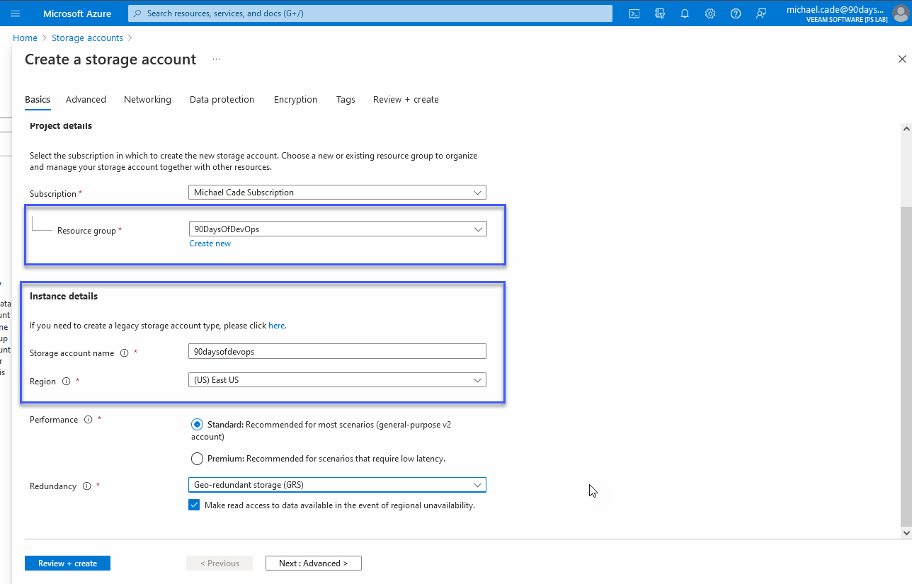

## Mô hình lưu trữ và cơ sở dữ liệu Microsoft Azure

### Các dịch vụ lưu trữ (Storage services)

- Các dịch vụ của Azure storage được cung cấp bởi các tài khoản lưu trữ(storage accounts).
- Storage accounts chủ yếu được tuỷ cập thông qua REST API.
- Một storage account phải có một tên duy nhất là và sẽ là một phần của DNS name `<Storage Account name>.core.windows.net`
- Có nhiều tuỳ chọn sau lưu và mã hoá khác nhau.
- Nằm trong một resource group

Chúng ta có thể tạo storage group bằng cách tìm kiếm storage group trong thành tìm kiếm ở trên cùng của Azure portal.

Sau đó chúng ta có thể thực hiện các bước để tạo storage account của mình, hãy nhớ rằng tên này cần phải là duy nhất và nó cũng cần phải là chữ thường, không có khoảng trắng nhưng có thể sử dụng các chữ số.

Chúng ta cũng có thể chọn mức độ dự phòng (redundancy) mà chúng ta muốn với storage account của mình và bất cứ thứ gì chúng ta lưu trữ ở đó. Càng xuống phía dưới danh sách, các tuỳ chọn sẽ ngày một đắt tiền nhưng dữ liệu của bạn cũng được bảo đảm hơn.

Ngay cả tuỳ chọn dự phòng mặc định cũng cung cấp cho chúng ta 3 bản sau dữ liệu.

[Azure Storage Redundancy](https://docs.microsoft.com/en-us/azure/storage/common/storage-redundancy)

Dưới đây là tóm tắt cho thông tin có trong đường link ở trên:

- **Locally-redundant storage** - sao chép dữ liệu của bạn ba lần trong một trung tâm dữ liệu ở khu vực chính.
- **Geo-redundant storage** - sao chép đồng bộ dữ liệu của bạn ba lần tại một vị trí vật lý ở khu vực chính sử dụng LRS.
- **Zone-redundant storage** - sao chép dữ liệu của bạn một cách đồng bộ trên ba vùng khả dụng của Azure trong vùng chính.
- **Geo-zone-redundant storage** - kết hợp tính khả dụng cao do khi các dữ liệu được sao chép giữa các availability zones (AZ) với khả năng bảo vệ khỏi sự cố với một region bằng geo-replication. Dữ liệu trong GZRS storage account được sao chép qua ba AZs trong region chính và cũng được sao chép sang vùng địa lý thứ hai để bảo về các thảm hoạ xảy ra trong từng khu vực.

Quay trở lại các tuỳ chọn về hiệu suất. Chúng ta có Standard và Premium để chọn. Chúng ta đã chọn Standard trong hướng dẫn này nhưng lựa chọn Premium cho chúng ta một số ưu điểm cụ thể.

Sau đó, trong drop-down, bạn có thể thấy chúng ta có ba tuỳ chọn sau.

Có rất nhiều tuỳ chọn nâng cao hơn có sẵn cho tài khoản lưu trữ của bạn, nhưng hiện tại, chúng ta không cần phải truy cập vào các phần này. Các tuỳ chọn này là về mã hoá và bảo vệ dữ liệu.

### Ổ đĩa được quản lý - Managed Disks

Truy cập bộ nhớ có thể đạt được theo một vài cách sau:

Truy cập được xác thực thông qua:

- Một shared key để kiểm soát hoàn toàn
- Shared Access Signature để truy cập, uỷ quyền truy cập.
- Azure Active Directory (nếu có)

Truy cập công cộng:
- Quyền truy cập công khai cũng có thể được cấp để cho phép truy cập ẩn danh bao gồm cả qua HTTP.
- - Một ví dụ về điều này có thể là lưu trữ các tệp và nội dung cơ bản trong một khối blob để trình duyệt có thể xem và tài xuống dữ liệu này.

Nếu bạn đang truy cập vào bộ nhớ của mình từ một dịch vụ Azure khác, thì lưu lượng truy cập vẫn nằm trong Azure.

Khi nói đến hiệu xuất lưu trữ, chúng ta có 2 loại khác nhau:

- **Tiêu chuẩn** - Số lượng IOPS tối đa trong khả năng
- **Premium** - Số lượng IOPS được đảm bảo

IOPS => Input/Output operations per sec.

Ngoài ra còn có sự khác biết giữa ổ đĩa không được quản lý và ổ đĩa được quản lý để cân nhắc khi chọn ổ lưu trữ phù hợp cho tác vụ của bạn.

### Lưu trữ trên máy ảo - Virtual Machine Storage

- Ổ đĩa của hệ điều hành máy ảo được lưu trữ trên bộ lưu trữ liên tục (persisten storage)
- Một số workloads phi trạng thái không yêu cầu lưu trữ liên tục và việc giảm độ trễ là điều cần quan tâm hơn.
- Có một số máy ảo hỗ trợ các ổ đĩa tạm thời (ephemeral disks) do hệ điều hành quản lý và được tạo trên bộ lưu trữ nút cục bộ (node-local storage)
  - Chúng cũng có thể được sử dụng với VM Scale Sets

Ổ đĩa được quản lý là bộ lưu trữ khối (block storage) có thể được sử dụng với Azure Virtual Machines. Bạn có thể có Ultra Disk Storage, Premium SSD, Standard SSD, hoặc Standard HDD. Chúng cũng có một số đặc điểm riêng.

- Hỗ trợ Snapshot và Image
- Di chuyển đơn giản giữa các SKUs
- Tính khả dụng tốt hơn khi kết hợp với các bộ tính khả dụng (availability sets)
- Tính phí dựa trên kích thước đĩa, không phải trên dung lượng lưu trữ đã sử dụng.

## Lưu trữ kho - Archive Storage

- **Cool Tier** - Có sẵn cho block và các blobs có thể thêm dữ liệu (append blobs)
  - Chi phí lưu trữ thấp hơn
  - Chi phí đọc/ghi cao hơn
- **Archive Tier** - Có sẵn cho block BLOBs.
  - Được định cấu hình trên mỗi BLOB.
  - Chi phí rẻ hơn nhưng độ trễ khi truy vấn dữ liệu cao hơn.
  - Có độ bền bỉ (durability) tương tự như Azure Storage thông thường.
  - Phân tầng dữ liệu tuỳ chỉnh có thể được bật theo yêu cầu.

### Chia sẻ file - File Sharing

Từ việc tạo storage account ở trên, giờ đây chúng ta có thể tạo chia sẻ tệp.

Việc này sẽ cung cấp tính năng chia sẻ tệp SMB2.1 và 3.0 trong Azure.

Có thể sử dụng trong Azure và bên ngoài thông qua SMB3 và cổng 445 mở ra với Internet.

Cung cấp lưu trữ tệp được chia sẻ trong Azure.

Ngoài REST API, dữ liệu có thể được đọc bởi ứng dụng SMB client tiêu chuẩn

Bạn cũng có thể để ý đến [Azure NetApp Files](https://vzilla.co.uk/vzilla-blog/azure-netapp-files-how) (SMB and NFS)

### Bộ nhớ đệm & Dịch vụ media - Caching & Media Services

Azure Content Delivery Network cung cấp bộ nhớ đệm cho nội dung web tĩnh với các vị trí trên khắp thế giới.

Azure Media Service, cung cấp các công nghệ chuyển mã phương tiện bên cạnh các dịch vụ phát lại.

## Mô hình cơ sở dữ liệu Microsoft Azure

Quay lại [Ngày 28](day28.md), chúng ta đã đề cập đến nhiều tùy chọn dịch vụ khác nhau. Một trong số đó là PaaS (Nền tảng dưới dạng Dịch vụ), nơi bạn trừu tượng hóa một các cơ sở hạ tầng và hệ điều hành và chỉ còn lại quyền kiểm soát ứng dụng hoặc trong trường hợp này là các mô hình cơ sở dữ liệu.

### Relational Databases

Cơ sở dữ liệu Azure SQL cung cấp cơ sở dữ liệu quan hệ dưới dạng dịch vụ dựa trên Microsoft SQL Server.

Đây là SQL chạy nhánh SQL mới nhất với mức độ tương thích cơ sở dữ liệu có sẵn khi cần có một phiên bản chức năng cụ thể.

Có một vài tùy chọn về cách cấu hình điều này, chúng ta có thể cung cấp một cơ sở dữ liệu duy nhất tron instance, trong khi một nhóm đàn hồi (elastic pool) cho phép nhiều cơ sở dữ liệu chia sẻ một nhóm dung lượng và chia tỷ lệ với nhau.

Các instances cơ sở dữ liệu này có thể được truy cập như các bản SQL thông thường.

Các dịch vụ được quản lý khác như MySQL, PostgreSQL và MariaDB.

### Giải pháp NoSQL

Azure Cosmos DB là một NoSQL bất khả tri (agnostic NoSQL) với 99.99% SLA.

Dữ liệu được phân phối toàn cầu với độ trễ một chữ số cho 99% số yêu cầu ở mọi nơi trên thế giới với tính năng tự động điều hướng.

Khoá phân vùng (Partition key) được tận dụng để phân vùng/phân mảnh/phân phối dữ liệu.

Hỗ trợ nhiều mô hình dữ liệu khác nhau (documents, key-value, graph, column-friendly)

Hỗ trợ nhiều API khác nhau (DocumentDB SQL, MongoDB, Azure Table Storage và Gremlin)

Có nhiều mô hình nhất quán khác nhau dựa trên [định lý CAP](https://en.wikipedia.org/wiki/CAP_theorem).

### Bộ nhớ đệm - Caching

Để tránh đi sâu vào các hệ thống bộ nhớ đệm như Redis, tôi chỉ muốn đề cập rằng Microsoft Azure có một dịch vụ gọi là Azure Cache cho Redis.

Azure Cache cho Redis cung cấp bộ nhớ lưu trữ dữ liệu in-memory dựa trên Redis.

- Đây là một phiên bản triển khai của phần mềm mã nguồn mở Redis Cache.
  - Một instance được host, bảo mật
  - Có nhiều tiers khác nhau để lựa chọn
  - Ứng dụng phải được cập nhật để tận dụng bộ nhớ đệm
  - Nhắm vào các ứng dụng có yêu cầu đọc nhiều hơn so với ghi
  - Lưu trữ dưới dạng key-value

Đã có rất nhiều ghi chú và lý thuyết về Microsoft Azure nhưng tôi muốn đề cập kỹ hơn tới các khối xây dựng cơ bản (building blocks) trước khi chúng ta đi sâu vào các khía cạnh thực hành về cách các thành phần này kết hợp và hoạt động với nhau.

Chúng ta còn một chút lý thuyết nữa về mạng trước khi có thể thiết lập và triển khai và chạy một số dịch vụ dựa trên các kịch bản có sẵn. Chúng ta cũng nên tương tác với Microsoft Azure bằng các phương pháp khác nhau so với việc chỉ sử dụng cổng portal như chúng ta vẫn làm cho tới thời điểm này.

## Tài liệu tham khảo

- [Hybrid Cloud and MultiCloud](https://www.youtube.com/watch?v=qkj5W98Xdvw)
- [Microsoft Azure Fundamentals](https://www.youtube.com/watch?v=NKEFWyqJ5XA&list=WL&index=130&t=12s)
- [Google Cloud Digital Leader Certification Course](https://www.youtube.com/watch?v=UGRDM86MBIQ&list=WL&index=131&t=10s)
- [AWS Basics for Beginners - Full Course](https://www.youtube.com/watch?v=ulprqHHWlng&t=5352s)

Hẹn gặp lại vào [ngày 33](day33.md)

