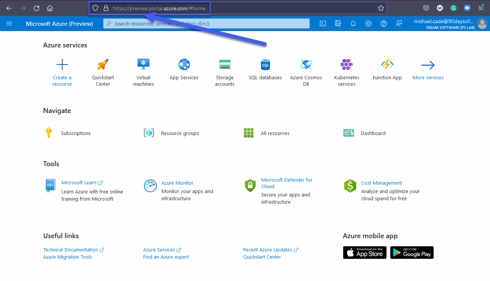

## Mô hình Mạng Microsoft Azure + Quản lý Azure

Hôm nay là ngày kỷ niệm của Microsoft Azure và Sinh nhật lần thứ 12 của nó! (Ngày 1 tháng 2 năm 2022) Dù sao đi nữa, chúng ta sẽ đề cập đến các mô hình kết nối mạng trong Microsoft Azure và một số tùy chọn quản lý dành cho Azure. Cho đến hiện tại, chúng ta mới chỉ sử dụng Azure portal nhưng chúng ta đã đề cập đến một số phần và phương pháp khác để tạo các tài nguyên trên nền tảng này.

## Mô hình mạng Azure

### Mạng ảo - Virtual Networks

- Mạng ảo (VNet) là một cấu trúc được tạo trong Azure.
- Một mạng ảo có một hoặc nhiều dải IP được gán cho nó.
- Mạng ảo tồn tại trong một subscription trong một region.
- Mạng con ảo (virtual subnets) được tạo trong mạng ảo để chia nhỏ phạm vi mạng.
- Máy ảo được đặt trong mạng con ảo.
- Tất cả các máy ảo trong một mạng ảo đều có thể giao tiếp với nhau.
- 65.536 IPs riêng trên mỗi Mạng ảo.
- Chỉ trả tiền cho lưu lượng đi ra từ một region. (Dữ liệu rời khỏi region)
- Hỗ trợ IPv4 & IPv6.
   - IPv6 dành cho public-facing và trong các mạng ảo.

Chúng ta có thể ví Mạng ảo Azure với AWS VPC. Tuy nhiên, có một số khác biệt cần lưu ý:

- Trong AWS, VNet mặc định được tạo, điều này không giống với Microsoft Azure, bạn phải tạo mạng ảo đầu tiên theo yêu cầu của mình.
- Tất cả các Virtual Machines mặc định trong Azure đều có NAT truy cập internet. Không có NAT Gateways như AWS.
- Trong Microsoft Azure không có khái niệm mạng con Private hay Public.
- IP công cộng là tài nguyên có thể được gán cho vNIC hoặc Bộ cân bằng tải.
- Mạng ảo và Mạng con có ACL riêng cho phép ủy quyền cấp mạng con.
- Mạng con trên các AZs trong khi ở AWS, bạn có các mạng con nằm trên một AZ.

Chúng ta cũng có Virtual Network Peering. Điều này cho phép các mạng ảo trên các tenants và regions được kết nối thông qua hạ tầng của Azure. Không có tính bắc cầu nhưng nhưng có thể được kích hoạt qua Azure Firewall trong hub virtual network. 

### Kiểm soát truy cập - Access Control

- Azure sử dụng Network Security Groups, đây là những nhóm có trạng thái.
- Kích hoạt các quy tắc được tạo và sau đó được gán cho một Network Security Group
- Network Security Groups được áp dụng cho mạng con hoặc máy ảo.
- Khi được áp dụng cho một mạng con, nó vẫn được thực thi tại NIC của máy ảo rằng nó không phải là thiết bị "Edge".

- Các quy tắc được kết hợp trong một Network Security Group.
- Dựa trên mức độ ưu tiên, có thể cấu hình linh hoạt.
- Số ưu tiên thấp hơn có nghĩa là ưu tiên cao.
- Hầu hết logic được xây dựng bởi Địa chỉ IP nhưng một số thẻ và nhãn cũng có thể được sử dụng.

| Description      | Priority | Source Address     | Source Port | Destination Address | Destination Port | Action |
| ---------------- | -------- | ------------------ | ----------- | ------------------- | ---------------- | ------ |
| Inbound 443      | 1005     | \*                 | \*          | \*                  | 443              | Allow  |
| ILB              | 1010     | Azure LoadBalancer | \*          | \*                  | 10000            | Allow  |
| Deny All Inbound | 4000     | \*                 | \*          | \*                  | \*               | DENY   |

Chúng ta cũng có Application Security Groups (ASGs)

- Trường hợp NSG tập trung vào dải địa chỉ IP có thể khó duy trì đối với môi trường đang phát triển.
- ASG cho phép xác định tên thật (Monikers) cho các vai trò ứng dụng khác nhau (Máy chủ web, máy chủ DB, WebApp1, v.v.)
- NIC của máy ảo được coi là thành viên của một hoặc nhiều ASG.

Sau đó, ASG có thể được sử dụng trong các quy tắc và là một phần của Network Security Groups để kiểm soát luồng giao tiếp và vẫn có thể sử dụng các tính năng của NSG như tags của dịch vụ.

| Action | Name               | Source     | Destination | Port         |
| ------ | ------------------ | ---------- | ----------- | ------------ |
| Allow  | AllowInternettoWeb | Internet   | WebServers  | 443(HTTPS)   |
| Allow  | AllowWebToApp      | WebServers | AppServers  | 443(HTTPS)   |
| Allow  | AllowAppToDB       | AppServers | DbServers   | 1443 (MSSQL) |
| Deny   | DenyAllinbound     | Any        | Any         | Any          |

### Cân bằng tải - Load Balancing

Microsoft Azure có hai giải pháp cân bằng tải riêng biệt. (giải phảp first party, có nhiều giải pháp của bên thứ ba trên Azure marketplace) Cả hai đều có thể hoạt động với các endpoints nội bộ hoặc công khai.

- Load Balancer (Layer 4) hỗ trợ phân phối và chuyển tiếp cổng dựa trên hàm băm.
- App Gateway (Layer 7) hỗ trợ các tính năng như giảm tải SSL, định tuyến dựa trên cookie và định tuyến nội dung dựa trên URL.

Ngoài ra với App Gateway, bạn có thể tùy chọn sử dụng Web Application firewall.

## Công cụ quản lý Azure - Azure Management Tools

Chúng ta đã dành phần lớn thời gian lý thuyết của mình để xem qua Azure portal, tôi khuyên bạn nên tuân theo văn hóa DevOps và thực hiện các các task, đặc biệt là xung quanh việc khởi tạo tài nguyên nên được thông qua API hoặc công cụ dòng lệnh (CLI). Tôi muốn đề cập đến một số công cụ quản lý có sẵn khác vì chúng ta cần biết điều này khi tự động hóa việc khởi tạo và quản lý môi trường Azure của mình.

### Azure Portal

The Microsoft Azure Portal is a web-based console, that provides an alternative to command-line tools. You can manage your subscriptions within the Azure Portal. Build, Manage, and Monitor everything from a simple web app to complex cloud deployments. Another thing you will find within the portal are these breadcrumbs, JSON as mentioned before is the underpinning of all Azure Resources, It might be that you start in the Portal to understand the features, services and functionality but then later understand the JSON underneath to incorporate into your automated workflows.

Microsoft Azure portal là một bảng điều khiển bằng web, cung cấp giải pháp thay thế cho các công cụ dòng lệnh. Bạn có thể quản lý subscriptions của mình trong Azure portal. Xây dựng, quản lý và giám sát mọi thứ từ một ứng dụng web đơn giản đến việc triển khai hệ thống phức tạp. Một thứ khác mà bạn sẽ tìm thấy trong portal là các breadcrumbs này, JSON như đã đề cập trước đây là nền tảng của tất cả tài nguyên trên Azure. Có thể bạn bắt đầu với portal để hiểu các tính năng, dịch vụ và chức năng nhưng sau đó nên hiểu các file JSON ở dưới đó để kết hợp vào quy trình làm việc tự động của bạn.

Ngoài ra còn có Azure Preview portal, nó có thể được sử dụng để xem và thử nghiệm các dịch vụ và cải tiến mới và sắp ra mắt.

### PowerShell

Before we get into Azure PowerShell it is worth introducing PowerShell first. PowerShell is a task automation and configuration management framework, a command-line shell and a scripting language. We might and dare I say this liken this to what we have covered in the Linux section around shell scripting. PowerShell was very much first found on Windows OS but it is now cross-platform.

Azure PowerShell is a set of cmdlets for managing Azure resources directly from the PowerShell command line.

We can see below that you can connect to your subscription using the PowerShell command `Connect-AzAccount`

Trước khi chúng ta bắt đầu với Azure PowerShell, chúng ta nên biết tới PowerShell. PowerShell là một framework quản lý cấu hình và tự động hóa tác vụ, một command-line shell và ngôn ngữ kịch bản. Nó giống với những gì chúng ta đã tìm hiểu trong phần shell scripting cho Linux. PowerShell lúc đầu được sử dụng rộng rãi trên hệ điều hành Windows nhưng giờ đây nó đã có trên nhiều nền tảng.

Azure PowerShell là một tập hợp các lệnh ghép ngắn để quản lý tài nguyên Azure trực tiếp từ dòng lệnh PowerShell.

Chúng ta có thể thấy bên dưới rằng bạn có thể kết nối với đăng ký của mình bằng lệnh PowerShell `Connect-AzAccount`

Sau đó, nếu muốn tìm một số lệnh cụ thể được liên kết với máy ảo Azure, chúng ta có thể chạy lệnh sau. Bạn có thể dành thời gian để học và tìm hiểu thêm về ngôn ngữ lập trình này.

Có một số hướng dẫn nhanh rất tốt từ Microsoft về việc bắt đầu và khởi tạo các dịch vụ từ Powershell [tại đây](https://docs.microsoft.com/en-us/powershell/azure/get-started-azureps?view=azps-7.1.0)

### Visual Studio Code

Giống như nhiều người, và như tất cả các bạn đã thấy, IDE của tôi là Visual Studio Code.

Visual Studio Code là trình chỉnh sửa mã nguồn miễn phí do Microsoft tạo cho Windows, Linux và macOS.

Bạn sẽ thấy bên dưới có rất nhiều tích hợp và công cụ được tích hợp trong Visual Studio Code mà bạn có thể sử dụng để tương tác với Microsoft Azure và các dịch vụ trong đó.

### Cloud Shell

Azure Cloud Shell là một shell tương tác, được xác thực, có thể truy cập bằng trình duyệt để quản lý tài nguyên Azure. Nó cung cấp sự linh hoạt khi lựa chọn shell phù hợp nhất với người dùng.

You can see from the below when we first launch Cloud Shell within the portal we can choose between Bash and PowerShell.
Bạn có thể thấy từ bên dưới khi khởi chạy Cloud Shell lần đầu tiên trong portal, chúng ta có thể chọn giữa Bash và PowerShell.

Để sử dụng cloud shell, bạn sẽ phải cung cấp một chút dung lượng lưu trữ trong subscription của mình.

Khi bạn chọn sử dụng cloud shell, nó sẽ khởi động một máy, những máy này là tạm thời nhưng các tệp của bạn vẫn được duy trì theo hai cách: thông qua disk image và mounted file share.

- Cloud Shell chạy trên máy chủ tạm thời được cung cấp trên theo mỗi phiên, mỗi người dùng
- Cloud Shell hết thời gian chờ sau 20 phút không có hoạt động tương tác
- Cloud Shell yêu cầu một Azure file share được gắn vào (mounted)
- Cloud Shell sử dụng cùng một Azure file share cho cả Bash và PowerShell
- Cloud Shell được cung cấp một máy cho mỗi tài khoản người dùng
- Cloud Shell vẫn duy trì $HOME bằng cách sử dụng hình ảnh 5 GB được giữ trong file share của bạn
- Quyền được đặt như một người dùng Linux thông thường trong Bash

Phần trên được sao chép từ [Tổng quan về Cloud Shell](https://docs.microsoft.com/en-us/azure/cloud-shell/overview)

### Azure CLI

Cuối cùng, tôi muốn đề cập đến Azure CLI, Azure CLI có thể được cài đặt trên Windows, Linux và macOS. Sau khi cài đặt, bạn có thể nhập `az` theo sau là các lệnh khác để tạo, cập nhật, xóa và xem tài nguyên trên Azure.

Khi mới bắt đầu học Azure, tôi hơi bối rối vì có Azure PowerShell và Azure CLI.

Tôi cũng thích có phản hồi từ cộng đồng về điều này. Nhưng theo cách tôi thấy thì Azure PowerShell là một module được thêm vào Windows PowerShell hoặc PowerShell Core (cũng có sẵn trên hệ điều hành khác nhưng không phải tất cả), trong khi Azure CLI là một chương trình dòng lệnh đa nền tảng kết nối với Azure và thực thi các lệnh đó .

Cả hai tùy chọn này đều có cú pháp khác nhau, mặc dù từ những gì tôi có thể thấy và những gì tôi đã làm chúng có thể thực hiện các nhiệm vụ rất giống nhau.

Ví dụ: tạo một máy ảo từ PowerShell sẽ sử dụng lệnh ghép ngắn `New-AzVM` trong khi Azure CLI sẽ sử dụng `az VM create`.

Trước đây, bạn có thể thấy rằng tôi đã cài đặt module Azure PowerShell trên hệ thống của mình nhưng sau đó tôi cũng đã cài đặt Azure CLI và nó có thể được gọi thông qua PowerShell trên máy Windows của mình.

Bài học rút ra ở đây như chúng ta đã đề cập là chọn công cụ phù hợp với bản thân. Azure chạy trên tự động hóa. Mọi hành động bạn thực hiện bên trong portal sẽ được dịch ở đâu đó thành dạnh mã và được thực thi để đọc, tạo, sửa đổi hoặc xóa tài nguyên.

Azure CLI

- Giao diện dòng lệnh đa nền tảng, có thể cài đặt trên Windows, macOS, Linux
- Chạy trong Windows PowerShell, Cmd, Bash và các shell Unix khác.

Azure PowerShell

- Module PowerShell đa nền tảng, chạy trên Windows, macOS, Linux
- Yêu cầu Windows PowerShell hoặc PowerShell

Nếu có lý do khiến bạn không thể sử dụng PowerShell trong môi trường của mình nhưng bạn có thể sử dụng bash thì Azure CLI sẽ là lựa chọn của bạn.

Tiếp theo, chúng ta sử dụng tất cả các lý thuyết đã được đề cập và tạo ra một số kịch bản và thực hành trên Azure.

## Tài liệu tham khảo

- [Hybrid Cloud and MultiCloud](https://www.youtube.com/watch?v=qkj5W98Xdvw)
- [Microsoft Azure Fundamentals](https://www.youtube.com/watch?v=NKEFWyqJ5XA&list=WL&index=130&t=12s)
- [Google Cloud Digital Leader Certification Course](https://www.youtube.com/watch?v=UGRDM86MBIQ&list=WL&index=131&t=10s)
- [AWS Basics for Beginners - Full Course](https://www.youtube.com/watch?v=ulprqHHWlng&t=5352s)

Hẹn gặp lại vào [ngày 34](day34.md)
