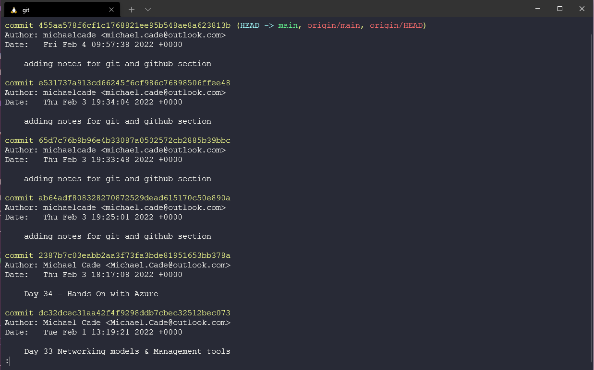
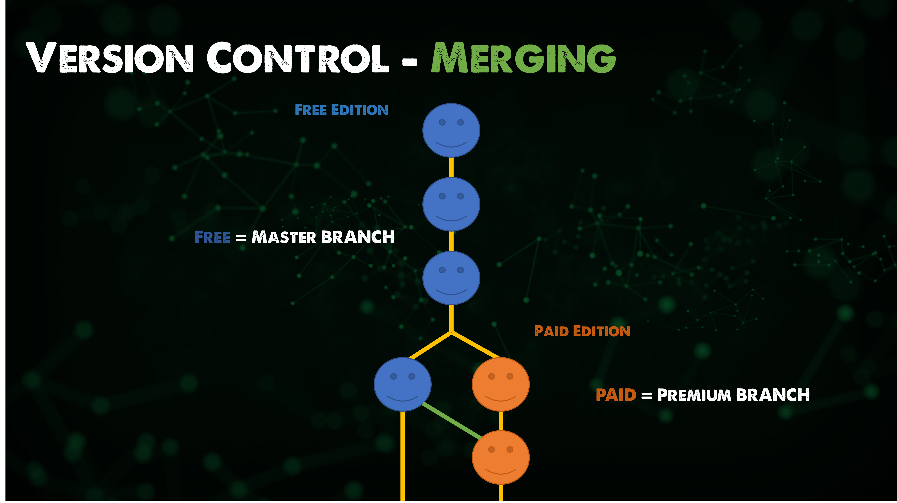
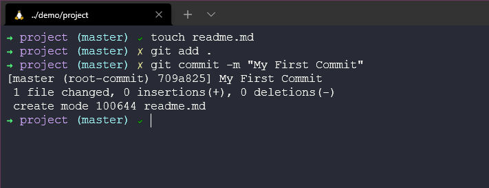
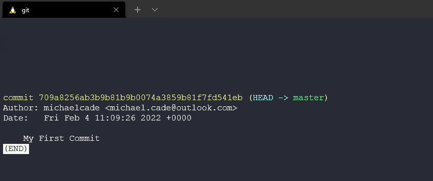
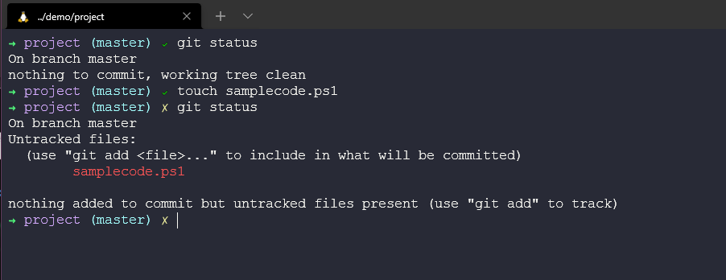
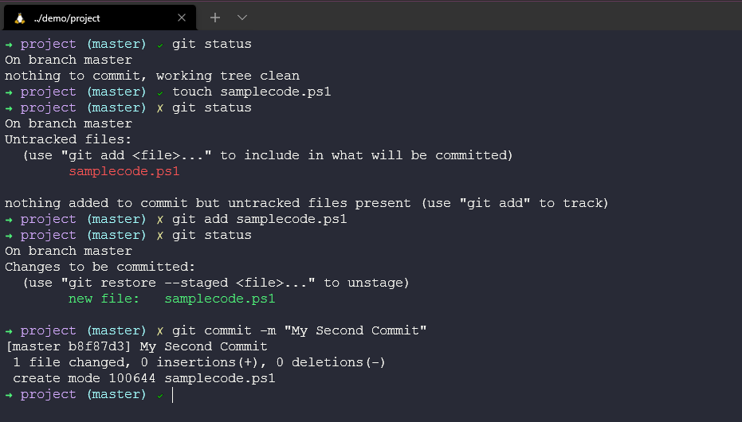
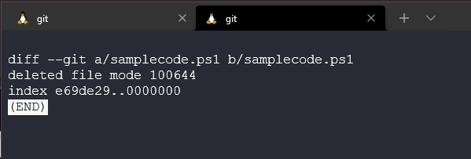
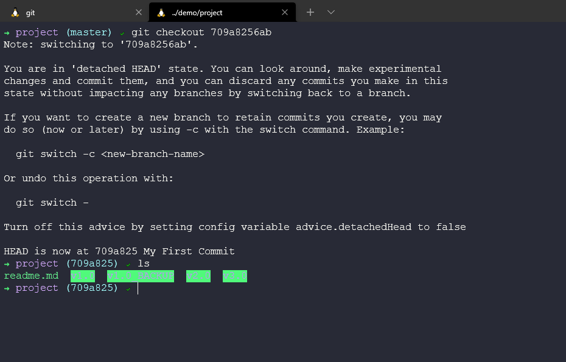

## Bức tranh toàn cảnh: Git - Quản lý phiên bản

Trước khi bắt đầu tìm hiểu về git, chúng ta cần hiểu quản lý phiên bản là gì và tại sao chúng ta cần làm vậy? Trong bài mở đầu về git này, chúng ta sẽ đi qua khái niệm quản lý phiên bản và kiếm thức cơ bản về git.

### Quản lý phiên bản là gì?

Git không phải là hệ thống quản lý phên bản duy nhất, vì vậy ở đây chúng ta sẽ đề cập đến những lựa chọn và phương pháp có sẵn cho việc quản lý phiên bản.

Lợi ích rõ ràng nhất và lớn nhất của quản lý phiên bản là khả năng theo dõi lịch sử của dự án. Chúng ta có thể xem lại kho lưu trữ (repository) bằng cách sử dụng `git log` và xem lại toàn bộ các commit cũng như comments cũng như những gì đã diễn ra trong toàn bộ dự án. Đừng lo, chúng ta sẽ đi vào cách lệnh ở phần sau. Bây giờ, hãy tưởng tượng đây là một dự án phần mềm thực tế với rất nhiều mã nguồn và có nhiều người đang làm việc chung để phát triển sản phẩn tại các thời điểm khác nhau, tất cả các kỹ sư đã đóng góp code, và tất cả những người review code đều được ghi lại ở đây để cho chúng ta biết điều gì đã xảy ra, khi nào, bởi ai và ai đã review.

Quản lý phiên bản trước đây sẽ giống như việc tạo một bản sao phiên bản code của bạn theo cách thủ công trước khi bạn thực hiện các thay đổi. CÓ thể bạn cũng không cần sử dụng những phiên bản cũ nữa nhưng nó được tạo ra để bạn có thể yên tâm hơn, nhỡ đâu...

Tôi đã bắt đầu áp dụng quản lý phiên bản không chỉ đối với mã nguồn mà hầu hết mọi thứ, ví dụ như dự án này (90DaysOfDevOps). Tại sao lại không sử dụng các tính năng như khôi phục, ghi lại mọi thứ đã diễn ra.

Tuy nhiên, để tránh hiểu lầm **Quản lý phiên bản không hoạt động như một bản sao lưu**

Một lợi ích khác của quản lý phiên bản là khả năng quản lý nhiều phiên bản của một dự án. Lấy ví dụ như chúng ta có một ứng dụng miễn phí và sau đó là ứng dụng trả phí có sẵn trên tất cả các hệ điều hành. Phần lớn mã được chia sẽ giữa hai ứng dụng. Chúng ta có thể sao chép và dán mã của mình cho từng commit vào từng ứng dụng, nhưng điều đó sẽ rất lộn xộn, đặc biệt là khi bạn mở rộng quy mô phát triển với nhiều nhân sự, cũng sẽ rất dễ mắc lỗi.

Ứng dụng trả phí là nơi chúng ta có các chứ năng bổ sung, hãy gọi chúng là các commit trả phí, bản miễn phí sẽ chỉ chứa các commit bình thường. 

Cách chúng ta có thể làm được điều này trong quản lý phiên bản là thông qua phân nhánh (branching)

Phân nhánh cho phép hai luồng mã cùng tồn tại cho một ứng dụng như chúng ta đã nói ở trên. Nhưng chúng ta vẫn muốn các tính năm mới có trong phiên bản miễn phí có trong phiên bản trả phí, để làm được điều này, chúng ta có một thứ gọi là merge.

Bây giờ, điều này có vẻ dễ dàng nhưng việc merge có thể phức tạp vì bạn có thể có một nhóm làm việc trên phiên bản miễn phí và một nhóm khác làm việc với phiên bản trả phí và điều gì sẽ xảy ra nếu cả hai cùng thay đổi đến cấu trúc tổng thể của mã. CÓ thể một biến được cập nhật và làm hỏng phần nào đó. Sau đó, bạn có các conflict làm một chức năng không chạy được. Quản lý phiên bản không thể khắc phục được các conflict do bạn tạo ra. Nhưng quản lý phiên bản cho phép điều này được quản lý một cách dễ dàng.

Nói chung, lý do chính nếu bạn chưa sử dụng quản lý phiên bản cho tới thởi điểm này có thể là bạn chưa cộng tác bao giờ. Sẽ có ngày càng nhiều trường hợp mà chúng ta cần tới khả năng chia sẽ mã giữa các nhà phát triển. Có thể là một bài trình bày chung mà bạn đang làm việc với đồng nghiệp hoặc thử thách 90DaysOfDevOps, nơi bạn có cộng đồng và các chỉnh sửa, cập nhật sẽ được cộng đồng đóng góp trong suốt dự án.

Nếu không có quản lý phiên bản, làm thể nào các nhóm phát triển phần mềm có thể giải quyết vấn đề này? Tôi thấy thật khó khăn khi để theo dõi tất cả mọi thứ khi tôi đang thực hiện các dự án của mình. Tôi hi vọng họ sẽ chia nhỏ mã theo từng module chức năng một, có thể sẽ là từng miếng ghép nhỏ cho một bức tranh lớn để giải quyết các vấn đề trước khi tất cả được release.

Với quản lý phiên bản, chúng ta có một nguồn sự thật duy nhất (single source of truth). Chúng ta có thể làm việc trên các module khác nhau nhưng nó cho phép chúng ta cộng tác tốt hơn.

Một việc khác cần đề cập tới là không chỉ các nhà phát triển có thể hưởng lợi từ quản lý phiên bản, tất cả các thành viên và các công cụ có thể nhìn rõ dự án và tận dụng, các công cụ quản lý dự án có thể được liên kết và theo dõi tiến độ công việc. Chúng ta cũng có thể có một máy build, chẳng hạn như là một Jenkins server mà chúng ta sẽ nói trong phần sau. Một công cụ xây dựng mà nguồn và đóng gói hệ thống, tự động hoá quá trình kiểm thử và các metrics liên quan tới mã nguồn.

### Git là gì?

Git là một công cụ theo dõi các thay đổi đối với mã nguồn hoặc bất kỳ tệp nào hoặc cũng có thể nói Git là một hệt thống quản lý phiên bản phân tán mã nguồn mở.

Có nhiều cách à git có thể được sử dụng trên các hệ thống của chúng ta, phổ biến nhất hoặc ít nhất là đối với tôi, tôi đã sử dụng dòng lệnh (command line), nhưng chúng ta cũng có các công cụ và giao diện người dùng đồng hoạ như Visual Studio Code, các công cụ này có các chức năng của git mà chúng ta có thể tận dụng.

Bây giờ chúng ta sẽ xem qua một cách tổng quát trước khi cài đặt git trên máy của mình.

Hãy sử dụng thư mục mà chúng ta đã tạo trước đó.

Để sử dụng thư mục này với quản lý phiên bản, trước tiên chúng ta cần khởi tạo thư mục nào bằng lệnh `git init`. Hiện tại, chỉ cần nghĩ rằng lệnh này đặt thư mục của chúng ta làm kho lưu trữ trong cơ sở dữ liệu ở đâu đó trên máy tính của chúng ta.

Bây giờ chúng ta có thể tạo một số tệp và thư mục cho mã nguồn hoặc cũng có thể đã có sẵn từ trước đó. Sử dụng lệnh `git add .` sẽ đặt tất cả cá tệp và thư mục trong thư mục của chúng ta vào một chiếc hộp nhưng chúng ta chưa commit bất cứ thứ gì vào cơ sở dữ liệu đó. Thao tác này chỉ có nghĩ là tất cả các tệp có `.` đã sẵn sàng để được thêm vào.

Sau đó, chúng ta có thể muốn tiếp tục và commit các tệp của mình, việc này có thể thực hiện bằng lệnh `git commit -m "My First Commit"`. Chúng ta có thể đưa ra lý do cho commit của mình, điều này được khuyến khích để chúng ta có thể biết điều gì xảy ra trong mỗi commit.

Bây giờ chúng ta có thể thấy những gì xảy ra trong lịch sử của dự án. Sử dụng lệnh `git log`

Nếu chugns ta tạo một tệp bổ sung có tên là `samplecode.ps1`, thì trạng thái sẽ bị thay đổi. Chúng ta cũng có thể kiểm tra trạng thái của kho lưu trữ của mình bằng cách sử dụng `git status`, lệnh này cho chúng ta thấy không có gì để commit và chúng ta có thể thêm một tệp mới có thên samplecode.ps1. Sau đó, nếu chạy lại lệnh `git status` một lần nữa bạn sẽ thấy file mà chúng ta có thể commit.

Thêm tệp mới của chúng ta bằng lệnh `git add samplecode.ps1` và sau đó chạy lại lệnh `git status` một lần nữa và thấy tệp này đã được sẵn sàng để commit.

Sau đó dùng lệnh `git commit -m "My Second Commit"`.

`git status` bây giờ cũng thể hiện rằng chúng ta đã dọn dẹp mọi thứ.

Sau đó, chúng ta có thể sử dụng lệnh `git log` để hiện thị các commit mới nhất và commit đầu tiên.

Nếu chúng ta muốn xem các thay đổi giữa các lần commit của mình, tức là những tệp nào đã được thêm hoặc sửa đổi, chúng ta có thể sử dụng `git diff b8f8 709a`

Nó sẽ hiển thị những gì đã thay đổi, trong trường hợp của chúng ta, một tệp mới đã được thêm vào.

Chúng ta sẽ đi sâu hơn vào vấn đề này sau nhưng chúng ta có thể nhảy giữa các commit của mình, đại loại là chúng ta có thể du hành thời gian! Bằng cách sử dụng hash của commit, có thể sử dụng lệnh `git checkout 709a` để nhảy ngược thời gian mà không làm mất tệp mới của chúng ta.

Nhưng sau đó, chúng ta cũng sẽ muốn tiếp tục và có thể thực hiện điều này theo cách tương tự với hash của commit hoặc bạn có thể thấy như ở đây chúng ta sử dụng `git switch -` câu lệnh hoàn tác thao tác trước đó.

TLDR:

- Theo dõi lịch sử của một dự án
- Quản lý nhiều phiên bản khác nhau của một dự án
- Chia sẽ mã giữa các kỹ sư phát triển và mở rộng phạm vi các nhóm và công cụ sử dụng
- Phối hợp làm việc giữa các nhóm
- Ồ, và có thể du hành thời gian!

Điều này giống như một bước nhảy mới nhưng hy vọng rằng bạn có thể thấy bức tranh toàn cảnh đằng sau quản lý phiên bản mà không thực sự biết các câu lệnh cụ thể và sức mạnh của chúng.

Tiếp theo, chugsn ta sẽ cài đặt và thiết lập git trên máy cục bộ của bạn, đồng thời tìm hiểu sâu hơn một chút về một số trường hợp sử dụng và các câu lệnh trong Git.

## Tài liệu tham khảo

- [What is Version Control?](https://www.youtube.com/watch?v=Yc8sCSeMhi4)
- [Types of Version Control System](https://www.youtube.com/watch?v=kr62e_n6QuQ)
- [Git Tutorial for Beginners](https://www.youtube.com/watch?v=8JJ101D3knE&t=52s)
- [Git for Professionals Tutorial](https://www.youtube.com/watch?v=Uszj_k0DGsg)
- [Git and GitHub for Beginners - Crash Course](https://www.youtube.com/watch?v=RGOj5yH7evk&t=8s)
- [Complete Git and GitHub Tutorial](https://www.youtube.com/watch?v=apGV9Kg7ics)

Hẹn gặp lại vào [ngày 36](day36.md)
