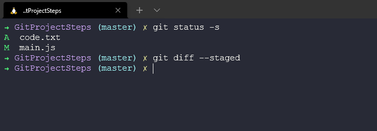
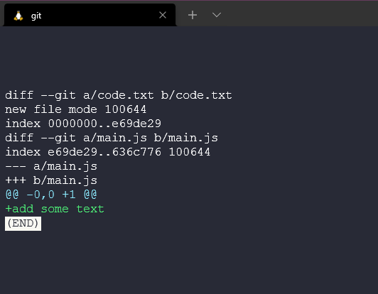
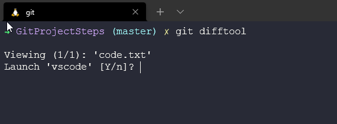
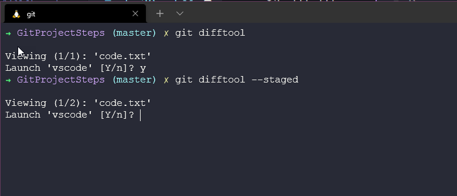
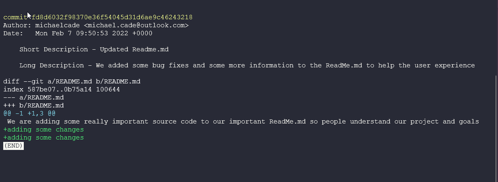
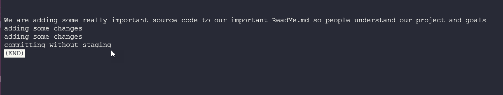
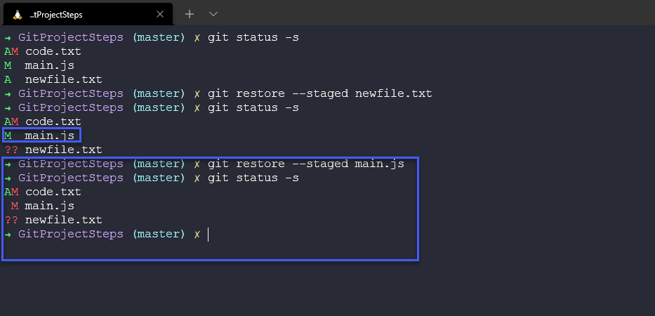

## Xem, unstaging, loại bỏ & khôi phục

Tiếp tục với ngày hôm qua sau khi đã thực hành một số lệnh của git và thực hành với dự án mới của bạn. Hãy nhớ rằng, chúng ta chưa nhắc tới GitHub hoặc bất kỳ dịch vụ nào dựa trên git. Tất cả những điều được nhắc tới cho đến bây giờ giúp bản kiểm soát cục bộ các dự án của mình tại thời điển này nhưng chúng sẽ trở nên hữu ích khi bạn tích hợp với các công cụ được nhắc đến ở trên.

### Xem các thay đổi được staged và chưa được staged

Bạn nên xem các đoạn mã đã đước staged và chưa được staged trước khi commit. Chúng ta có thể làm điều này với lệnh `git diff --staged`



Điều này sau đó cho chúng ta thấyt tất cả những thay đổi chúng ta đã thực hiện và tất cả các tệp mới mà chúng ta đã thêm hoặc xoá.

Các thay đổi trong các tệp được biểu thị bằng `---` hoặc `+++` bạn có thể thấy như dưới dây, chúng ta vừa thêm dòng mới "+add some text".



Chúng ta cũng có thể chạy `git diff` để so sánh khu vực staging với thư mục làm việc của chúng ta. Nếu như thực hiện một số thay đổi với tệp code.txt mới được thêm vào và thêm một số dòng.


Nếu sau đó chúng ta chạy lệnh `git diff`, chúng ta sẽ so sánh và có kết quả như dưới đây.


### Công cụ Diff trực quan

Đối với tôi, những hiển thị ở trên rất khó hiểu nên tôi muốn sử dụng một công cụ trực quan hơn, dưới đây là một vài công cụ trực quan để xem được diff:

- KDiff3
- P4Merge
- WinMerge (chỉ cho Windows)
- VSCode

Để thiết lập điều này với git, bạn chạy lệnh sau `git config --global diff.tool vscode`

Chúng ta sẽ chạy phần trên và sẽ đặt một số tham số khi khởi chạy VScode.


Chúng ta cũng có thể kiểm tra cấu hình của mình với `git config --global -e`


Sau đó, chúng ta có thể sử dụng `git difftool` để mở công cụ trực quan.



Sau đó, mở trang diff trên VSCode và so sánh 2 trang, chúng ta chỉ sửa đổi một tệp từ không có gì thành thêm một dòng mã như ở màn hình bên phải. 


Tôi thấy phương pháp này dễ dàng hơn nhiều để theo dõi các thay đổi và đây là phương pháp tương tự như những gì chúng ta sẽ thấy khi sử dụng các dịch vụ dựa trên git như GitHub.

Chúng ta cũng có thể sử dụng `git difftool --staged` để so sánh stage với các tệp đã được commit.



Sau đó, chúng ta có thể duyệt qua các tệp đã thay đổi của mình trước khi commit.


Tôi đang sử dụng VSCode làm IDE của mình và giống như hầu hết các IDE khác, chúng có chức năng này được tích hợp sẵn, rất hiếm khi bạn cần chạy các lệnh này từ terminal, mặc dù nó rất hữu ích nếu bạn không có sẵn IDE bởi một lý do nào đó.

### Xem lại lịch sử

Trước đây chúng ta đã đề cập đến `git log` sẽ cung cấp một cái nhìn toàn diện về tất cả các commit mà chúng ta đã thực hiện trong kho lưu trữ của mình.


Mỗi commit có chuỗi thập lục phân, duy nhất cho kho lưu trữ. Tại đây, bạn có thể xem chúng ta đang làm việc trên nhánh nào và sau đó là tác giả, ngày tháng và nội dung commit.

Chúng ta cũng có `git log --oneline` và điều này mang lại một phiên bản ngắn gọn hơn nhiều của chuỗi thập lục phân mà chúng ta có thể sử dụng trong các lệnh `diff`. Chúng ta cũng chỉ có một dòng mô tả cho các commit.


Chúng ta có thể đảo ngược điều này và bắt đầu với commit hận đầu tiên bằng cách chạy `git log --oneline --reverse`, chúng ta thấy commit đầu tiên của mình ở đầu trang.


### Xem một commit 

Việc có thể xem nội dung commit là một điều tuyệt vời nếu bạn có ý thức tuân theo các best practices và có những nội dung commit có ý nghĩa. Tuy nhiên, cũng có lệnh `git show` cho phép chúng ta kiểm tra và xem một commit.

Chúng ta có thể sử dụng `git log --oneline --reverse` để lấy danh sách các commit của mình rồi lấy chúng và chạy `git show <commit ID>`


Đầu ra của lệnh đó sẽ giống như bên dưới với chi tiết về commit, tác giả và những gì đã thay đổi.



Chúng ta cũng có thể sử dụng `git show HEAD~1` trong đó 1 là số bước quay lại từ phiên bản hiện tại.

Điều này rất hữu ích nếu bạn muốn biết một số chi tiết về tệp của mình, nhưng nếu chúng ta muốn liệt kê tất cả các tệp trong một cây cho toàn bộ snapshot của thư mục. Chúng ta có thể sử dụng lệnh `git ls-tree HEAD~1`, một lần nữa quay lại một snapshot từ commit cuối cùng. Chúng ta có thể thấy có hai blobs, những blobs này biểu thị các tệp trong khi cây biểu thị một thư mục. Bạn cũng có thể thấy các commit và tags.


Sau đó, chúng ta có thể sử dụng phần trên để đi sâu vào và xem nội dung của tệp (blobs) bằng cách sử dụng lệnh `git show`.


Sau đó, nội dung của phiên bản cụ thể của tệp sẽ được hiển thị.



### Unstage tệp

Sẽ có lúc bạn có thể đã sử dụng `git add .` nhưng có những tệp bạn chưa muốn commit với snapshot đó. Trong ví dụ dưới đây, tôi đã thêm newfile.txt vào khu vực staging của mình nhưng tôi chưa sẵn sàng commit tệp này nên tôi sẽ sử dụng `git restore --staged newfile.txt` để hoàn tác bước `git add`.


Chúng ta cũng có thể thực hiện tương tự với các tệp đã sửa đổi, chẳng hạn như main.js và hủy thực hiện commit, như ở trên chúng ta có chữ M màu xanh lá cây để sửa đổi và sau đó bên dưới chúng ta sẽ hủy thực hiện những thay đổi đó.



Tôi nhận thấy lệnh này khá hữu ích với 90DaysOfDevOps vì đôi khi tôi chuẩn bị cho nhiều ngày trước và cảm thấy muốn ghi chú lại nhưng tôi không muốn commit và đẩy lên kho lưu trữ GitHub công khai.

### Loại bỏ các thay đổi cục bộ

Đôi khi chúng ta có thể thực hiện các thay đổi nhưng chúng ta không hài lòng với những thay đổi đó và muốn loại bỏ chúng. Chúng ta sẽ sử dụng lại lệnh `git restore` và chúng ta sẽ có thể khôi phục các tệp từ snapshot hoặc các phiên bản trước đó. Chúng ta có thể chạy `git restore .` đối với thư mục của mình và nó sẽ khôi phục mọi thứ từ snapshot của mình, lưu ý rằng tệp chưa được theo dõi của chúng ta vẫn còn. Không có tệp có tên là newfile.txt được theo dõi trước đó.


Bây giờ để xóa newfile.txt hoặc bất kỳ tệp nào chưa được theo dõi. Chúng ta có thể sử dụng `git clean`.


Hoặc nếu chugns ta biết hậu quả, có thể muốn chạy `git clean -fd` để buộc và xóa tất cả các thư mục.


### Khôi phục tệp về một phiên bản cũ 

Như chúng ta đã đề cập trong suốt phần lớn những gì Git có thể giúp là khôi phục các bản sao tệp của bạn từ các snapshot (đây không phải là bản sao lưu nhưng nó là một điểm khôi phục nhanh) Lời khuyên của tôi là bạn cũng nên lưu các bản sao mã của bạn ở các vị trí khác bằng giải pháp dự phòng cho việc này.

Ví dụ: hãy xóa tệp quan trọng nhất trong thư mục của chúng ta, lưu ý rằng chúng ta đang sử dụng các lệnh dựa trên Unix để xóa tệp này khỏi thư mục, không phải lệnh git.


Bây giờ, không còn readme.md trong thư mục làm việc của chúng ta. Chúng ta có thể đã sử dụng `git rm readme.md` và nó sẽ được phản ánh trong cơ sở dữ liệu git. Chúng ta cũng hãy xóa nó khỏi đây để mô phỏng việc nó bị xóa hoàn toàn.


Let's now commit this with a message and prove that we no longer have anything in our working directory or staging area.

Bây giờ chúng ta hãy commit điều này và chứng minh rằng chúng ta không còn bất kỳ thứ gì trong thư mục làm việc hoặc khu vực tổ chức của mình.


Chúng ta đã sai lầm và giờ cần tệp đó trở lại!

Chúng ta có thể sử dụng lệnh `git undo` để hoàn tác commit cuối cùng, nhưng nếu đó diễn ra trước đó thì sao? Chúng ta có thể sử dụng lệnh `git log` để tìm các commit của mình và sau đó thấy rằng tệp nằm trong commit cuối cùng nhưng chúng ta không hoàn tác toàn bộ commit đó, vì vậy có thể sử dụng lệnh `git restore --source =HEAD~1 README.md` để tìm cụ thể tệp và khôi phục tệp từ snapshot của chúng ta.

Bạn có thể thấy bằng cách sử dụng quy trình này, giờ đây chúng ta có tệp trở lại trong thư mục làm việc.


We now have a new untracked file and we can use our commands previously mentioned to track, stage and commit our files and changes.
Bây giờ chúng ta có một tệp chưa được theo dõi mới và có thể sử dụng các lệnh đã đề cập trước đó để theo dõi, stage và commit các tệp và thay đổi của chúng ta.

### Rebase vs Merge

Đây dường như là vấn đề đau đầu nhất khi nói đến Git và khi nào nên sử dụng rebase hoặc merge trên kho git của bạn.

Điều đầu tiên cần biết là cả `git rebase` và `git merge` đều giải quyết cùng một vấn đề. Cả hai đều để tích hợp các thay đổi từ nhánh này sang nhánh khác. Tuy nhiên, chúng làm điều này theo những cách khác nhau.

Hãy bắt đầu với một tính năng mới trong một nhánh mới. Nhánh chính tiếp tục với các commit mới.


Lựa chọn dễ dàng ở đây là sử dụng `git merge feature main` sẽ hợp nhất nhánh main vào nhánh feature.


Merge rất dễ dàng vì nó không có tính phá hủy. Các nhánh hiện tại không bị thay đổi theo bất kỳ cách nào. Tuy nhiên, điều này cũng có nghĩa là nhánh tính năng sẽ có một merge commit không liên quan mỗi khi bạn cần kết hợp các thay đổi với upstream. Nếu main được commit liên tục và nhiều, điều này sẽ hoặc có thể làm bẩn lịch sử commit của nhánh feature.

Là một tùy chọn thay thế, chúng ta có thể đặt lại nhánh feature lên nhánh main bằng cách sử dụng
```
git checkout feature
git rebase main
```

Điều này chuyển nhánh feature (toàn bộ nhánh feature) kết hợp hiện quả với tất cả các commit mới trong nhánh main. Tuy nhiên, thay vì sử dụng một merge commit, việc rebase sẽ viết lại lịch sử commit bằng cách tạo các commit hoàn toàn mới cho mỗi commit trong nhánh ban đầu.


Lợi ích lớn nhất của việc rebase là lịch sử dự án rõ ràng hơn nhiều. Nó cũng loại bỏ các merge commit không cần thiết. Và khi bạn so sánh hai hình ảnh cuối cùng, bạn có thể theo dõi lịch sử dự án tuyến tính rõ ràng hơn nhiều.

Mặc dù đó vẫn không phải là một kết luận có thể bỏ qua, nhưng việc chọn lịch sử sạch hơn cũng đi kèm với sự đánh đổi. Nếu bạn không tuân theo [Quy tắc vàng của rebase](https://www.atlassian.com/git/tutorials/merging-vs-rebasing#the-golden-rule-of-rebasing) việc viết lại lịch sử dự án có thể là thảm họa đối với quy trình cộng tác của bạn. Và ít quan trọng hơn, việc rebase lại làm mất context được cung cấp bởi một merge commit — bạn không thể biết khi nào các thay đổi upstream được tích hợp vào feature.

## Tài liệu tham khảo

- [What is Version Control?](https://www.youtube.com/watch?v=Yc8sCSeMhi4)
- [Types of Version Control System](https://www.youtube.com/watch?v=kr62e_n6QuQ)
- [Git Tutorial for Beginners](https://www.youtube.com/watch?v=8JJ101D3knE&t=52s)
- [Git for Professionals Tutorial](https://www.youtube.com/watch?v=Uszj_k0DGsg)
- [Git and GitHub for Beginners - Crash Course](https://www.youtube.com/watch?v=RGOj5yH7evk&t=8s)
- [Complete Git and GitHub Tutorial](https://www.youtube.com/watch?v=apGV9Kg7ics)
- [Git cheatsheet](https://www.atlassian.com/git/tutorials/atlassian-git-cheatsheet)
- [Exploring the Git command line – A getting started guide](https://veducate.co.uk/exploring-the-git-command-line/)

Hẹn gặp lại vào [ngày 40](day40.md)
