## Quy trình làm việc với mã nguồn mở

Hi vọng rằng qua 7 bài viết vừa rồi với Git, chúng ta đã hiểu rõ hơn về git là gì và sau đó là cách một dịch vụ sử dụng git như Github tích hợp với git để cung cấp kho lưu trữ mã nguồn và cũng là cách cộng đồng có thể cộng tác trên mã và các dự án khác nhau. 

Khi chúng ta xem xét các kiến thức cơ bản về GitHub, chúng ta đã trải qua quá trình fork một dự án bất kỳ và thực hiện thay đổi đó với kho lưu trữ cục bộ của chúng ta. Bây giờ, chúng ta sẽ tiến thêm một bước và thực hiện đóng góp cho một dự án mã nguồn mở. Hãy nhớ rằng việc đóng góp không nhất thiết phải là các bản sửa lỗi hoặc các tính năng cần viết mã, nó cũng có thể là tài liệu, sửa lỗi chính tả. Tất cả thứ dù là nhỏ nhất đều hữu ích và nó cũng cho phép bạn thực hành với một số chức năng git mà chúng ta đã đề cập trong những ngày qua.

## Fork một project

Điều đầu tiên chúng ta phải làm là tìm một dự án mà chúng ta có thể đóng góp. Gần đây, tôi đã thuyết trình về dự án [Kanister Project](https://github.com/kanisterio/kanister) và tôi muốn chia sẻ các bài thuyết trình của mình đã được đăng tải trên Youtube tới tệp Readme.md trong project đó. 

Trước hết, chúng ta cần fork project đó. Hãy cùng thử quy trình đó. Tôi sẽ tới liên kết đã ở trên và fork kho lưu trữ của project.

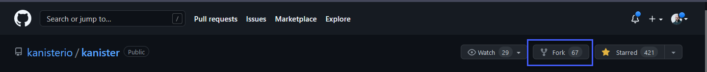

Bây giờ, chúng ta đã có bản sao của toàn bộ kho lưu trữ.

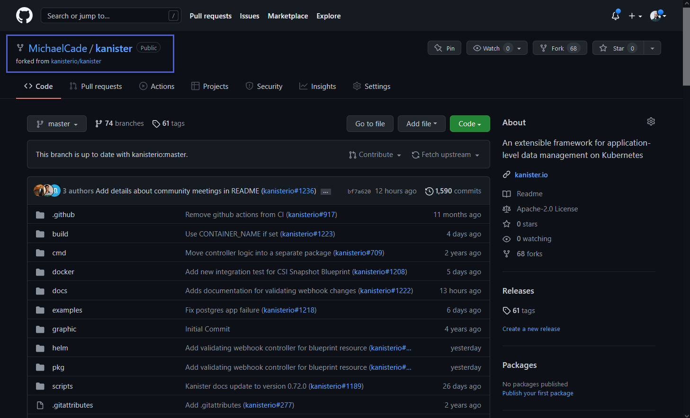

Để tham khảo trên tệp Readme.md, các bài trình bài ban đầu được liệt kê chỉ gồm 2 bài này, vì vậy chúng ta sẽ sửa với quy trình của chúng ta.

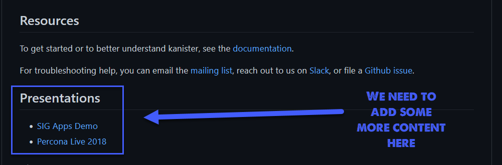

## Clone vào máy cục bộ

Sau khi có bản fork của kho lưu trữ, chúng ta có thể mang nó xuống máy cục bộ của mình và bắt đầu thực hiện chỉnh sửa của mình đối với các tệp. Sử dụng nút `code` trong repo của chúng ta để có thể lấy URL của kho lưu trữ rồi sử dụng lệnh `git clone <url>` trong thư mục mà chúng ta muốn đặt kho lưu trữ.

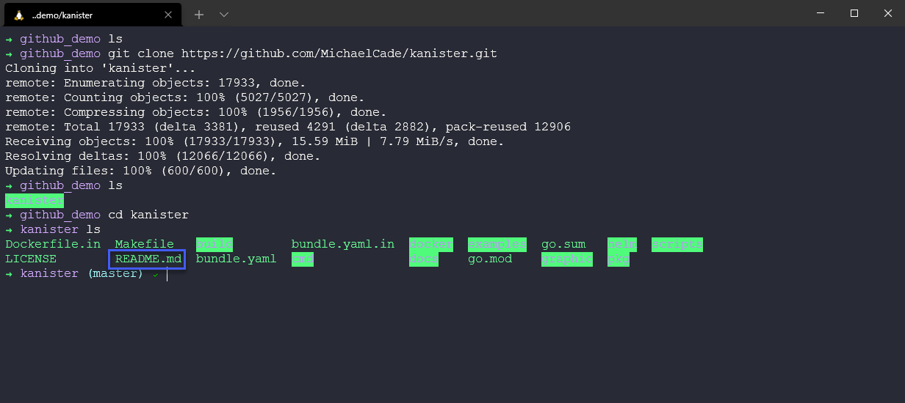

## Thực hiện các thay đổi

Sau khi có project ở máy của mình, chúng ta có thể mở VSCode hoặc IDE, text editor tuỳ chọn của mình để thực hiện thay đổi của mình.

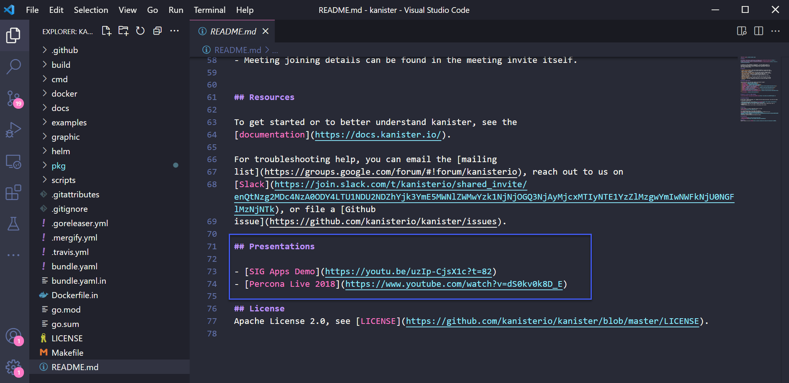

Tệp Readme.md được viết dưới cú pháp markdown và vì chúng ta đang chỉnh sửa một project của người khác nên sẽ thêm nội dung của mình với format của dự án hiện tại.

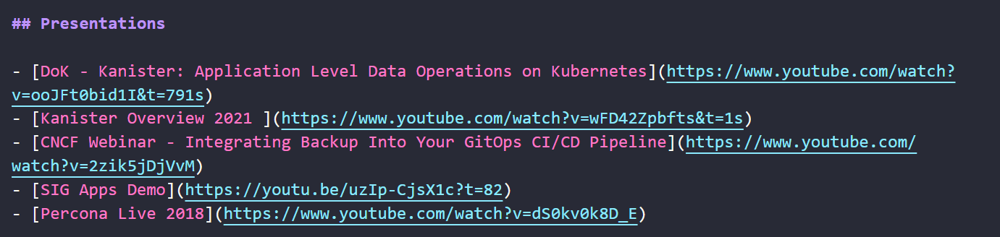

## Kiểm tra thay đổi của bạn

Chúng ta phải kiểm tra các thay đổi của mình theo cách tốt nhất, điều này rất hợp lý nếu đây là thay đổi mã nguồn đối với một ứng dụng mà bạn muốn đảm bảo rằng ứng dụng vẫn hoạt động sau khi thay đổi được thêm vào, chúng ta cũng phải đảm bảo rằng tài liệu được định dạnh và trông một cách chuẩn xác.

Với VSCode, chúng ta có thể thêm nhiều plugin, một trong số đá là khả năng xem trước các trang markdown.

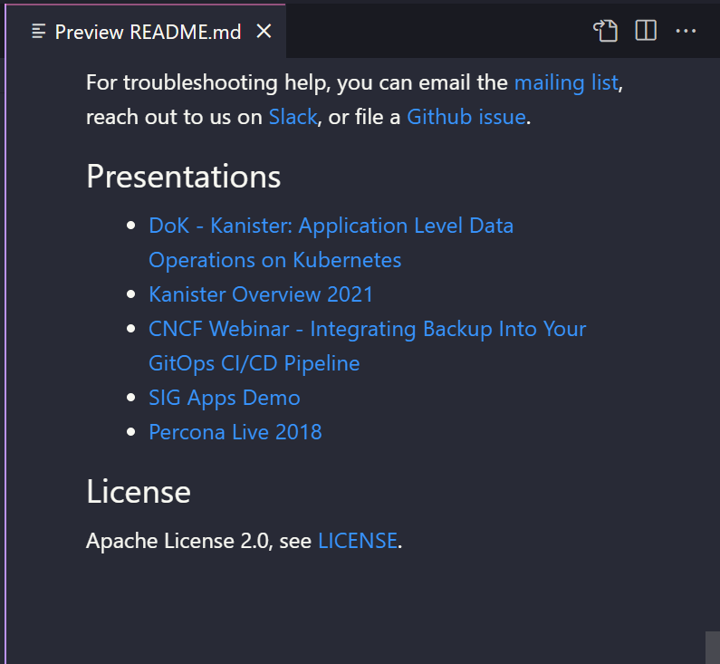

## Push các thay đổi trở lại kho lưu trữ của chúng ta

Chúng ta không có quyền để đẩy trực tiếp các thay đổi trở lại kho lưu trữ của Kanister, vì vậy chúng ta phải đi theo con đường này. Bây giờ sau khi chúng ta hài lòng với những thay đổi cùa mình, chúng ta có thể chạy quả một số lệnh phổ biến của git.

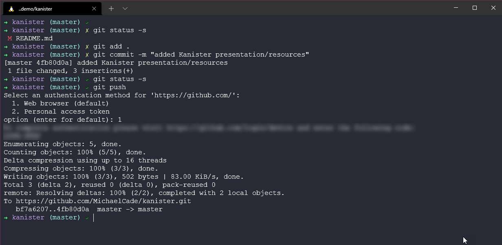

Bây giờ, chúng ta quay trở lại Github để kiểm tra các thay đổi một lần nữa và sau đó đóng góp cho dự án chính.

Trong có vẻ ổn.

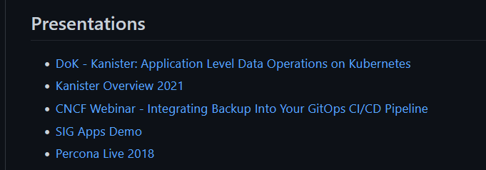

Bây giờ chúng ta có thể quay trở lại kho lưu trữ được forked của Kanistẻ và thấy rằng mình đang ở trước một commit so với nhánh kanisterio:master.

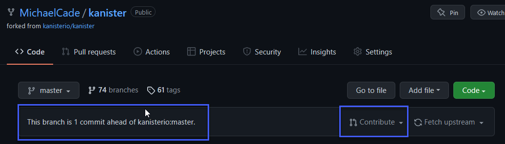

Tiếp theo, chúng ta nhấn nút `contribute` được đánh dấu ở trên. Chúng ta thấy có lựa chọn "Open Pull Request".

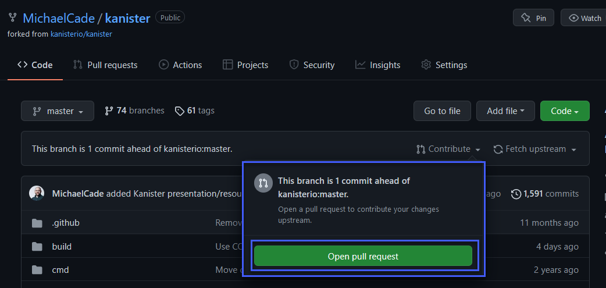

## Mở một pull request

Có khá nhiều thứ trong hình ảnh sau đây, trên cùng bên trái, bạn có thấy chúng ta đang ở kho lưu trữ gốc hoặc kho lưu trữ chính. Một nút tạo Pull request mà chúng ta sẽ nhắc tới sau đây. Chúng ta có một commit duy nhất nhưng nếu chúng ta sửa nhiều hơn thì có thể thấy được nhiều commits hơn ở đây. Sau đó là thay đổi trong tệp Readme.md của mà chúng ta đã thêm vào.

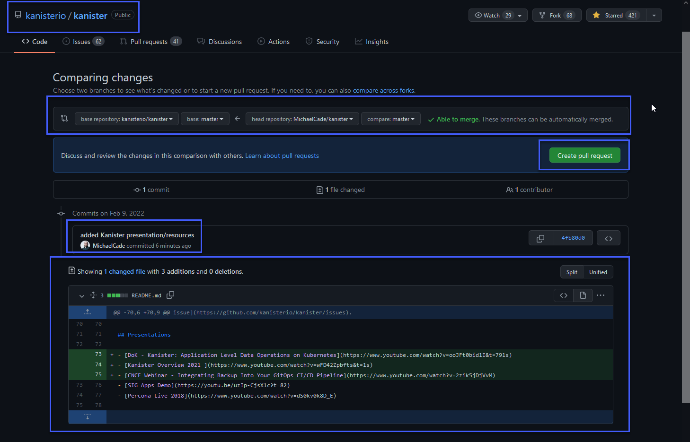

Sau khi xem xét các thay đổi ở trên và sẵn sàng tạo pull request, chúng ta có thể click nút màu xanh lá cây.

Sau đó, tuỳ thuộc vào cách người bảo trì dự án thiết lập chứng năng Pull Request trong kho lưu trữ của họ, bạn có thể cần hoặc không cung cấp những thông tin về Pull request theo một template mà người bảo trì đã chuẩn bị.

Đây là nơi bạn muốn mô tả về những gì bạn đã làm, rõ ràng và ngắn gọn nhưng đầy đủ chi tiết. Bạn có thể thấy tôi đã thực hiện một tổng quan về thay đổi đơn giản và tôi đã đánh dấu vào các đầu mục.

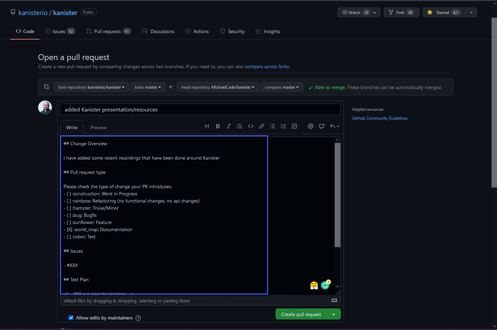

## Tạo một pull request

Bây giờ chúng ta đã sẵn sàng tạo một pull request. Sau khi nhấn "Create Pull Request" ở đầu trang, bạn sẽ nhận được bản tóm tắt về pull request của mình.

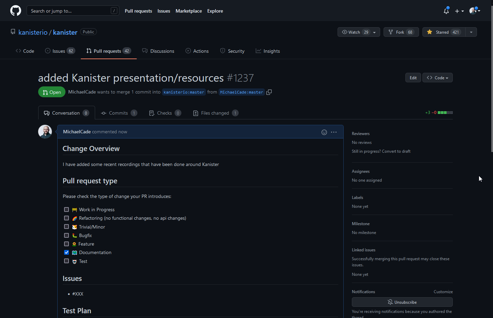

Kéo xuống dưới, bạn có thể thấy một số quá trình tự động hoá đang diễn ra, trong trường hợp này, chúng ta yêu cầu một review cho pull request của mình. Chúng ta có thể thấy Travis CI đang được tiên shanfh và quá trình build đã được bắt đầu và nó sẽ kiểm tra bản cập nhật của chúng ta, đảm bảo bổ sung mới không phá vỡ bất cứ điều gì.

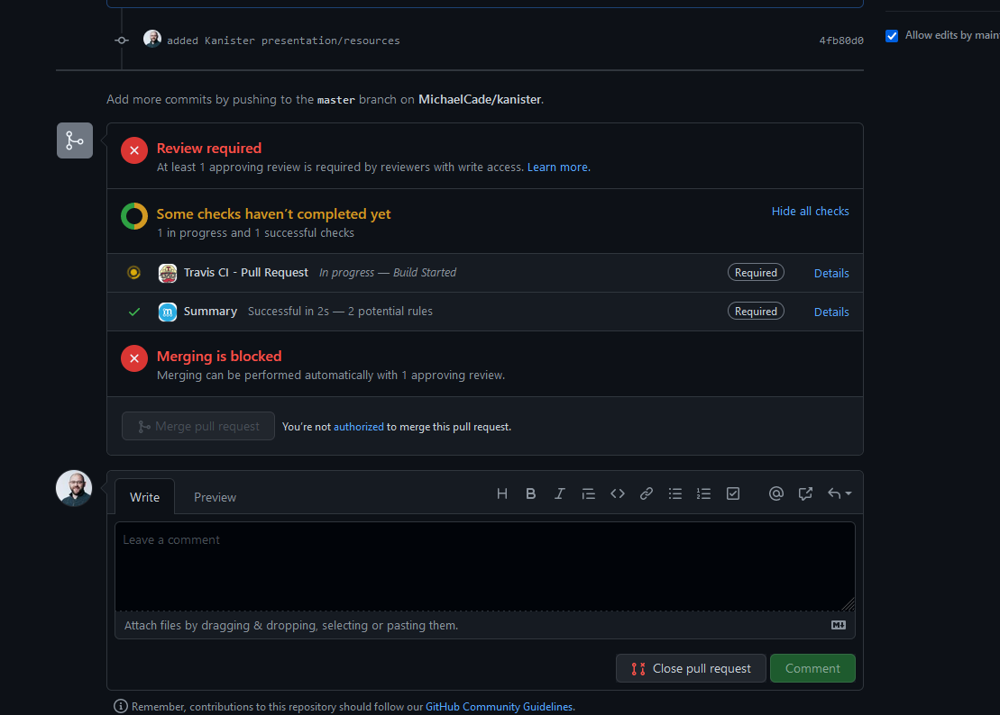

Một điều khác cần lưu ý ở đây là màu đỏ trong ảnh chụp màn hình ở trên, có thể trông hơi khó chịu và có vẻ như bạn đã mặc một lỗi gì đó. Đừng lo lắng, bạn không làm hỏng bất cứ thứ gì, quy trình này là để giúp bạn và người bảo trì của dự án. Theo kinh nghiệm của tôi, nếu bạn mặc mỗi lỗi, người bảo trì sẽ liên hệ và tư vấn về những việc cần làm tiếp theo.

Pull request này hiện đã được công khai cho mọi người xem [added Kanister presentation/resource #1237](https://github.com/kanisterio/kanister/pull/1237)

Tôi sẽ publish tất cả những điều này trước khi pull request của tôi được chấp nhận, có lẽ sẽ có một phần thưởng cho ai thêm một hình ảnh của một PR thành công?

1. Fork kho lưu trữ này về GitHub account của bạn
2. Thêm hình ảnh và có thể là một chút văn bản
3. Đẩy các thay đổi vào kho lưu trữ đã được forked của bạn
4. Tạo PR để tôi xem xét và duyệt
5. Tôi sẽ nghĩ một số giải thưởng

Phần này kết thúc quá trình tìm hiểu về Git và GitHub của chúng ta, tiếp theo, chúng ta sẽ đi sâu vào containers, bắt đầu bằng một bức tranh toàn cảnh, xem xét cách thức và lý do tại sao các chúng ta sử dụng containers cũng như tìm hiểu thêm về ảo hoá.

## Tài liệu tham khảo

- [Learn GitLab in 3 Hours | GitLab Complete Tutorial For Beginners](https://www.youtube.com/watch?v=8aV5AxJrHDg)
- [BitBucket Tutorials Playlist](https://www.youtube.com/watch?v=OMLh-5O6Ub8&list=PLaD4FvsFdarSyyGl3ooAm-ZyAllgw_AM5)
- [What is Version Control?](https://www.youtube.com/watch?v=Yc8sCSeMhi4)
- [Types of Version Control System](https://www.youtube.com/watch?v=kr62e_n6QuQ)
- [Git Tutorial for Beginners](https://www.youtube.com/watch?v=8JJ101D3knE&t=52s)
- [Git for Professionals Tutorial](https://www.youtube.com/watch?v=Uszj_k0DGsg)
- [Git and GitHub for Beginners - Crash Course](https://www.youtube.com/watch?v=RGOj5yH7evk&t=8s)
- [Complete Git and GitHub Tutorial](https://www.youtube.com/watch?v=apGV9Kg7ics)
- [Git cheatsheet](https://www.atlassian.com/git/tutorials/atlassian-git-cheatsheet)

Hẹn gặp lại vào [ngày 42](day42.md)
