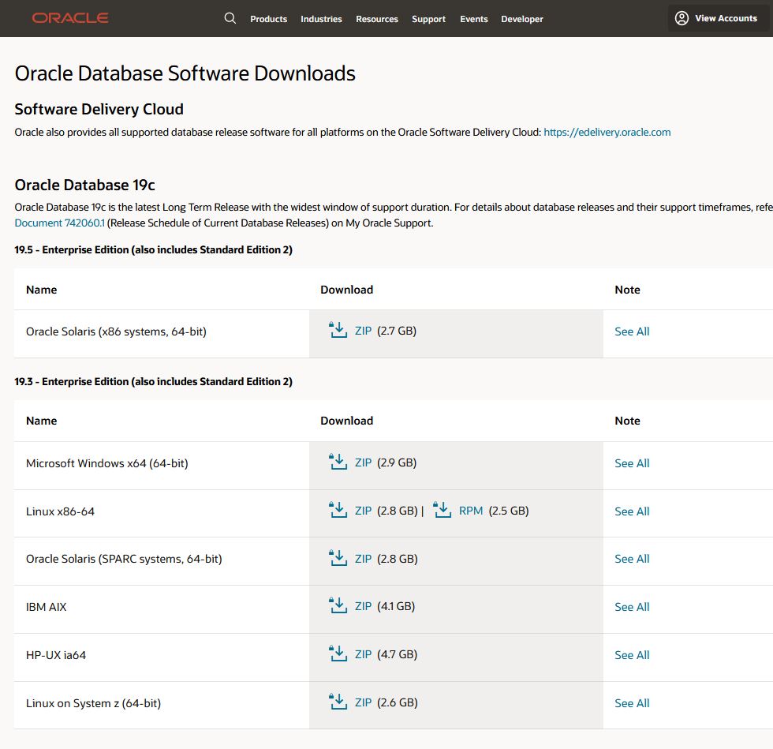
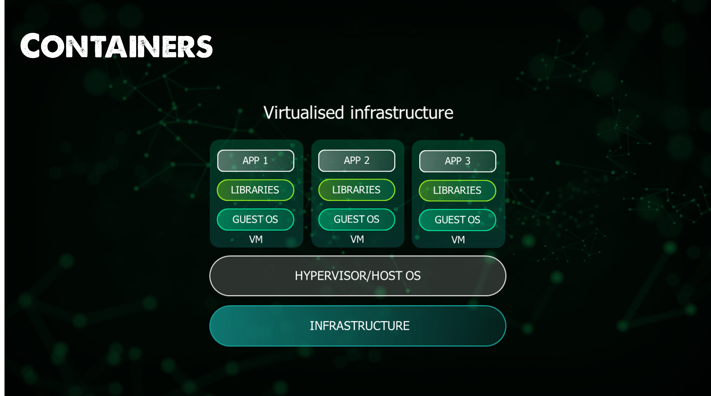

## Bức tranh toàn cảnh: Containers

Bây giờ, chúng ta bắt đầu với phần tiếp theo và phần này sẽ tập trung vào các containers, cụ thể là chúng ta sẽ nói tới Docker, một vài phần chính để hiểu thêm về các containers.

Tôi cũng sẽ cố gắng thực hành nhiều trong phần này để tại một số container sử dụng trong phần này và các phần sau của thử thách.

Như mọi khi, bài đăng đầu tiên này sẽ tập trung vào bức tranh toàn cảnh cách chúng ta đi được tới đây và ý nghĩa của những điều đó.

- Lịch sử của các phát triển platforms và các ứng dụng
- Chúng ta cũng sẽ nói về ảo hoá và container hoá

### Tại sao chạy ứng dụng bằng một cách khác?

Điều đầu tiên chúng ta phải xem xét là tại sao chúng ta cần một cách khác để chạy phần mềm hoặc ứng dụng của mình? Chà, lựa chọn đó thật tuyệt, chúng ta có thể chạy các ứng dụng của mình ở nhiều dạng khác nhau, chúng ta có thể thấy các ứng dụng được triển khai trên phần cứng vật lý có hệ điều hành và một ứng dụng duy nhất được triển khai tại đó. Cũng có thể thấy máy ảo hoặc các phiên bản IaaS sử dụng điện toán đám mây chạy ứng dụng của chúng ta, sau đó tích hợp lại vào cơ sở dữ liệu trong máy ảo hoặc dưới dạng cung cấp PaaS trong đám mây công cộng. Hoặc cũng có thể thấy ứng dụng chạy trong các containers.

Không có lựa chọn nào ở trên là đúng hay sai, nhưng chúng đều có lý do để tồn tại và tôi cũng tin tưởng rằng không có lựa chọn nào trong số này sẽ biến mất trong tương lai gần. Tôi đã thấy rất nhiều nội dung liên quan đến việc so sánh container và VMs và thực sự điều đó không nên được tranh luận, nó giống như tranh luận táo với lê quả nào ngon hơn dù cả hai đều là trái cây (=cách chạy ứng dụng của chúng ta) và chúng không giống nhau.

Tôi cũng muốn nói rằng nếu bạn mới bắt đầu và đang phát triển một ứng dụng, bạn nên hướng tới các container đơn gỉan khi xét về tính hiệu quả, tốc độ và kích thước. Nhưng điều đó cũng đi kèm với một cái giá, nếu bạn không biết gì về container thì đó sẽ là một quá trình học tập để buộc bản thân bạn phải hiểu lý do tại sao chúng ta sử dụng và xây dựng một mindset mới. Nếu bạn đã phát triển các ứng dụng của mình theo một cách cụ thể hoặc chưa từng sử dụng containers thì bạn có thể có nhiều vấn đề khó giải quyết hơn trước cả khi xem xét đến việc sử dụng chúng.

Chúng ta có nhiều sự lựa chọn khác nhau khi tải xuống một phần mềm nhất định, có rất nhiều hệ điều hành khác nhau mà chúng ta có thể đang sử dụng và hướng dẫn cụ thể về những gì chúng ta cần làm để cài đặt ứng dụng của mình.

Gần đây, tôi nhận thấy rằng các ứng dụng mà chúng ta có thể đã từng cần một hệ điều hành máy chủ đầy đủ, một máy ảo, một instance vật lý hoặc điện toán đám mây hiện đang phát hành các phiên bản phần mềm trên container của chúng. Tôi thấy điều này khá thú vị vì nó đứa thế giới của container và sau đó là Kubernetes tới mọi người chứ không chỉ tập trung vào các nhà phát triển ứng dụng.

Như bạn có thể thấy như tôi đã nói trước đây, tôi sẽ không cố thuyết phục rằng câu trả lời cho việc chạy các ứng dụng là việc sử dụng các containers! Tôi nói răng đây là một tùy chọn khác mà chúng ta cần lưu ý khi triển khai các ứng dụng của mình.

Chúng ta đã có công nghệ container trong một thời gian dài, vậy tại sao trong 10 năm qua, điều này đã trở nên phổ biến, tôi có thể nói rằng thậm chí nó còn phổ biến hơn trong 5 năm qua. Chúng ta đã có container trong nhiều thập kỷ. Nó liên quan đến các thách thức của containers hay thậm chí các images, về cách chúng ta phân phối phần mềm của mình, bởi vì nếu chúng ta chỉ có công nghệ container, thì chúng ta vẫn sẽ gặp các vấn đề giống như chúng ta đã gặp phải với quản lý phần mềm.

Nếu chúng ta coi Docker như một công cụ, thì lý do khiến nó thành công là do hệ sinh thái images dễ tìm kiếm và sử dụng. Việc tích hợp vào hệ thống của bạn và thiết lập và chạy trở nên rất đơn giản. Một phần quan trọng của điều này là tính nhất quán, một trong những thách thức mà chúng ta phải đối mặt với việc triển phai, phát triển phần mềm. Không quan trọng đó là MongoDB hay nodeJS, quá trình thiết lập và chạy hai phần mềm này sẽ giống nhau. Việc tắt các ứng dụng trên cũng giống nhau. Tất cả những vấn đề vẫn sẽ tồn tại, nhưng điều tuyệt vời là khi chúng ta kết hợp công nghệ images và containers với nhau, giờ đây chúng ta có một bộ công cụ duy nhất giúp chúng ta giải quyết tất cả các vấn đề được liệt kê dưới đây:

- Đầu tiên chúng ta phải tìm phần mềm trên internet.
- Sau đó chúng ta phải tải phần mềm này về.
- Chúng ta có tin nguồn mà chúng ta tải về không?
- Vậy chúng ta có cần giấy phép không? License nào là phù hợp?
- Có tương thích với các nền tảng khác nhau không?
- Package đó là gì? mã nhị phân? tệp thực thi? Trình quản lý gói?
- Làm thế nào để chúng ta cấu hình phần mềm?
- Các dependencies? Toàn bộ quá trình tải xuống bao gồm chúng hay chúng ta cũng cần cài đặt, cấu hình chúng?
- Dependencies của dependencies?
- Làm thế nào để bắt đầu ứng dụng?
- Làm thế nào để dừng ứng dụng?
- Nó có tự động khởi động lại không?
- Khởi động khi boot?
- Xung đột tài nguyên?
- Xung đột thư viện?
- Xung đột cổng
- Bảo mật cho phần mềm?
- Nâng cấp phần mềm?
- Làm cách nào để gỡ bỏ phần mềm?

Chúng ta có thể chia những điều trên thành 3 lĩnh vực rất phức tạp của phần mềm mà các containers và images giúp chúng ta giải quyết.

| Phân phối | Cài đặt  | Vận hành          |
| ------------ | ------------- | ------------------ |
| Find         | Install       | Start              |
| Download     | Configuration | Security           |
| License      | Uninstall     | Ports              |
| Package      | Dependencies  | Resource Conflicts |
| Trust        | Platform      | Auto-Restart       |
| Find         | Libraries     | Updates            |

Containers và images sẽ giúp chúng ta loại bỏ một số thách thức mà chúng ta gặp phải với các phần mềm và ứng dụng khác.

Ở high-level, chúng ta có thể gộp cài đặt và vận hành vào cùng một danh sách, images sẽ giúp chúng ta từ quan điểm phân phối và containers giúp cài đặt và vận hành.

Ok, nghe có vẻ hay và thú vị nhưng chúng ta vẫn cần hiểu containers là gì và như tôi đã đề cập đến images nên tiếp theo chúng ta hãy đề cập đến phần đó.

Một điều khác mà bạn có thể đã thấy rất nhiều khi chúng ta nói về Container để phát triển phần mềm là sự giống nhau của chúng với các công-te-nơ (container) vận chuyển, container vận chuyển được sử dụng để vận chuyển nhiều loại hàng hóa trên biển bằng tàu lớn.

Vậy thì những điều này có liên quan gì tới chủ đề container của chúng ta? Hãy nghĩ về mã nguồn mà các nhà phát triển phần mềm đã viết, làm thế nào chúng ta có thể triển kahi mã đó từ máy này sang một máy khác?

Nếu chúng ta nghĩ về những gì đã được biết tới phân phối phần mềm, cài đặt và vận hành nhưng bây giờ chúng ta sẽ xây dựng chúng tành một hình ảnh môi trường. Chúng ta có phần cứng và hệ điều hành nơi bạn sẽ chạy nhiều ứng dụng. Ví dụ: NodeJS có một số dependencies nhất định và cần một số thư viện nhất định. Nếu sau đó bạn muốn cài đặt MySQL thì nó cần các thư viện và dependencies cần thiết. Mỗi ứng dụng phần mềm sẽ có thư viện và dependencies của nó. Chúng ta có thể rất may mắn và không có bất kỳ xung đột nào giữa bất kỳ các ứng dụng nào của chúng ta bởi sự xung đột giữa các thư viện và dependencies. Tuy nhiên, càng nhiều ứng dụng thì sẽ có càng nhiều cơ hội hoặc rủi ro xảy ra do các xung đột đó. Các ứng dụng sẽ được cập nhật và những xung đột này. Rất có thể với một lần triển khai sửa chữa các phần mềm của bản bằng việc update chúng sẽ tạo ra các xung đột khác.

Containers có thể giúp giải quyết vấn đề này. Containers giúp **xây dựng** ứng dụng của bạn, **vận chuyển** ứng dụng đó, **triển khai** và **mở rộng quy mô các ứng dụng này một cách dễ dàng và độc lập với nhau. Hãy nhìn vào kiến trúc, bạn sẽ có phần cứng và hệ điều hành, sau đó, bạn sẽ có một container engine như docker (chúng ta sẽ nhắc tới sau). Phần mềm container engine sẽ giúp tạo các container đóng gói các thư viện và các dependencies cùng với nó để bạn có thể di chuyển container này từ máy này sang máy khác mà không phải lo lắng về các thư viện và dependencies vì chúng là một phần của container. Container này có thể được di chuyển qua các hệ thống mà không phải lo lắng về các dependencies mà ứng dụng cần để chạy vì mọi thứ mà ứng dụng cần đều được đóng gói thành một container.

### Ưu điểm của containers

- Container giúp đóng gói tất cả các dependencies bên trong và cô lập nó.

- Dễ dàng quản lý các containers

- Khả năng di chuyển từ hệ thống này qua hệ thống khác 

- Container giúp đóng gói phần mềm và bạn có thể dễ dàng vận chuyển nó mà không cần nhiều nỗ lực

- Container có khả năng mở rộng dễ dàng

Sử dụng các container, bạn có thể mở rộng các container và sử dụng bộ cân bằng tải hoặc một service để phân chia lưu lượng và có thể mở rộng ứng dụng theo chiều ngang. Container cung cấp tính linh hoạt và dễ dàng trong việc quản lý các ứng dụng của mình.

### Container là gì?

Khi chúng ta chạy các ứng dụng trên máy tính, đây có thể là VSCode hoặc trình duyệt web mà bạn đang sử dụng để đọc bài viết này. Ứng dụng đó đang chạy dưới dạng một process hoặc một thứ gì đó coi là một process. Trên máy tính xách tay hoặc hệ thống của chúng ta, chúng ta có xu hướng chạy nhiều ứng dụng hoặc như chúng ta đã nói là các process. Khi chúng ta mở một ứng dụng mới hoặc click vào biểu tượng ứng dụng, đây là ứng dụng chúng ta muốn chạy, đôi khi ứng dụng này có thể là một dịch vụ mà chúng ta chỉ muốn chạy nền, hệ điều hành của chúng ta có rất nhiều các dịch vụ chạy nền cung cấp cho bạn trải nghiệm người dùng mà bạn có đang có với hệ thống.

Biểu tượng ứng dụng đó đại diện cho một liên kết đến một tệp thực thi ở đâu đó trên hệ thống tệp của bạn, sau đó hệ điều hành sẽ tải tệp thực thi đó vào bộ nhớ. Thật thú vị, tệp thực thi đó đôi khi được nhắc tới như là một hình ảnh khi chúng ta đang nói về một process.

Containers là các processes, một container là một đơn vị phần mềm tiêu chuẩn đóng gói mã và tất cả các dependencies của nó để ứng dụng chạy nhanh và đáng tin cậy từ môi trường điện toán này sang môi trường điện toán khác.

Phần mềm được đóng gói trong container sẽ luôn chạy giống nhau, bất kể trên cơ sở hạ tầng nào. Các container cách ly phần mềm khỏi môi trường của nó và đảm bảo rằng nó hoạt động đồng nhất bất chấp sự khác biệt chẳng hạn giữa môi trường phát triển và staging.

Tôi đã đề cập đến image trong phần trước khi đề cập đến cách thức và lý do tại sao các container và image được kết hợp với nhau khiến các container trở nên phổ biến trong hệ sinh thái của chúng ta.

### Image là gì?

Container image là một gói phần mềm nhẹ, độc lập, có thể thực thi, bao gồm mọi thứ cần thiết để chạy một ứng dụng: mã, runtime, công cụ hệ thống, thư viện hệ thống và cài đặt. Container image trở thành container khi chạy.

## Tài liệu tham khảo

- [TechWorld with Nana - Docker Tutorial for Beginners](https://www.youtube.com/watch?v=3c-iBn73dDE)
- [Programming with Mosh - Docker Tutorial for Beginners](https://www.youtube.com/watch?v=pTFZFxd4hOI)
- [Docker Tutorial for Beginners - What is Docker? Introduction to Containers](https://www.youtube.com/watch?v=17Bl31rlnRM&list=WL&index=128&t=61s)
- [Introduction to Container By Red Hat](https://www.redhat.com/en/topics/containers)

Hẹn gặp lại vào [ngày 43](day43.md)
