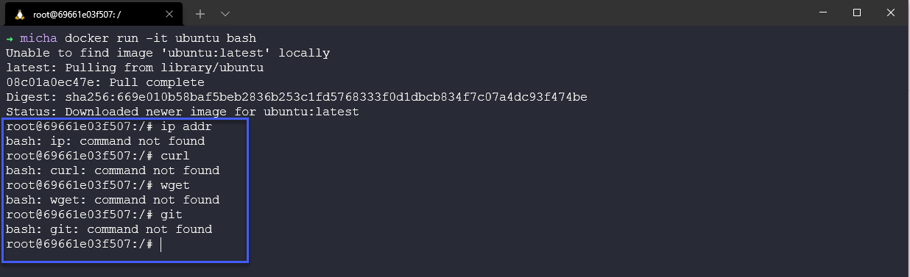

## Docker Images & Thực hành với Docker Desktop

Bây giờ chúng ta đã cài đặt Docker Desktop trên hệ thống của mình. (Nếu bạn đang chạy Linux thì bạn vẫn còn có các tuỳ chọn nhưng không có GUI, dù sao thì docker có hoạt động trên Linux.) [Cài đặt Docker Engine trên Ubuntu](https://docs.docker.com/engine/install/ubuntu/) (Các bản phân phối khác cũng có sẵn.)

Trong bài đăng này, chúng ta sẽ bắt đầu triển khai một số images và môi trường của chúng ta. Nhắc lại về Docker image - Docker image là một tệp được sử dụng để thực thi mã trong Docker container. Docker image hoạt động như một bộ chỉ dẫn để xây dựng Docker container, giống như một template. Docker images cũng đóng vai trò là điểm bắt đầu khi sử dụng Docker.

Bây giờ là thời điểm tốt để tạo tài khoản cảu bạn trên [DockerHub](https://hub.docker.com/)

DockerHub là một tài nguyên tập trung để làm việc với Docker và các thành phần khác của nó. Thường được gọi là một registry để lưu trữ các docker images. Nhưng có rất nhiều dịch vụ bổ sung ở đây có thể được sử dụng để tự động hóa, tích hợp vào GitHub hoặc quét bảo mật.

Nếu bạn kéo xuống sau khi đăng nhập, bạn sẽ thấy danh sách các container image. Bạn có thể thấy các image cho cơ sở dữ liệu sử dụng MySQL, hello-world, v.v. Hãy coi đây là những image cơ sở tốt, bạn có thể chỉ cần một image cho cơ sở dữ liệu ở đây và trong phần lớn trường hợp, tốt nhất là bạn nên sử dụng image chính thức (với dấu tích xanh) thay vì việc tạo riêng image của mình.

Chúng ta có thể đi sâu hơn vào chế độ xem các image có sẵn và tìm kiếm trên các danh mục, hệ điều hành và kiến ​​trúc. Một điều tôi nhấn mạnh bên dưới là image chính thức, điều này sẽ giúp bạn yên tâm hơn về nguồn gốc của nó.

Chúng ta cũng có thể tìm kiếm một image cụ thể, ví dụ: WordPress có thể là một image cơ sở tốt mà chúng ta muốn, chúng ta có thể làm điều đó ở trên cùng và tìm tất cả các container image liên quan đến WordPress. Dưới đây là chú ý cho việc chúng ta cũng có Verified Publisher.

- Image chính thức (Official Image) - Docker Official images là một tập hợp các kho lưu trữ giải pháp mã nguồn mở Docker được tuyển chọn.

- Verified Publisher - Nội dung Docker chất lượng cao từ các tổ chức đã được xác minh. Các sản phẩm này được công khai và duy trì bởi một công ty/tổ chức thương mại.

### Khám phá Docker Desktop

Chúng ta đã cài đặt Docker Desktop trên hệ thống của mình và nnếu bạn mở ứng dụng này, bạn sẽ thấy một cái gì đó tương tự như hình bên dưới. Như bạn có thể thấy, chúng ta không có container nào đang chạy và docker engine của chúng ta đang chạy.

Vì đây không phải là bản cài đặt mới đối với tôi nên tôi có một số image đã được tải xuống và có sẵn trên hệ thống của mình. Bạn có thể sẽ không thấy gì ở đây.

Bạn sẽ thấy các container images mà bạn đã lưu trữ trong docker hub của mình trong mục remote repositories. Bạn có thể thấy như bên dưới, tôi không có bất kỳ image nào.

Chúng ta cũng có thể xác nhận này trên trang dockerhub của mình và xác nhận rằng chúng ta không có gì ở đó.

Tiếp theo, chúng ta có tab Volumes, nếu bạn có các containers yêu cầu tính bền vững thì đây là nơi chúng ta có thể thêm các volumes vào hệ thống tệp trên máy của bạn hoặc hệ thống tệp được chia sẻ.

Tại thời điểm viết bài, cũng có một tab "Dev Environments", đây là nơi giúp bạn cộng tác với nhóm của mình thay vì sử dụng các nhánh của khác nhau trên git. Tuy nhiên, chúng ta sẽ không nói về phần này.

Quay trở lại tab đầu tiên, bạn có thể thấy rằng có một lệnh mà chúng ta có thể chạy, đó là container getting-started. Hãy chạy `docker run -d -p 80:80 docker/getting-started` trong terminal của chúng ta.

Nếu chúng ta kiểm tra lại cửa sổ docker desktop, chúng ta sẽ thấy rằng chúng ta có một container đang chạy.

Bạn có thể nhận thấy rằng tôi đang sử dụng WSL2 và để có thể sử dụng, bạn cần đảm bảo rằng tính năng này được bật trong cài đặt.

Nếu bây giờ chúng ta kiểm tra lại tab Images của mình, bạn sẽ thấy một image đang được sử dụng có tên là `docker/getting-started`.

Quay lại tab Containers/Apps, nhấp vào container đang chạy của bạn. Bạn sẽ mặc định thấy được logs và trên thanh ở phía trên, bạn có một số tùy chọn để chọn, trong trường hợp của chúng ta, tôi khá tự tin rằng một trang web chạy trong container này, vì vậy chúng ta sẽ chọn mở trong trình duyệt.

Khi chúng ta nhấn vào nút đó ở trên, chắc chắn rằng một trang web sẽ được mở ra và hiển thị nội dung tương tự như bên dưới.

Container này cũng có thêm một số chi tiết về container và image của chúng ta.

Bây giờ chúng ta đã có container đầu tiên. Chưa có gì quá đáng sợ. Còn nếu chúng ta muốn pull một container image từ DockerHub thì sao? Có thể sẽ có một `hello world` container chúng ta có thể sử dụng.

Tôi dừng container `getting started` không phải để tiết kiệm tài nguyên mà để những bước sau được nhìn rõ hơn.

Quay trở lại terminal, chạy `docker run hello-world` và xem điều gì xảy ra.

Bạn có thể thấy rằng chúng ta không có image ở local, vì vậy chúng ta đã kéo nó xuống từ dockerhub. Sau đó chúng ta nhận được một thông báo trong container image với một số thông tin về những gì nó đã làm để thiết lập và chạy cũng như một số liên kết đến các tài liệu tham khảo.

Nếu bây giờ chúng ta vào Docker Desktop, chúng ta không thấy có container đang chạy nhưng có một container đã exited gửi thông báo hello-world message, nghĩa là nó xuất hiện, gửi thông báo và sau đó bị chấm dứt.

Và cuối cùng, chúng ta hãy kiểm tra tab Images và thấy rằng chúng ta có một image hello-world mới trên hệ thống của mình, nghĩa là nếu chúng ta chạy lại lệnh `docker run hello-world` trong terminal, chúng ta sẽ không phải kéo bất cứ thứ gì trừ khi phiên bản thay đổi.

Thông điệp từ container hello-world đặt ra một thử thách làm một điều gì đó khó hơn một chút.

Thử thách được chấp nhận!

Khi chạy `docker run -it ubuntu bash` trong thiết bị đầu cuối của chúng ta, chúng ta sẽ chạy phiên bản Ubuntu được đóng gói chứ không phải bản sao đầy đủ của Hệ điều hành. Bạn có thể tìm hiểu thêm về image cụ thể này trên [DockerHub](https://hub.docker.com/_/ubuntu)

Bạn có thể thấy bên dưới khi chúng ta chạy lệnh, giờ đây chúng ta có một dấu nhắc tương tác (`-it`) và chúng ta có một trình shell bằng bash trong container của mình.

Chúng ta có bash shell nhưng chúng ta không có gì khác, đó là lý do tại sao container image này nhỏ hơn 30 MB.

Nhưng chúng ta vẫn có thể sử dụng image này và có thể cài đặt phần mềm bằng trình quản lý gói apt của mình, chúng ta cũng có thể cập nhật container image và nâng cấp.

Hoặc có thể chúng ta muốn cài đặt một số phần mềm vào container của mình, tôi đã chọn một ví dụ thực sự tệ ở đây vì pinta là một trình chỉnh sửa image và nó có dung lượng hơn 200 MB nhưng hy vọng bạn sẽ hiểu được những gì tôi đang làm ở đây. Điều này sẽ làm tăng đáng kể kích thước container của chúng ta nhưng dù sao thì chúng ta vẫn đang ở MB chứ không phải GB.

Tôi hy vọng đã cung cấp cho bạn cái nhìn tổng quan về Docker Desktop và thế giới container không quá đáng sợ khi bạn chia nhỏ nó với các trường hợp sử dụng đơn giản. Chúng ta cần đề cập đến kết nối mạng, bảo mật và các tùy chọn khác mà chúng ta có so với việc chỉ tải xuống container image và sử dụng chúng như thế này. Đến cuối phần này, chúng ta sẽ tạo một cái gì đó, tải nó lên kho lưu trữ DockerHub và có thể triển khai nó.

## Tài liệu tham khảo

- [TechWorld with Nana - Docker Tutorial for Beginners](https://www.youtube.com/watch?v=3c-iBn73dDE)
- [Programming with Mosh - Docker Tutorial for Beginners](https://www.youtube.com/watch?v=pTFZFxd4hOI)
- [Docker Tutorial for Beginners - What is Docker? Introduction to Containers](https://www.youtube.com/watch?v=17Bl31rlnRM&list=WL&index=128&t=61s)
- [WSL 2 with Docker getting started](https://www.youtube.com/watch?v=5RQbdMn04Oc)

Hẹn gặp lại vào [ngày 45](day45.md)
