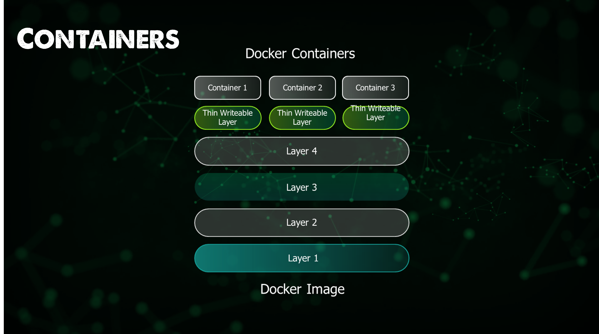

## Phân tích một Docker Image

Trong phần trước, chúng ta đã đề cập đến một số điều cơ bản về cách sử dụng Docker Desktop kết hợp với DockerHub để triển khai và chạy một số image đã được xác nhận. Ôn lại về image, chắc hẳn bạn sẽ không quên mọi thứ nếu tôi liên tục đề cập đến chúng.

Docker image là một template chỉ có thể đọc chứa một bộ chỉ dẫn để tạo container có thể chạy được trên nền tảng Docker. Nó cũng câp một giải pháp thuận tiện để đóng gói các ứng dụng và môi trường được cấu hình trước mà bạn có thể sử dụng cho mục đích cá nhân hoặc chia sẻ công khai với những người dùng Docker khác. Docker image cũng là điểm khởi đầu với bất kỳ ai lần đầu tiên sử dụng Docker. 


Điều gì sẽ xảy ra nếu chúng ta muốn tạo Docker image của riêng mình? Để làm được điều này, đầu tiên bạn cần tạo một Dockerfile. Bạn đã thấy cách chúng ta có thể lấy container image của Ubuntu và thêm các phần mềm cần thiết và mọi thứ hoạt động rất ổnm tuy nhiên, nếu container đó bị dừng lại hoặc loại bỏ thì tất cả các cập nhật phần mềm cũng như quá trình cài đặt sẽ biến mất, không có phiên bản nào lặp lại cho quá trình chúng ta đã thực hiện. Vì vậy, việc đó có thể tốt nếu chúng ta cần thể hiện các chức năng của Docker image nhưng không giúp ích gì cho việc truyền hình ảnh qua nhiều môi trường khác nhau với các phần mềm được cài đặt sẵn cho mỗi container khi khởi tạo/chạy.

### Dockerfile là gì?

Dockerfile là một tệp dữ liệu text có chứa các câu lệnh mà bạn sẽ thực hiện thủ công để xây dựng một docker image. Docker có thể xây dựng các hình ảnh một cách tự động bằng việc đọc các chỉ dẫn của chúng ta trong các dockerfile.

Mỗi một tệp tạo ra một docker image được biết tới như một layer (lớp). Các layers này đến từ các images, được tạo trên các image khác trong nhiều stages. Mỗi một layer độc lập với layer nằm trực tiếp phía dưới của nó. Thứ tự của các layer đóng vai trò then chốt trong việc quản lý vòng đời docker image của bạn môt cách hiệu quả.

Chúng ta nên tổ chức các layers theo thứ tự của việc hay thay đổi nhất. Các layer hay bị thay đổi nên nằm càng cao càng tốt trong stack của chúng ta, lý do vì khi bạn thay đổi một layer trong image của bạn, Docker không chỉ xây dựng lại layer đó mà toàn bộ các layer nằm phía sau/dựa vào layer đó. Do đó, một thay đổi với layer ở phía trên sẽ giúp tiết kiệm thời gian cho việc xây dựng lại toàn bộ image.

Mỗi lần docker tạo một container từ một image (như chúng ta đã làm ngày hôm qua), chúng thêm vào một layer có thể được chỉnh sửa, hay còn biết đến như container layer. Nó sẽ ghi lại toàn bộ các thay đổi của container trong runtime. Layer này là thứ duy nhất khác biệt giữa một container đang hoạt động và image gốc. Bất kỳ số lượng container tương tự nào cũng có thể chia sẻ quyền truy cập vào cùng một base image trong khi vẫn duy trì trạng thái của chúng.

Quay trở lại ví dụ chúng ta sử dụng ngày hôm qua với Ubuntu image. Chúng ta có thể chạy cùng một lệnh đó nhiều lần và trên container đầu tiên, chúng ta có thể cài đặt pinta và trên container thứ hai, chúng ta có thể cài đặt figlet với hai ứng dụng khác nhau, mục đích khác nhau, kích thước khác nhau, v.v. Mỗi container mà chúng ta triển khai chia sẻ cùng một image nhưng không cùng một trạng thái và sau đó trạng thái đó sẽ biến mất khi chúng ta xoá container.



Theo ví dụ trên với Ubuntu image, nhưng cũng có nhiều container image dựng sẵn khác có sẵn trên DockerHub và các kho lưu trữ của bên thứ ba. Những image này thường được gọi là image gốc - base image. Nó là nền tảng để xây dựng tất cả các layer khác và cung cấp các khối xây dựng cơ bản cho môi trường container của chúng ta.

Cùng với một tập hợp các tệp layers riêng lẻ, Docker image cũng bao gồm một tệp bổ sung được gọi là manifest. Đây thực chất là phần mô tả image ở định dạng JSON và bao gồm các thông tin như image tag, chữ ký điện tử và chi tiết về cách định cấu hình container cho các loại nền tảng khác nhau.


### Làm thế nào để tạo một docker image

Có hai cách chúng ta có thể tạo một docker image. Chúng ta có thể thực hiện nhanh chóng với quy trình mà chúng ta đã bắt đầu ngày hôm qua, chúng ta chọn base image của mình khởi động container đó và cài đặt tất cả phần mềm cũng như các dependencies (phụ thuộc) mà chúng ta muốn có trên container của mình.

Sau đó, chúng ta có thể sử dụng `docker commit container name` để có một bản sao cục bộ của image này như một docker image và nó sẽ xuất hiện trong tab images của docker desktop của bạn.

Cực kỳ đơn giản, tôi không đề xuất phương pháp này trừ khi bạn muốn hiểu quy trình, sẽ rất khó để quản lý vòng đời theo cách này và cần rất nhiều cấu hình thủ công. Nhưng đó là cách nhanh nhất và đơn giản nhất để xây dựng docker image. Nó rất tốt cho việc thử nghiệm, khắc phục sự cố, xác thực các dependencies, v.v.

Cách chúng ta dự định xây dựng image của mình là thông qua một dockerfile. Điều này giúp chúng ta có một cách rõ ràng, nhanh gọn và có thể lặp lại để tạo một image. Quản lý vòng đời cũng sẽ dễ dàng hơn nhiều ngoài ra cũng dễ dàng tích hợp vào các quy trình Phân phối liên tục và Tích hợp liên tục (CI/CD). Nhưng như bạn có thể thấy, nó khó hơn một chút so với quy trình được đề cập đầu tiên.

Việc sử dụng phương pháp dockerfile phù hợp hơn nhiều với việc triển container của doanh nghiệp trong thế giới thực.

Dockerfile là một quy trình gồm ba bước, theo đó bạn tạo dockerfile và thêm các lệnh bạn cần để tạo nên một image.

Bảng sau đây chứa một số câu lệnh dockerfile mà chúng ta sẽ sử dụng và rất có thể bạn cũng sẽ sử dụng.

| Lệnh | Mục đích |
| ---------- | ------------------------------------------------------------------------------------------------------------------------------------------- |
| FROM       | Để chỉ định hình ảnh gốc.                                                                                                                |
| WORKDIR    | Để đặt thư mục làm việc cho bất kỳ lệnh nào phía sau trong Dockerfile.                                                                |
| RUN        | Để chạy các câu lệnh giúp cài đặt bất kỳ ứng dụng và package nào cần thiết cho container của bạn.                                                                       |
| COPY       | Để sao chép các tệp hoặc thư mục từ một vị trí cụ thể.                                                                                 |
| ADD        | Là COPY, nhưng cũng có thể xử lý các URL và giải nén các tệp nén.                                                                   |
| ENTRYPOINT | Lệnh sẽ luôn được thực thi khi container khởi động. Nếu không được chỉ định, giá trị mặc định là /bin/sh -c                                 |
| CMD        | Các đối số được chuyển đến điểm vào. Nếu ENTRYPOINT không được cấu hình (mặc định là /bin/sh -c), CMD sẽ là các lệnh mà container thực thi. |
| EXPOSE     | Để xác định cổng nào để truy cập ứng dụng container của bạn.                                                                    |
| LABEL      | Để thêm metadata vào image.                                                                                                               |

Bây giờ chúng ta có chi tiết về cách xây dựng dockerfile đầu tiên, chúng ta có thể tạo một thư mục làm việc và tạo dockerfile. Tôi đã tạo một thư mục làm việc trong repository này, nơi bạn có thể xem các tệp và thư mục mà tôi thực hành. [Container](../../../2022/Days/Containers/)

Trong thư mục này, tôi sẽ tạo một tệp .dockerignore tương tự như .gitignore mà chúng ta đã sử dụng trong phần trước. Tệp này sẽ liệt kê bất kỳ tệp nào sẽ được tạo trong quá trình xây dựng Docker mà bạn muốn loại bỏ khỏi bản dựng cuối cùng.

Hãy nhớ rằng mọi thứ về container đều phải nhỏ gọn, nhanh nhất có thể và không bị cồng kềnh.

Tôi muốn tạo một Dockerfile đơn giản với bố cục bên dưới, nó cũng có thể được tìm thấy trong thư mục được liên kết ở trên.

```
# Use the official Ubuntu 18.04 as base
FROM ubuntu:18.04
# Install nginx and curl
RUN apt-get update && apt-get upgrade -y
RUN apt-get install -y nginx curl
RUN rm -rf /var/lib/apt/lists/*
```

Điều hướng đến thư mục này trong terminal của bạn, sau đó chạy `docker build -t 90daysofdevops:0.1 .` chúng ta đang sử dụng `-t`, sau đó đặt tên và thẻ cho image.


Bây giờ chúng ta đã tạo image của mình, sau đó chúng ta có thể chạy image của mình bằng Docker Desktop hoặc có thể sử dụng câu lệnh với docker. Tôi đã sử dụng Docker Desktop. Tôi đã kích hoạt một container và bạn có thể thấy rằng chúng ta có sẵn gói `curl` trong cli của container.


Trong khi Docker Desktop cũng có khả năng tận dụng giao diện người dùng để thực hiện thêm một số tác vụ với image mới này.


Chúng ta có thể kiểm tra hình ảnh của mình, khi làm như vậy, bạn sẽ thấy rất nhiều dockerfile và các dòng mã mà chúng ta muốn chạy trong container của mình.


Chúng ta có pull option, nếu thử thì chúng ta sẽ thất bại vì image này không được lưu trữ ở bất kỳ đâu nên sẽ gặp lỗi. Tuy nhiên, chúng ta có một tuỳ chọn "Push to Hub" cho phép chúng ta đẩy hình ảnh của mình lên DockerHub.

Nếu bạn đang sử dụng cùng một lệnh `docker build` mà chúng ta đã chạy trước đó thì nó cũng sẽ không hoạt động, bạn sẽ cần lệnh build là `docker build -t {{username}}/{{imagename}}:{{version}} `


Sau đó, nếu xem qua kho lưu trữ DockerHub của chúng ta, bạn có thể thấy rằng chúng ta vừa đẩy một hình ảnh mới. Bây giờ trong Docker Desktop, chúng ta có thể sử dụng pull tab đó.


## Tài liệu tham khảo 

- [TechWorld with Nana - Docker Tutorial for Beginners](https://www.youtube.com/watch?v=3c-iBn73dDE)
- [Programming with Mosh - Docker Tutorial for Beginners](https://www.youtube.com/watch?v=pTFZFxd4hOI)
- [Docker Tutorial for Beginners - What is Docker? Introduction to Containers](https://www.youtube.com/watch?v=17Bl31rlnRM&list=WL&index=128&t=61s)
- [WSL 2 with Docker getting started](https://www.youtube.com/watch?v=5RQbdMn04Oc)
- [Blog on gettng started building a docker image](https://stackify.com/docker-build-a-beginners-guide-to-building-docker-images/)
- [Docker documentation for building an image](https://docs.docker.com/develop/develop-images/dockerfile_best-practices/)

Hẹn gặp lại vào [ngày 46](day46.md)
