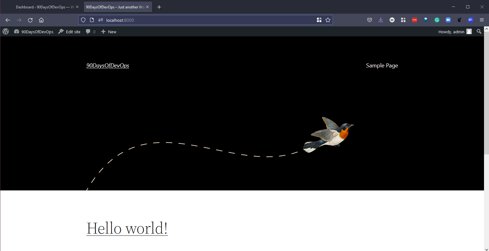
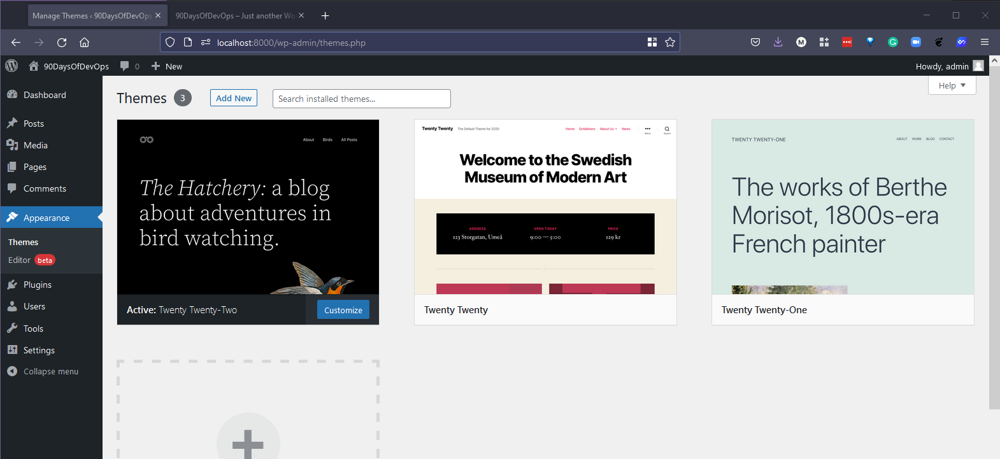

## Docker Compose

Khả năng chạy một container sẽ rất tuyệt vời nếu bạn có một image độc lập có mọi thứ bạn cần cho trường hợp sử dụng của mình, những mọi thứ trở nên thú vị hơn khi bạn đang tìm cách xây dựng nhiều ứng dụng với các  container image khác nhau. Ví dụ: nếu tôi có giao diện người dùng của trang web nhưng yêu cầu có một cơ sở dữ liệu ở phía backend, tôi có thể đặt cả hai vào một container chúng nhưng tốt hơn và hiệu quả hơn là có container cơ sở dữ liệu của riêng ứng dụng đó.

Đây là nơi Docker compose xuất hiện, đây là một công cụ cho phép bạn chạy các ứng dụng phức tạp hơn trên nhiều container. Với lợi ích là có thể sử dụng một tệp và lệnh duy nhất để khởi động ứng dụng của bạn. Ví dụ tôi sẽ hướng dẫn trong bài đăng này là từ [Ứng dụng mẫu Docker QuickStart (Quickstart: Compose and WordPress)](https://docs.docker.com/samples/wordpress/).

Trong ví dụ đầu tiên này, chúng ta sẽ:

- Sử dụng Docker Compose để triển khai WordPress và một MySQL instance riêng.
- Sử dụng tệp YAML sẽ được gọi là `docker-compose.yml`
- Xây dựng dự án
- Định cấu hình WordPress qua trình duyệt web
- Dọn dẹp

### Cài đặt Docker Compose

Như đã đề cập Docker Compose là một công cụ. Nếu bạn đang sử dụng macOS hoặc Windows thì compose có sẵn trong bản cài đặt Docker Desktop của bạn. Tuy nhiên, bạn có thể muốn chạy container của mình trên máy chủ Windows hoặc máy chủ Linux và trong trường hợp đó, bạn có thể cài đặt bằng cách sử dụng hướng dẫn sau [Cài đặt Docker Compose](https://docs.docker.com/compose/install/)

Để xác nhận rằng chúng ta đã cài đặt `docker-compose` trên hệ thống của mình, chúng ta có thể mở một terminal và gõ lệnh trên.


### Docker-Compose.yml (YAML)

Điều tiếp theo mà chúng ta đề cập đến là docker-compose.yml, bạn có thể tìm thấy trong [thư mục Container của kho lưu trữ](../../Days/Containers/my_wordpress/docker-compose.yaml). Nhưng quan trọng hơn, chúng ta cần thảo luận về YAML một chút.

Gần như có thể có một bài riêng về YAML vì bạn sẽ gặp nó ở rất nhiều nơi khác nhau. Nhưng khái quát lại thì:

"YAML là ngôn ngữ tuần tự hóa dữ liệu (data serialization language) thân thiện với con người sử dụng với tất cả các ngôn ngữ lập trình."

Nó thường được sử dụng cho các tệp cấu hình và trong một số ứng dụng nhằm lưu trữ hoặc truyền dữ liệu. Chắc chắn bạn đã bắt gặp các tệp XML được dùng để cung cấp cùng một tệp cấu hình đó. YAML cung cấp một cú pháp tối thiểu nhưng nhằm vào các trường hợp sử dụng tương tự.

YAML Ain't Markup Language (YAML) là ngôn ngữ tuần tự hóa đã phổ biến dần trong vài năm qua. Các khả năng tuần tự hóa đối tượng giúp nó trở thành một sự thay thế khả thi cho các ngôn ngữ như JSON.

Từ viết tắt YAML là viết tắt của Yet Another Markup Language. Nhưng những người bảo trì đã đổi tên nó thành YAML Ain't Markup Language để nhấn mạnh hơn vào các tính năng hướng dữ liệu của nó.

Dù sao, hãy quay lại tệp docker-compose.yml. Đây là tệp cấu hình về những gì chúng ta muốn thực hiện khi có nhiều container đang được triển khai trên một hệ thống duy nhất của chúng ta.

Ngay từ hướng dẫn được liên kết ở trên, bạn có thể thấy nội dung của tệp trông như thế này:
```
version: "3.9"

services:
  DB:
    image: mysql:5.7
    volumes:
      - db_data:/var/lib/mysql
    restart: always
    environment:
      MYSQL_ROOT_PASSWORD: somewordpress
      MYSQL_DATABASE: wordpress
      MYSQL_USER: wordpress
      MYSQL_PASSWORD: wordpress

  wordpress:
    depends_on:
      - db
    image: wordpress:latest
    volumes:
      - wordpress_data:/var/www/html
    ports:
      - "8000:80"
    restart: always
    environment:
      WORDPRESS_DB_HOST: db
      WORDPRESS_DB_USER: wordpress
      WORDPRESS_DB_PASSWORD: wordpress
      WORDPRESS_DB_NAME: wordpress
volumes:
  db_data: {}
  wordpress_data: {}
```

Chúng ta khai báo một phiên bản và sau đó một phần lớn của tệp docker-compose.yml này được tạo thành từ các services, chúng ta có service DB và service WordPress. Bạn có thể thấy mỗi trong số đó có một image được xác định bằng version tag. Bây giờ chúng ta sẽ tạo các volumes để có thể lưu trữ cơ sở dữ liệu của mình ở đó.

Sau đó, chúng ta có một số biến môi trường (environment) như mật khẩu và tên người dùng. Các tệp này có thể trở nên rất phức tạp nhưng tệp cấu hình YAML đơn giản hóa giao diện tổng thể của chúng.

### Xây dựng dự án

Tiếp theo, chúng ta quay trở lại terminal của mình và sử dụng một số lệnh với công cụ docker-compose. Điều hướng đến thư mục của bạn, nơi chứa tệp docker-compose.yml.

Từ terminal, chúng ta chỉ cần chạy `docker-compose up -d`, thao tác này sẽ bắt đầu quá trình pull những image và dựng ứng dụng có nhiều containers của bạn.

`-d` trong lệnh này có nghĩa là chế độ tách rời (detached mode), có nghĩa là lệnh Run đang hoặc sẽ chạy ở chế độ nền.


Nếu bây giờ chúng ta chạy lệnh `docker ps`, bạn có thể thấy chúng ta có 2 containers đang chạy, một là WordPress và một là MySQL.


Tiếp theo, chúng ta có thể xác thực việc đã thiết lập và chạy WordPress bằng cách mở trình duyệt và truy cập `http://localhost:8000`, bạn sẽ thấy trang thiết lập WordPress.


Chúng ta có thể trải qua quá trình thiết lập WordPress và sau đó có thể bắt đầu xây dựng trang web của mình với bảng điều khiển bên dưới.


Sau đó, nếu chúng ta mở một tab mới và điều hướng đến cùng một địa chỉ mà chúng ta đã làm trước đó `http://localhost:8000` thì sẽ thấy một theme mặc định đơn giản với tiêu đề trang web là "90DaysOfDevOps" và một bài đăng mẫu.



Trước khi chúng ta thực hiện bất kỳ thay đổi nào, hãy mở Docker Desktop và điều hướng đến tab Volumes, ở đây bạn sẽ thấy hai volumes được liên kết với containers của chúng ta, một cho wordpress và một cho db.


Theme wordpress hiện tại của tôi là "Twenty Twenty-Two" và tôi muốn thay đổi nó thành "Twenty Twenty", chúng ta có thể thực hiện những thay đổi đó trong bảng điều khiển.



Tôi cũng sẽ thêm một bài đăng mới vào trang web của mình và bạn có thể thấy phiên bản mới nhất của trang web của chúng ta. 


### Dọn dẹp hay không

Nếu bây giờ chúng ta sử dụng lệnh `docker-compose down` thì lệnh này sẽ xoá bỏ những containers của chúng ta nhưng sẽ để lại và giữ nguyên các volumes.


Chúng ta có thể xác nhận trong Docker Desktop rằng volumes của chúng ta vẫn còn đó.


Sau đó, nếu chúng ta muốn đem mọi thứ trở lại thì có thể sử dụng lệnh `docker up -d` từ trong cùng thư mục và chúng ta có các ứng dụng của mình khởi động và chạy bình thường trở lại.


Sau đó, chúng ta truy cập tới cùng một địa chỉ `http://localhost:8000` và nhận thấy rằng bài đăng mới và thay đổi về theme vẫn còn nguyên.


Nếu chúng ta muốn loại bỏ các containers và các volumes đó thì việc sử dụng lệnh `docker-compose down --volumes` cũng sẽ xoá bỏ các volumes.


Bây giờ, khi chúng ta sử dụng lại `docker-compose up -d`, các ứng dụng sẽ khởi động lại, tuy nhiên, các image đã có sẵn hệ thống của chúng ta nên sẽ không cần phải pull lại chúng từ kho lưu trữ DockerHub.

Thú thật rằng khi tôi bắt đầu tìm hiểu về docker-compose và các khả năng của nó, tôi đã bối rối không biết nó nằm ở đâu bên cạnh hoặc với các công cụ Điều phối containers (Container Orchestration) như Kubernetes, mọi thứ chúng ta đã làm ở đây trong bản demo ngắn này đều tập trung vào một máy chủ khi chạy WordPress và DB trên máy tính để bàn cục bộ. Chúng ta không có nhiều máy ảo hoặc nhiều máy chủ vật lý, chúng ta cũng không thể dễ dàng mở rộng và thu nhỏ các yêu cầu của ứng dụng của mình.

Phần tiếp theo của chúng ta sẽ đề cập đến Kubernetes nhưng trước tiên chúng ta có một vài ngày nữa về Container nói chung.

Đây cũng là một nguồn tài nguyên tuyệt vời cho các mẫu ứng dụng docker-compose với nhiều tích hợp khác nhau. [Awesome-Compose](https://github.com/docker/awesome-compose)

Trong kho lưu trữ ở trên, có một ví dụ tuyệt vời sẽ triển khai Elaticsearch, Logstash và Kibana (ELK) cho một node.

Tôi đã tải các tệp lên [Thư mục vùng chứa](../Days/Containers/elasticsearch-logstash-kibana/) Khi bạn có thư mục này ở máy tính của bạn, hãy điều hướng đến đó và bạn chỉ cần sử dụng `docker-compose up -d`


Sau đó, chúng ta có thể kiểm tra các containers đang chạy với câu lệnh `docker ps`


Bây giờ chúng ta có thể mở trình duyệt cho từng vùng chứa:


Để xóa mọi thứ, chúng ta có thể sử dụng lệnh `docker-compose down`.

## Tài liệu tham khảo

- [TechWorld with Nana - Docker Tutorial for Beginners](https://www.youtube.com/watch?v=3c-iBn73dDE)
- [Programming with Mosh - Docker Tutorial for Beginners](https://www.youtube.com/watch?v=pTFZFxd4hOI)
- [Docker Tutorial for Beginners - What is Docker? Introduction to Containers](https://www.youtube.com/watch?v=17Bl31rlnRM&list=WL&index=128&t=61s)
- [WSL 2 with Docker getting started](https://www.youtube.com/watch?v=5RQbdMn04Oc)
- [Blog on getting started building a docker image](https://stackify.com/docker-build-a-beginners-guide-to-building-docker-images/)
- [Docker documentation for building an image](https://docs.docker.com/develop/develop-images/dockerfile_best-practices/)
- [YAML Tutorial: Everything You Need to Get Started in Minute](https://www.cloudbees.com/blog/yaml-tutorial-everything-you-need-get-started)

Hẹn gặp bạn vào [ngày 47](day47.md)
