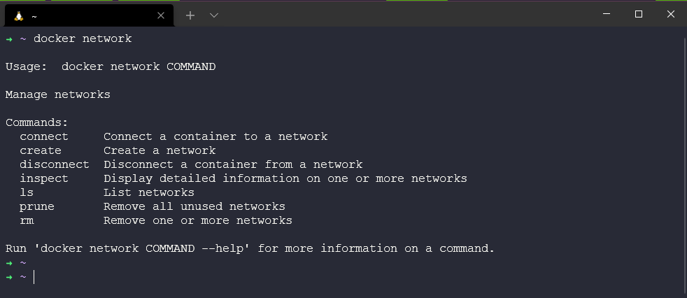
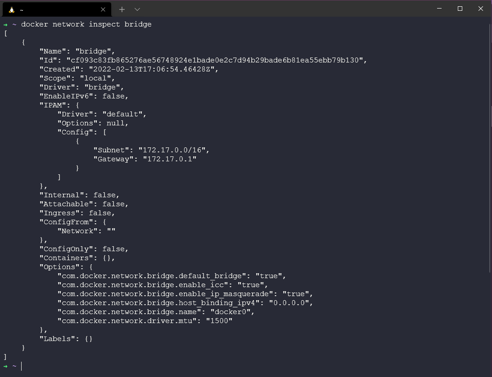
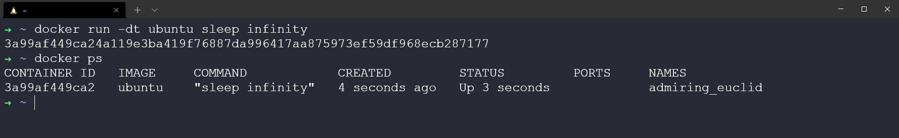
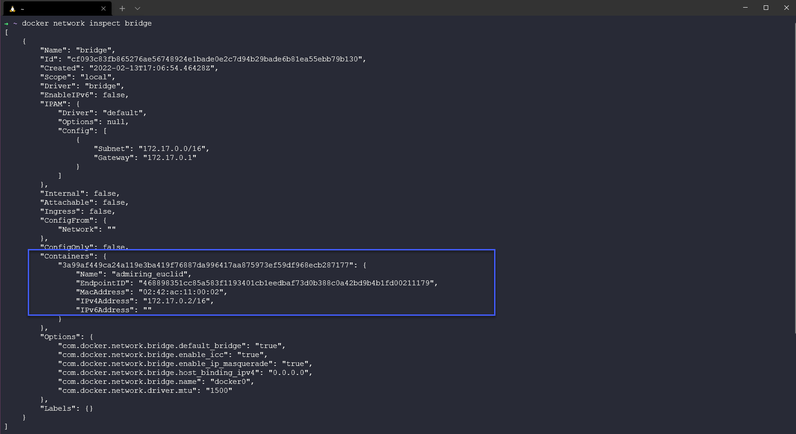
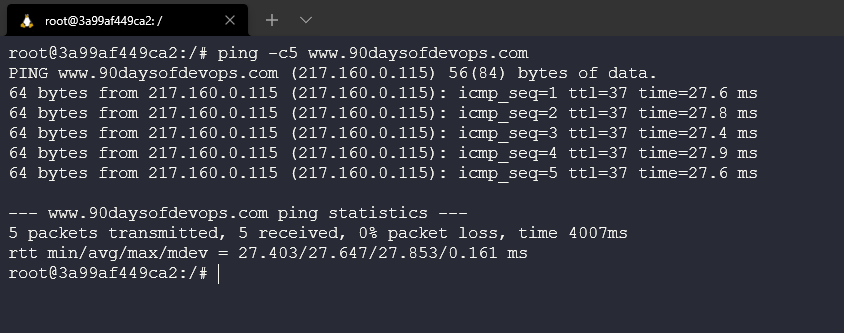
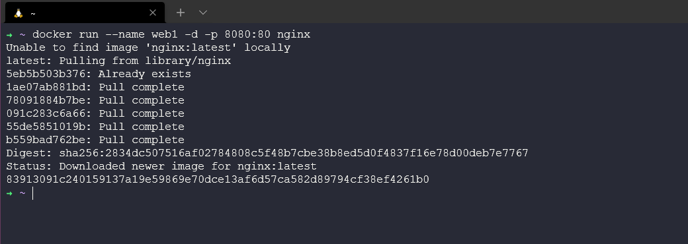
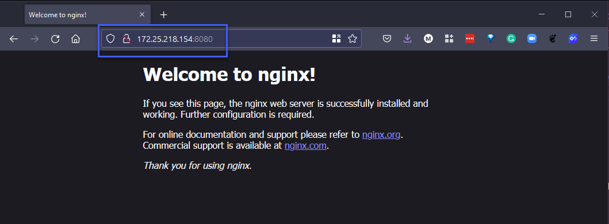

## Docker Networking & Security

Trong loạt bài viết về container chúng ta đã xem xét qua mọi thứ nhưng chưa xem xét cách mọi thứ hoạt động ở phía sau từ góc độ network và cũng chưa đề cập tới bảo mật, nó sẽ được đề cập trong bài viết này.

### Khái niệm cơ bản về Docker networking

Mở một terminal và gõ lệnh `docker network`, đây là câu lệnh chính để định cấu hình và quản lý mạng container.

Theo như bên dưới, bạn có thể thấy đây là cách chúng ta có thể sử dụng lệnh và các lệnh phụ có sẵn. Chúng ta có thể tạo các mạng mới, liệt kê cách mạng hiện có, kiểm tra và xoá các mạng.



Hãy xem qua các mạng hiện có mà chúng ta có kể từ khi cài đặt, mạng Docker có sẵn dùng trông giống như sử dụng lệnh `docker network list`.

Mỗi mạng có một NAME và ID duy nhất. Mỗi mạng cũng được liên kết với một driver duy nhất. Lưu ý rằng mạng "bridge" và mạng "host" có cùng tên với driver tương ứng của chúng.


Tiếp theo, chúng ta có thể xem xét kỹ hơn các mạng của mình bằng lệnh `docker network inspect`.

Khi tôi chạy lệnh `docker network inspect bridge`, tôi có thể nhận được tất cả các chi tiết cấu hình của mạng cụ thể đó. Điều này bao gồm tên, ID, driver, container được liên kết và như bạn thấy, có rất nhiều thông tin khác.



### Docker: Bridge Networking

Như bạn đã thấy ở trên, bản cài đặt tiêu chuẩn của Docker Desktop cung cấp cho chúng ta một mạng dựng sẵn có tên là `bridge`. Nếu bạn xem lại lệnh `docker network list`, bạn có thể thấy rằng mạng được gọi là bridge được liên kết với driver `bridge`. Chỉ vì chúng có cùng tên không có nghĩa chúng giống nhau. Được liên kết nhưng không giống nhau.

Đầu ra ở trên cũng cho thấy rằng mạng bridge có phạm vi cục bộ. Điều này có nghãi là mạng chỉ tồn tại trên máy chủ Docker này. Điều này đúng với tất cả các mạng sử dụng driver bridge - bridge driver cung cấp mạng cho single-host.

Tất cả các mạng được tạo bằng bridge driver đều dựa trên cấu hình Linux bridge (còn gọi là virtual switch)

### Kết nối tới một container

Theo mặc định, bridge network được gán cho các container mới, nghĩa là trừ khi bạn chỉ định một mạng cụ thể, tất các các container sẽ được kết nối với mạng bridge.

Hãy tạo một container mới với câu lệnh `docker run -dt ubuntu sleep infinity`


Lệnh sleep ở trên chỉ để giữ cho container chạy ở chế độ nền để chúng ta có thể thực hành với nó.



Sau đó, nếu chúng ta kiểm tra mạng bridge của mình với lệnh `docker network inspect bridge`, bạn sẽ thấy rằng chúng ta có một container khớp với những gì chúng ta vừa triển khai vì chúng ta đã không chỉ định một mạng nào cho nó.



Bạn cũng có thể đi sâu vào container bằng cách sử dụng `docker exec -it 3a99af449ca2 bash`, bạn sẽ phải sử dụng `docker ps` để lấy container id của bạn.

Từ đây, image của chúng ta không có gì để ping nên chúng ta cần chạy thêm lệnh sau `apt-get update && apt-get install -y iputils-ping` sau đó ping một địa chỉ bên ngoài. `ping -c5 www.90daysofdevops.com`



Để xoá bỏ container, chúng ta có thể chạy lại lệnh `docker stop 3a99af449ca2` và sử dụng lệnh `docker ps` để kiểm tra.

###  Cấu hình NAT cho kết nối bên ngoài

Trong bước này, chúng ta sẽ bắt đầu một NGINX container mới và map port 8080 trên máy chủ Docker tới cổng 80 bên trong container. Điều này có nghĩa là các truy cập vào máy chủ Docker trên cổng 8080 sẽ được chuyển sang cổng 80 bên trong container.

Bắt đầu một container mới dựa trên NGINX image chính thức bằng cách chạy `docker run --name web1 -d -p 8080:80 nginx`



Xem lại trạng thái của container và port mapping bằng cách chạy `docker ps`


Dòng trên cùng hiển thị container web1 mới đang chạy NGINX. Lưu ý lệnh mà container đang chạy cũng như port mapping - `0.0.0.0:8080->80/tcp` ánh xạ cổng 8080 trên tất cả các interfaces của máy chủ tới cổng 80 bên trong container web1. Port mapping này là yếu tố làm cho dịch vụ web của container có thể truy cập hiệu quả từ bên ngoài (thông qua địa chỉ IP máy chủ Docker trên cổng 8080).

Bây giờ chúng ta cần địa chỉ IP cho máy chủ thực tế của mình, có thể thực hiện việc này bằng cách vào WSL terminal của mình và sử dụng lệnh `IP addr`.


Sau đó, chúng ta có thể lấy IP này, mở trình duyệt và truy cập `http://172.25.218.154:8080/` IP của bạn có thể khác. Điều này xác nhận rằng có thể truy cập được NGINX.



Tôi đã thực hiện các hướng dẫn của trang web này từ DockerCon 2017 nhưng chúng vẫn còn phù hợp cho đến ngày nay. Tuy nhiên, phần còn lại của hướng dẫn đi sâu vào Docker Swarm và chúng ta sẽ không xem xét điều đó ở đây. [Mạng Docker - DockerCon 2017](https://github.com/docker/labs/tree/master/dockercon-us-2017/docker-networking)

### Bảo vệ container của bạn

Container cung cấp môi trường an toàn cho workloads của bạn so với cấu hình một máy chủ đầy đủ. Chúng cung cấp khả năng chia nhỏ các ứng dụng của bạn thành nhiều thành phần nhỏ hơn, được liên kết lỏng lẻo, mỗi thành phần được tách biệt với nhau, giúp giảm tổng thể bề mặt cho các cuộc tấn công.

Nhưng chúng không tránh khỏi các tin tặc đang tìm cách khai thác hệ thống. Chúng ta vẫn cần hiểu những nguy cơ bảo mật của công nghệ và tuân thủ, áp dụng các thực hành tốt nhất.

### Di chuyển khỏi quyền root

Tất cả các container mà chúng ta đã triển khai đều đang sử dụng quyền root đối với process trong container của bạn. Điều này có nghĩa là họ có toàn quyền truy cập của admin vào môi trường máy chủ và vùng chứa của bạn. Chúng ta đều đã biết rằng những hệ thống này sẽ không hoạt động lâu dài. Nhưng bạn cũng đã thấy rằng để khởi động và chạy chúng dễ dàng như thế nào.

Chúng ta có thể thêm một vài bước vào quy trình của chúng ta để sử dụng người dùng không phải root như một thực hành tốt nhất mà chúng ta ưu tiên. Khi tạo các tệp dockerfile, chúng ta có thể tạo tài khoản người dùng. Bạn cũng có thể tìm thấy ví dụ này trong [thư mục container](../../Days/Containers/Dockerfile)

```
# Use the official Ubuntu 18.04 as base
FROM ubuntu:18.04
RUN apt-get update && apt-get upgrade -y
RUN groupadd -g 1000 basicuser && useradd -r -u 1000 -g basicuser basicuser
USER basicuser
```

We can also use `docker run --user 1009 ubuntu` the Docker run command overrides any user specified in your Dockerfile. Therefore, in the following example, your container will always run with the least privilege—provided user identifier 1009 also has the lowest permission level.

However, this method doesn’t address the underlying security flaw of the image itself. Therefore it’s better to specify a non-root user in your Dockerfile so your containers always run securely.

Chúng ta cũng có thể sử dụng `docker run --user 1009 ubuntu` lệnh Docker run sẽ ghi đè bất kỳ người dùng nào được chỉ định trong Dockerfile. Do đó, trong ví dụ sau, container của bạn sẽ luôn chạy với ít đặc quyền nhất và mã định danh người dùng 1009 cũng có mức cấp phép thấp nhất.

Tuy nhiên, phương pháp này không giải quyết được lỗ hổng bảo mật tiềm ẩn của chính image đó. Do đó, tốt hơn là chỉ định người dùng không phải root trong Dockerfile của bạn để vùng chứa của bạn luôn chạy an toàn.

### Private Registry

Một điều khác mà chúng ta đã sử dụng nhiều là các registry công khai như DockerHub. Thay vào đó, sử dụng một private registry chứa các container image do tổ chức của bạn có nghĩa là bạn có thể lưu trữ ở nơi bạn muốn hoặc cũng có các dịch vụ được quản lý sẵn cho việc này, nhưng nhìn chung, điều này mang lại cho bạn quyền kiểm soát hoàn toàn các image cho bạn và nhóm của bạn.

DockerHub cung cấp cho bạn một điểm bắt đầu rất tốt, nhưng nó chỉ cung cấp cho bạn một dịch vụ cơ bản mà bạn phải đặt nhiều niềm tin vào các image publisher.

### Tinh gọn và sạch sẽ

Tôi đã đề cập đến việc này trong suốt các bài viết về container, mặc dù nó không liên quan tới bảo mật. Nhưng kích thước container của bạn có thể ảnh hưởng đến bảo mặt trên khía cạnh về bề mặt tấn công. Nếu bạn có tài nguyên mà bạn không sử dụng trong ứng dụng của mình thì bạn không cần nó trong container của mình.

Đây cũng là mối quan tâm chính của tôi với việc lấy các hình ảnh `latest` bởi vì điều đó cũng có thể làm cho image của bạn lớn lên rất nhiều. DockerHub cũng hỗ trợ hiển thị kích thước sau khi nén cho từng hình ảnh ở trong kho lưu trữ.

`docker image` là một câu lệnh tốt để kiểm tra kích thước các image của bạn.


## Resources

- [TechWorld with Nana - Docker Tutorial for Beginners](https://www.youtube.com/watch?v=3c-iBn73dDE)
- [Programming with Mosh - Docker Tutorial for Beginners](https://www.youtube.com/watch?v=pTFZFxd4hOI)
- [Docker Tutorial for Beginners - What is Docker? Introduction to Containers](https://www.youtube.com/watch?v=17Bl31rlnRM&list=WL&index=128&t=61s)
- [WSL 2 with Docker getting started](https://www.youtube.com/watch?v=5RQbdMn04Oc)
- [Blog on getting started building a docker image](https://stackify.com/docker-build-a-beginners-guide-to-building-docker-images/)
- [Docker documentation for building an image](https://docs.docker.com/develop/develop-images/dockerfile_best-practices/)
- [YAML Tutorial: Everything You Need to Get Started in Minute](https://www.cloudbees.com/blog/yaml-tutorial-everything-you-need-get-started)

Hẹn gặp lại vào [ngày 48](day48.md)
