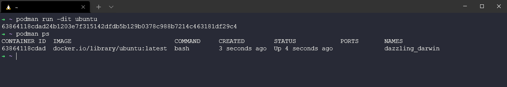
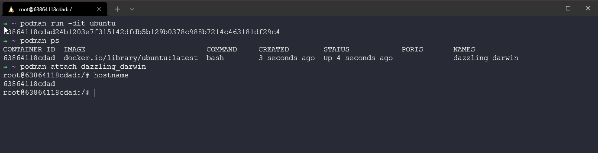

## Các lựa chọn thay thế cho Docker

Tôi đã nói ngay từ đầu rằng chúng ta sẽ sử dụng Docker cho loạt bài viết về Container, đơn giản vì có rất nhiều tài nguyên và cộng động sử dụng rất lớn, ngoài ra nó cũng là lý do khiến container trở nên phổ biến. Tôi nghĩ chúng ta nên tìm hiểu về lịch sử hình thành và phát triển của Docker, tôi thấy nó rất hữu ích. 

Nhưng như tôi đã đề cập, chúng ta có những lựa chọn khác thay thế cho Docker. Nếu chúng ta nghĩ Docker là gì và nó giúp gì cho chúng ta thì nó là một nền tảng để phát triển, kiểm thử, triển khai và quản lý các ứng dụng.

Tôi muốn làm nổi bật một vài lựa chọn thay thế cho Docker mà bạn có thể hoặc sẽ thấy trong tương lai.

### Podman

Podman là gì? Podman là một container engine không sử dụng deamon nhằm phát triển, quản lý và chạy các bộ OCI containers trên hệ thống Linux. Các containers có thể được chạy với quyền root và non-root.

Tôi sẽ xem xét điều này từ quan điểm của Windows nhưng biết rằng giống như Docker, không có yêu cầu ảo hoá ở đó vì nó sẽ sử dụng Hệ điều hành cơ bản, điều không thể thực hiện được với Windows.

Podman có thể chạy trên WSL2 mặc dù không có một trải nghiệm mượt mà như với Docker Desktop. Ngoài ra còn có thể sử dụng Windows client để kết nối tới một Linux VM nơi mà containers của bạn sẽ chạy.

Ubuntu của tôi trên WSL2 là phiên bản 20.04. Làm theo các bước tiếp theo sẽ cho phép bạn cài đặt Podman trên phiên bản WSL của mình 

```Shell
echo "deb https://download.opensuse.org/repositories/devel:/kubic:/libcontainers:/stable/xUbuntu_20.04/ /" |
sudo tee /etc/apt/sources.list.d/devel:kubic:libcontainers:stable.list
```
Thêm khoá GPG

```Shell
curl -L "https://download.opensuse.org/repositories/devel:/kubic:\
/libcontainers:/stable/xUbuntu_20.04/Release.key" | sudo apt-key add -
```

Chạy bản cập nhật và nâng cấp hệ thống bằng lệnh `sudo apt-get update && sudo apt-get upgrade`. Cuối cùng, chúng ta có thể cài đặt podman bằng `sudo apt install podman`

Bây giờ chúng ta có thể sử dụng rất nhiều lệnh tương tự với docker, lưu ý rằng chúng ta không có giao diện người dùng đẹp mắt giống docker. Bạn có thể thấy bên dưới tôi đã sử dụng `podman images` và không có gì sau khi cài đặt, sau đó tôi đã sử dụng `podman pull ubuntu` để kéo container image của ubuntu xuống.


Sau đó, chúng ta có thể chạy hình ảnh Ubuntu của mình bằng cách sử dụng `podman run -dit ubuntu` và `podman ps` để xem hình ảnh đang chạy của chúng ta.



Sau đó, để truy cập vào container đó, chúng ta có thể chạy `podman attach dazzling_darwin` tên container của bạn rất có thể sẽ khác.



Nếu bạn đang chuyển từ docker sang podman, bạn cũng nên thay đổi tệp cấu hình của mình thành `alias docker=podman` theo cách đó, bất kỳ lệnh nào bạn chạy với docker cũng sẽ sử dụng podman.

### LXC

LXC là một container engine cho phép người dùng tạo nhiều Linux container được cô lập. Không giống như Docker, LXC hoạt động như một trình ảo hóa để tạo nhiều máy Linux với các tệp hệ thống riêng biệt và các tính năng, cấu hình mạng. Xuất hiện trước Docker và sau đó quay trở lại trong thời gian ngắn do những thiếu sót của Docker.

LXC nhẹ như docker và dễ dàng triển khai.

### Containerd

Một standalone container runtime. Containerd mang lại sự đơn giản và mạnh mẽ cũng như tính di động. Containerd trước đây là một công cụ trong các dịch vụ container của Docker cho đến khi Docker quyết định tách nó ra thành một thành phần độc lập.

Một dự án trong Cloud Native Computing Foundation, nó được đặt cùng với các công cụ vùng chứa phổ biến như Kubernetes, Prometheus và CoreDNS.

### Các công cụ Docker khác

Chúng ta cũng có thể đề cập đến các công cụ và tùy chọn xung quanh Rancher và VirtualBox nhưng có thể sẽ trình bày chi tiết hơn vào một bài viết khác.

[**Gradle**](https://gradle.org/)

- Quét bản dựng cho phép các nhóm cộng tác gỡ lỗi và theo dõi lịch sử của tất cả các bản dựng.
- Các tùy chọn thực thi cung cấp cho các nhóm khả năng xây dựng liên tục để bất cứ khi nào có thay đổi, nhiệm vụ sẽ tự động được thực thi.
- Bố cục kho lưu trữ tùy chỉnh cung cấp cho các nhóm khả năng xử lý bất kỳ cấu trúc thư mục tệp nào dưới dạng kho lưu trữ cho artifact.

[**Packer**](https://packer.io/)

- Khả năng tạo song song nhiều hình ảnh máy để tiết kiệm thời gian của nhà phát triển và tăng hiệu quả.
- Các nhóm có thể dễ dàng gỡ lỗi các bản dựng bằng trình gỡ lỗi của Packer, công cụ này sẽ kiểm tra các lỗi và cho phép các nhóm thử các giải pháp trước khi bắt đầu lại các bản dựng.
- Hỗ trợ nhiều nền tảng thông qua plugin để các nhóm có thể tùy chỉnh bản dựng của mình.


[**Logspout**](https://github.com/gliderlabs/logspout)

- Công cụ ghi log - Khả năng tùy chỉnh của công cụ này cho phép các nhóm gửi cùng một nhật ký đến nhiều điểm đến.
- Các nhóm có thể dễ dàng quản lý các tệp của họ vì công cụ này chỉ yêu cầu quyền truy cập vào Docker socket.
- Mã nguồn mở và dễ triển khai.

[**Logstash**](https://www.elastic.co/products/logstash)

- Tùy chỉnh quy trình của bạn và dễ dàng tích hợp với Logstash pluggable framework.
- Dễ dàng phân tích cú pháp và chuyển đổi dữ liệu của bạn để phân tích và mang lại giá trị kinh doanh.
- Nhiều đầu ra khác nhau của Logstash cho phép bạn định tuyến dữ liệu của mình đến nơi bạn muốn.

[**Portainer**](https://www.portainer.io/)

- Sử dụng các mẫu được tạo sẵn hoặc tạo mẫu của riêng bạn để triển khai các ứng dụng.
- Tạo nhóm và gán vai trò và quyền cho các thành viên trong nhóm.
- Biết những gì đang chạy trong từng môi trường bằng bảng điều khiển của công cụ.

## Tài nguyên tham khảo

- [TechWorld with Nana - Docker Tutorial for Beginners](https://www.youtube.com/watch?v=3c-iBn73dDE)
- [Programming with Mosh - Docker Tutorial for Beginners](https://www.youtube.com/watch?v=pTFZFxd4hOI)
- [Docker Tutorial for Beginners - What is Docker? Introduction to Containers](https://www.youtube.com/watch?v=17Bl31rlnRM&list=WL&index=128&t=61s)
- [WSL 2 with Docker getting started](https://www.youtube.com/watch?v=5RQbdMn04Oc)
- [Blog on getting started building a docker image](https://stackify.com/docker-build-a-beginners-guide-to-building-docker-images/)
- [Docker documentation for building an image](https://docs.docker.com/develop/develop-images/dockerfile_best-practices/)
- [YAML Tutorial: Everything You Need to Get Started in Minute](https://www.cloudbees.com/blog/yaml-tutorial-everything-you-need-get-started)
- [Podman | Daemonless Docker | Getting Started with Podman](https://www.youtube.com/watch?v=Za2BqzeZjBk)
- [LXC - Guide to building an LXC Lab](https://www.youtube.com/watch?v=cqOtksmsxfg)

Hẹn gặp lại vào [ngày 49](day49.md)
