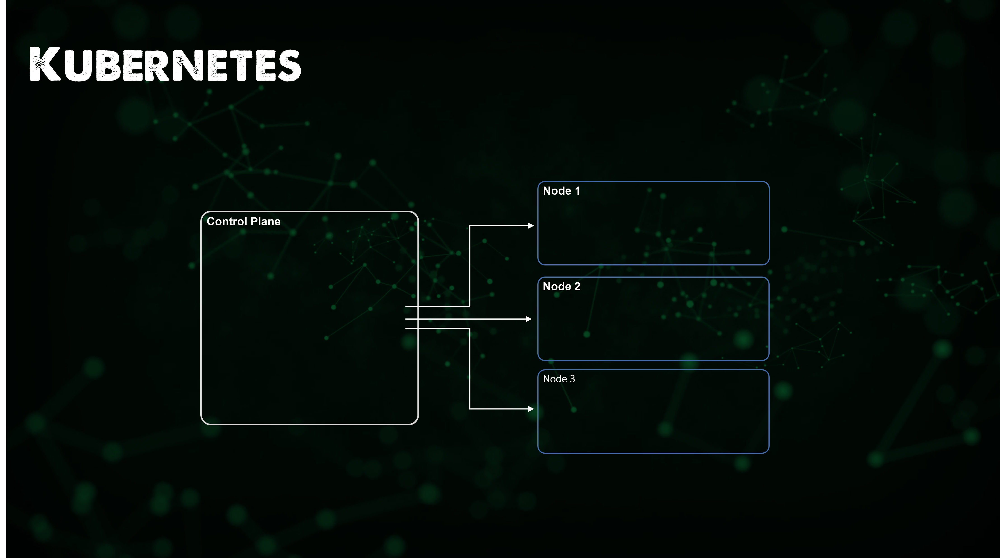
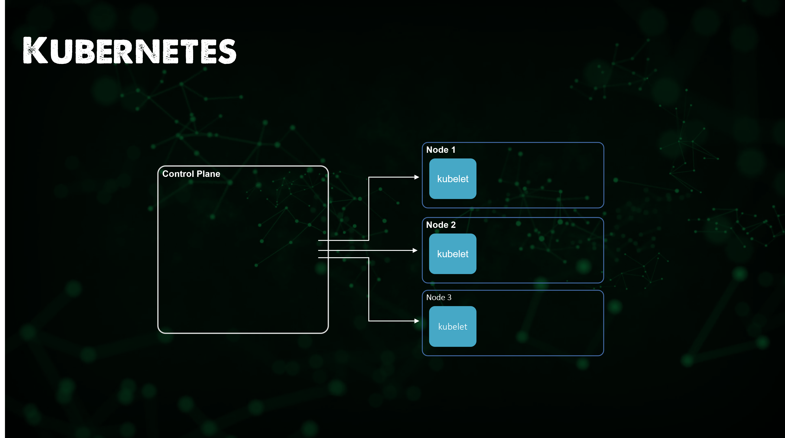
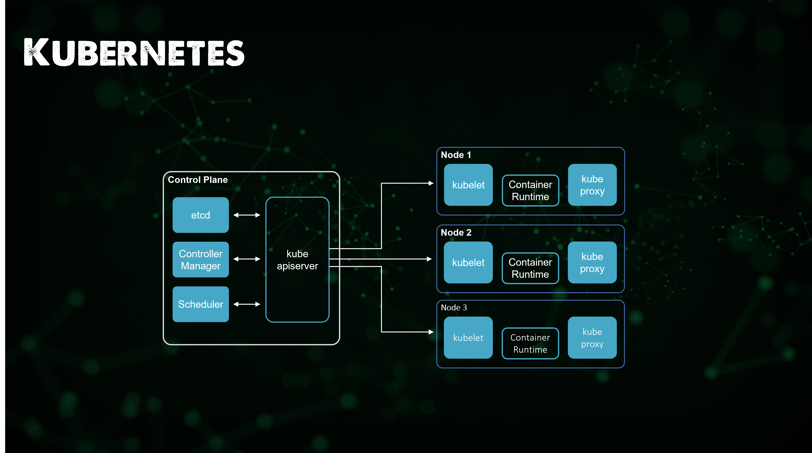
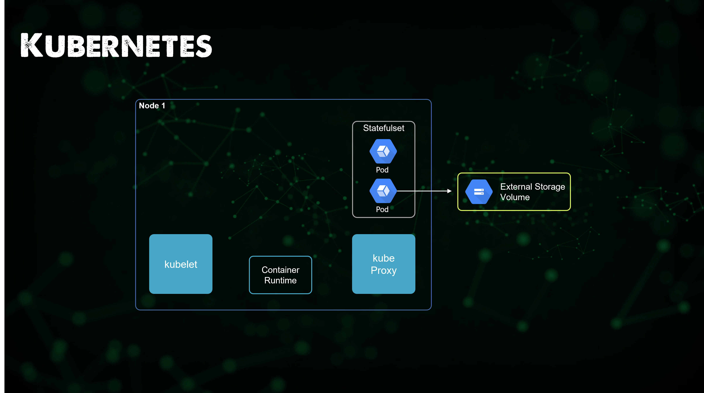
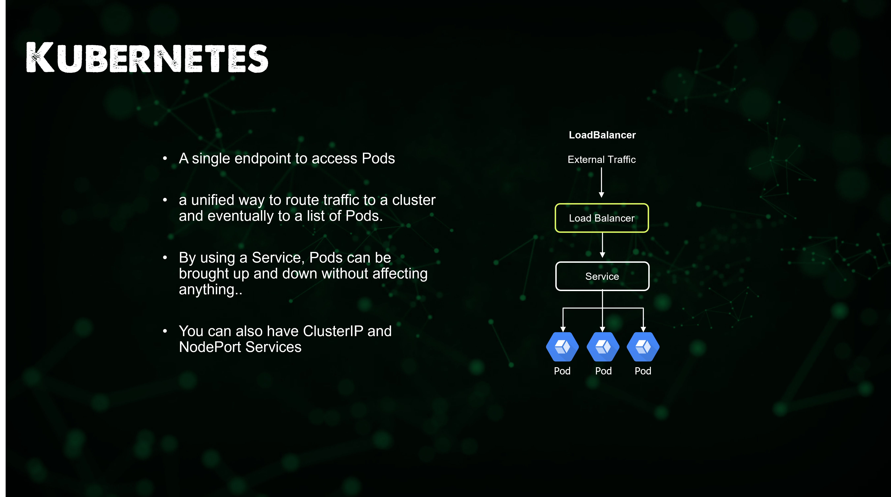

## Bức tranh toàn cảnh: Kubernetes

Trong phần trước, chúng ta đã đề cập đến Containers, container chưa đạt yêu cầu khi xem xét khía cạnh điều chỉnh quy mô (scaling) và điều phối (orchestration). Thứ tốt nhất chúng ta có thể làm là docker-compose để tạo một ứng dụng với nhiều container. Khi nói đến Kubernetes, một Container Orchestrator, nó mang lại chúng ta khả năng tăng và giảm quy mô một cách tự động hoặc dựa trên tải ứng dụng và dịch vụ của bạn.

Là một nền tảng, Kubernetes cung cấp khả năng sắp xếp các container theo yêu cầu và trạng thái mong muốn của bạn. Chúng ta sẽ đề cập đến Kubernetes trong phần này vì nó đang nổi lên là một cách để triển khai cơ sở hạ tầng tiếp theo. Tôi cũng đề xuất rằng, từ góc độ DevOps, Kubernetes chỉ là một nền tảng mà bạn cần có hiểu biết cơ bản, cũng như về bare metal, ảo hoá và rất có thể là các dịch vụ dựa trên điện toán đám mây. Kubernetes chỉ là một tuỳ chọn khác để chạy các ứng dụng của bạn.

### Container Orchestration (Điều phối container) là gì?

Tôi đã đề cập tới Kubernetes và tôi đã đề cập tới Container Orchestration, Kubernetes là công nghệ trong khi điều phối container là khái niệm, quy trình phía sau công nghệ đó. Kubernetes không phải là nền tảng Điều phối container duy nhất mà chúng ta còn có Docker Swarm, HashiCorp Nomad và các nền tảng khác. Nhưng Kubernetes đang phát triển ngày càng mạnh mẽ, vì vậy tôi muốn đề cập đến Kubernetes nhưng muốn nói rằng nó không phải công nghệ duy nhất ngoài kia.

### Kubernetes là gì?

Điều đầu tiên bạn nên đọc nếu bạn chưa quen với Kubernetes là tài liệu chính thức. Kinh nghiệm của tôi khi thực sự tìm hiểu sâu về Kubernetes hơn một năm trước là đó sẽ là một quá trình học tập đòi hỏi nhiều thời gian. Xuất phát từ nền tảng ảo hoá và lưu trữ, tôi đã nghĩ nó sẽ rất khó khăn.

Nhưng cộng động và tài nguyên học tập miễn phí và các tư liệu cực kỳ tốt. [Kubernetes.io](https://kubernetes.io/docs/concepts/overview/what-is-kubernetes/)

_Kubernetes là một nền tảng mã nguồn mở, di động, có thể mở rộng để quản lý khối lượng công việc và dịch vụ được chạy trên container, hỗ trợ cả cấu hình khai báo và tự động hóa. Nó có một hệ sinh thái lớn, phát triển nhanh chóng. Các dịch vụ, hỗ trợ và công cụ Kubernetes được phổ biến rộng rãi._

Những điều quan trọng cần lưu ý trong câu trích dẫn trên, Kubernetes là dự án mã nguồn mở với lịch sử bắt nguồn từ Google, người đã trao tặng dự án cho tổ chức Cloud Native Computing Foundation (CNCF) và nó hiện cũng đang được phát triển bởi cộng đồng mã nguồn mở và các doanh nghiệp lớn góp phần tạo nên Kubernetes như ngày nay.

Tôi đã đề cập ở trên về việc các container tốt như thế nào và trong phần trước, chúng ta đã nói về cách container và các container image đã thay đổi và đẩy nhanh việc áp dụng các hệ thống cloud-native. Nhưng chỉ riêng container sẽ không cung cấp trải nghiệm sẵn sàng cho môi trường sản xuất của các ứng dụng của bạn. Kubernetes cung cấp cho chúng ta những điều sau:

- **Phát hiện dịch vụ (Service discovery) và cân bằng tải (load balancing)** Kubernetes có thể expose một container bằng cách sử dụng DNS hoặc địa chỉ IP của chúng. Nếu lưu lượng truy cập vào container cao, Kubernetes có thể cân bằng tải và điều phối lưu lượng mạng để quá trình triển khai được ổn định.

- **Điều phối lưu trữ (Storage orchestration)** Kubernetes cho phép bạn tự động gắn hệ thống lưu trữ mà bạn chọn, chẳng hạn như lưu trữ cục bộ (local storage) hoặc các dịch vụ lưu trữ sử dụng điện toán đám mây công cộng,...

- **Tự động triển khai và khôi phục (Automated rollouts and rollbacks)** Bạn có thể mô tả trạng thái mong muốn cho các containers đã triển khai của mình bằng Kubernetes và nó có thể thay đổi trạng thái mong muốn với tốc độ được kiểm soát. Ví dụ: bạn có thể tự động hoá Kubernetes để tạo container mới cho quá trình triển khai của mình, xoá container hiện có và sử dụng tất cả các tài nguyên của chúng ta cho container mới được tạo.

- **Đóng gói tự động** Bạn cung cấp cho Kubernetes một cluster gồm nhiều nodes mà nó có thể sử dụng để chạy các tác vụ được đóng gói trong các containers. Bạn cho Kubernetes biết lượng CPU và bộ nhớ (RAM) mà mỗi container cần. Kubernetes có thể sắp xếp các containers và các nodes của bạn để có thể tận dụng các tài nguyên một cách tốt nhất. 

- **Tự phục hồi** Kubernetes khởi động lại các container bị lỗi, thay thế các container, xoá bỏ các container không phản hồi các health-check do người dùng quy định và không sử dụng các container cho các yêu cầu từ người dùng cho đến khi chúng ở trạng thái sẵn sàng.

- **Quản lý cấu hình và bí mật (Secret and configuration management)** Kubernetes cho phép bạn lưu trữ và quản lý thông tin nhạy cảm, chẳng hạn như mật khẩu, OAuth tokens, hoặc SSH keys. Bạn có thể triển khai và cập nhật các giá trị bí mật cũng như cấu hình ứng dụng mà không cần xây dựng lại container image cũng như không để lộ các giá trị đó trong cấu hình hệ thống của bạn.

Kubernetes cung cấp cho bạn một framework để chạy các hệ thống phân tán một cách linh hoạt.

Container Orchestration quản lý việc triển khai, sắp xếp và vòng đời của các containers.

Nó cũng có các nhiệm vụ khác:

- Quản lý, liên kết các máy chủ thành một cluster.
- Quản lý lập lịch, sắp xếp các containers trên các nodes thông qua scheduler.
- Khám phá dịch vụ (service discovery) biết vị trí của các containers trong các nodes thông qua scheduler.
- Đảm bảo đủ số lượng nodes và containers cho khối lượng công việc được yêu cầu thông qua replication.
- Quản lý sức khoẻ, phát hiện và thay thế các nodes, containers.

### Các thành phần chính của Kubernetes

Kubernetes là một công cụ điều phối containers cho phép cung cấp, quản lý và mở rộng quy mô ứng dụng. Bạn có thể sử dụng nó để quản lý vòng đời của các ứng dụng được container hoá trong các nodes của một cluster - là một tập hợp các máy worker như các máy ảo hoặc các máy vật lý.

Ứng dụng của bạn có thể cần nhiều tài nguyên khác để chạy, chẳng hạn như ổ đĩa, mạng và các giá trị bí mật giúp bạn kết nối với cơ sở dữ liệu, nói chuyện với các hệ thống được bảo vệ bởi tường lửa và khóa bảo mật. Với Kubernetes, bạn có thể thêm các tài nguyên đó vào ứng dụng của mình. Tài nguyên cơ sở hạ tầng mà ứng dụng của bạn cần sẽ được quản lý quản lý theo dạng khai báo.

Hình mẫu chính (key paradigm) của Kubernetes là mô hình khai báo của nó. Bạn cung cấp trạng thái mà bạn muốn và Kubernetes sẽ biến nó thành hiện thực. Nếu bạn cần năm instances, thì bạn không tự mình khởi động năm instances riêng biệt. Thay vào đó, bạn nói với Kubernetes rằng bạn cần năm instances và Kubernetes sẽ tự động điều chỉnh trạng thái. Nếu xảy ra sự cố với một trong các instances của bạn, Kubernetes vẫn biết trạng thái mà bạn muốn và tạo các instances trên một node có sẵn.

### Node

#### Control Plane

Mỗi Kubernetes cluster yêu cầu một Control plane node, các thành phần của control plane đưa ra các quyết định chung về cluster đó (ví dụ: lập lịch), cũng như phát hiện và phản hồi các sự kiện của cluster.

#### Worker Node

Một máy worker chạy khối lượng công vuệc của Kubernetes. Nó có thể là một máy vật lý (bare metal) hoặc máy ảo (VM). Mỗi node có thể lưu trữ một hoặc nhiều pods. Các nodes của Kubernetes được quản lý bởi một control plane.

Có nhiều loại node khác nữa nhưng tôi sẽ không đề cập tại đây.

#### kubelet

Một agent chạy trên mọi node trong cluster. Nó đảm bảo rằng các containers đang được chạy trong pod.

Kubelet nhận một bộ PodSpecs được cung cấp thông qua các cơ chế khác nhau và đảm bảo rằng các vùng chứa được mô tả trong các PodSpec đó đang chạy và khoẻ mạnh. Kubelet không quản lý các containers không được tạo bởi Kubernetes.

#### kube-proxy

kube-proxy là một proxy mạng chạy trên mỗi node trong cluster của bạn, triển khai một phần của khái niệm Kubernetes Service.

kube-proxy duy trì các quy tắc mạng trên các nodes. Các quy tắc mạng này cho phép giao tiếp mạng với các Pods của bạn từ các sessions mạnh bên trong hoặc bên ngoài cluster của bạn. 

kube-proxy sử dụng lớp lọc gói tin (packet filtering layer) của hệ điều hành nếu có thể. Nếu không, kube-proxy tự chuyển tiếp traffic.

#### Container runtime

The container runtime là phần mềm chịu trách nhiệm chạy các containers. 

Kubernetes hỗ trợ một số container runtimes: Docker, containerd, CRI-O, và mọi các triển khai của Kubernetes CRI (Container Runtime Interface).

### Cluster

Cluster là một nhóm các nodes, trong đó một node có thể là một máy vật lý hoặc một máy ảo. Mỗi node sẽ có container runtime (Docker) và cũng sẽ chạy một kubelet service, là agent nhận các lệnh từ Master controller (sẽ nói thêm sau) và một Proxy được sử dụng để kết nối proxy tới các Pods khác từ một thành phần khác (Services, thứ mà chúng ta sẽ đề cập sau).

Control plane của chúng ta có thể được triển khai với độ sẵn sàng cao (HA) sẽ chứa một số vai trò khác biệt với các worker nodes, quan trọng nhất sẽ là máy chủ kube API, đây là nơi sẽ diễn ra mọi giao tiếp để lấy thông tin hoặc đẩy thông tin đến Kubernetes cluster của chúng ta.

#### Máy chủ Kube API

Máy chủ Kubernetes API xác thực và định cấu hình dữ liệu cho các đối tượng API bao gồm pods, services, replication controllers, và các đối tượng khác. Máy chủ API phụ vụ các tác vụ REST và cung cấp giao diện người dùng cho các trạng thái được chia sẻ của cluster qua đó tất cả các thành phần khác có thể tương tác.

#### Scheduler

Kubernetes scheduler (bộ lập lịch) là một quy trình của control plane lập lịch các Pods cho các Nodes. Scheduler xác định node nào là vị trí thích hợp cho từ pod trong hàng đợi lập lịch theo các ràng buộc và tài nguyên sẵn có. Sau đó, Scheduler sẽ xếp hạng từng node hợp lệ gắn pod vào một node thích hợp.

#### Controller Manager

Kubernetes controller manager là một trình chạy nền có các vòng điều khiển lõi được cài đặt cùng với Kubernetes. Trong các ứng dụng của người máy hoặc tự động hoá, vòng điểu khiển là một vòng lặp không kết thúc để điều chỉnh trạng thái của hệ thống. Trong Kubernetes, bộ điều khiển là một vòng điều khiển theo dõi trạng thái được chia sẽ của cluster thông qua máy chủ api và thực hiện các thay đổi nhằm chuyển trạng thái hiện tại sang trạng thái mong muốn.

#### etcd

Kho lưu trữ dạng key-value có tính nhất quán và độ sẵn sàng cao được sử dụng để lưu trữ toàn bộ cấu hình, trạng thái của Kubernetes cluster.

#### kubectl

Để quản lý Kubernetes cluster bằng CLI, chúng ta có kubectl, kubectl tương tác với API server.

Công cụ dòng lệnh của Kubernetes, kubectl cho phép bạn chạy các lệnh tương tác với Kubernetes cluster. Bạn có thể sử dụng kubectl để triển khai ứng dụng, kiểm tra và quản lý tài nguyên của cluster cũng như xem log.

### Pods

Pod là một nhóm các container tạo thành một ứng dụng logic. Ví dụ: Nếu bạn có một ứng dụng web đang chạy nodejs container và một MySQL container thì cả hai containers này có thể được đặt trong một pod duy nhất. Một pod cũng có thể chia sẻ các volumes dữ liệu chung và chúng cũng chia sẻ một networking namespace. Hãy nhớ rằng các pod là tạm thời và chúng có thể được bật hoặc tắt bởi Master Controller. Kubernetes sử dụng một phương tiện đơn giản nhưng hiệu quả để xác định các pod thông qua khái niệm Labels (nhãn: key - values).

- Pods sử lý Volumes, Secrets, và cấu hình cho containers.
- Pod mang tính tạm thời (ephemeral). Chúng sẽ tự khởi động lại khi chúng gặp lỗi.
- Pod được replicated khi ứng dụng mở rộng quy mô theo chiều ngang bởi ReplicaSet. Mỗi pod sẽ chạy cùng một container code.
- Pods chạy trên các Worker nodes.

### Deployments

- Bạn chỉ có thể quyết định chạy Pods, nhưng khi chúng gặp lỗi chúng sẽ biến mất.
- Một Deployment sẽ cho phép pod của bạn chạy liên tục.
- Deployment cho phép bạn cập nhật ứng dụng đang chạy mà không có đowntime.
- Deployment cũng xác định một chiến lược khởi động lại pod khi chúng chết.

### ReplicaSets

- Deployment cũng có thể tạo ReplicaSet.
- Một ReplicaSet đảm bảo ứng dụng của bạn có số lượng pod mong muốn.
- Replicate sẽ tạo vả mở rộng các nhóm dựa trên Deployment

### StatefulSets

- Ứng dụng của bạn có yêu cầu bạn lưu giữ thông tin về trạng thái của nó không?
- Một cơ sở dữ liệu cần trạng thái
- Các Pod của StatefulSet không thể hoán đổi cho nhau.
- Mỗi nhóm có một mã định danh duy nhất, cố định mà controller duy trì trong mọi lần lập lịch lại.

### DaemonSets

- DeamonSets được sử dụng cho các tiến trình liên tục.
- Chạy trên một pod trong mỗi node.
- Mỗi node mới được thêm vào cluster sẽ bắt đầu một pod mới
- Hữu ích cho các tác vụ nên như monitoring hay thu thập log
- Mỗi pod có một mã định danh duy nhất và cố định mà controller duy trì trong mọi lần lập lịch lại.

### Services

- Một endpoint duy nhất để truy cập các pods.
- Một cách thống nhất để định tuyến lưu lượng truy cập đến một cluster và cuối cùng là các pods.
- Bằng cách sử dụng Services, các pods có thể được khởi động và tắt mà không ảnh hưởng đến bất cứ thứ gì.

Đây chỉ là khái quát nhanh và ghi chú về các khối xây dựng cơ bản của Kubernetes, chúng ta có thể sử dụng kiến thức này và thêm vào một số kiến thức khác xung quanh Storage và Ingress để cải thiện ứng dụng của mình nhưng cũng có nhiều lựa chọn về nơi mà bạn muốn chạy Kubernetes cluster của mình. Phần tiếp theo sẽ tập trung vào các tuỳ chọn về nơi chạy cluster Kubernetes, đồng thời tìm hiểu thêm một số kiến thức cụ thể về Storage.

### Những gì chúng ta sẽ đề cập trong loạt bài về Kubernetes

- Kiến trúc Kubernetes
- Các câu lệnh kubectl 
- Kubernetes YAML
- Kubernetes Ingress
- Kubernetes Services
- Helm Package Manager
- Lưu trữ liên tục - Persistent Storage
- Ứng dụng có trạng thái - Stateful Apps

## Tài liệu tham khảo

- [Kubernetes Documentation](https://kubernetes.io/docs/home/)
- [TechWorld with Nana - Kubernetes Tutorial for Beginners [FULL COURSE in 4 Hours]](https://www.youtube.com/watch?v=X48VuDVv0do)
- [TechWorld with Nana - Kubernetes Crash Course for Absolute Beginners](https://www.youtube.com/watch?v=s_o8dwzRlu4)
- [Kunal Kushwaha - Kubernetes Tutorial for Beginners | What is Kubernetes? Architecture Simplified!](https://www.youtube.com/watch?v=KVBON1lA9N8)

Hẹn gặp lại vào [ngày 50](day50.md)
