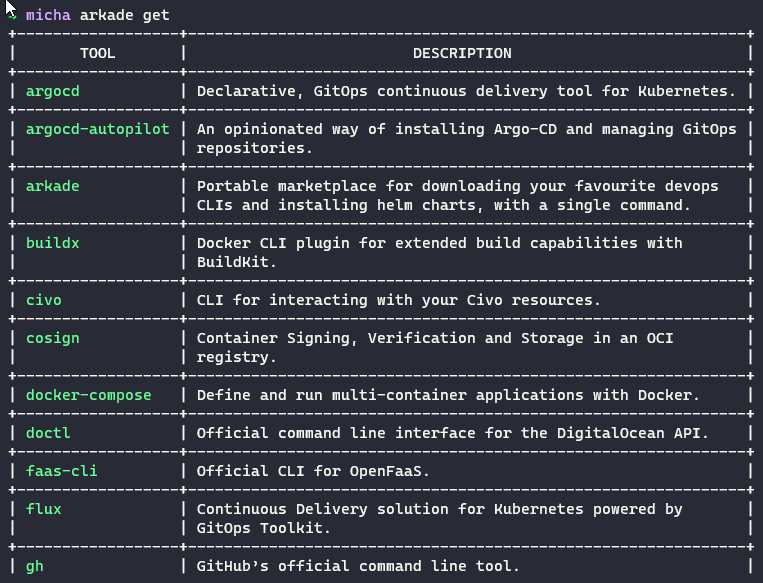
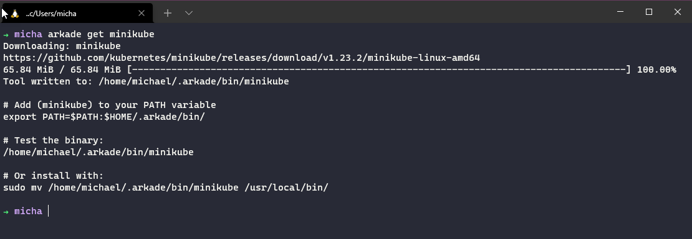
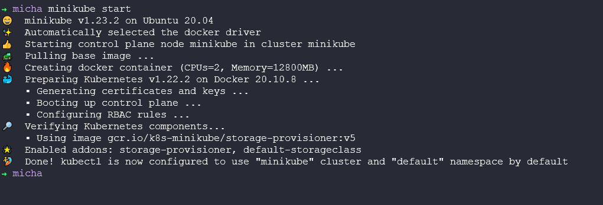
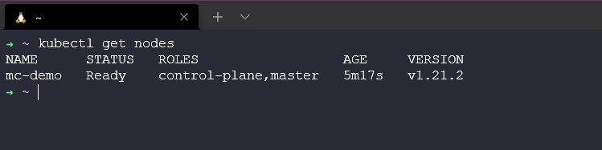

## Triển khai cluster Kubernetes đầu tiên

Trong bài viết này, chúng ta sẽ thiết lập và chạy một Kubernetes cluster trên máy tính cá nhân sử dụng minikube, điều này sẽ cung cấp cho chúng ta một cluster cơ bản cho phần còn lại của tuần nói về Kubernetes. Mặc dù chúng ta cũng sẽ xem xét tới việc triển khai một Kubernetes cluster với Virtual Box trong phần sau. Lý do chọn phương pháp này so với sử dụng dịch vụ được quản lý bởi các nhà cung cấp điện toán đám mây công cộng là vì nó sẽ khiến bạn tốn tiền ngay cả với bậc miễn phí, tôi đã chia sẻ một số blog nếu bạn muốn thực hiện điều đó vào [ngày 50](day50.md).

### Minikube là gì?

> "minikube nhanh chóng thiết lập một Kubernetes cluster cục bộ trên macOS, Linux và Windows. Chúng tôi tập trung vào việc trợ giúp các nhà phát triển ứng dụng và những người dùng mới của Kubernetes"

Bạn có thể không phải là đối tượng được nhắc tới ở trên nhưng tôi nhận thấy minikube là một công cụ tuyệt vời nếu bạn chỉ muốn thực nghiệm thứ gì đó với Kubernetes, bạn có thể dễ dàng triển khai một ứng dụng và chúng cũng có một số add-ons rất tốt sẽ được giới thiệu ngay sau đây.

Để bắt đầu, bất kể hệ điều hành nào cũng có thể chạy minikube. Trước tiên, hãy truy cập vào [trang web chính thức của dự án tại đây](https://minikube.sigs.k8s.io/docs/start/) để chọn phương pháp cài đặt. Tôi không sử dụng cách này nhưng bạn có thể chọn cách của tôi ở dưới dây.

Được đề cập ở dưới, bạn cần phải có "Trình quản lý container hoặc máy ảo, ví dụ như Docker, Hyper kit, Hyper-V, KVM, Parallels, Podman, VirtualBox, hoặc VMware", đó sẽ là nơi Minikube chạy một cách dễ dàng nhất. Bạn có thể cài đặt Docker trên hệ thống của mình bằng cách sử dụng [hướng dẫn sau](https://docs.docker.com/get-docker/).

### Các cài đặt minikube và các phần mềm khác của tôi 

Tôi đã sử dụng Arkade được một thời gian để tải tất cả các công cụ liên quan tới Kubernetes và CLIs, bạn có thể xem hướng dẫn cài đặt trên [github repository này](https://github.com/alexellis/arkade) để bắt đầu với Arkade. Tôi cũng đã đề cập đến điều này trong các bài đăng khác khi tôi muốn cài đặt thứ gì đó. Sự đơn giản của việc chỉ cần nhập arkade get và sau đó xem liệu công cụ hoặc cli của bạn có hay không sẽ giúp ích rất nhiều cho bạn. Trong tuần về Linux, chúng ta đã nói về trình quản lý gói và quy trình cài đặt các phần mềm, bạn có thể nghĩ rằng Arkade là một marketplace cho tất cả các ứng dụng và CLI cho Kubernetes. Một công cụ hữu ích và nhỏ gọn cho hệ thống của bạn, viết bằng Golang và có thể dùng với mọi platform.

Là một phần của danh sách dài các ứng dụng có sẵn trong arkade, minikube có thể được tải xuống và cài đặt một cách đơn giản với câu lệnh `arkade get minikube`.

Chúng ta cũng sẽ cần kubectl như một phần của các công cụ, vì vậy bạn cũng có thể cài đặt nó thông qua arkade hoặc tôi tin rằng theo như tài liệu của minikube, nó cũng được cài đặt thông qua câu lệnh curl ở bên trên. Chúng ta sẽ nói về kubectl ở phần sau của bài viết.

### Bắt đầu và chạy Kubernetes cluster

Đối với phần này, tôi muốn đề cập đến các lựa chọn có sẵn cho chúng ta khi thiết lập và chạy một Kubernetes cluster trên máy tính cá nhân của bạn. Chúng ta có thể chỉ cần chạy lệnh sau và một cluster sẽ được tạo cho bạn sử dụng.

minikube được sử dụng trên dòng lệnh và khi mọi thứ được cài đặt, bạn chỉ cần lệnh `minikube start` để triển khai Kubernetes cluster đầu tiên của mình. Bạn sẽ thấy bên dưới Docker Driver sẽ là lựa chọn mặc định cho nơi mà chúng ta sẽ chạy các node ảo hoá của mình. Tôi đã đề cập ở phần đầu của bài viết về các tuỳ chọn khác có sẵn, chúng sẽ hữu ích khi bạn muốn mở rộng Kubernetes cluster cục bộ này.

Một minikube cluster sẽ bao gồm một docker container trong instance đó và sẽ có control plane node và worker node chạy trong cùng một instance trong khi thông thường, bạn sẽ tách riêng các node đó. Chúng ta sẽ đề cập đến điều đó trong phần tiếp theo, nơi chúng ta sẽ xem qua các môi trường Kubernetes trên máy tính cá nhân nhưng gần hơn một chút với kiến ​​trúc của môi trường sản xuất.

Tôi đã đề cập tới vấn đề này một vài lần, tôi thích minikube vì chúng có các add-ons sẵn có, khả năng triển khai một cluster bằng một lệnh đơn giản bao gồm tất cả các add-ons cần thiết ngay từ đầu giúp tôi triển khai cùng một thiết lập mọi lúc.

Bạn có thể thấy danh sách các add-ons ở dưới đây, tôi thường sử dụng add-on `CSI-host path-driver` và `volumesnapshots` nhưng bạn có thể xem danh sách đầy đủ ở dưới. Chắc chắn rằng các addon này thường có thể được triển khai bằng cách sử dụng Helm, thứ mà chúng ta sẽ đề cập sau trong phần Kubernetes, nó gíup mọi thứ đơn giản hơn nhiều.

Tôi cũng đang xác định trong dự án của mình một số cấu hình bổ sung, apiserver được cấu hình trên port 6433 thay vì một port API ngẫu nhiên, và tôi sẽ cấu hình container runtime sử dụng containerd dù docker là lựa chọn mặc định và CRI-O cũng có thể được lựa chọn. Tôi cũng cài đặt một phiên bản Kubernetes cụ thể.

Bây giờ, chúng ta đã sẵn sàng để triển khai Kubernetes cluster với minikube. Tôi đã đề cập trước đây rằng bạn sẽ cần `kubectl` để tương tác với cluster của bạn. Bạn có thể cài đặt nó với arkade bằng câu lệnh `arkade get kubectl`

hoặc bạn có thể tải xuống từ trang web chính thức cho các nền tảng

- [Linux](https://kubernetes.io/docs/tasks/tools/install-kubectl-linux)
- [macOS](https://kubernetes.io/docs/tasks/tools/install-kubectl-macos)
- [Windows](https://kubernetes.io/docs/tasks/tools/install-kubectl-windows)

Khi bạn đã có kubectl, chúng ta có thể tương tác với cluster sử dụng câu lệnh đơn giản `kubectl get nodes`

### kubectl là gì?

kubectl là một CLI (Command line interface - giao diện dòng lệnh) giúp bạn tương tác với Kubernetes clusters, chúng ta đang sử dụng nó ở đây để tương tác với minikube cluster của mình nhưng chúng ta cũng có thể sử dụng kubectl để tương tác với các cluster của doanh nghiệp chạy trên các đám mây công cộng.

Chúng ta sử dụng kubectl để triển khai các ứng dụng cũng như kiểm tra và quản lý các tài nguyên của cluster. Bạn có thể đọc về [Tổng quan kubectl](https://kubernetes.io/docs/reference/kubectl/overview/) trên trang web chính thức của Kubernetes.

kubectl tương tác với máy chủ API được chạy trên control plan node đã được chúng ta đề cập ở bài viết trước.

### kubectl cheat sheet

Cùng với tài liệu chính thức, tôi cũng hay sử dụng trang web này để tìm kiếm các câu lệnh của [Unofficial Kubernetes](https://unofficial-kubernetes.readthedocs.io/en/latest/)

| Liệt kê các tài nguyên        |                                            |
| ------------------------ | ------------------------------------------ |
| kubectl get nodes        | Liệt kê tất cả các nodes trong cluster                  |
| kubectl get namespaces   | Liệt kê tất cả các namespaces trong cluster             |
| kubectl get pods         | Liệt kê tất cả các pods trong namespace mặc định của cluster |
| kubectl get pods -n name | Liệt kê tất cả các pods trong namespace "name"           |

| Tạo các tài nguyên            |                                             |
| ----------------------------- | ------------------------------------------- |
| kubectl create namespace name | Tạo một namespace với tên "name"            |
| kubectl create -f [filename]  | Tạo một tài nguyên từ tệp JSON hoặc YAML: |

| Điều chỉnh các tài nguyên            |                   |
| ---------------------------- | ----------------- |
| kubectl edit svc/servicename | Điều chỉnh một service |

| Thông tin chi tiết hơn về tài nguyên |                                                         |
| ------------------------ | ------------------------------------------------------- |
| kubectl describe nodes   | hiển thị chi tết trạng thái của các nodes |

| Xoá tài nguyên   |                                                  |
| ------------------ | ------------------------------------------------ |
| kubectl delete pod | Xoá các tài nguyên, có thể tử stdin hoặc tệp |

Bạn có thể muốn biết các tên viết tắt của một số tài nguyên trên kubectl, ví dụ `-n` là tên viết tắt của `namespace` giúp bạn dễ dàng thao tác hơn và làm code của bạn trông gọn gàng hơn.

| Tên rút gọn | Tên đầy đủ                  |
| ---------- | -------------------------- |
| csr        | certificatesigningrequests |
| cs         | componentstatuses          |
| cm         | configmaps                 |
| ds         | daemonsets                 |
| deploy     | deployments                |
| ep         | endpoints                  |
| ev         | events                     |
| hpa        | horizontalpodautoscalers   |
| ing        | ingresses                  |
| limits     | limitranges                |
| ns         | namespaces                 |
| no         | nodes                      |
| pvc        | persistentvolumeclaims     |
| pv         | persistentvolumes          |
| po         | pods                       |
| pdb        | poddisruptionbudgets       |
| psp        | podsecuritypolicies        |
| rs         | replicasets                |
| rc         | replicationcontrollers     |
| quota      | resourcequotas             |
| sa         | serviceaccounts            |
| svc        | services                   |

Điều cuối cùng cần bổ sung ở đây là tôi đã tạo một dự án khác xung quanh minikube để giúp tôi nhanh chóng tạo ra các môi trường demo để hiển thị các dịch vụ dữ liệu và bảo vệ các workload đó với Kasten K10, [Project Pace](https://github.com/MichaelCade/project_pace) có thể được tìm thấy ở đó và tôi luôn chào đón phản hồi và tương tác của bạn, nó cũng có bao gồm một số các tự động để triển khai các minikube cluster của bạn và tạo các ứng dụng dịch vụ dữ liệu khác nhau.

Tiếp theo, chúng ta sẽ triển kahi nhiều node vào các máy ảo bằng VirtualBox nhưng chúng ta sẽ chọn cách dễ hơn như các chúng ta đã làm trong tuần về Linux, sử dụng vagrant để tạo các máy ảo và triển khai các phần mềm theo cách chúng ta mong muốn.

Tôi đã thêm danh sách này vào bài viết ngày hôm qua, đó là các blog hướng dẫn mà tôi đã thực hành với các Kubernetes cluster đã được triển khai.

- [Kubernetes playground – How to choose your platform](https://vzilla.co.uk/vzilla-blog/building-the-home-lab-kubernetes-playground-part-1)
- [Kubernetes playground – Setting up your cluster](https://vzilla.co.uk/vzilla-blog/building-the-home-lab-kubernetes-playground-part-2)
- [Getting started with Amazon Elastic Kubernetes Service (Amazon EKS)](https://vzilla.co.uk/vzilla-blog/getting-started-with-amazon-elastic-kubernetes-service-amazon-eks)
- [Getting started with Microsoft Azure Kubernetes Service (AKS)](https://vzilla.co.uk/vzilla-blog/getting-started-with-microsoft-azure-kubernetes-service-aks)
- [Getting Started with Microsoft AKS – Azure PowerShell Edition](https://vzilla.co.uk/vzilla-blog/getting-started-with-microsoft-aks-azure-powershell-edition)
- [Getting started with Google Kubernetes Service (GKE)](https://vzilla.co.uk/vzilla-blog/getting-started-with-google-kubernetes-service-gke)
- [Kubernetes, How to – AWS Bottlerocket + Amazon EKS](https://vzilla.co.uk/vzilla-blog/kubernetes-how-to-aws-bottlerocket-amazon-eks)
- [Getting started with CIVO Cloud](https://vzilla.co.uk/vzilla-blog/getting-started-with-civo-cloud)
- [Minikube - Kubernetes Demo Environment For Everyone](https://vzilla.co.uk/vzilla-blog/project_pace-kasten-k10-demo-environment-for-everyone)
- [Minikube - Deploy Minikube Using Vagrant and Ansible on VirtualBox](https://medium.com/techbeatly/deploy-minikube-using-vagrant-and-ansible-on-virtualbox-infrastructure-as-code-2baf98188847)

### Những gì chúng ta sẽ đề cập trong loạt bài về Kubernetes

Chúng ta đã đề cập tới một số vấn đề ở dưới và sẽ thực hành nhiều hơn vào ngày mai với cluster thứ 2, nơi mà chúng ta sẽ triển khai ứng dụng của mình.

- Kiến trúc Kubernetes
- Các câu lệnh kubectl 
- Kubernetes YAML
- Kubernetes Ingress
- Kubernetes Services
- Helm Package Manager
- Lưu trữ liên tục - Persistent Storage
- Ứng dụng có trạng thái - Stateful Apps

## Tài liệu tham khảo

- [Kubernetes Documentation](https://kubernetes.io/docs/home/)
- [TechWorld with Nana - Kubernetes Tutorial for Beginners [FULL COURSE in 4 Hours]](https://www.youtube.com/watch?v=X48VuDVv0do)
- [TechWorld with Nana - Kubernetes Crash Course for Absolute Beginners](https://www.youtube.com/watch?v=s_o8dwzRlu4)
- [Kunal Kushwaha - Kubernetes Tutorial for Beginners | What is Kubernetes? Architecture Simplified!](https://www.youtube.com/watch?v=KVBON1lA9N8)
- [Techbeatly - Deploy Minikube Using Vagrant and Ansible on VirtualBox](https://www.youtube.com/watch?v=xPLQqHbp9BM&t=371s)

Hẹn gặp lại vào [ngày 52](day52.md)
