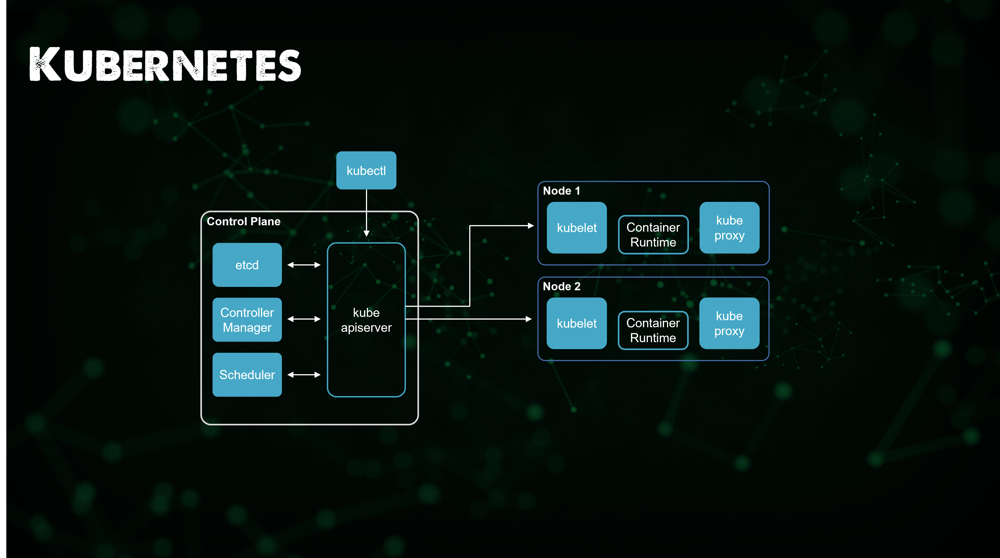

## Thiết lập Kubernetes cluster đa node

Lúc đầu tôi đã tính để title của bài viết này là "Thiết lập Kubernetes cluster đa node với Vagrant" nhưng có thể nó hơi dài!

Trong bài viết ngày hôm qua, chúng ta đã sử dụng một dự án thú vị để triển khai Kubernetes cluster đầu tiên của mình và thực hành chúng với công cụ CLI quan trọng nhất mà bạn sẽ gặp khi sử dụng Kubernetes (kubectl)

Trong bài ngày hôm nay, chúng ta sẽ sử dụng VirtualBox làm cơ sở nhưng như đã đề cập ở lần trước khi chúng ta nói về Vagrant trong phần về Linux, chúng ta có thể sử dụng bất kỳ công cụ ảo hoá nào được hỗ trợ. Đó là [ngày 14](day14.md) khi chúng ta xem xét và triển khai máy chủ Ubuntu.

### Tóm tắt nhanh về Vagrant

Vagrant là một tiện ích CLI giúp quản lý vòng đời các máy ảo của bạn. Chúng ta có thể sử dụng vagrant để tạo, xoá các máy ảo trên nhiều nền tảng khác nhau bao gồm vSphere, Virtual Box và cả Docker. Nó có các nhà cung cấp khác nhưng chúng ta sẽ chọn Virtual Box ở đây.

Tôi sẽ sử dụng [bài viết và repository này](https://devopscube.com/kubernetes-cluster-vagrant/) để cấu hình hệ hống. Tuy nhiên, tôi khuyên rằng nếu đây là lần đầu tiên bạn triển khai một Kubernetes cluster thì bạn cũng có thể xem xét thực hiện điều này một cách thủ công để sau đó ít nhất thì bạn cũng biết nó trông như thế nào. Phải công nhận sau mỗi bản phát hành của Kubernetes, các tác vụ để setup ngày càng được tinh gọn và hiệu quả hơn. Tôi nhớ thời của VMware và ESX và cách bạn mấy 1 ngày để triển khai 3 ESX server, bây giờ chúng ta có thể làm trong 1 giờ. Chúng ta sẽ đi theo hướng đó khi nói đến Kubernetes.

### Môi trường Lab Kubernetes

Tôi đã tải lên trong [Kubernetes folder](../../Days/Kubernetes/) vagrantfile mà chúng ta sẽ sử dụng để xây dựng môi trường. Lấy tệp này và điều hướng đến thư mục trong terminal của bạn. Tôi đang sử dụng Windows nên Powershell là lựa chọn để thực hiện các lệnh trên máy trạm của mình với vagrant. Nếu bạn chưa có vagrant thì bạn có thể sử dụng arkade, hôm qua chúng ta đã đề cập đến nó khi cài đặt minikube và các công cụ khác. Chỉ sử dụng lệnh `arkade get vagrant` và bạn sẽ tải xuống và cài đặt phiên bản vagrant mới nhất.

Khi bạn đang ở trong thư mục của mình, chạy `vagrant up` và nếu tất cả được cấu hình chính xác thì bạn sẽ thấy phần khởi động sau trong terminal của mình.


Trong terminal, bạn sẽ thấy một số bước đang diễn ra, nhưng trong thời gian chờ đợi, hãy xem những gì chúng ta đang chuẩn bị ở đây.



Từ những điều trên, bạn có thể thấy rằng chúng ta sẽ xây dựng 3 máy ảo, chúng ta sẽ có một sẽ có một control plane node và 2 worker nodes. Nếu bạn qua lại [ngày 49](day49.md), bạn có thể đọc lại về những phần trong hình ảnh trên.

Cũng trong hình ảnh đó, chúng ta thấy truy cập kubectl sẽ đến từ bên ngoài cluster tới kube apiserver trong khi thực tế như một phần của việc triển khai vagrant, chúng ta sẽ có kubectl trên mỗi node để có thể truy cập cluster từ trong tất cả các nodes.

Quá trình thực hiện bài lab này có thể kéo dài từ 5 cho tới 30 phút phụ thuộc vào thiếp lập của bạn.

Tôi cũng sẽ sớm đề cập tới các tệp nhưng bạn sẽ nhận thấy nếu bạn xem qua vagrantfile bạn sẽ thấy 3 phần của triển khai và đó chính là nơi cluster được tạo ra. Chúng ta thấy việc sử dụng vagrant để triển khai các máy ảo và cài đặt hệ điều hành của mình dễ dàng như thế nào với các vagrant boxes cũng như khả năng chạy tập lệnh shell như một phần của quy trình triển khai là điều khá thú vị nếu chúng ta tự động hoá các bản dựng của các bài lab.

Sau khi hoàn tất, chúng ta có thể ssh tới một trong các node của mình `vagrant ssh master` từ terinal, username và password mặc định là `vagrant/vagrant`

Bạn cũng có thể sử dụng `vagrant ssh node01` và `vagrant ssh node02` để truy cập các worker nodes nếu bạn muốn.


Bây giờ chúng ta đang ở một trong các node trong cluster mới của chúng ta, có thể sử dụng `kubectl get nodes` để hiển thị 3 node cluster và trạng thái của chúng.


Tại thời điểm này, chúng ta có một cluster với 3 nodes đang chạy, với 1 control plane node và 2 worker nodes.

### Hướng dẫn về Vagrantfile và Shell Script

Nếu chúng ta xem tệp vagrantfile của mình, bạn sẽ thấy rằng chúng ta đang xác định một vài worker node, địa chỉ IP mạng cho mạng bắc cầu trong VirtualBox và sau đó là một số tên đặt. Một điều khác mà bạn cũng sẽ thấy là chúng ta đang gọi một số tập lệnh mà chúng ta muốn chạy trên các máy chủ cụ thể.

```
NUM_WORKER_NODES=2
IP_NW="10.0.0."
IP_START=10

Vagrant.configure("2") do |config|
    config.vm.provision "shell", inline: <<-SHELL
        apt-get update -y
        echo "$IP_NW$((IP_START))  master-node" >> /etc/hosts
        echo "$IP_NW$((IP_START+1))  worker-node01" >> /etc/hosts
        echo "$IP_NW$((IP_START+2))  worker-node02" >> /etc/hosts
    SHELL
    config.vm.box = "bento/ubuntu-21.10"
    config.vm.box_check_update = true

    config.vm.define "master" do |master|
      master.vm.hostname = "master-node"
      master.vm.network "private_network", ip: IP_NW + "#{IP_START}"
      master.vm.provider "virtualbox" do |vb|
          vb.memory = 4048
          vb.cpus = 2
          vb.customize ["modifyvm", :id, "--natdnshostresolver1", "on"]
      end
      master.vm.provision "shell", path: "scripts/common.sh"
      master.vm.provision "shell", path: "scripts/master.sh"
    end

    (1..NUM_WORKER_NODES).each do |i|
      config.vm.define "node0#{i}" do |node|
        node.vm.hostname = "worker-node0#{i}"
        node.vm.network "private_network", ip: IP_NW + "#{IP_START + i}"
        node.vm.provider "virtualbox" do |vb|
            vb.memory = 2048
            vb.cpus = 1
            vb.customize ["modifyvm", :id, "--natdnshostresolver1", "on"]
        end
        node.vm.provision "shell", path: "scripts/common.sh"
        node.vm.provision "shell", path: "scripts/node.sh"
      end
    end
  end
```

Hãy chia nhỏ những tập lệnh đang được chạy. Chúng ta có ba tập lệnh được liệt kê trong VAGRANTFILE để chạy trên các node cụ thể.

`master.vm.provision "shell", path: "scripts/common.sh"`

Tập lệnh trên sẽ tập trung vào việc chuẩn bị cho các nodes sẵn sàng, nó sẽ chạy trên 3 nodes của chúng ta và nó sẽ xoá tất cả các thành phần của Docker đang có và cài đặt lại Docker và ContainerD cũng như kubeadm, kubelet và kubectl. Tập lệnh này cũng sẽ cập nhật các gói phần mềm hiện có trên hệ thống.

`master.vm.provision "shell", path: "scripts/master.sh"`

Tập lệnh `master.sh` sẽ chỉ chạy trên control plane node, tập lệnh này sẽ tạo Kubernetes cluster sử dụng các lệnh kubeadm. Nó cũng sẽ chuẩn bị config context để truy cập vào cluster này, chúng ta sẽ nói đến sau đây.

`node.vm.provision "shell", path: "scripts/node.sh"`

Tập lệnh này chỉ đơn giản là lấy cấu hình do master tạo và kết nối các nodes của chúng ta vào Kubernetes cluster, quá trình kết nối này lại sử dụng kubeadmn và một tập lệnh khác có thể tìm thấy trong thư mục config.

### Truy cập vào Kubernetes cluster

Bây giờ chúng ta đã có hai cluster được triển khai, chúng ta có minikube cluster đã triển khai trong phần trước và có cluster 3 nodes mới mà chúng ta vừa triển khai trên VirtualBox.

Ngoài ra, tệp cấu hình cũng giúp bạn có quyền truy cập trên máy của bạn, bạn đã chạy vagrant bao gồm cách chúng ta có thể truy cập vào cluster từ máy trạm của mình.

Trước khi chúng ta nói đến điều đó, hãy nói qua về context.


Context rất quan trọng, khả năng truy cập Kubernetes cluster từ máy tính để bàn hoặc máy tính xách tay của bạn là cần thiết. Có rất nhiều lựa chọn khác nhau và mọi người sử dụng các hệ điều hành khác nhau được mọi người sử dụng hàng ngày.

Theo mặc định, ứng dụng Kubernetes CLI (kubectl) sử dụng C:\Users\username\.kube\config để lưu trữ các thông tin quan trọng của Kubernetes cluster, chẳng hạn như các endpoints và thông tin đăng nhập. Nếu bạn đã triển khai một cluster, bạn có thể thấy tệp này ở vị trí đó. Nhưng có thể bạn đang sử dụng node chính để chạy các lệnh kubectl của mình thông qua ssh hoặc các phương thức khác thì hi vọng bài viết này sẽ giúp bạn có thể kết nối từ máy trạm của mình.

Sau đó, chúng ta cần lấy tệp kubeconfig từ cluster hoặc chúng ta cũng có thể lấy tệp này từ tệp cấu hình của mình sau khi triển khai, lấy nội dung của tệp này qua SCP hoặc chỉ cần mở một console session tới node chúng của bạn và sao chép xuống máy windows cục bộ.


Sau đó, chúng ta sẽ lấy một bản sao của tệp cấu hình đó và chuyển nó đến vị trí `$HOME/.kube/config`.


Bây giờ, từ máy trạm cục bộ của bạn, bạn có thể chạy `kubectl cluster-info` và `kubectl get nodes` để kiểm tra rằng bạn có quyền truy cập vào cluster của mình.


Điều này không chỉ cho phép kết nối và điểu khiển từ máy windows của bạn mà còn cho phép chúng ta thực hiện một số chuyển tiếp cổng để truy cập các dịch vụ nhất định từ máy tính windows của chúng ta.

Nếu bạn quan tâm đến cách quản lý nhiều cluster trên máy trạm của mình thì tôi có hướng dẫn chi tiết hơn [tại đây](https://vzilla.co.uk/vzilla-blog/building-the-home-lab-kubernetes-playground-part-6).

Tôi đã thêm danh sách các bài blog hướng dẫn mà tôi đã thực hiện với các Kubernetes cluster khác nhau đang được triển khai.

- [Kubernetes playground – How to choose your platform](https://vzilla.co.uk/vzilla-blog/building-the-home-lab-kubernetes-playground-part-1)
- [Kubernetes playground – Setting up your cluster](https://vzilla.co.uk/vzilla-blog/building-the-home-lab-kubernetes-playground-part-2)
- [Getting started with Amazon Elastic Kubernetes Service (Amazon EKS)](https://vzilla.co.uk/vzilla-blog/getting-started-with-amazon-elastic-kubernetes-service-amazon-eks)
- [Getting started with Microsoft Azure Kubernetes Service (AKS)](https://vzilla.co.uk/vzilla-blog/getting-started-with-microsoft-azure-kubernetes-service-aks)
- [Getting Started with Microsoft AKS – Azure PowerShell Edition](https://vzilla.co.uk/vzilla-blog/getting-started-with-microsoft-aks-azure-powershell-edition)
- [Getting started with Google Kubernetes Service (GKE)](https://vzilla.co.uk/vzilla-blog/getting-started-with-google-kubernetes-service-gke)
- [Kubernetes, How to – AWS Bottlerocket + Amazon EKS](https://vzilla.co.uk/vzilla-blog/kubernetes-how-to-aws-bottlerocket-amazon-eks)
- [Getting started with CIVO Cloud](https://vzilla.co.uk/vzilla-blog/getting-started-with-civo-cloud)
- [Minikube - Kubernetes Demo Environment For Everyone](https://vzilla.co.uk/vzilla-blog/project_pace-kasten-k10-demo-environment-for-everyone)

### Những gì chúng ta sẽ đề cập trong loạt bài về Kubernetes

- Kiến trúc Kubernetes
- Các câu lệnh kubectl 
- Kubernetes YAML
- Kubernetes Ingress
- Kubernetes Services
- Helm Package Manager
- Lưu trữ liên tục - Persistent Storage
- Ứng dụng có trạng thái - Stateful Apps

## Tài liệu tham khảo

- [Kubernetes Documentation](https://kubernetes.io/docs/home/)
- [TechWorld with Nana - Kubernetes Tutorial for Beginners [FULL COURSE in 4 Hours]](https://www.youtube.com/watch?v=X48VuDVv0do)
- [TechWorld with Nana - Kubernetes Crash Course for Absolute Beginners](https://www.youtube.com/watch?v=s_o8dwzRlu4)
- [Kunal Kushwaha - Kubernetes Tutorial for Beginners | What is Kubernetes? Architecture Simplified!](https://www.youtube.com/watch?v=KVBON1lA9N8)

Hẹn gặp lại vào [ngày 53](day53.md)
