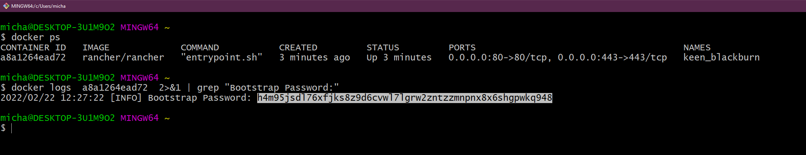
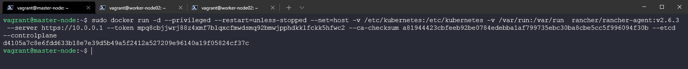

## Tổng quan về Rancher - Thực hành

Trong bài viết này, chúng ta sẽ đề cập tới Rancher, cho đến giờ, mọi thứ chúng ta làm đều dưới giao diện dòng lệnh sử dụng kubectl nhưng chứng ta có một số công cụ quản lý cluster với giao diện người dùng để các nhóm vận hành có thể quản lý các cluster một cách tốt hơn.

Rancher theo như [trang web của họ](https://rancher.com/)

> Rancher là phần mềm hoàn chỉnh dành cho các nhóm sử dụng containers. Nó giải quyết các vấn đề về vận hành và bảo mật trong việc quản lý các Kubernetes cluster trên bất kỳ cơ sở hạ tầng nào đồng thời cung cấp cho các nhóm DevOps các công cụ tích hợp để chạy các containerized workloads.

Rancher cho phép chúng ta triển khai các cụm Kubernetes theo tiêu chuẩn của môi trường production và sau đó cung cấp xác thực tập trung, kiểm soát truy cập và khả năng quan sát. Tôi đã đề cập trong phần trước rằng có rất nhiều lựa chọn khi nói đến Kubernetes và nơi bạn nên hoặc có thể chạy chúng, khi sử dụng Rancher, việc chạy chúng ở đâu không quan trọng.

### Triển khai Rancher

Điều đầu tiên chúng ta cần làm là triển khai Rancher trên máy trạm cục bộ của mình, có một số cách và vị trí bạn có thể chọn để làm điều này. Đối với tôi, tôi muốn sử dụng máy tính cá nhân của mình và chạy Rancher bằng một docker container. Bằng cách chạy lệnh bên dưới, chúng ta sẽ kéo container image và sau đó có quyền truy cập vào giao diện người dùng của Rancher.

Các phương pháp triển khai Rancher khác có tại [Rancher Quick-Start-Guide](https://rancher.com/docs/rancher/v2.6/en/quick-start-guide/deployment/)

`sudo docker run -d --restart=unless-stopped -p 80:80 -p 443:443 --privileged rancher/rancher`

Như bạn có thể thấy trong Docker Desktop của chúng ta, có một Rancher container đang chạy.


### Truy cập Rancher UI

Với container ở trên đang chạy, chúng ta có thể điều hướng tới nó thông qua một trang web. `https://localhost` sẽ hiển thị trang đăng nhập như ở dưới.


Thực hiện theo các hướng dẫn dưới đây để có được mật khẩu cần thiết. Vì tôi đang sử dụng Windows nên tôi đã chọn bash vì chúng ta cần lệnh grep.



Sau đó, chúng ta có thể lấy mật khẩu ở trên và đăng nhập, trang tiếp theo là nơi chúng ta có thể xác định mật khẩu mới.


Khi chúng ta đã làm những điều trên, chúng ta sẽ đăng nhập và có thể thấy màn hình sau. Là một phần của triển khai Rancher, chúng ta cũng thấy một K3s cluster được tạo.


### Sử dụng rancher

Điều đầu tiên để chúng ta xem xét là K3S cluster được triển khai. Bạn có thể thấy như bên dưới để chúng ta có thể có được cái nhìn rõ ràng về những gì đang xảy ra bên trong cluster của chúng ta. Đây là triển khai mặc định và chúng ta chưa triển khai bất cứ thứ gì cho cluster này. Bạn có thể thấy nó được tạo thành từ 1 node và có 5 deployments. Sau đó, bạn cũng có thể thấy rằng có một số thông số về pods, cores và memory.


Trên menu bên trái, chúng ta cũng có tab "Apps & Marketplace", điều này cho phép chúng ta chọn các ứng dụng mà chúng ta muốn chạy trên các cluster của mình, như đã đề cập, Rancher cung cấp cho chúng ta khả năng chạy hoặc quản lý các clusters khác nhau. Với marketplace, chúng ta có thể triển khai các ứng dụng của mình rất dễ dàng.


Một điều khác cần đề cập tới là nếu bạn cần có quyền truy cập vào bất cứ cluster nào do Rancher quản lý, ở trên cùng bên phải, bạo có thể mở một kubectl shell tới cluster mà bạn chọn.


### Tạo một cluster mới

Trong hai ngày vừa qua, chúng ta đã tạo một minikube cluster và đã sử dụng Vagrant với VirtualBox để tạo một Kubernetes cluster gồm 3 nodes. Với Rancher, chúng ta cũng có thể tạo cluster. Trong [thư mục Rancher](../../../2022/Days/Kubernetes/Rancher/) bạn sẽ thấy các tệp vagrant tạo ra 3 nodes giống nhau nhưng không có các bước tạo Kubernetes cluster của chúng ta (chúng ta muốn Rancher làm điều này cho chúng ta)

Tuy nhiên, chúng ta muốn cài đặt docker và cập nhật hệ điều hành nên bạn vẫn sẽ thấy `common.sh` chạy trên các nodes của chúng ta. Nó cũng sẽ căif đặt Kubeadm, Kubectl,... Nhưng nó sẽ không chạy các lệnh Kubeadm để tạo và nối các nodes của chúng ta thành một cluster.

Chúng ta có thể điều hướng đến vị trì thư mục vagrant và chỉ cần chạy `vagrant up` và điều này sẽ bắt đầu quá trình tạo 3 máy ảo của chúng ta trong VirtualBox.


Bây giờ chúng ta đã có các nodes hoặc máy ảo sẵn sàng, sau đó chúng ta có thể sử dụng Rancher để tạo Kubernetes cluster mới của mình. Màn hình đầu tiên để tạo cluster của bạn cung cấp cho bạn một số tuỳ chọn về vị trí của cluster, ví dụ như các dịch vụ Kubernetes được quản lý trên đám mây công cộng, vSphere hoặc lựa chọn khác.


Chúng ta sẽ chọn "custom" vì chúng ta không sử dụng một trong các nền tảng được tích hợp. Trang mở đầu là nơi bạn xác định tên cluster của mình (có ghi local ở dưới nhưng bạn không thể sử dụng local, cluster của chúng ta là vagrant). Bạn có thể xác định các phiên bản Kubernetes tại đây, nhà cung cấp mạng và một số tuỳ chọn cấu hình khác để khởi động và chạy cụm Kubernetes của bạn.


Trang tiếp theo sẽ cung cấp cho bạn mã đăng ký cần được chạy trên từng node của bạn với các dịch vụ phù hợp để được kích hoạt. etcd, control-plane và worker. Đối với master node, chúng ta muốn có etcd và control-plan nên có thể nhìn lệnh bên dưới.



```
sudo docker run -d --privileged --restart=unless-stopped --net=host -v /etc/kubernetes:/etc/kubernetes -v /var/run:/var/run  rancher/rancher-agent:v2.6.3 --server https://10.0.0.1 --token mpq8cbjjwrj88z4xmf7blqxcfmwdsmq92bmwjpphdkklfckk5hfwc2 --ca-checksum a81944423cbfeeb92be0784edebba1af799735ebc30ba8cbe5cc5f996094f30b --etcd --controlplane
```

Nếu mạng được định cấu hình chính xác thì bạn sẽ nhanh chóng thấy thông tin sau trong bảng điều khiển rancher của ình, cho biết rằng master node đầu tiên hiện đang được đăng ký và cluster đang được tạo.


Sau đó, chúng ta có thể lặp lại quy trình này với các worker nodes bằng lệnh sau và sau một lúc, bạn sẽ thiết lập và chạy các ứng dụng của mình và có khả năng tận dụng marketplace để triển khai các ứng dụng của mình.

```
sudo docker run -d --privileged --restart=unless-stopped --net=host -v /etc/kubernetes:/etc/kubernetes -v /var/run:/var/run  rancher/rancher-agent:v2.6.3 --server https://10.0.0.1 --token mpq8cbjjwrj88z4xmf7blqxcfmwdsmq92bmwjpphdkklfckk5hfwc2 --ca-checksum a81944423cbfeeb92be0784edebba1af799735ebc30ba8cbe5cc5f996094f30b --worker
```


Trong 3 ngày vừa qua, chúng ta đã sử dụng một số cách khác nhau để thiết lập và chạy với Kubernetes cluster, trong những ngày còn lại, chúng ta sẽ xem xét khía cạnh ứng dụng của nền tảng và nó được cho là phần quan trọng nhất. Chúng ta sẽ xem xét các dịch vụ và khả năng cung cấp cũng như sử dụng dịch vụ của chúng ta trong Kubernetes.

Tôi đã được nói rằng các yêu cầu xung quanh việc khởi động các rancher node yêu cầu các máy ảo phải có 4GB ram nếu không chúng sẽ gặp sự cố, tôi đã cập nhật vì các worker nodes của chúng ta chỉ có 2GB.

### Những gì chúng ta sẽ đề cập trong loạt bài về Kubernetes

- Kiến trúc Kubernetes
- Các câu lệnh kubectl 
- Kubernetes YAML
- Kubernetes Ingress
- Kubernetes Services
- Helm Package Manager
- Lưu trữ liên tục - Persistent Storage
- Ứng dụng có trạng thái - Stateful Apps

## Tài liệu tham khảo

- [Kubernetes Documentation](https://kubernetes.io/docs/home/)
- [TechWorld with Nana - Kubernetes Tutorial for Beginners [FULL COURSE in 4 Hours]](https://www.youtube.com/watch?v=X48VuDVv0do)
- [TechWorld with Nana - Kubernetes Crash Course for Absolute Beginners](https://www.youtube.com/watch?v=s_o8dwzRlu4)
- [Kunal Kushwaha - Kubernetes Tutorial for Beginners | What is Kubernetes? Architecture Simplified!](https://www.youtube.com/watch?v=KVBON1lA9N8)

Hẹn gặp lại vào [ngày 54](day54.md)
