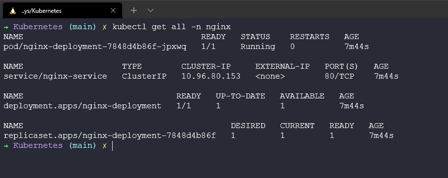
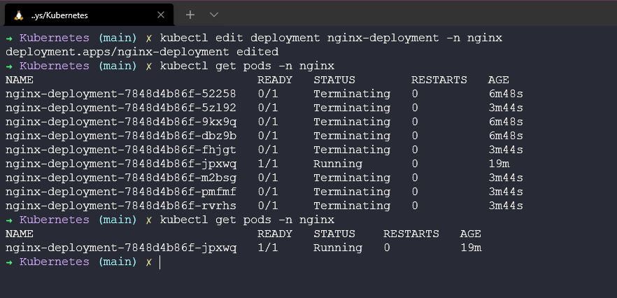
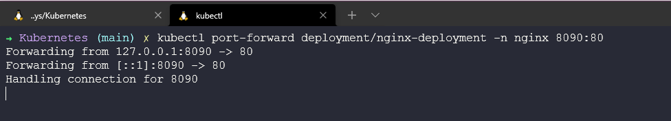
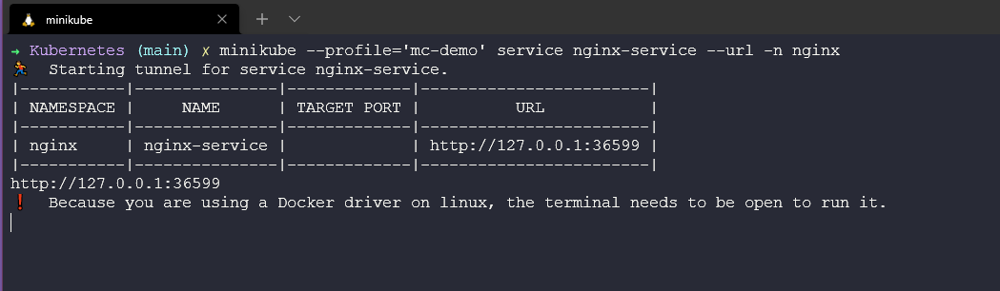

## Triển khai ứng dụng Kubernetes

Bây giờ, chúng ta cuối cùng cũng có thể triển khai một số ứng dụng vào trên các cluster của mình, một số người sẽ nói rằng đây là lý do Kubernetes tồn tại, để phân phối ứng dụng.

Ý tưởng ở đây là chúng ta có thể lấy các container images của mình và triển khai chúng dưới dạng các pods trên Kubernetes cluster của chúng ta để tận dùng Kubernetes như một bộ điều phối container.

### Trển khai ứng dụng trên Kubernetes

Có một số cách để chúng ta có thể triển khai các ứng dụng của mình trên Kubernetes cluster, chúng ta sẽ đề cập đến hai trong số các cách tiếp cận phổ biến nhất là tệp YAML mà Heml charts.

Chúng ta sẽ sử dụng minikube cluster cho các triển khai ứng dụng này. Chúng ta sẽ nhắc lại một số thành phần hoặc khối xây dựng đã đề cập tới trước đó của Kubernetes.

Xuyên suốt tuần này và trong tuần về Container, chúng ta đã thảo luận về images và lợi ích của Kubernetes cũng như cách chúng ta có thể xử lý việc mở rộng quy mô khác dễ dàng bằng nền tảng này.


Trong bước đầu tiên này, chúng ta sẽ tạo một ứng dụng không trạng thái trong minikube cluster của mình. Chúng ta sẽ sử dụng một ứng dụng không trạng thái theo quy chẩn trong demo đầu tiên với Deployment của `nginx` sử dụng các pods của chúng ta, sau đó chúng ta cũng sẽ tạo một service cho phép chúng ta sử dụng một máy chủ web được phục vụ bởi nginx pod. Tất cả chúng sẽ nằm trong một namespace.


### Tạo tệp YAML

Trong demo đầu tiên, chúng ta muốn xác định mọi thứ chứng ta muốn làm bằng YAML, chúng ta có thể có nguyên một bài nói về YAML nhưng tôi sẽ lướt qua phần này và để lại một số tài nguyên ở cuối bài trình bày chi tiết về YAML.

Chúng ta có thể tạo các tệp sau dưới dạng một tệp YAML hoặc chúng ta có thể chia nhỏ tệp này cho từng phần của ứng dụng của mình, ví dụ: đây có thể là các tệp riêng biệt dành cho namespace, deployement và service nhưng trong file này, như bên dưới, chúng ta sử dụng `---` đề tách các phần trong một tệp. Bạn có thể tìm thấy tệp này ở [đây](../../../2022/Days/Kubernetes/nginx-stateless-demo.yaml)

```Yaml
apiVersion: v1
kind: Namespace
metadata:
  name: nginx
  "labels": {
    "name": "nginx"
  }
---
apiVersion: apps/v1
kind: Deployment
metadata:
  name: nginx-deployment
  namespace: nginx
spec:
  selector:
    matchLabels:
      app: nginx
  replicas: 1
  template:
    metadata:
      labels:
        app: nginx
    spec:
      containers:
      - name: nginx
        image: nginx
        ports:
        - containerPort: 80
---
apiVersion: v1
kind: Service
metadata:
  name: nginx-service
  namespace: nginx
spec:
  selector:
    app: nginx-deployment
  ports:
    - protocol: TCP
      port: 80
      targetPort: 80
```

### Kiểm tra cluster của chúng ta

Trước khi chúng ta triển khai bất cứ thứ gì, chúng ta chỉ cần đảm bảo rằng chúng ta không có một namespace nào là `nginx`. Có thể xác nhận việc này bằng cách chạy lệnh `kubectl get namespace` và như bạn có thể thấy dưới đây, chúng ta không có namespace nào là `nginx`.


### Triển khai ứng dụng của chúng ta

Bây giờ chúng ta đã sẵn sàng triển khai ứng dụng của mình lên minikube cluster, quy trình tương tự như thế này sẽ hoạt động trên bất kỳ Kubernetes cluster nào khác.

Chúng ta cần điều hướng tới vị trị tệp YAML của mình và chạy lệnh `kubectl create -f nginx-stateless-demo.yaml`, sau đó bạn có thể thấy 3 đối tượng đã được tạo và chúng ta có một namespace, deployment và service.


Hãy chạy lại lệnh để xem các namespaces có sẵn trong cluster của chúng ta `kubectl get namespace` và giờ bạn có thể thấy rằng chúng ta có namespace mới.


Sau đó, nếu chúng ta kiểm tra các pods cho namespace sử dụng lệnh `kubectl get pods -n nginx` bạn sẽ thấy rằng chúng ta có 1 pod sẵn sàng và đang trong trạng thái chạy.


Chúng ta cũng có thể kiểm tra service đã được tạo bằng câu lệnh `kubectl get service -n nginx`


Cuối cùng, chúng ta có thể kiểm tra xem deployment ở đâu và làm thể nào chúng ta giữ được cấu hình mong muốn của mình.


Ở trên có vài lệnh chúng ta cần biết nhưng cũng có thể sử dụng lệnh `kubectl get all -n nginx` để xem mọi thứ chúng ta đã triển khai với tệp YAML đó.



Bạn có thể nhận thấy như ở trên rằng chúng ta cũng có một replicaset, trong deployment của mình, chúng ta cấu hình số replicas của image mà chúng ta muốn triển khai. Ban đầu nó được đặt là 1, nhưng nếu muốn nhanh chóng mở rộng quy mô ứng dụng của mình thì chúng ta có thể làm theo những cách sau.

Chúng ta có thể chỉnh sửa tệp của mình sử dụng  `kubectl edit deployment nginx-deployment -n nginx` sẽ mở trình soạn thảo văn bản trong terminal của bạn và cho phép bạn chỉnh sửa deployment của mình.


Khi lưu thay đổi bằng trình soạn thảo của bạn trong terrminal, nếu không có sự cố nào và cú pháp chính xác đã được sửu dụng thì bạn sẽ thấy một số tài nguyên được triển khai trong namespace.


Bạn cũng có thể thay đổi số lượng replicas sử dụng kubectl với câu lệnh `kubectl scale deployment nginx-deployment --replicas=10 -n nginx`


Chúng ta có thể sử dụng phương pháp này để giảm quy mô ứng dụng của mình xuống 1 bằng cả 2 phương pháp. Tôi đã sử dụng lựa chọn chỉnh sửa nhưng bạn cũng có thể sử dụng lệnh `scale` như trên.



Hy vọng rằng, bạn có thể thấy ở đây không chỉ việc triển khai ứng dụng siêu nhanh mà còn có khả năng tăng và giảm quy mô ứng dụng một cách nhanh chóng. Nếu đây là một máy chủ web, chúng ta có thể mở rộng quy mô khi có nhiều người sử dụng và giảm xuống khi tải được giảm.

### Truy cập ứng dụng của chúng ta

Nhưng làm thế nào để chúng ta có thể truy cập vào máy chủ web của mình?

Nếu bạn nhìn vào service của chúng ta ở trên, bạn sẽ thấy không có sẵn IP nào ở bên ngoài để chúng ta có thể mở trình duyệt web và truy cập nó. Để truy cập được, chúng ta có một số lựa chọn.

**ClusterIP** - IP mà bạn thấy là ClusterIP, IP này nằm trên mạng nội bộ của cluster, chỉ những thứ trong cluster mới có thể truy cập tới IP này.

**NodePort** - Expose dịch vụ trên cùng một cổng của các nodes được chọn trong cluster sử dụng NAT.

**LoadBalancer** -Tạo một bộ cân bằng tải bên ngoài trên đám mây hiện tại, chúng ta đang sử dụng minikube nhưng ví dụ nếu bạn đã xây dựng Kubernetes cluster của riêng mình trên VirtualBox, bạn cần triển khai một LoadBalancer chẳng hạn như metallb vào cluster của mình để có chức năng này.

**Port-Forward** - Chúng ta cũng có khả năng chuyển tiếp cổng, cho phép bạn truy cập và tương tác với các process của Kubernetes cluster từ localhost. Lựa chọn này chỉ dành cho kiểm thử và tìm lỗi.

Bây giờ chúng ta có một số lựa chọn dể chọn và Minikube có vài hạn chế hoặc khác biết so với một Kubernetes cluster thực tế.

Chúng ta có thể chỉ cần chạy lệnh sau để chuyển tiếp cổng để truy cập ứng dụng từ máy trạm cục bộ của mình.

`kubectl port-forward deployment/nginx-deployment -n nginx 8090:80`



Lưu ý rằng khi bạn chạy lệnh trên, terminal đó sẽ không sử dụng được vì nó sẽ thực hiện việc chuyển tiếp cổng tới máy và cổng cục bộ của bạn.


Bây giờ chúng ta sẽ xem xét cụ thể với Minikube về cách chúng ta có thể expose ứng dụng của mình. Chúng ta cũng có thể sử dụng minikube để tạo URL kết nối tới dịch vụ, [chi tiết cụ thể](https://minikube.sigs.k8s.io/docs/commands/service/)

Trước hết, chúng ta xoá service của mình bằng cách sử dụng `kubectl delete service nginx-service -n nginx`

Tiếp theo, chúng ta sẽ tạo một service mới sử dụng `kubectl expose deployment nginx-deployment --name nginx-service --namespace nginx --port=80 --type=NodePort` lưu ý ở đây rằng chúng ta sẽ sử dụng Expose và thay đổi type thành NodePort.


Cuối cùng trong terminal mới chạy `minikube --profile='mc-demo' service nginx-service --URL -n nginx` để tạo một tunnel cho service của chúng ta.



Mở trình duyệt và click vài liên kết trong terminal.


### Helm

Helm là một cách khác để chúng ta có thể triển khai các ứng dụng của mình. Được gọi là "Trình quản lý gói cho Kubernetes". Bạn có thể tìm hiểu thêm tại [đây](https://helm.sh/)

Helm là trình quản lý gói cho Kubernetes. Helm có thể được coi như yum hoặc apt cho Kubernetes. Heml triển khai các charts mà bạn có thể coi như một ứng dụng được đóng gói. Đây là một blueprint cho các tài nguyên ứng dụng được định cấu hình trước của bạn. Các charts này có thể được triển khai dưới dạng một easy-to-use chart. Sau đó, bạn có thể triển khai một phiên bản khác của chart với một bộ cấu hình khác.

Họ có một trang mà bạn có thể tham khảo tất cả các Heml charts có sẵ và đương nhiên, bạn có thể tạo biểu đồ của riêng mình. Tài liệu rất rõ ràng và ngắn gọn và không gây khó khăn như khi tôi bắt đầu nghe đến Helm.

Việc thiết lập và cài đặt Heml cực kỳ đơn giản. Bạn có thể tìm thấy các tệp nhị phân và liên kết tải xuống tại đây cho hầu hết các hệ điều hành, bao gồm cả các thiết bị RaspberryPi arm64.

Hoặc bạn có thể sử dụng tập lệnh cài đặt và có phiên bản mới nhất của Heml được tải xuống và cài đặt.

```Shell
curl -fsSL -o get_helm.sh https://raw.githubusercontent.com/helm/helm/master/scripts/get-helm-3

chmod 700 get_helm.sh

./get_helm.sh
```

Cuối cùng, cũng có tuỳ trọng sử dụng trình quản lý gói của hệ điều hành,homebrew cho mac, chocolatey cho windows, apt với Ubuntu/Debian, hoặc snap hay pkg.

Cho tới nay, Helm dường như là cách tốt nhất để tải xuống và cài đặt các ứng dụng thử nghiệm khác nhau trong cluster của bạn.

Một tài nguyên tốt ở đây là [ArtifactHUB](https://artifacthub.io/) giúp tìm, cài đặt và công khai các gói Kubernetes. Cũng xin nhắc tới [KubeApps](https://kubeapps.com/) với giao diện người dùng để hiển thị các helm charts.

### Những gì chúng ta sẽ đề cập trong loạt bài về Kubernetes

- Kiến trúc Kubernetes
- Các câu lệnh kubectl 
- Kubernetes YAML
- Kubernetes Ingress
- Kubernetes Services
- Helm Package Manager
- Lưu trữ liên tục - Persistent Storage
- Ứng dụng có trạng thái - Stateful Apps

## Tài liệu tham khảo

- [Kubernetes Documentation](https://kubernetes.io/docs/home/)
- [TechWorld with Nana - Kubernetes Tutorial for Beginners [FULL COURSE in 4 Hours]](https://www.youtube.com/watch?v=X48VuDVv0do)
- [TechWorld with Nana - Kubernetes Crash Course for Absolute Beginners](https://www.youtube.com/watch?v=s_o8dwzRlu4)
- [Kunal Kushwaha - Kubernetes Tutorial for Beginners | What is Kubernetes? Architecture Simplified!](https://www.youtube.com/watch?v=KVBON1lA9N8)

Hẹn gặp lại vào [ngày 55](day55.md)
