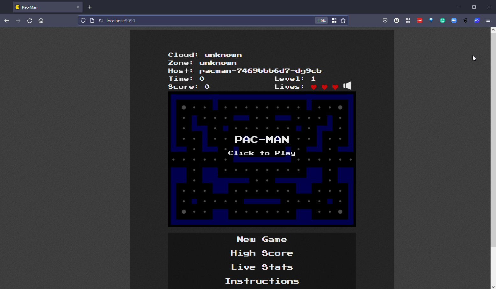
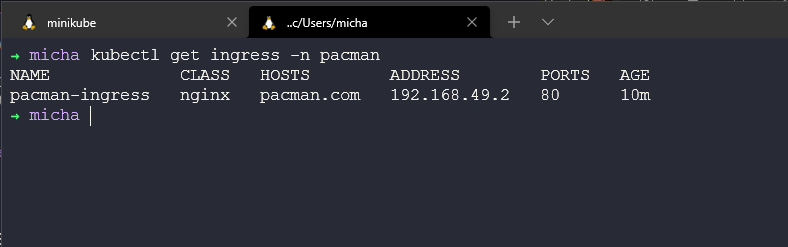
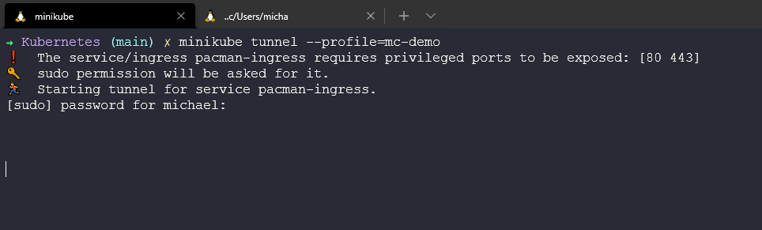

## State và Ingress trong Kubernetes

Trong bài viết cuối cùng của Kubernetes, chúng ta sẽ xem xét State và Ingress.

Mọi thứ chúng ta đã nói cho tới nay là về phi trạng thái (stateless), phi trạng thái có nghĩa rằng các ứng dụng của chúng ta không quan tâm tới mạng nào đang được sử dụng và không cần bất cứ bộ lưu trữ vĩnh viễn nào. Trong khi các ứng dụng có trạng thái ví dụ như cơ sở dữ liệu, để các ứng dụng như vậy hoạt động chính xác, bạn sẽ cần đảm bảo rằng các pods có thể liên lạc với nhau thông qua một định danh duy nhất không thay đổi (hostnames, IPs,...) Ví dụ về các ứng dụng có trạng thái bao gồm các MySQL clusters, Redis, Kafka, MongoDB và các ứng dụng khác. Về cơ bản, bất kỳ ứng dụng nào lưu trữ dữ liệu.

### Ứng dụng có trạng thái

StatefulSets đại diện cho một tập hợp các pods có định danh duy nhất, không đổ và hostnames ổn định mà Kubernetes sẽ duy trì bất kể chúng được lập lịch chạy ở đâu. Thông tin trạng thái và dữ liệu có khả năng phục hồi khác cho bất kỳ Stateful Set Pod cụ thể nào được duy trì trong persistent disk storage (bộ lưu trữ đĩa) được liên kết với StatefulSet.

### Deployment với StatefulSet

- Việc tạo ra các bản sao của ứng dụng có trạng thái khó khăn hơn.
- Việc tạo ra các bản sau của các pods trong một deployment (ứng dụng phi trạng thái) là giống hệt nhau và có thể hoán đổi.
- Tạo ra các pods theo thứ tự ngẫu nhiên với các giá trị băm ngẫu nhiên.
- Một Service cân bằng tải cho bất kỳ pod nào.

Khi nói đến StatefulSets hoặc ứng dụng có trạng thái, những điều trên trở nên khó khăn hơn.

- Không thể tạo hoặc xoá cùng một lúc.
- Không thể được truy cập một cách ngẫu nhiên.
- Các bản sao của pods không giống hệt nhau.

Bạn có thể thấy một số thứ trong demo của chúng ta ngay sau đây về việc mỗi pods có một định danh riêng. Với ứng dụng phi trạng thái, bạn sẽ thấy các tên ngẫu nhiên, ví dụ: `app-7469bbb6d7-9mhxd` trong khi ứng dụng có trạng thái sẽ được sắp xếp nghiêm chỉnh hơn với `mongo-0` và khi được mở rộng quy mô, nó sẽ ạo một pod mới có tên là `mongo-1`.

Các pods này được tạo từ cùng một cấu hình, nhưng chúng không thể hoán đổi cho nhau. Mỗi nhóm StatefulSet có một mã định danh cố định trong mọi lần lập lịch lại. Điều này là cần thiết bởi vì khi chúng ta yêu cầu các workloads có trạng thái ví dụ như cơ sở dữ liệu nơi chúng ta có các yêu cầu ghi và đọc, chúng ta không thể có hai pods cùng ghi một lúc mà không biết về việc này vì chúng sẽ khiến dữ liệu mất đi tính nhất quán. Chúng ta cần đảm bảo rằng chỉ một trong số các pods của chúng ta ghi vào cơ sở dữ liệu tại bất kỳ thời điểm nào, tuy nhiên, chúng ta có thể có nhiều pods đọc dữ liệu đó.

Mỗi pod trong StatefulSet sẽ có quyền truy cập vào persistent volume và một bản sao của cơ sở dữ liệu để đọc từ đó, và nó sẽ được cập nhật liên tự từ bản gốc. Một điều thú vị khác cần lưu ý là mỗi pod cũng sẽ lưu trữ trạng thái pod của nó trong persistent volume này, nếu sau đó `mongo-0` bị chết thì một pod mới sẽ được cung cấp và nó sẽ tiếp quản trạng thái pod được lưu trong bộ lưu trữ.

TLDR; StatefulSets vs Deployments

- Tên nhóm có thể được dự đoán = `mongo-0`
- DNS cố định
- Định danh pod - giữ nguyên State, giữ nguyên Role
- Tạo ra các bản sao của các ứng dụng có trạng thái rất phức tạp
  - Có rất nhiều việc bạn phải làm:
    - Định cấu hình cho các bản sao và đồng bộ hoá dữ liệu
    - Tạo các bộ nhớ được chia sẻ
    - Quản lý & sao lưu

### Persistant Volumes | Claims | StorageClass

Làm cách nào để duy trì dữ liệu trong Kubernetes?

Chúng ta đã đề cập ở trên nhắc tới ứng dụng có trạng thái, chúng ta phải lưu trữ trạng thái ở đâu đó và đây là lúc cần có volume (một ổ đĩa), Kubernetes không cup cấp tính bền vững.

Chúng ta yêu cầu lớp lưu trữ không phụ thuộc vào vòng đời của pod. Bộ lưu trữ này phải luôn có sẵn và truy cập được từ tất cả các Kubernetes nodes. Bộ lưu trữ cũng phải nằm ngoài Kubernetes cluster để có thể tồn tại độc lập ngay cả khi Kubernetes cluster gặp sự cố.

### Persistent Volume

- Một tài nguyên của cluster (như CPU và RAM) để lưu trữ dữ liệu
- Được tạo thông qua một tệp YAML
- Cần lưu trữ vật lý thực tế (Network-attached storage - NAS)
- Tích hợp từ bên ngoài vào Kubernetes cluster của bạn
- Bạn có thể có nhiều loại lưu trữ khi sử dụng các kho lưu trữ của mình
- PVs không được chia theo các namespaces
- Local storage khả dụng nhưng sẽ rành riêng cho một node trong cluster
- Cơ sở dữ liệu yêu cầu tính bền vững nên sử dụng lưu trữ từ xa (NAS)

### Persistent Volume Claim

Một persistent volume có thể sẵn có và đảm bảo tính sẵn sàng nhưng nếu nó không được claim bởi một ứng dụng, nó sẽ không được sử dụng.

- Được tạo thông qua một tệp YAML 
- Persistent Volume Claim được sử dụng trong cấu hình pod (thuộc tính volumes)
- PVCs ở trong cùng một namespace với pod
- Volume được mount vào pod
- Pods có thể có nhiều kiểu volume type khác nhau (ConfigMap, Secret, PVC)

Một cách khác để nghĩ về PVs và PVCs như sau:
PVs được tạo bởi Kubernetes Admin
PVCs được tạo bởi người dùng hoặc nhà phát triển ứng dụng

Cũng có 2 loại volumes khác mà chúng ta sẽ không đi vào chi tiết nhưng có được đề cập đến: 

### ConfigMaps | Secrets

- Tệp cấu hình cho pod của bạn.
- Tệp certificate cho pod của bạn.

### StorageClass

- Được tạo thông qua tệp YAML
- Cung cấp Persistent Volumes một cách linh hoạt khi PVC yêu cầu nó
- Mỗi storage backend có provisioner của nó
- Storage bacned được định nghĩa bằng YAML (thông qua thuộc tính provisioner)
- Trìu tượng hoá các nhà cung cấp lưu trữ ở dưới
- Xác định các thông số cho lưu trữ đó

### Tổng kết

Trong bài viết ngày hôm qua, chúng ta đã được hướng dẫn cách tạo ứng dụng phi trạng thái, ở đây chúng ta sẽ làm điều tương tự nhưng sẽ triển khai workload có trạng thái sử dụng minikube cluster của mình.

Một bản tóm tắt về các lệnh minikube mà chúng ta sẽ sử dụng để có các chứ năng và các addons để sử dụng tính bền bỉ là `minikube start --addons volumesnapshots,csi-hostpath-driver --apiserver-port=6443 --container-runtime=containerd -p mc-demo --Kubernetes-version=1.21.2`

Lệnh này sử dụng CSI-hostpath-driver, thứ cung cấp cho chúng ta storageclass, thứ mà tôi sẽ trình bày sau.

Ứng dụng được xây dựng xong sẽ trông như sau:

Bạn có thể tìm thấy tệp cấu hình YAML cho ứng dụng này tại [pacman-stateful-demo.yaml](../../Days/Kubernetes/pacman-stateful-demo.yaml)

### Cấu hình StorageClass 

Tuy nhiên, còn một bước nữa mà chúng ta nên chạy trước khi bắt đầu triển khai ứng dụng của mình và đó là đảm bảo storageclass của chúng ta (CSI-hostpath-sc) là lưu trữ mặc định của chúng ta. Trước tiên, chúng ta có thể kiểm tra điều này bằng cách chạy lệnh `kubectl get storageclass` nhưng minikube cluster sẽ hiển thị standard storageclass là mặc định, vì vậy chúng ta phải thay đổi điều đó bằng các lệnh dưới đây.

Lệnh đầu tiên này sẽ đặt CSI-hostpath-sc storageclass là mặc định.

`kubectl patch storageclass csi-hostpath-sc -p '{"metadata": {"annotations":{"storageclass.kubernetes.io/is-default-class":"true"}}}'`

Lệnh này sẽ xoá chú thích mặc định khỏi standard StorageClass.

`kubectl patch storageclass standard -p '{"metadata": {"annotations":{"storageclass.kubernetes.io/is-default-class":"false"}}}'`

Chúng ta bắt đầu không có Pacman namespace trong cluster của mình `kubectl get namespace`

Chúng ta sau đó triểu khai tệp YAML của mình. `kubectl create -f pacman-stateful-demo.yaml` bạn có thể thấy từ lệnh này, chúng ta đã tạo một số đối tượng trong Kubernetes cluster.

Giờ đây chúng ta đã có namespace mới được tạo.

Sao đó, như bạn có thể thấy trong ảnh tiếp theo và lệnh `kubectl get all -n pacman` sẽ cho thấy có một số điều đang xảy ra trong namespace của mình. Chúng ta có các pods chạy frontend với NodeJS, chúng ta có mongo chạy backend cơ sở dữ liệu. Có các service cho Pacman và mongo truy cập vào. Chúng ta có một deployment cho Pacman và một statefulset cho mongo.

Chúng ta cũng có persistent volume và persistent volume claim, lệnh `kubectl get pv` sẽ cung cấp cho chúng ta persistent volumes trong mọi namespaces và lệnh `kubectl get pvc -n pacman` sẽ cung cấp cho chúng ta các persistent volume claims trong namespace pacman.

### Chơi game | Ý tôi là truy cập vào ứng dụng siêu quan trọng của chúng ta

Vì chúng ta đang sử dụng Minikube và như đã đề cập trong ứng dụng phi trạng thái, chúng ta có một số trở ngại cần vượt qua khi truy cập ứng dụng của mình. Tuy nhiên, chúng ta có quyền truy cập vào ingress hoặc load balancer trong cluster của mình, service được thiết lập để tự động nhận IP từ đó có thể truy cập từ bên ngoài (bạn có thể thấy điều này ở trên trong hình ảnh chụp các thành phần trong Pacman namespace).

Đối với demo này, chúng ta sẽ sử dụng phương thức chuyển tiếp cổng để truy cập ứng dụng của mình. Bằng cách mở một terminal và chạy lệnh `kubectl port-forward svc/pacman 9090:80 -n pacman`. Mở trình duyệt và giờ đây, chúng ta sẽ có quyền truy cập vào ứng dụng của mình. Nếu bạn đang chạy ứng dụng này trên AWS thì nó cũng sẽ báo vị trí trên đám mây cũng như máy chủ chạy pod của bạn trong Kubernetes, một lần nữa bạn có thể nhìn lại và thấy tên pod này trên những ảnh chụp màn hình của chúng ta ở trên.

Bây giờ chúng ta có thể chơi và ghi điểm số, sau đó nó sẽ được lưu trong cơ sở dữ liệu của chúng ta.

OK, thât tuyệt nếu chúng ta có thể có một điểm số cao nhưng điều gì sẽ xảy ra nếu chúng ta xoá pod `mongo-0`? Bằng lệnh ``kubectl delete pod mongo-0 -n pacman` tôi có thể xoá nó và nếu bạn vẫn ở trong ứng dụng, bạn sẽ thấy điểm số sẽ không khả dụng ít nhất trong vài giây.

Bây giờ, nếu tôi quay trở lại trò chơi của mình, tôi có thể tạo một trò chơi mới và xem điểm số cao nhất của mình. Tuy nhiên, cách duy nhất mà bạn có thể thực sự tin tôi là hãy tự mình thử và chia sẻ lên mạng xã hội về điểm số của mình! 

Với việc triển khai, chúng ta có thể mở rộng quy mô ứng dụng này bằng cách sử dụng các lệnh trong phần trước nhưng nếu bạn muốn tổ chức một bữa tiệc Pacman siêu to khổng lồ, bạn có thể mở rộng quy mô bằng cách sử dụng lệnh `kubectl scale deployment pacman --replicas=10 -n pacman`

### Tìm hiểu về Ingress

Trước khi chúng ta kết thúc phần về Kubernetes, tôi cũng muốn đề cập đến một phần kiến thức lớn của Kubernetes, đó là ingress.

### Ingress là gì?

Cho tới nay, với các ví dụ của chúng ta, chúng ta sử dụng port-forward (chuyển tiếp cổng) hoặc chúng ta sử dụng cách lệnh cụ thể trong minikube để có quyền truy cập vào các ứng dụng của mình, nhưng điều này sẽ không hoạt động trong môi trường sản xuất (production). Chúng ta sẽ muốn có một cách tốt hơn để truy cập các ứng dụng của mình trên quy mô lớn với nhiều người dùng.

Chúng ta cũng đã nói về NodePort là một tuỳ chọn, nhưng một lần nữa, điều này chỉ dành cho mục đích thử nghiệm.

Ingress cung cấp cho chúng ta một cách tốt hơn để expose ứng dụng của mình, điều này cho phép xác định các quy tắc định tuyến trong Kubernetes cluster của mình.

Đối với ingress, chúng ta sẽ tạo một yêu cầu chuyển tiếp tới internal service của ứng dụng.

### Khi nào bạn cần ingress?

Nếu bạn đang sử dụng nhà cung cấp điện toán đám mây, một dịch vụ Kubernetes được quản lý rất có thể sẽ có tuỳ chọn ingress của họ hoặc họ sẽ cung cấp cho bạn tuỳ chọn cân bằng tải. Bạn không phải tự mình triển khai điều này, một trong những lợi ích của dịch vụ Kubernetes được quản lý.

Nếu bạn đang chạy cluster của mình thì bạn sẽ cần cấu hình một entrypoint
If you are running your cluster then you will need to configure an entrypoint.

### Cấu hình Ingress với Minikube

Trên clsuter đang chạy của tôi với tên gọi mc-demo, tôi có thể chạy lệnh sau để bật tính năng ingress trên cluster của mình.

`minikube --profile='mc-demo' addons enable ingress`

Nếu chúng ta kiểm tra các namespace bây giờ, bạn sẽ thấy rằng chúng ta có một namespace mới với tên ingress-nginx `kubectl get ns`

Bây giờ, chúng ta phải tạo cấu hình YAML cho ingress để truy cập dịch vụ pacman. Tôi đã thêm tệp này vào repository này [pacman-ingress.yaml](../../Days/Kubernetes/pacman-ingress.yaml)

Sau đó, chúng ta có thể tạo nó trong ingress namespace của chúng ta với lệnh `kubectl create -f Pacman-ingress.yaml`

Sau đó, nếu chúng ta chạy `kubectl get ingress -n Pacman`

Sau đó, tôi được thông báo rằng vì chúng ta đang sử dụng minikube chạy trên WSL2 trong Windows nên chúng ta phải tạo minikube tunnel bằng cách sử dụng lệnh `minikube tunnel --profile=mc-demo`

Nhưng tôi vẫn không thể truy cập vào 192.168.49.2 và chơi game Pacman của mình.

Nếu bất kỳ ai có hoặc có thể làm cho điều này hoạt động trên Windows và WSL, tôi sẽ rất biết ơn nếu bạn bổ sung vào phần này. Tôi cảm thấy bài viết này sẽ giúp xác định nguyên nhân có thể khiến ingress không hoạt động với WSL [Configuring Ingress to run Minikube on WSL2 using Docker runtime](https://hellokube.dev/posts/configure-minikube-ingress-on-wsl2/)

## Tài liệu tham khảo

Nếu bạn có tài liệu MIỄN PHÍ mà bạn đã sử dụng thì vui lòng thêm chúng vào đây thông qua PR cho repository này và tôi sẽ sẵn lòng thêm chúng vào.

- [Kubernetes StatefulSet simply explained](https://www.youtube.com/watch?v=pPQKAR1pA9U)
- [Kubernetes Volumes explained](https://www.youtube.com/watch?v=0swOh5C3OVM)
- [Kubernetes Ingress Tutorial for Beginners](https://www.youtube.com/watch?v=80Ew_fsV4rM)
- [Kubernetes Documentation](https://kubernetes.io/docs/home/)
- [TechWorld with Nana - Kubernetes Tutorial for Beginners [FULL COURSE in 4 Hours]](https://www.youtube.com/watch?v=X48VuDVv0do)
- [TechWorld with Nana - Kubernetes Crash Course for Absolute Beginners](https://www.youtube.com/watch?v=s_o8dwzRlu4)
- [Kunal Kushwaha - Kubernetes Tutorial for Beginners | What is Kubernetes? Architecture Simplified!](https://www.youtube.com/watch?v=KVBON1lA9N8)

Bài viết này kết thúc phần Kubernetes của chúng ta, có rất nhiều nội dung khác mà chúng ta có thể trình bày về Kubernetes và 7 ngày chỉ giúp chúng ta có được kiến thức cơ bản, mọi người có thể xem qua [100DaysOfKubernetes](https://100daysofkubernetes.io/overview.html) để có một cái nhìn đầy đủ hơn.

Tiếp theo, chúng ta sẽ xem xét đến Cơ sở hạ tầng dưới dạng mã (Infrastructure as Code - IaC) và tầm quan trọng của nó từ góc độ DevOps.

Hẹn gặp lại vào [ngày 56](day56.md)
