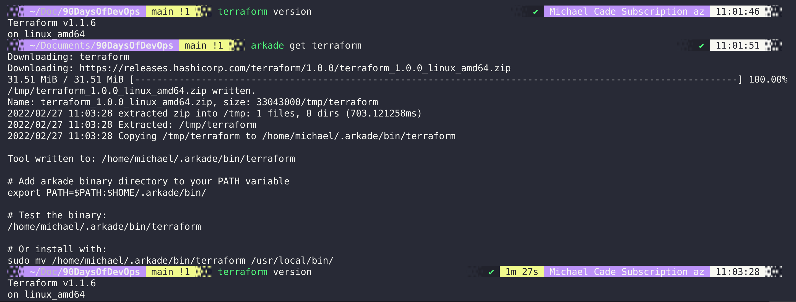

## Giới thiệu về Terraform

"Terraform là một công cụ để xây dựng, thay đổi và quản lý phiên bản cơ sở hạ tầng một cách an toàn và hiệu quả"

Trích dẫn trên đến từ HashiCorp, công ty đứng đằng sau Terraform.

"Terraform là một công cụ phần mềm cơ sở hạ tầng dưới dạng mã mã nguồn mở cung cấp quy trình làm việc với CLI để quản lý hàng trăm dịch vụ điện toán đám mây. Terraform mã hoá các API của các nhà cung cấp thành các tệp cấu hình khai báo"

HashiCorp có nguồn tài nguyên tuyệt vời tại [HashiCorp Learn](https://learn.hashicorp.com/terraform?utm_source=terraform_io&utm_content=terraform_io_hero) bao gồm tất cả các sản phẩm của họ và cung cấp một số bản demo hướng dẫn rất tốt khi bạn đang cố gắng làm việc với Cơ sở hạ tầng dưới dạng mã.

Tất cả các nhà cung cấp điện toán đám mây và on-prem thường cung cấp cho chúng ta quyền truy cập vào bảng điều khiển quản lý cho phép chúng ta tạo các tài nguyên của mình thông qua giao diệu người dùng, các nền tảng này cũng cung cấp CLI hoặc truy cập API để tạo các tài nguyên đó nhưng với API, chúng ta có thể khởi tạo rất nhanh chóng.

Cơ sở hạ tầng dưới dạng mã cho phép chúng ta kết nối với các API đó để triển khai tài nguyên của mình ở trạng thái mong muốn.

Các công cụ khác cũng được liệt kê ở dưới đây, nếu có công cụ khác, xin các bạn hãy chia sẻ thông qua một PR

| Nhà cung cấp cụ thể                  | Không phụ thuộc vào nhà cung cấp |
| ------------------------------- | -------------- |
| AWS CloudFormation              | Terraform      |
| Azure Resource Manager          | Pulumi         |
| Google Cloud Deployment Manager |                |

Đây là một lý do khác tại sao chúng ta đang sử dụng Terraform, chúng ta không muốn bị phụ thuộc vào một nhà cung cấp cụ thể hoặc nền tảng mà chúng ta muốn sử dụng cho các demos của mình cũng như trong thực tế.

## Tổng quan về Terraform

Terraform là một công cụ tập trung vào việc cung cấp hạ tầng, Terraform là một CLI có khả năng khởi tạo, cung cấp các môi trường cơ sở hạ tầng phức tạp. Với Terraform, chúng ta có thể xác định các yêu cầu cơ sở hạ tầng phức tạp tồn tại cục bộ hoặc từ xa (điện toán đám mây) Terraform không chỉ cho phép chúng ta xây dựng mọi thứ từ đầu mà còn duy trì và cập nhật các tài nguyên đó theo suốt vòng đời của chúng.

Chúng ta sẽ đề cập tới high level trong bài viết này, bạn có thể biết thêm chi tiết và tìm hiểu các tài nguyên khác tại trang[terraform.io](https://www.terraform.io/)

### Write

Terraform cho phép chúng ta tạo các tệp cấu hình khai báo để xây dựng môi trường của chúng ta. Các tệp được viết bằng ngôn ngữ cấu hình của HashiCorp (HCL - HashiCorp Configuration Language) cho phép mô tả ngắn gọn các tài nguyên bằng cách sử dụng các khối, đối số và biểu thức. Tất nhiên, chúng ta sẽ xem xét những điều này một cách chi tiết khi triển khai VM, COntainer và Kubernetes.

### Plan

Khả năng kiểm tra xem các tệp cấu hình trên có triển khai những gì chúng ta muốn thấy hay không bằng cách sử dụng các chức năng cụ thể của Terraform CLI trước khi triển khai hoặc thay đổi bất cứ thứ gì. Hãy nhớ rằng Terraform là một công cụ được sử dụng xuyên suốt cho cơ sở hạ tầng của bạn, nếu bạn muốn thay đổi các khía cạnh của cơ sở hạ tầng của mình, bạn nên thực hiện điều đó thông qua Terraform để tất cả mọi thứ được nắm bắt thông qua mã.

### Apply

Khi đã hài lòng, bạn có thể áp dụng cấu hình này cho nhiều providers có sẵn trong Terraform. Bạn có thể thấy danh sách các provider có sẵn tại [đây](https://registry.terraform.io/browse/providers)

Một điều khác cần đề cập là cũng có sẵn các modules, nó tương tự như container images ở chỗ các modules này đã được tạo và chia sẻ công khai, do đó bạn không phải tạo đi tạo lại chúng mà chỉ cần sử dụng lại cách tốt nhất để triển khai một tài nguyên cụ thể theo cùng một cách ở mọi nơi. Bạn có thể tìm thấy các module có sẵn [tại đây](https://registry.terraform.io/browse/modules)

Quy trình làm việc của Terraform trông như thể này: (_lấy từ website của terraform_)

### Terraform vs Vagrant

Trong thử thách này, chúng ta đã sử dụng Vagrant, một công cụ mã nguồn mở khác của Hashicorp tập trung vào các môi trường phát triển.

- Vagrant là một công cụ tập trung vào việc quản lý môi trường phát triển
- Terraform là một công cụ để xây dựng cơ sở hạ tầng.

Bạn có thể tìm thấy sự so sánh giữa hai công cụ tại đây trên [trang web chính thức của Hashicorp](https://www.vagrantup.com/intro/vs/terraform)

## Cài đặt Terraform

Không có nhiều thứ để nói cho việc cài đặt Terraform.

Terraform hỗ trợ đa nền tảng và bạn có thể thấy bên dưới trên máy tính Linux của tối, chúng ta có một số tuỳ chọn để tải xuống và cài đặt CLI

Sử dụng `arkade` để cài đặt Terraform, arkade là một công cụ nhỏ, tiện dụng để cài đặt các công cụ, ứng dụng và clis cần thiết vào hệ thống của bạn. Một câu lệnh `arkade get terraform` đơn giản sẽ cho phép cập nhật terraform nếu có hoặc cũng cài đặt Terraform CLI.

Chúng ta sẽ tìm hiểu thêm về HCL và sau đó bắt đầu sử dụng Terraform để tạo một số tài nguyên cơ sở hạ tầng trên các nền tảng khác nhau.

## Tài liệu tham khảo

- [What is Infrastructure as Code? Difference of Infrastructure as Code Tools](https://www.youtube.com/watch?v=POPP2WTJ8es)
- [Terraform Tutorial | Terraform Course Overview 2021](https://www.youtube.com/watch?v=m3cKkYXl-8o)
- [Terraform explained in 15 mins | Terraform Tutorial for Beginners](https://www.youtube.com/watch?v=l5k1ai_GBDE)
- [Terraform Course - From BEGINNER to PRO!](https://www.youtube.com/watch?v=7xngnjfIlK4&list=WL&index=141&t=16s)
- [HashiCorp Terraform Associate Certification Course](https://www.youtube.com/watch?v=V4waklkBC38&list=WL&index=55&t=111s)
- [Terraform Full Course for Beginners](https://www.youtube.com/watch?v=EJ3N-hhiWv0&list=WL&index=39&t=27s)
- [KodeKloud - Terraform for DevOps Beginners + Labs: Complete Step by Step Guide!](https://www.youtube.com/watch?v=YcJ9IeukJL8&list=WL&index=16&t=11s)
- [Terraform Simple Projects](https://terraform.joshuajebaraj.com/)
- [Terraform Tutorial - The Best Project Ideas](https://www.youtube.com/watch?v=oA-pPa0vfks)
- [Awesome Terraform](https://github.com/shuaibiyy/awesome-terraform)

Hẹn gặp lại vào [ngày 58](day58.md)
