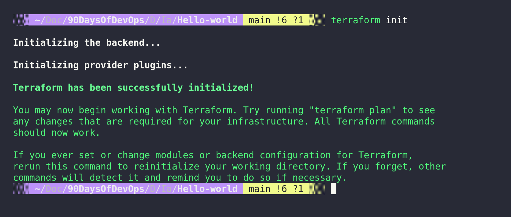

## HashiCorp Configuration Language (HCL)

Trước khi chúng ta bắt đầu tạo các thành phần với Terraform, chúng ta cần tìm hiểu một chút về ngôn ngữ cấu hình của HashiCorp (HCL). Cho đến nay, trong thử thách 90 ngày DevOps, chúng ta đã tìm hiểu về một số ngôn ngữ script và lập trình khác nhau, ví dụ như ngôn ngữ lập trình Go, sau đó đến với các tập lệnh bash, thậm chí chúng ta cũng có đề cập đến Python khi làm việc với tự động hóa triển khai mạng máy tính.

Tiếp theo, chúng ta phải tìm hiểu về HashiCorp Configuration Language (HCL). Nếu đây là lần đầu tiên bạn gặp ngôn ngữ này, có thể nó sẽ có vẻ hơi đáng sợ, nhưng nó thực sự rất đơn giản và mạnh mẽ.

Ở phần tiếp theo, chúng ta sẽ sử dụng các ví dụ mà chúng ta có thể chạy trên hệ thống cục bộ, bất kể bạn đang sử dụng hệ điều hành nào. Chúng ta sẽ sử dụng VirtualBox, mặc dù đây không phải là nền tảng hạ tầng thông thường mà bạn thường sử dụng với Terraform. Tuy nhiên, đây là một công cụ miễn phí giúp chúng ta cài đặt và thực hành theo hướng dẫn của bài viết này. Chúng ta cũng có thể mở rộng khái niệm trong bài viết này để áp dụng cho Docker hoặc Kubernetes.

Nhìn chung, bạn nên sử dụng Terraform để triển khai hạ tầng của mình trên các hệ thống điện toán đám công cộng (AWS, Google, Microsoft Azure), cũng như trong môi trường ảo hóa như VMware, Microsoft Hyper-V, Nutanix AHV. Trên đám mây công cộng, Terraform cho phép chúng ta làm nhiều hơn chỉ triển khai tự động máy ảo. Chúng ta có thể tạo ra tất cả các hạ tầng cần thiết như khối công việc PaaS và tài nguyên mạng như VPC và Security Groups.

Có hai khía cạnh quan trọng trong Terraform, chúng ta có mã nguồn mà chúng ta sẽ thảo luận trong bài viết này và sau đó chúng ta còn có trạng thái (state). Cả hai điều này cùng nhau có thể được gọi là lõi của Terraform. Tiếp theo, chúng ta có môi trường mà chúng ta muốn tương tác và triển khai, điều này được thực hiện bằng cách sử dụng các provider của Terraform, đã được đề cập ngắn gọn trong buổi trước, nhưng chúng ta có provider AWS, provider Azure, v.v. Có hàng trăm provider khác nhau.

### Hướng dẫn sử dụng Terraform đơn giản

Hãy xem qua một tệp `.tf` trong Terraform để hiểu hơn về cấu trúc. Ví dụ đầu tiên chúng ta sẽ thảo luận sẽ là mã để triển khai tài nguyên lên AWS. Điều này cũng đòi hỏi bạn đã cài đặt AWS CLI trên hệ thống của bạn và đã cấu hình cho tài khoản của bạn.


### Provider

Ở đầu cấu trúc tệp `.tf`, thông thường được gọi là `main.tf`, ít nhất cho đến khi chúng ta làm các thứ phức tạp hơn, chúng ta sẽ định nghĩa các provider mà chúng ta đã đề cập trước đó. Nguồn của provider AWS như bạn có thể thấy là `hashicorp/aws`, điều này có nghĩa là provider này được duy trì hoặc đã được phát triển bởi chính HashiCorp và cộng đồng sử dụng. Mặc định, bạn sẽ tham chiếu đến các provider có sẵn từ Terraform Registry, bạn cũng có thể viết các provider riêng của bạn và sử dụng chúng cục bộ hoặc tự xuất bản lên Terraform Registry.

```
terraform {
  required_providers {
    aws = {
      source  = "hashicorp/aws"
      version = "~> 3.0"
    }
  }
}
```

Chúng ta cũng có thể thêm khu vực (region) vào đây để xác định khu vực AWS mà chúng ta muốn triển khai, chúng ta có thể làm điều này bằng cách thêm các dòng sau đây:

```
provider "aws" {
  region = "ap-southeast-1" //region where resources need to be deployed
}
```

### Tài nguyên trong Terraform

- Một thành phần quan trọng khác của tệp cấu hình Terraform là khối tài nguyên (resource block), nó mô tả một hoặc nhiều đối tượng hạ tầng như EC2, Load Balancer, VPC, v.v.

- Một khối tài nguyên khai báo một tài nguyên thuộc một loại cụ thể (`"aws_instance"`) với một tên giúp truy xuất (`"90daysofdevops"`) cụ thể.

- Loại tài nguyên và tên cùng nhau tạo thành một định danh cho một tài nguyên cụ thể.

```
resource "aws_instance" "90daysofdevops" {
  ami               = data.aws_ami.instance_id.id
  instance_type     = "t2.micro"
  availability_zone = "us-west-2a"
  security_groups   = [aws_security_group.allow_web.name]
  user_data         = <<-EOF
                #! /bin/bash
                sudo yum update
                sudo yum install -y httpd
                sudo systemctl start httpd
                sudo systemctl enable httpd
                echo "
<h1>Deployed via Terraform</h1>
" | sudo tee /var/www/html/index.html
        EOF
  tags = {
    Name = "Created by Terraform"
  }
}
```

Từ ví dụ trên, bạn có thể thấy chúng ta cũng đang chạy lệnh `yum update` và cài đặt `httpd` vào máy chủ EC2.

Nếu chúng ta nhìn vào toàn bộ tệp main.tf, nó có thể trông giống như sau:

```hcl
terraform {
  required_providers {
    aws = {
      source  = "hashicorp/aws"
      version = "~> 3.27"
    }
  }
  required_version = ">= 0.14.9"
}
provider "aws" {
  profile = "default"
  region  = "us-west-2"
}
resource "aws_instance" "90daysofdevops" {
  ami           = "ami-830c94e3"
  instance_type = "t2.micro"
  availability_zone = "us-west-2a"
    user_data         = <<-EOF
                #! /bin/bash
                sudo yum update
                sudo yum install -y httpd
                sudo systemctl start httpd
                sudo systemctl enable httpd
                echo "
<h1>Deployed via Terraform</h1>
" | sudo tee /var/www/html/index.html
        EOF
  tags = {
    Name = "Created by Terraform"
  tags = {
    Name = "ExampleAppServerInstance"
  }
}
```

Mã trên sẽ triển khai một máy chủ web đơn giản dưới dạng một instance EC2 trên AWS. Điều tuyệt vời về mã này và bất kỳ cấu hình nào tương tự là chúng ta có thể lặp lại quy trình này và nhận được kết quả giống nhau mỗi lần. Ngoại trừ khả năng tôi đã làm sai mã, không có sự tương tác của con người với mã trên.

Chúng ta hãy xem một ví dụ siêu đơn giản, một ví dụ mà bạn có thể chẳng bao giờ sử dụng nhưng hãy để chúng ta giả vờ nói về nó. Giống như các ngôn ngữ scripting và lập trình khác, chúng ta nên bắt đầu với một kịch bản hello-world.

```
terraform {
  # This module is now only being tested with Terraform 0.13.x. However, to make upgrading easier, we are setting
  # 0.12.26 as the minimum version, as that version added support for required_providers with source URLs, making it
  # forwards compatible with 0.13.x code.
  required_version = ">= 0.12.26"
}
# website::tag::1:: The simplest possible Terraform module: it just outputs "Hello, World!"
output "hello_world" {
  value = "Hello, 90DaysOfDevOps from Terraform"
}
```

Bạn sẽ tìm thấy tệp này trong thư mục IAC (Infrastructure as Code) trong thư mục `hello-world`. Tuy nhiên, mặc định, tệp này sẽ không hoạt động ngay lập tức, chúng ta cần chạy một số lệnh để sử dụng mã Terraform của chúng ta.

Trong cửa sổ terminal, hãy điều hướng đến thư mục nơi tệp main.tf đã được tạo, đây có thể là thư mục từ kho lưu trữ này hoặc bạn có thể tạo một thư mục mới bằng mã ở trên.

Khi đã ở trong thư mục đó, chúng ta sẽ chạy lệnh `terraform init`.

Chúng ta cần thực hiện lệnh này trên bất kỳ thư mục nào chứa mã Terraform hoặc trước khi chúng ta chạy bất kỳ mã Terraform nào. Việc khởi tạo một thư mục cấu hình tải xuống và cài đặt các provider đã được định nghĩa trong cấu hình, trong trường hợp này, chúng ta không có provider, nhưng trong ví dụ ở trên, điều này sẽ tải xuống provider AWS cho cấu hình này.



Lệnh tiếp theo sẽ là terraform plan.

Lệnh terraform plan tạo ra một kế hoạch thực thi, cho phép bạn xem trước các thay đổi mà Terraform dự định thực hiện trên hạ tầng của bạn.

Dưới đây, bạn có thể thấy rằng với ví dụ hello-world của chúng ta, chúng ta sẽ thấy đầu ra nếu đây là một instance EC2 trên AWS, chúng ta sẽ thấy tất cả các bước mà chúng ta sẽ tạo ra.


Ở điểm này, chúng ta đã khởi tạo kho lưu trữ và đã tải xuống các provider khi cần thiết, chúng ta đã chạy một bước đi kiểm tra để đảm bảo rằng đây là những gì chúng ta muốn thấy, vì vậy bây giờ chúng ta có thể chạy và triển khai mã của chúng ta.

`terraform apply` cho phép chúng ta làm điều này, có một biện pháp an toàn tích hợp trong lệnh này và nó sẽ cung cấp một kế hoạch về những gì sẽ xảy ra, đòi hỏi bạn phản hồi bằng cách nói `"yes"` để tiếp tục.


Khi chúng ta gõ `"yes"` để xác nhận, mã của chúng ta sẽ được triển khai. Không có gì thú vị nhưng bạn có thể thấy chúng ta có kết quả đầu ra mà chúng ta đã định nghĩa trong mã của mình.


Hiện tại, chúng ta chưa triển khai bất cứ thứ gì, chúng ta chưa thêm, thay đổi hoặc phá hủy bất cứ thứ gì, nhưng nếu chúng ta đã làm điều đó, chúng ta sẽ thấy điều đó được chỉ ra trong đoạn trên. Tuy nhiên, nếu chúng ta đã triển khai một cái gì đó và muốn loại bỏ tất cả những gì chúng ta đã triển khai, chúng ta có thể sử dụng lệnh `terraform destroy`. Một lần nữa, điều này có tính năng an toàn, bạn phải gõ `"yes"` để xác nhận, mặc dù bạn có thể sử dụng `--auto-approve` ở cuối các lệnh `apply` và `destroy` để bỏ qua sự can thiệp thủ công đó. Tuy nhiên, tôi khuyên bạn chỉ nên sử dụng lối tắt này khi học và thử nghiệm vì mọi thứ có thể biến mất nhanh hơn cả việc xây dựng.

Từ đó, chúng ta đã tìm hiểu về 4 lệnh trong CLI của Terraform.

`terraform init` = chuẩn bị thư mục dự án với các provider.
`terraform plan` = hiển thị những gì sẽ được tạo ra và thay đổi trong lệnh tiếp theo dựa trên mã của chúng ta.
`terraform apply` = triển khai các tài nguyên được định nghĩa trong mã của chúng ta.
`terraform destroy` = phá hủy các tài nguyên chúng ta đã tạo ra trong dự án của chúng ta.
Chúng ta cũng đã tìm hiểu về hai khía cạnh quan trọng của tệp mã.

Provider = cách Terraform liên lạc với nền tảng cuối thông qua các API.
Tài nguyên (resources) = những gì chúng ta muốn triển khai bằng mã.
Một điều lưu ý khác khi chạy terraform init là xem cây thư mục trước và sau để xem điều gì xảy ra và chúng ta lưu trữ provider và các module ở đâu.

### Trạng Thái Của Terraform - Terraform state

Chúng ta cũng cần nhận thức về tệp trạng thái (state file) được tạo ra trong thư mục của chúng ta và đối với ví dụ `hello world` này, tệp trạng thái của chúng ta rất đơn giản. Đây là một tệp `JSON`, đại diện cho mọi thứ đã được tạo ra bởi Terraform. Tệp trạng thái sẽ hiển thị dữ liệu nhạy cảm của bạn, vì vậy hãy cẩn thận và làm thỏa thuận tốt nhất là đặt các tệp `.tfstate` vào thư mục `.gitignore` trước khi tải lên `GitHub`.

Mặc định, tệp trạng thái, như bạn có thể thấy, được lưu trữ trong cùng thư mục với mã dự án của bạn, nhưng nó cũng có thể được lưu trữ từ xa như một tùy chọn. Trong một môi trường sản xuất, điều này có thể sẽ là một vị trí chia sẻ như một bucket S3.

Một tùy chọn khác có thể là `Terraform Cloud`, đây là một dịch vụ quản lý có phí. (Miễn phí cho tối đa 5 người dùng)

Các lợi ích của việc lưu trữ trạng thái ở một vị trí từ xa là:

- Dữ liệu nhạy cảm được mã hóa
- Dành cho tổ chức, nhóm có số lượng dev, devops đông đảo
- Tự động hóa
- Tuy nhiên, điều này có thể làm tăng độ phức tạp

```JSON
{
  "version": 4,
  "terraform_version": "1.1.6",
  "serial": 1,
  "lineage": "a74296e7-670d-0cbb-a048-f332696ca850",
  "outputs": {
    "hello_world": {
      "value": "Hello, 90DaysOfDevOps from Terraform",
      "type": "string"
    }
  },
  "resources": []
}
```

## Tài liệu tham khảo

Dưới đây là danh sách nhiều tài nguyên mà tôi đã liệt kê và tôi nghĩ rằng chủ đề này đã được đề cập nhiều lần. Nếu bạn có các tài nguyên bổ sung, hãy tạo một yêu cầu `pull request` với tài nguyên của bạn và tôi sẽ vui lòng xem xét và thêm chúng vào danh sách.

- [What is Infrastructure as Code? Difference of Infrastructure as Code Tools](https://www.youtube.com/watch?v=POPP2WTJ8es)
- [Terraform Tutorial | Terraform Course Overview 2021](https://www.youtube.com/watch?v=m3cKkYXl-8o)
- [Terraform explained in 15 mins | Terraform Tutorial for Beginners](https://www.youtube.com/watch?v=l5k1ai_GBDE)
- [Terraform Course - From BEGINNER to PRO!](https://www.youtube.com/watch?v=7xngnjfIlK4&list=WL&index=141&t=16s)
- [HashiCorp Terraform Associate Certification Course](https://www.youtube.com/watch?v=V4waklkBC38&list=WL&index=55&t=111s)
- [Terraform Full Course for Beginners](https://www.youtube.com/watch?v=EJ3N-hhiWv0&list=WL&index=39&t=27s)
- [KodeKloud - Terraform for DevOps Beginners + Labs: Complete Step by Step Guide!](https://www.youtube.com/watch?v=YcJ9IeukJL8&list=WL&index=16&t=11s)
- [Terraform Simple Projects](https://terraform.joshuajebaraj.com/)
- [Terraform Tutorial - The Best Project Ideas](https://www.youtube.com/watch?v=oA-pPa0vfks)
- [Awesome Terraform](https://github.com/shuaibiyy/awesome-terraform)

Hẹn gặp lại các bạn ở [ngày 59](day59.md)