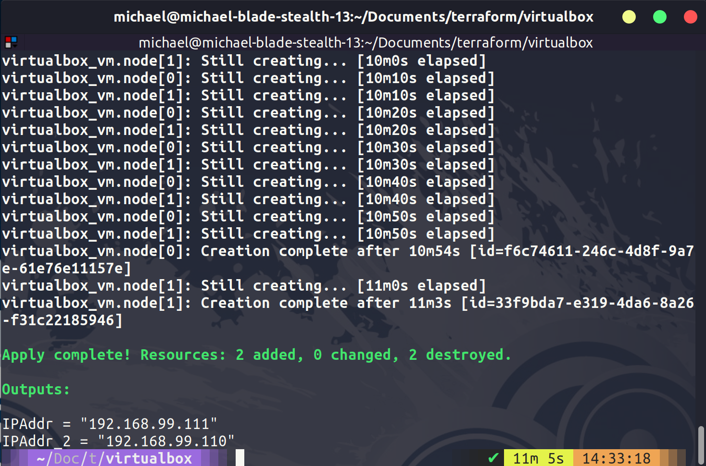
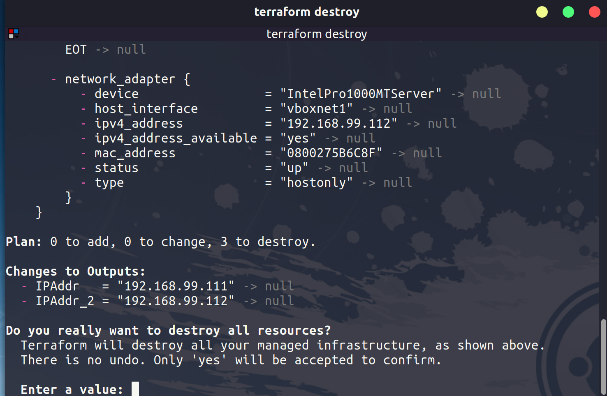

## Tạo máy ảo với Terraform và biến

Trong bài này, chúng ta sẽ tạo một hoặc hai máy ảo bằng cách sử dụng terraform trong VirtualBox. Điều này không phải là một trường hợp thông thường, VirtualBox là một lựa chọn ảo hóa máy trạm và điều này không phải là một trường hợp sử dụng cho Terraform, nhưng hiện tại tôi đang ở độ cao 36.000ft và dù tôi đã triển khai các tài nguyên trên public cloud, nhưng việc làm điều này trên máy tính xách tay của tôi nhanh hơn nhiều.

Chỉ cho mục đích demo, nhưng khái niệm là tương tự, chúng ta sẽ có mã cấu hình trạng thái mong muốn của chúng ta và sau đó chúng ta sẽ chạy mã đó với nhà cung cấp VirtualBox. Trong quá khứ, chúng ta đã sử dụng `vagrant` ở đây và tôi đã đề cập đến sự khác biệt giữa `vagrant` và `terraform` ở đầu phần này.

### Tạo máy ảo trong VirtualBox

Điều đầu tiên chúng ta sẽ làm là tạo một thư mục mới được gọi là VirtualBox, sau đó chúng ta có thể tạo một tệp tin VirtualBox.tf và đây sẽ là nơi chúng ta định nghĩa các tài nguyên của chúng ta. Đoạn mã dưới đây, có thể được tìm thấy trong thư mục VirtualBox với tên `VirtualBox.tf`, sẽ tạo 2 máy ảo trong VirtualBox.

Bạn có thể tìm hiểu thêm về nhà cung cấp VirtualBox của cộng đồng tại [đây](https://registry.terraform.io/providers/terra-farm/virtualbox/latest/docs/resources/vm)

```
terraform {
  required_providers {
    virtualbox = {
      source = "terra-farm/virtualbox"
      version = "0.2.2-alpha.1"
    }
  }
}

# There are currently no configuration options for the provider itself.

resource "virtualbox_vm" "node" {
  count     = 2
  name      = format("node-%02d", count.index + 1)
  image     = "https://app.vagrantup.com/ubuntu/boxes/bionic64/versions/20180903.0.0/providers/virtualbox.box"
  cpus      = 2
  memory    = "512 mib"

  network_adapter {
    type           = "hostonly"
    host_interface = "vboxnet1"
  }
}

output "IPAddr" {
  value = element(virtualbox_vm.node.*.network_adapter.0.ipv4_address, 1)
}

output "IPAddr_2" {
  value = element(virtualbox_vm.node.*.network_adapter.0.ipv4_address, 2)
}

```

Bây giờ sau khi chúng ta đã định nghĩa mã của mình, chúng ta có thể thực hiện lệnh `terraform init` trên thư mục của chúng ta để tải xuống nhà cung cấp cho Virtualbox.


Bạn cũng cần phải cài đặt VirtualBox trên hệ thống của bạn. Sau đó, chúng ta có thể chạy lệnh `terraform plan` để xem mã của chúng ta sẽ tạo ra gì cho chúng ta. Tiếp theo là `terraform apply`. Hình ảnh dưới đây hiển thị quá trình hoàn thành của bạn.



Trong Virtualbox, bạn sẽ nhìn thấy 2 máy ảo mới được khởi tạo.


### Thay đổi cấu hình

Hãy thay đổi cấu hình triển khai để thử nghiệm. Chúng ta chỉ cần thay đổi dòng `count` để hiển thị số lượng nút mới mong muốn của chúng ta. Khi chúng ta chạy `terraform apply`, nó sẽ trông giống như dưới đây.


Một khi đã hoàn thành, trong VirtualBox bạn sẽ nhìn thấy 3 máy ảo được khởi tạo và chạy.


Khi mọi thứ đã hoàn thành, chúng ta có thể dọn dẹp bằng cách sử dụng `terraform destroy`, tất cả máy ảo sẽ được xóa bỏ sau đó.



### Biến và đầu ra

Trong buổi trước, chúng ta đã đề cập đến outputs khi chạy ví dụ `hello-world`. Nhưng chúng ta có thể đi vào chi tiết hơn ở đây.

Tuy nhiên, cũng có nhiều biến số khác mà chúng ta có thể sử dụng, cũng như một số cách khác nhau để định nghĩa biến số.

- Chúng ta có thể nhập biến số bằng tay với lệnh `terraform plan` hoặc `terraform apply`

- Chúng ta có thể định nghĩa chúng trong tệp `.tf` trong khối

- Chúng ta có thể sử dụng biến môi trường trong hệ thống của chúng ta bằng cách sử dụng định dạng `TF_VAR_NAME`.

- Sở thích của tôi là sử dụng tệp `terraform.tfvars` trong thư mục dự án của chúng ta.

- Có tùy chọn tệp `*auto.tfvars`

- Hoặc chúng ta có thể định nghĩa khi chạy lệnh `terraform plan` hoặc `terraform apply` với `-var` hoặc `-var-file`.

Bắt đầu từ dưới lên sẽ là thứ tự các biến số được định nghĩa.

Chúng ta cũng đã đề cập đến việc tệp trạng thái sẽ chứa thông tin nhạy cảm. Chúng ta có thể định nghĩa thông tin nhạy cảm như là một biến số và chúng ta có thể định nghĩa nó như là thông tin nhạy cảm.

```
variable "some resource"  {
    description = "something important"
    type: string
    sensitive = true

}
```

## Tài liệu tham khảo

Dưới đây là danh sách nhiều tài nguyên mà tôi đã liệt kê và tôi nghĩ rằng chủ đề này đã được đề cập nhiều lần. Nếu bạn có các tài nguyên bổ sung, hãy tạo một yêu cầu `pull request` với tài nguyên của bạn và tôi sẽ vui lòng xem xét và thêm chúng vào danh sách.

- [What is Infrastructure as Code? Difference of Infrastructure as Code Tools](https://www.youtube.com/watch?v=POPP2WTJ8es)
- [Terraform Tutorial | Terraform Course Overview 2021](https://www.youtube.com/watch?v=m3cKkYXl-8o)
- [Terraform explained in 15 mins | Terraform Tutorial for Beginners](https://www.youtube.com/watch?v=l5k1ai_GBDE)
- [Terraform Course - From BEGINNER to PRO!](https://www.youtube.com/watch?v=7xngnjfIlK4&list=WL&index=141&t=16s)
- [HashiCorp Terraform Associate Certification Course](https://www.youtube.com/watch?v=V4waklkBC38&list=WL&index=55&t=111s)
- [Terraform Full Course for Beginners](https://www.youtube.com/watch?v=EJ3N-hhiWv0&list=WL&index=39&t=27s)
- [KodeKloud - Terraform for DevOps Beginners + Labs: Complete Step by Step Guide!](https://www.youtube.com/watch?v=YcJ9IeukJL8&list=WL&index=16&t=11s)
- [Terraform Simple Projects](https://terraform.joshuajebaraj.com/)
- [Terraform Tutorial - The Best Project Ideas](https://www.youtube.com/watch?v=oA-pPa0vfks)
- [Awesome Terraform](https://github.com/shuaibiyy/awesome-terraform)

Hẹn gặp lại các bạn vào ngày tiếp theo [Ngày 60](day60.md)
