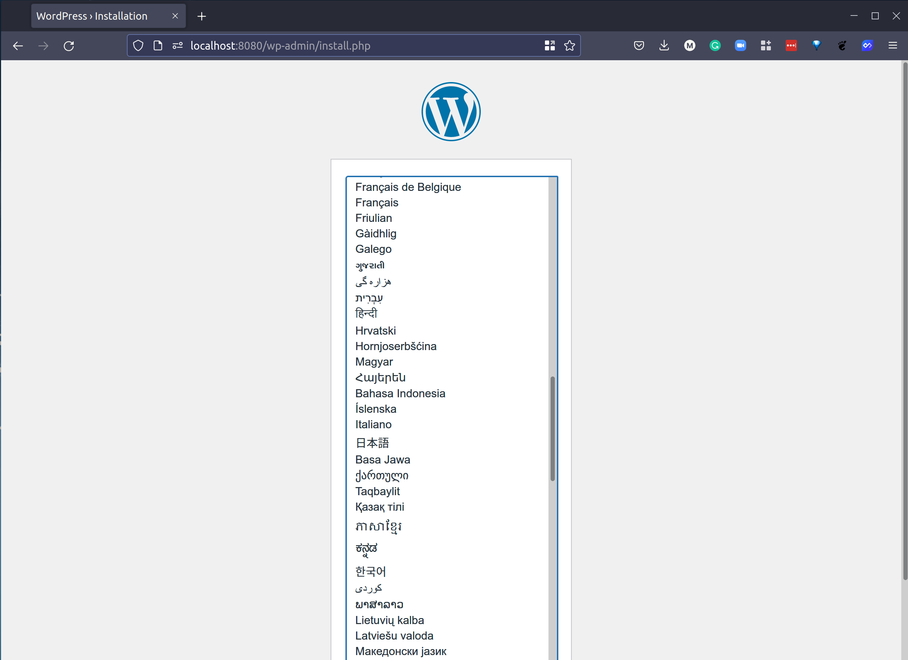

## Docker Containers, Provisioners & Modules

Trong [ngày 59](day59.md), chúng ta đã cung cấp một máy ảo bằng cách sử dụng Terraform đến môi trường VirtualBox FREE tại máy tính cá nhân. Trong phần này, chúng ta sẽ triển khai một Docker container với một số cấu hình đến môi trường Docker tại máy tính cá nhân của chúng ta.

### Docker Demo

Trước tiên, chúng ta sẽ sử dụng đoạn mã dưới đây, kết quả của đoạn mã này là chúng ta muốn triển khai một ứng dụng web đơn giản vào docker và công bố nó để nó có thể truy cập được từ mạng của chúng ta. Chúng ta sẽ sử dụng nginx và chúng ta sẽ làm cho nó có sẵn từ bên ngoài trên máy tính xách tay của chúng ta qua localhost và cổng 8000. Chúng ta đang sử dụng một nhà cung cấp docker từ cộng đồng và bạn cũng có thể thấy image docker chúng ta đang sử dụng cũng được nêu trong cấu hình của chúng ta.

```
terraform {
  required_providers {
    docker = {
      source  = "kreuzwerker/docker"
      version = "2.16.0"
    }
  }
}

provider "docker" {}

resource "docker_image" "nginx" {
  name         = "nginx:latest"
  keep_locally = false
}

resource "docker_container" "nginx" {
  image = docker_image.nginx.latest
  name  = "tutorial"
  ports {
    internal = 80
    external = 8000
  }
}
```

Nhiệm vụ đầu tiên là sử dụng lệnh terraform init để tải xuống nhà cung cấp vào máy tính cục bộ của chúng ta.


Tiếp theo, chúng ta chạy lệnh `terraform apply`, sau đó là `docker ps`, và bạn sẽ thấy chúng ta có một container đang chạy.


Nếu chúng ta mở trình duyệt và điều hướng đến http://localhost:8000/, bạn sẽ thấy chúng ta có quyền truy cập vào container NGINX của chúng ta.


Các bạn có thể tìm hiểu thêm về Docker Provider tại đây [Docker Provider](https://registry.terraform.io/providers/kreuzwerker/docker/latest/docs/resources/container)

Phía trên là một ví dụ rất đơn giản về những gì có thể làm được với Terraform và Docker và cách chúng ta có thể quản lý nó dưới trạng thái Terraform. Chúng ta đã bàn về docker-compose trong phần container và có một chút sự chồng chéo theo cách nào đó giữa việc này, cơ sở hạ tầng như mã và sau đó Kubernetes.

Để chứng minh điều này và cho thấy cách Terraform có thể xử lý một chút phức tạp hơn, chúng ta sẽ lấy tệp docker-compose cho WordPress và MySQL mà chúng ta đã tạo bằng docker-compose và đặt nó vào Terraform. Bạn có thể tìm thấy tệp [docker-wordpress.tf](2022/Days/IaC/Docker-WordPress/docker-WordPress.tf)

```
terraform {
  required_providers {
    docker = {
      source  = "kreuzwerker/docker"
      version = "2.16.0"
    }
  }
}

provider "docker" {}

variable wordpress_port {
  default = "8080"
}

resource "docker_volume" "db_data" {
  name = "db_data"
}

resource "docker_network" "wordpress_net" {
  name = "wordpress_net"
}

resource "docker_container" "db" {
  name  = "db"
  image = "mysql:5.7"
  restart = "always"
  network_mode = "wordpress_net"
  env = [
     "MYSQL_ROOT_PASSWORD=wordpress",
     "MYSQL_PASSWORD=wordpress",
     "MYSQL_USER=wordpress",
     "MYSQL_DATABASE=wordpress"
  ]
  mounts {
    type = "volume"
    target = "/var/lib/mysql"
    source = "db_data"
    }
}

resource "docker_container" "wordpress" {
  name  = "wordpress"
  image = "wordpress:latest"
  restart = "always"
  network_mode = "wordpress_net"
  env = [
    "WORDPRESS_DB_HOST=db:3306",
    "WORDPRESS_DB_USER=wordpress",
    "WORDPRESS_DB_NAME=wordpress",
    "WORDPRESS_DB_PASSWORD=wordpress"
  ]
  ports {
    internal = "80"
    external = "${var.wordpress_port}"
  }
}
```

Chúng ta lại tệp vào một thư mục mới và sau đó chạy lệnh `terraform init` để tải về các công cụ cần thiết.


Sau đó, chúng ta chạy lệnh `terraform apply` và kiểm tra đầu ra của lệnh `docker ps`, chúng ta sẽ thấy các container mới được tạo ra.


Sau đó, chúng ta có thể truy cập vào giao diện WordPress. Tương tự như khi chúng ta đã thực hiện quá trình này với docker-compose trong phần container, bây giờ chúng ta có thể tiếp tục thiết lập và các bài viết WordPress của chúng ta sẽ được lưu trong cơ sở dữ liệu MySQL.



Bây giờ chúng ta đã thảo luận khá chi tiết về containers và Kubernetes, chúng ta có thể hiểu rằng việc sử dụng containers một mình chỉ phù hợp cho việc kiểm thử, và nếu bạn đang chạy ứng dụng, bạn sẽ không chỉ sử dụng containers mà còn xem xét sử dụng Kubernetes để đạt được điều này. Tiếp theo, chúng ta sẽ tìm hiểu cách sử dụng Terraform với Kubernetes.

### Provisioners

Provisioners được sử dụng để xử lý những công việc không thể được miêu tả theo cách khai báo, giúp chúng ta triển khai các tác vụ đó.

Nếu không có cách thức khác và việc thêm phức tạp vào mã của bạn là điểm đến cuối cùng, bạn có thể thực hiện điều này bằng cách chạy một đoạn mã tương tự như khối mã sau đây.

```
resource "docker_container" "db" {
  # ...

  provisioner "local-exec" {
    command = "echo The server's IP address is ${self.private_ip}"
  }
}

```

Provisioner remote-exec được sử dụng để gọi một script trên tài nguyên từ xa sau khi nó được tạo ra. Điều này có thể được sử dụng cho một số công việc đặc thù của hệ điều hành hoặc có thể được sử dụng để kết hợp với một công cụ quản lý cấu hình. Tuy nhiên, hãy lưu ý rằng một số công việc này đã được bao gồm trong các provisioner tương ứng của chúng.

[Thông tin chi tiết về provisioners](https://www.terraform.io/language/resources/provisioners/syntax)

- file
- local-exec
- remote-exec
- vendor
  - ansible
  - chef
  - puppet

### Modules

Modules là các container chứa nhiều tài nguyên được sử dụng cùng nhau. Một module bao gồm một tập hợp các file `.tf` trong cùng một thư mục.

Modules là một cách tốt để tách biệt các tài nguyên cơ sở hạ tầng của bạn và cũng cho phép bạn sử dụng các module của bên thứ ba đã được tạo trước để không phải phát minh lại bánh xe.

Ví dụ, nếu chúng ta muốn sử dụng cùng một dự án để xây dựng các máy ảo (VMs), mạng riêng ảo (VPCs), nhóm bảo mật (Security Groups) và một cụm Kubernetes, chúng ta có thể muốn chia tách các tài nguyên của chúng thành các module để xác định rõ hơn các tài nguyên và nhóm chúng lại.

Một lợi ích khác của modules là bạn có thể sử dụng chúng cho các dự án khác hoặc chia sẻ chúng công khai để giúp cộng đồng.

Chúng ta đang chia cơ sở hạ tầng thành các thành phần, và các thành phần này được gọi là modules ở đây.

## Tài liệu tham khảo

Dưới đây là danh sách nhiều tài nguyên mà tôi đã liệt kê và tôi nghĩ rằng chủ đề này đã được đề cập nhiều lần. Nếu bạn có các tài nguyên bổ sung, hãy tạo một yêu cầu `pull request` với tài nguyên của bạn và tôi sẽ vui lòng xem xét và thêm chúng vào danh sách.

- [What is Infrastructure as Code? Difference of Infrastructure as Code Tools](https://www.youtube.com/watch?v=POPP2WTJ8es)
- [Terraform Tutorial | Terraform Course Overview 2021](https://www.youtube.com/watch?v=m3cKkYXl-8o)
- [Terraform explained in 15 mins | Terraform Tutorial for Beginners](https://www.youtube.com/watch?v=l5k1ai_GBDE)
- [Terraform Course - From BEGINNER to PRO!](https://www.youtube.com/watch?v=7xngnjfIlK4&list=WL&index=141&t=16s)
- [HashiCorp Terraform Associate Certification Course](https://www.youtube.com/watch?v=V4waklkBC38&list=WL&index=55&t=111s)
- [Terraform Full Course for Beginners](https://www.youtube.com/watch?v=EJ3N-hhiWv0&list=WL&index=39&t=27s)
- [KodeKloud - Terraform for DevOps Beginners + Labs: Complete Step by Step Guide!](https://www.youtube.com/watch?v=YcJ9IeukJL8&list=WL&index=16&t=11s)
- [Terraform Simple Projects](https://terraform.joshuajebaraj.com/)
- [Terraform Tutorial - The Best Project Ideas](https://www.youtube.com/watch?v=oA-pPa0vfks)
- [Awesome Terraform](https://github.com/shuaibiyy/awesome-terraform)

Hẹn gặp lại các bạn vào [Ngày 61](day61.md)
