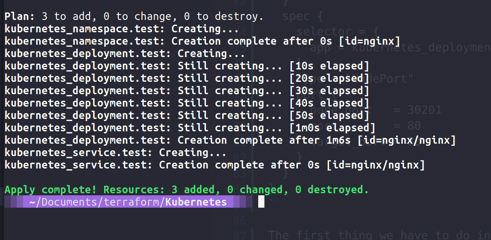

## Kubernetes & Đa môi trường

Cho đến nay, trong phần về Cơ sở hạ tầng mã nguồn, chúng ta đã xem xét triển khai máy ảo, mặc dù chúng ta đã sử dụng VirtualBox, nhưng nguyên tắc là giống nhau, chúng ta xác định bằng mã nguồn những gì chúng ta muốn máy ảo của mình trông như thế nào và sau đó triển khai. Tương tự cho các container Docker và trong buổi học này, chúng ta sẽ xem cách Terraform có thể được sử dụng để tương tác với các tài nguyên được hỗ trợ bởi Kubernetes.

Tôi đã sử dụng Terraform để triển khai các cụm Kubernetes cho mục đích trình diễn trên ba nhà cung cấp đám mây chính và bạn có thể tìm thấy kho lưu trữ tại đây [tf_k8deploy](https://github.com/MichaelCade/tf_k8deploy)

Tuy nhiên, bạn cũng có thể sử dụng Terraform để tương tác với các đối tượng bên trong cụm Kubernetes, điều này có thể được thực hiện bằng cách sử dụng [Kubernetes provider](https://registry.terraform.io/providers/hashicorp/kubernetes/latest/docs) hoặc [Helm provider](https://registry.terraform.io/providers/hashicorp/helm/latest) để quản lý việc triển kahi trong kubernetes

Bây giờ chúng ta có thể sử dụng `kubectl` như đã được hiển thị trong các phần trước. Tuy nhiên, việc sử dụng Terraform trong môi trường Kubernetes có một số lợi ích.

- Quy trình làm việc thống nhất - nếu bạn đã sử dụng Terraform để triển khai các cụm của mình, bạn có thể sử dụng cùng quy trình làm việc và công cụ để triển khai trong các cụm Kubernetes của bạn.

- Quản lý vòng đời - Terraform không chỉ là một công cụ cung cấp, nó còn cho phép thay đổi, cập nhật và xóa bỏ.

### Ví dụ Kubernetes đơn giản

Tương tự như demo chúng ta đã tạo trong buổi học trước, bây giờ chúng ta có thể triển khai nginx vào cụm Kubernetes của chúng ta. Trong mục này, tôi sẽ sử dụng minikube để làm ví dụ. Chúng ta tạo file Kubernetes.tf và bạn có thể tìm thấy nó tại [đây](2022/Days/IaC/Kubernetes/Kubernetes.tf)

Trong tệp đó, chúng ta sẽ xác định nhà cung cấp Kubernetes, chúng ta sẽ trỏ đến tệp kubeconfig của chúng ta, tạo một namespace có tên là nginx, và sau đó chúng ta sẽ tạo một deployment chứa 2 bản sao và cuối cùng là service.

```
terraform {
  required_providers {
    kubernetes = {
      source  = "hashicorp/kubernetes"
      version = ">= 2.0.0"
    }
  }
}
provider "kubernetes" {
  config_path = "~/.kube/config"
}
resource "kubernetes_namespace" "test" {
  metadata {
    name = "nginx"
  }
}
resource "kubernetes_deployment" "test" {
  metadata {
    name      = "nginx"
    namespace = kubernetes_namespace.test.metadata.0.name
  }
  spec {
    replicas = 2
    selector {
      match_labels = {
        app = "MyTestApp"
      }
    }
    template {
      metadata {
        labels = {
          app = "MyTestApp"
        }
      }
      spec {
        container {
          image = "nginx"
          name  = "nginx-container"
          port {
            container_port = 80
          }
        }
      }
    }
  }
}
resource "kubernetes_service" "test" {
  metadata {
    name      = "nginx"
    namespace = kubernetes_namespace.test.metadata.0.name
  }
  spec {
    selector = {
      app = kubernetes_deployment.test.spec.0.template.0.metadata.0.labels.app
    }
    type = "NodePort"
    port {
      node_port   = 30201
      port        = 80
      target_port = 80
    }
  }
}
```

Điều đầu tiên chúng ta phải làm trong thư mục dự án mới của chúng ta là chạy lệnh terraform init.


Và trước khi chúng ta chạy lệnh terraform apply, để tôi cho bạn thấy rằng chúng ta không có bất kỳ `namespace` nào.


Khi chúng ta chạy lệnh terraform apply, điều này sẽ tạo ra 3 tài nguyên mới đó là namespace, deployment và service trong cụm Kubernetes của chúng ta.



Bây giờ chúng ta có thể xem các tài nguyên đã triển khai trong cụm của chúng ta.


Bây giờ, vì chúng ta đang sử dụng minikube như bạn đã thấy trong phần trước, điều này có một số hạn chế khi chúng ta thử nghiệm với mạng docker cho ingress. Nhưng nếu chúng ta chỉ đơn giản sử dụng lệnh `kubectl port-forward -n nginx svc/nginx 30201:80` và mở trình duyệt đến `http://localhost:30201/`, chúng ta sẽ thấy trang NGINX của chúng ta.


Nếu bạn muốn thử các bài thực hành chi tiết hơn với Terraform và Kubernetes, thì trang web [HashiCorp Learn site](https://learn.hashicorp.com/tutorials/terraform/kubernetes-provider) là một nguồn tuyệt vời để thực hiện.

### Đa môi trường

Nếu chúng ta muốn lấy bất kỳ bài thực hành nào đã được thực hiện nhưng bây giờ muốn có môi trường sản xuất, staging và phát triển cụ thể trông giống nhau và tận dụng mã nguồn này, có hai phương pháp để làm được điều này với Terraform:

- `terraform workspaces`- nhiều phần được đặt tên trong một backend duy nhất

- cấu trúc file - Cấu trúc thư mục cung cấp phân tách, các module cung cấp tái sử dụng.

Tuy nhiên, mỗi phương pháp trên đều có ưu điểm và nhược điểm riêng.

### Terraform workspaces

Ưu điểm


- Dễ bắt đầu: Sử dụng Terraform workspaces giúp bắt đầu một cách dễ dàng, vì bạn có thể tạo các workspace riêng biệt một cách đơn giản và nhanh chóng.
- Tiện lợi khi có `terraform.workspace`
- Giảm thiểu sự trùng lặp code

Nhược điểm

- Dễ mắc lỗi do con người
- Lưu trạng thái trong cùng backend
- Mã nguồn không hiển thị rõ ràng các cấu hình triển khai

### File Structure

Ưu điểm

- Cô lập, tách riêng backend state
  - Cải thiện an ninh bảo mật
  - Giảm thiểu lỗi cá nhân
- Mã nguồn (code) thể hiện chính xác so với trạng thái triển khai

Nhược điểm

- Phải chạy nhiều lần `terraform apply` để triển khai cho nhiều môi trường
- Gia tăng sự trùng lặp,. nhưng có thể giảm thiểu khi sử dụng module

## Tài liệu tham khảo

- [What is Infrastructure as Code? Difference of Infrastructure as Code Tools](https://www.youtube.com/watch?v=POPP2WTJ8es)
- [Terraform Tutorial | Terraform Course Overview 2021](https://www.youtube.com/watch?v=m3cKkYXl-8o)
- [Terraform explained in 15 mins | Terraform Tutorial for Beginners](https://www.youtube.com/watch?v=l5k1ai_GBDE)
- [Terraform Course - From BEGINNER to PRO!](https://www.youtube.com/watch?v=7xngnjfIlK4&list=WL&index=141&t=16s)
- [HashiCorp Terraform Associate Certification Course](https://www.youtube.com/watch?v=V4waklkBC38&list=WL&index=55&t=111s)
- [Terraform Full Course for Beginners](https://www.youtube.com/watch?v=EJ3N-hhiWv0&list=WL&index=39&t=27s)
- [KodeKloud - Terraform for DevOps Beginners + Labs: Complete Step by Step Guide!](https://www.youtube.com/watch?v=YcJ9IeukJL8&list=WL&index=16&t=11s)
- [Terraform Simple Projects](https://terraform.joshuajebaraj.com/)
- [Terraform Tutorial - The Best Project Ideas](https://www.youtube.com/watch?v=oA-pPa0vfks)
- [Awesome Terraform](https://github.com/shuaibiyy/awesome-terraform)

Hẹn gặp lại các bạn vào [Ngày 62](day62.md)
