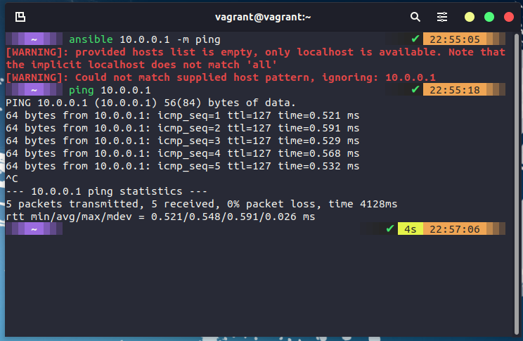
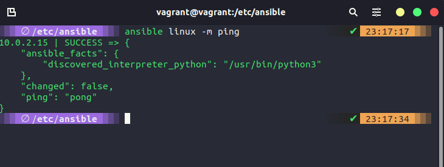

## Ansible: Bắt đầu

Chúng ta đã đề cập một chút về Ansible là gì trong [bài viết ngày hôm qua](day63.md) Nhưng chúng ta sẽ có một số thông tin bổ sung ở đây. Thứ nhất, Ansible là sản phẩm của RedHat. Thứ hai, agentless, kết nối thông qua SSH và chạy các câu lệnh. Thứ ba, nó đa nền tảng (Linux & macOS, WSL2) và là mã nguồn mở (cũng có tùy chọn trả phí cho doanh nghiệp).

### Cài đặt Ansible

Như bạn có thể đoán được, RedHat và team Ansible đã làm rất tốt việc tài liệu hoá Ansible. Việc cài đặt thường bắt đầu với các bước cài đặt mà bạn có thể tìm thấy [tại đây](https://docs.ansible.com/ansible/latest/installation_guide/intro_installation.html). Hãy nhớ rằng chúng ta đã nói rằng Ansible là một công cụ tự động hóa agentless, công cụ này được triển khai cho một hệ thống từ "Node điều khiển" - node điều khiển này sẽ quản lý máy và các thiết bị khác (có thể là mạng máy tính) thông qua SSH.

Trong tài liệu được liên kết ở trên, điều được chỉ rõ là node điều khiển không thể chạy hệ điều hành Windows.

Đối với node điều khiển của tôi và ít nhất là bài demo, tôi sẽ sử dụng máy ảo Linux mà chúng ta đã tạo lại trong [phần Linux](day20.md) làm node điều khiển của mình.

Hệ thống này đang chạy Ubuntu và chỉ cần các lệnh sau để cài đặt.

```Shell
sudo apt update
sudo apt install software-properties-common
sudo add-apt-repository --yes --update ppa:ansible/ansible
sudo apt install ansible
```

Bây giờ chúng ta đã cài đặt ansible trên node điều khiển của mình, bạn có thể kiểm tra điều này bằng cách chạy `ansible --version` và bạn sẽ thấy gì đó tương tự như bên dưới.


Trước khi chúng ta bắt đầu xem xét việc kiểm soát các node khác trong môi trường của mình, chúng ta cũng có thể kiểm tra chức năng của ansible bằng cách chạy một lệnh trên máy cục bộ của chúng ta `ansible localhost -m ping` sẽ sử dụng [Ansible Module](https://docs.ansible.com/ansible/2.9/user_guide/modules_intro.html) và đây là một cách nhanh chóng để thực hiện một tác vụ trên nhiều hệ thống khác nhau. Nó không thú vị lắm khi chúng ta chỉ có máy chủ lưu trữ cục bộ nhưng hãy tưởng tượng bạn muốn làm thứ gì đó hoặc đảm bảo rằng tất cả các hệ thống của bạn đã hoạt động khi bạn có hơn 1000 máy chủ và thiết bị.


Hoặc cách sử dụng thực tế cho một module có thể là `ansible webservers -m service -a "name=httpd state=started"` điều này sẽ cho chúng ta biết liệu tất cả máy chủ web có dịch vụ httpd đang chạy hay không. Thuật ngữ máy chủ web được sử dụng trong lệnh đó.

### hosts

Cách tôi sử dụng máy chủ cục bộ ở trên để chạy module ping trên hệ thống, tôi không thể chỉ định một máy khác trên mạng của mình, ví dụ: trong môi trường tôi đang sử dụng máy chủ Windows nơi VirtualBox đang chạy có bộ điều hợp mạng với IP 10.0.0.1 nhưng bạn có thể thấy bên dưới rằng tôi có thể ping tới nó nhưng tôi không thể sử dụng ansible để thực hiện tác vụ đó.



Để chúng ta chỉ định máy chủ của mình hoặc các node mà chúng ta muốn tự động hóa với các tác vụ này, chúng ta cần xác định chúng. Chúng ta có thể xác định chúng bằng cách điều hướng đến thư mục /etc/ansible trên hệ thống của bạn.


Tệp chúng ta muốn chỉnh sửa là tệp hosts, sử dụng trình soạn thảo văn bản, chúng ta có thể định nghĩa máy chủ của mình. Tệp hosts chứa nhiều hướng dẫn về cách sử dụng và sửa đổi tệp. Chúng ta sẽ cuộn xuống dưới cùng và sẽ tạo một nhóm mới có tên là [windows] và thêm địa chỉ IP `10.0.0.1` của chúng ta cho máy chủ lưu đó và lưu lại tệp.


Tuy nhiên, hãy nhớ rằng tôi đã nói rằng bạn sẽ cần có sẵn SSH để cho phép Ansible kết nối với hệ thống của bạn. Như bạn có thể thấy bên dưới khi tôi chạy `ansible windows -m ping`, chúng ta không thể truy cập được vì mọi thứ không kết nối được qua SSH.


Bây giờ tôi bắt đầu thêm một số máy chủ khác, một tên khác cho tệp này vì đây là nơi bạn sẽ xác định tất cả các thiết bị của mình, chẳng hạn như thiết bị mạng, bộ chuyển mạch và bộ định tuyến cũng sẽ được thêm vào đây và được phân nhóm. Mặc dù vậy, trong tệp hosts của chúng ta, tôi cũng đã thêm thông tin đăng nhập của mình để truy cập group Linux của hệ thống.


Bây giờ nếu chúng ta chạy `ansible Linux -m ping`, chúng ta sẽ thành công như bên dưới.



Sau đó, chúng ta có các yêu cầu về các nodes, đây là những hệ thống đích mà bạn muốn tự động hóa cấu hình. Chúng ta không cài đặt bất kỳ thứ gì cho Ansible trên những hệ thống này (ý tôi là chúng ta có thể đang cài đặt phần mềm nhưng không có ứng dụng khách nào từ Ansible mà chúng ta cần) Ansible sẽ thực hiện kết nối qua SSH và gửi tất cả mọi thứ qua qua SFTP.(Nếu bạn muốn và bạn đã định cấu hình SSH, bạn có thể sử dụng SCP và SFTP.)

### Các câu lệnh Ansible

Bạn đã thấy rằng chúng ta có thể chạy `ansible Linux -m ping` trên máy Linux của chúng ta và nhận được phản hồi, về cơ bản, với Ansible, chúng ta có thể chạy nhiều lệnh đặc biệt. [ad hoc commands](https://docs.ansible.com/ansible/latest/user_guide/intro_adhoc.html)


Nếu bạn thấy mình lặp lại các lệnh hoặc thậm chí tệ hơn là bạn phải đăng nhập vào các hệ thống riêng lẻ để chạy các lệnh này thì Ansible có thể trợ giúp. Ví dụ: lệnh đơn giản bên dưới sẽ cung cấp cho chúng ta đầu ra của tất cả các chi tiết hệ điều hành cho tất cả các hệ thống mà chúng ta thêm vào nhóm Linux của mình.
`ansible linux -a "cat /etc/os-release"`

Các trường hợp sử dụng khác có thể là khởi động lại hệ thống, sao chép tệp và quản lý người dùng. Bạn cũng có thể kết hợp các lệnh ad-hoc với các module Ansible.

Các lệnh ad-hoc sử dụng một mô hình khai báo, tính toán và thực hiện các hành động cần thiết để đạt được trạng thái cuối cùng được chỉ định. Chúng đạt được một dạng bình thường bằng cách kiểm tra trạng thái hiện tại trước khi chúng bắt đầu và sẽ không làm gì trừ khi trạng thái hiện tại khác với trạng thái cuối cùng được chỉ định.

## Tài liệu tham khảo

- [What is Ansible](https://www.youtube.com/watch?v=1id6ERvfozo)
- [Ansible 101 - Episode 1 - Introduction to Ansible](https://www.youtube.com/watch?v=goclfp6a2IQ)
- [NetworkChuck - You need to learn Ansible right now!](https://www.youtube.com/watch?v=5hycyr-8EKs&t=955s)

Hẹn gặp lại vào [ngày 65](day65.md).
