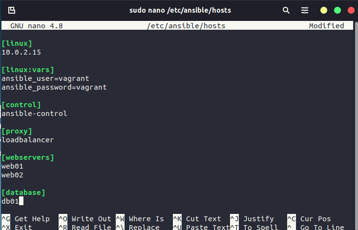
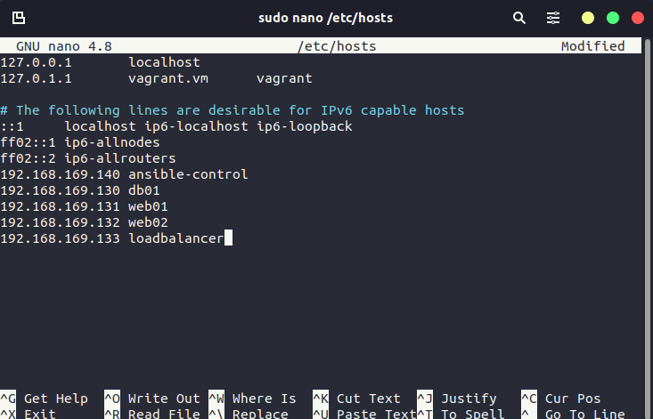
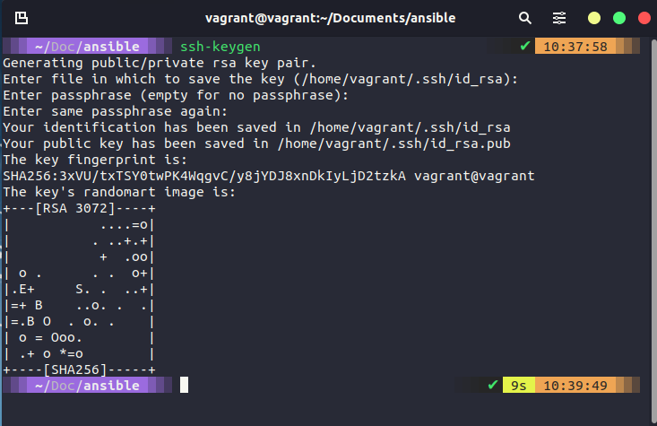
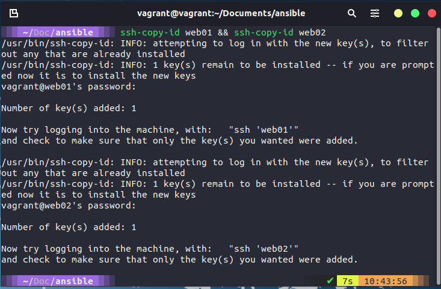
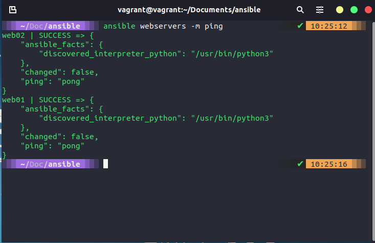

### Ansible Playbooks

Trong bài viết này, chúng ta sẽ xem xét lý do chính mà chúng ta sử dụng Ansible. Thật tuyệt khi chỉ cần thực hiện một lệnh duy nhất trên nhiều máy chủ khác nhau nhằm thực hiện các lệnh đơn giản như khởi động lại một danh sách dài các máy chủ thay vì phải kết nối với từng máy chủ một.

Nhưng còn việc sử dụng một hệ điều hành mới được cài đặt và khai báo các phần mềm và dịch vụ mà chúng ta muốn chạy trên hệ thống đó và đảm bảo rằng tất cả chúng đều chạy ở trạng thái mong muốn thì sao.

Đây là khi các playbook ansible xuất hiện. Playbook cho phép chúng ta sử dụng nhóm máy chủ của mình và thực hiện các tác vụ cấu hình và cài đặt đối với nhóm đó.

### Playbook format

Playbook > Plays > Tasks

Đối với bất kỳ ai chơi thể thao, bạn có thể đã bắt gặp thuật ngữ playbook, khi đó playbook là thứ cho cả đội biết bạn sẽ chơi như thế nào bao gồm nhiều plays (lượt chơi) và tasks (nhiệm vụ) khác nhau. Nếu chúng ta coi các plays là các tình huống cố định trong một môn thể thao, và các task (nhiệm vụ) được liên kết với mỗi play (lượt chơi), bạn có thể có nhiều tasks để tạo thành một play và trong playbook, bạn có thể có nhiều các plays khác nhau.

Các playbook này được viết bằng YAML (YAML không phải là ngôn ngữ đánh dấu), bạn sẽ tìm thấy rất nhiều phần mà chúng ta đã đề cập cho đến nay, đặc biệt là Containers và Kubernetes để thấy tầm quan trọng của các tệp cấu hình được định dạng YAML.

Chúng ta hãy xem một playbook đơn giản - playbook.yml.

```Yaml
- name: Simple Play
  hosts: localhost
  connection: local
  tasks:
    - name: Ping me
      ping:
    - name: print os
      debug:
        msg: "{{ ansible_os_family }}"
```

Chúng ta có thể tìm thấy file ở trên tại [simple_play](../../Days/Configmgmt/simple_play.yml). Nếu sau đó chúng ta sử dụng lệnh `ansible-playbook simple_play.yml`, chúng ta sẽ đi qua các bước sau.


Bạn có thể thấy nhiệm vụ đầu tiên là "thu thập các bước" đã xảy ra, nhưng chúng ta không kích hoạt hoặc yêu cầu điều này? Mô-đun này được playbook gọi tự động để thu thập các biến hữu ích về máy chủ từ xa. [ansible.buildin.setup](https://docs.ansible.com/ansible/latest/collections/ansible/builtin/setup_module.html)

Nhiệm vụ thứ hai của chúng ta là cài đặt ping, đây không phải là ping ICMP mà là tập lệnh python để báo cáo lại `pong` khi kết nối thành công với máy chủ hoặc máy chủ từ xa. [ansible.builtin.ping](https://docs.ansible.com/ansible/latest/collections/ansible/builtin/ping_module.html)

Sau đó, nhiệm vụ thứ ba hoặc thứ hai được xác định của chúng ta là nhiệm đầu tiên sẽ chạy trừ khi bạn tắt tính năng in ra thông báo cho chúng ta biết hệ điều hành hiện tại. Trong nhiệm vụ này, chúng ta đang sử dụng các điều kiện, chúng ta có thể chạy playbook này với tất cả các loại hệ điều hành khác nhau và nó sẽ trả về tên hệ điều hành.

```Yaml
tasks:
  - name: "shut down Debian flavoured systems"
    command: /sbin/shutdown -t now
    when: ansible_os_family == "Debian"
```

### Sử dụng vagrant để thiết lập môi trường

Chúng ta sẽ sử dụng Vagrant để thiết lập môi trường trên node của mình, tôi sẽ cài đặt số node là 4 để hợp lý nhưng bạn có thể kỳ vọng rằng con số này có thể dễ dàng tăng lên 300 hoặc 3000 và đây là sức mạnh của Ansible và các công cụ quản lý cấu hình khác giúp cấu hình máy chủ của bạn một cách dễ dàng.

Bạn có thể tìm thấy tệp này ở đây ([Vagrantfile](../../Days/Configmgmt/Vagrantfile))

```Vagrant
Vagrant.configure("2") do |config|
  servers=[
    {
      :hostname => "db01",
      :box => "bento/ubuntu-21.10",
      :ip => "192.168.169.130",
      :ssh_port => '2210'
    },
    {
      :hostname => "web01",
      :box => "bento/ubuntu-21.10",
      :ip => "192.168.169.131",
      :ssh_port => '2211'
    },
    {
      :hostname => "web02",
      :box => "bento/ubuntu-21.10",
      :ip => "192.168.169.132",
      :ssh_port => '2212'
    },
    {
      :hostname => "loadbalancer",
      :box => "bento/ubuntu-21.10",
      :ip => "192.168.169.134",
      :ssh_port => '2213'
    }

  ]

config.vm.base_address = 600

  servers.each do |machine|

    config.vm.define machine[:hostname] do |node|
      node.vm.box = machine[:box]
      node.vm.hostname = machine[:hostname]

      node.vm.network :public_network, bridge: "Intel(R) Ethernet Connection (7) I219-V", ip: machine[:ip]
      node.vm.network "forwarded_port", guest: 22, host: machine[:ssh_port], id: "ssh"

      node.vm.provider :virtualbox do |v|
        v.customize ["modifyvm", :id, "--memory", 2048]
        v.customize ["modifyvm", :id, "--name", machine[:hostname]]
      end
    end
  end

end
```

Sử dụng lệnh `vagrant up` để khởi động các máy này trong VirtualBox. Bạn có thể thêm nhiều bộ nhớ hơn và xác định một địa chỉ private_network khác cho mỗi máy nhưng cài đặt trên hoạt động trong môi trường của tôi. Hãy nhớ rằng môi trường của chúng ta là máy tính để bàn Ubuntu đã triển khai trong phần viết về Linux.

Nếu bạn có hạn chế về tài nguyên thì bạn cũng có thể chạy `vagrant up web01 web02` để chỉ khởi động các máy chủ web mà chúng ta đang sử dụng ở đây.

### Cấu hình máy chủ ansible

Bây giờ chúng ta đã sẵn sàng cho môi trường của mình, chúng ta có thể kiểm tra ansible để làm việc này, chúng ta sẽ sử dụng máy tính để bàn Ubuntu của mình (Bạn có thể sử dụng máy tính này nhưng bạn cũng có thể sử dụng bất kỳ máy dựa trên Linux nào trong mạng của mình để truy cập vào mạng bên dưới) để làm máy chủ điều khiển, chúng ta cũng hãy thêm các node mới vào nhóm trong tệp ansible hosts file, bạn có thể coi tệp này như một inventory, một giải pháp thay thế cho tệp này là một tệp inventory khác được gọi trong lệnh ansible với `-i filename`. Điều này có thể hữu ích so với việc sử dụng hosts file vì bạn có thể có các tệp khác nhau sử dụng cho các môi trường khác nhau, có thể là production, staging, test hoặc build. Bởi vì chúng ta đang sử dụng hosts file mặc định nên chúng ta không cần chỉ định nó.

Tôi đã thêm phần sau vào hosts file mặc định.


```Text
[control]
ansible-control

[proxy]
loadbalancer

[webservers]
web01
web02

[database]
db01

```



Trước khi tiếp tục, chúng ta muốn đảm bảo có thể chạy một lệnh trên các nodes của mình, hãy chạy `ansible nodes -m command -a hostname` lệnh đơn giản này sẽ kiểm tra xem chúng ta có kết nối hay không và báo cáo lại tên máy chủ của chúng ta.

Ngoài ra, lưu ý rằng tôi đã thêm các nodes và IP này vào node điều khiển Ubuntu của mình trong tệp /etc/hosts để đảm bảo nó có thể kết nối tới các máy chủ khác. Chúng ta cũng có thể cần thực hiện cấu hình SSH cho từng nodes từ máy chủ Ubuntu.

```Text
192.168.169.140 ansible-control
192.168.169.130 db01
192.168.169.131 web01
192.168.169.132 web02
192.168.169.133 loadbalancer
```



Ở giai đoạn này, chúng ta muốn nói tới việc thiết lập các khóa SSH giữa điều khiển của bạn và các nodes máy chủ của bạn. Đây là việc chúng ta sẽ làm tiếp theo, bạn cũng có thể thêm các biến vào hosts file của bạn để cung cấp tên người dùng và mật khẩu. Nhưng tôi khuyên các bạn không nên điều này vì nó không bao giờ là một thực hành tốt.

Để thiết lập SSH và chia sẻ giữa các nodes của bạn, hãy làm theo các bước bên dưới, bạn sẽ phải nhập mật khẩu (`vagrant`) và có thể bạn sẽ cần nhấn `y` vài lần để chấp nhận.

`ssh-keygen`



`ssh-copy-id localhost`


Bây giờ, nếu bạn đã bật tất cả các máy ảo của mình thì bạn có thể chạy `ssh-copy-id web01 && ssh-copy-id web02 && ssh-copy-id loadbalancer && ssh-copy-id db01` và bạn sẽ phải mật khẩu trong trường hợp của chúng ta và mật khẩu sẽ là `vagrant`

Tôi không chạy tất cả các máy ảo của mình mà chỉ chạy các máy chủ web nên tôi đã nhập lệnh `ssh-copy-id web01 && ssh-copy-id web02`



Trước khi chạy bất kỳ playbook nào, tôi muốn đảm bảo rằng tôi có kết nối tới các groups của mình, vì vậy tôi đã chạy lệnh `ansible webservers -m ping` để kiểm tra.



### Playbook Ansible "thực" đầu tiên 

Ansible playbook đầu tiên của chúng ta sẽ định cấu hình các máy chủ web, chúng ta đã nhóm các máy chủ này trong hosts file theo nhóm [webservers].

Trước khi chạy playbook của mình, chúng ta có thể xác nhận rằng web01 và web02 chưa cài đặt apache. Phần đầu của ảnh chụp màn hình bên dưới cho bạn thấy bố cục thư mục và tệp mà tôi đã tạo trong máy chủ ansible của mình để chạy playbook này, chúng ta có `playbook1 .yml`, sau đó trong thư mục mẫu, chúng ta có các tệp `index.html.j2` và `ports.conf.j2`.

Sau đó chúng ta SSH vào web01 để kiểm tra xem đã cài apache chưa?


Bạn có thể thấy ở phần trên rằng chúng ta chưa cài đặt apache trên web01, vì vậy chúng ta có thể khắc phục điều này bằng cách chạy playbook bên dưới.

```Yaml
- hosts: webservers
  become: yes
  vars:
    http_port: 8000
    https_port: 4443
    html_welcome_msg: "Hello 90DaysOfDevOps"
  tasks:
  - name: ensure apache is at the latest version
    apt:
      name: apache2
      state: latest

  - name: write the apache2 ports.conf config file
    template:
      src: templates/ports.conf.j2
      dest: /etc/apache2/ports.conf
    notify:
    - restart apache

  - name: write a basic index.html file
    template:
      src: templates/index.html.j2
      dest: /var/www/html/index.html
    notify:
    - restart apache

  - name: ensure apache is running
    service:
      name: apache2
      state: started

  handlers:
    - name: restart apache
      service:
        name: apache2
        state: restarted
```

Phân tích playbook ở trên:

- `- hosts: webservers` điều này có nghĩa là nhóm chạy playbook này là một nhóm có tên là webservers
- `become: yes` có nghĩa là người dùng đang chạy playbook của chúng ttaôi sẽ trở thành root trên các hệ thống được kết nối. Bạn sẽ phải nhập mật khẩu root.
- Sau đó, chúng ta có `vars` và nó dùng để xác định một số biến môi trường mà chúng ta muốn trong các máy chủ web của mình.

Tiếp theo, chúng ta bắt đầu các tasks,

- Task 1 là đảm bảo rằng apache đang chạy phiên bản mới nhất
- Task 2 là viết tệp tin port.conf từ nguồn của chúng ta được tìm thấy trong thư mục mẫu.
- Task 3 là tạo 1 file index.html cơ bản
- Task 4 là đảm bảo apache đang chạy

Cuối cùng, chúng ta có phần về handlers, [Handlers: Running operations on change](https://docs.ansible.com/ansible/latest/user_guide/playbooks_handlers.html)

"Đôi khi bạn muốn task chỉ chạy khi có thay đổi trên máy. Ví dụ: bạn có thể muốn khởi động lại dịch vụ nếu task cập nhật cấu hình của dịch vụ đó, còn nếu không có thay đổi thì không. Ansible sử dụng trình handlers để giải quyết điều này. Handlers là các task chỉ chạy khi được thông báo. Mỗi trình xử lý phải có một tên duy nhất trên toàn bộ các playbooks."

Ở giai đoạn này, bạn có thể nghĩ rằng chúng ta đã triển khai 5 máy ảo (bao gồm cả máy chủ Ubuntu hoạt động như Ansible Control của chúng ta) Các hệ thống khác sẽ hoạt động trong phần còn lại của bài viết này.

### Chạy playbook 

Bây giờ chúng ta đã sẵn sàng để chạy playbook trên các nodes của mình. Để chạy playbook, chúng ta có thể sử dụng `ansible-playbook playbook1.yml` Chúng ta đã xác định các máy chủ mà playbook sẽ chạy trong playbook và điều này sẽ hướng dẫn các tasks đã xác định.

Khi lệnh hoàn tất, chúng ta nhận được một đầu ra hiển thị các plays và tasks, quá trình này có thể mất một chút thời gian, bạn có thể thấy từ hình ảnh bên dưới rằng quá trình này đã mất một lúc để thực hiện và cài đặt trạng thái mong muốn.


Sau đó, chúng ta có thể kiểm tra lại điều này bằng cách nhảy vào một node và kiểm tra xem chúng ta đã cài đặt phần mềm trên node của mình chưa.


Để giải quyết vấn đề này vì chúng ta đã triển khai hai máy chủ web độc lập với phần trên, giờ đây chúng ta có thể điều hướng đến các IP tương ứng mà chúng ta đã xác định và nhận trang web mới của mình.


Chúng ta sẽ xây dựng trên playbook này khi chúng ta chuyển qua phần còn lại của phần này. Tôi cũng quan tâm đến việc sử dụng máy chủ Ubuntu của chúng ta và xem liệu chúng ta có thể khởi động các ứng dụng và cấu hình của mình bằng Ansible hay không. Bạn có thể thấy điều đó khi chúng ta có thể sử dụng local host trong các lệnh của mình, chẳng hạn như chúng ta cũng có thể chạy playbook đối với local host của mình.

Một điều khác cần bổ sung ở đây là chúng ta chỉ thực sự làm việc với máy ảo Ubuntu nhưng Ansible không hề biết tới các hệ thống đích. Các lựa chọn thay thế đã đề cập trước đây để quản lý hệ thống của bạn không thể mở rộng khi bạn sử dụng một số lượng lớn máy chủ, cộng với sự khó khăn ngay cả với 3 nodes. Chúng ta cũng có thể sử dụng shell script như đã đề cập trong phần Linux nhưng các node này có khả năng cao là sẽ khác nhau nên dù có thể thực hiện được nhưng sau đó cần một người để duy trì và quản lý các tập lệnh đó. Ansible miễn phí và dễ dàng hơn so với việc phải có một tập lệnh chuyên dụng.

## Tài liệu tham khảo

- [What is Ansible](https://www.youtube.com/watch?v=1id6ERvfozo)
- [Ansible 101 - Episode 1 - Introduction to Ansible](https://www.youtube.com/watch?v=goclfp6a2IQ)
- [NetworkChuck - You need to learn Ansible right now!](https://www.youtube.com/watch?v=5hycyr-8EKs&t=955s)
- [Your complete guide to Ansible](https://www.youtube.com/playlist?list=PLnFWJCugpwfzTlIJ-JtuATD2MBBD7_m3u)


Playlist cuối cùng được liệt kê ở trên có rất nhiều đoạn mã và ý tưởng cho bài viết này, nó là một video hướng dẫn tuyệt vời.

Hẹn gặp lại vào [ngày 66](day66.md)
