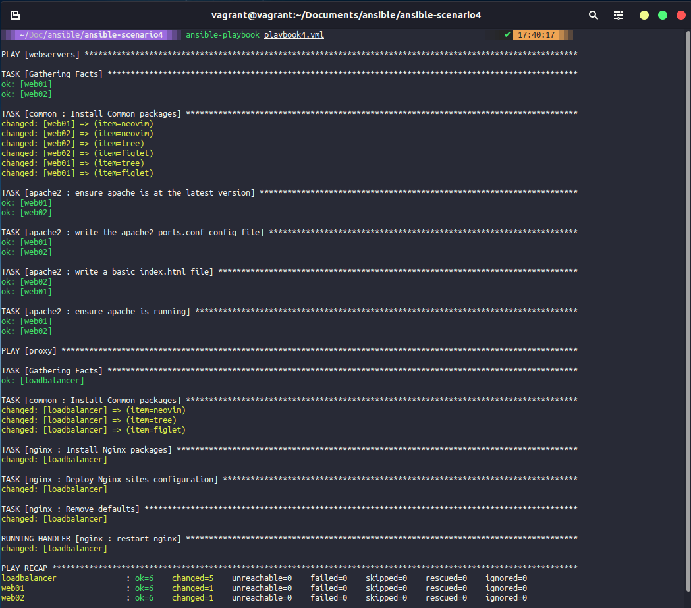
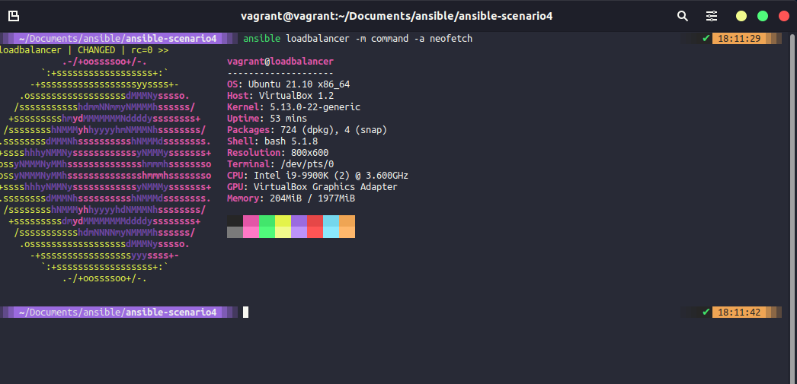

## Sử dụng Role & Triển khai Loadbalancer

Trong bài viết trước, chúng ta đã đề cập tới roles và sử dụng câu lệnh `asnsible-galaxy` để tạo ra cấu trúc thư mục cho một số role mà chúng ta đã sử dụng. Chúng ta đã hoàn thành việc dọn dẹp lại thư mục cho các mã cấu hình của mình vì mọi thứ được đặt vào các thư mục theo từng role.

Tuy nhiên, chúng ta mới chỉ sử dụng role apache2 và có một tệp playbook3.yaml để thiết lập các máy chủ web của chúng ta.

Tại thời điểm này, nếu bạn chỉ sử dụng lệnh `vagrant up web01 web02` thì bây giờ là lúc để chạy lệnh `vagrant up loadbalancer`, điều này sẽ khởi tạo một hệ thống chạy Ubuntu khá mà chúng ta sẽ sử dụng để làm Load Balancer/Proxy của mình.

Chúng ta đã định nghĩa máy này trong file host nhưng không có khoá ssh được định cấu hình cho tới khi nó khả dụng, chính vì thế chúng ta cũng cần chạy lệnh `ssh-copy-id loadbalancer` khi hệ thống đã hoạt động và sẵn sàng.

### Common role

Chúng ta đã tạo role `common` và cuối bài viết ngày hôm qua, common role sẽ được sử dụng trên tất cả các máy chủ của chúng ta trong khi các role khác dành riêng cho từng trường hợp sử dụng. Các ứng dụng chúng ta sắp cài đặt cũng sẽ phổ biến và được sử dụng trên các máy khác nhau. Trong thư mục roles, điều hướng đến thư mục tasks và bạn sẽ có một tệp mail.yml. Trong YAML này, chúng ta cần trỏ tệp mà đến install_tools.yml bằng cách thêm một dòng `- import_tasks: install_tools.yml`, dòng này từng là `include` nhưng nó sẽ sớm không được hỗ trợ nữa nên chúng ta sẽ sử dụng import_tasks.

```Yaml
- name: "Install Common packages"
  apt: name={{ item }} state=latest
  with_items:
  - neofetch
  - tree
  - figlet
```
Trong playbook của chúng ta, sau đó chúng ta sẽ thêm common role cho từng group máy chủ.

```Yaml
- hosts: webservers
  become: yes
  vars:
    http_port: 8000
    https_port: 4443
    html_welcome_msg: "Hello 90DaysOfDevOps - Welcome to Day 66!"
  roles:
    - common
    - apache2
```

### nginx

Giai đoạn tiếp theo là để chúng ta cài đặt và định cấu hình nginx trên máy ảo cân bằng tải. Giống như cấu trúc thư mục chung, chúng ta có thể cấu hình nginx theo bài viết trước.

Đầu tiên, chúng ta sẽ thêm một khối máy chủ vào playbook của mình. Khối này sẽ bao gồm common role và sau đó là role nginx mới.

Playbook có thể được tìm thấy tại đây [playbook4.yml](../../Days/Configmgmt/ansible-scenario4/playbook4.yml)

```Yaml
- hosts: webservers
  become: yes
  vars:
    http_port: 8000
    https_port: 4443
    html_welcome_msg: "Hello 90DaysOfDevOps - Welcome to Day 66!"
  roles:
    - common
    - apache2

- hosts: proxy
  become: yes
  roles:
    - common
    - nginx
```

Để nó có thể hoạt động, chúng ta phải định nghĩa các tasks mà chúng ta muốn chạy, theo cách tương tự, chúng ta sẽ sửa main.yml trong các tasks để nó trỏ tới hai tệp, một để cài đặt và một là để định cấu hình.

Có một số tệp khác mà tôi đã sửa dựa vào kết quả mà chúng ta mong muốn, hãy xem trong thư mục [ansible-scenario4](../../Days/Configmgmt/ansible-scenario4) để biết tất cả các tệp đã thay đổi. Bạn nên kiểm tra các thư mục tasks, handlers và templates trong thư mục ngĩn và bạn sẽ tìm thấy các tệp và thay đổi bổ sung đó.

### Chạy playbook đã được cập nhật

Kể từ hôm qua, chúng ta đã thêm common role để cài đặt một số packages trên hệ thống và cũng đã thêm role ngĩn bao gồm cài đặt và định cấu hình.

Hãy chạy playbook4.yml sử dụng câu lệnh `ansible-playbook playbook4.yml`



Bây giờ chúng ta đã định cấu hình webservers và loadbalancer và có thể truy cập http://192.168.169.134/, địa chỉ IP của bộ cân bằng tải (load balancer) của chúng ta.


Nếu bạn đang làm theo và không có có được trạng thái mong muốn thì rất có thể là do địa chỉ IP của máy chủ mà bạn đang có trong môi trường của mình. Có thể tìm thấy tệp này trong `templates\mysite.j2` và nó sẽ trông tương tự như ở dưới dây. Bạn cần cập nhật địa chỉ IP máy chủ web của mình.

```J2
    upstream webservers {
        server 192.168.169.131:8000;
        server 192.168.169.132:8000;
    }

    server {
        listen 80;

        location / {
                proxy_pass http://webservers;
        }
    }
```

Tôi khá tự tin rằng những gì chúng ta đã cài đặt đều tốt nhưng hãy sử dụng một lệnh ad-hoc thông qua ansible để kiểm tra việc cài đặt các công cụ chung này.

`ansible loadbalancer -m command -a neofetch`



## Tài liệu tham khảo

- [What is Ansible](https://www.youtube.com/watch?v=1id6ERvfozo)
- [Ansible 101 - Episode 1 - Introduction to Ansible](https://www.youtube.com/watch?v=goclfp6a2IQ)
- [NetworkChuck - You need to learn Ansible right now!](https://www.youtube.com/watch?v=5hycyr-8EKs&t=955s)
- [Your complete guide to Ansible](https://www.youtube.com/playlist?list=PLnFWJCugpwfzTlIJ-JtuATD2MBBD7_m3u)

Playlist cuối cùng được liệt kê ở trên có rất nhiều đoạn mã và ý tưởng cho bài viết này, nó là một video hướng dẫn tuyệt vời.

Hẹn gặp lại vào [ngày 68](day68.md)
