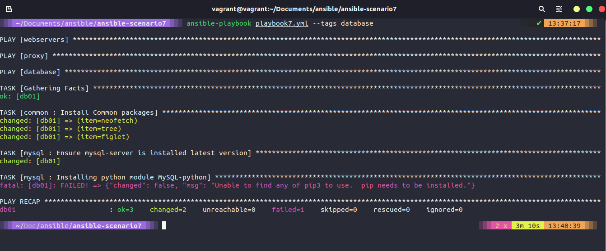

## Tags, Variables, Inventory & Database Server config

### Tags

Khi chúng ta hoàn thành playbook trong bài viết ngày hôm qua, chúng ta sẽ cần chạy mọi task và play trong playbook đó. Điều đó có nghĩa là chúng ta phải chạy các plays và tasks của webservers và loadbalancer đến bước hoàn thành.

Tuy nhiên, các tags có thể cho phép chúng ta tách biệt chúng ra nếu muốn. Đây là một cách hiệu quả nếu chúng ta có một playbook lớn và phức tạp trong môi trường của mình.

Trong tệp playbook, trong trường hợp này, chúng ta đang sử dụng [ansible-scenario5](../../Days/Configmgmt/ansible-scenario5/playbook5.yml)

```Yaml
- hosts: webservers
  become: yes
  vars:
    http_port: 8000
    https_port: 4443
    html_welcome_msg: "Hello 90DaysOfDevOps - Welcome to Day 66!"
  roles:
    - common
    - apache2
  tags: web

- hosts: proxy
  become: yes
  roles:
    - common
    - nginx
  tags: proxy
```

Chúng ta có thể xác nhận bằng cách sử dụng `ansible-playbook playbook5.yml --list-tags` mà danh sách các tags sẽ cho chúng ta biết các tags đã được định nghĩa trong playbook của mình.


Bây giờ, nếu chúng ta muốn chỉ muốn nhắm tới proxy, chúng ta có thể thực hiện điều này bằng cách chạy lệnh `ansible-playbook playbook5.yml --tags proxy` mà như các bạn thấy bên dưới, playbook sẽ chỉ chạy với proxy được chỉ định.


tags cũng có thể được thêm vào task để chúng ta có thể biết được chi tiết về nơi mà điều mà bạn muốn thực hiện. Đó có thể là các thẻ phân loại theo ứng dụng, chẳng hạn như chúng ta có thể xem qua các tasks và gắn thẻ cho chúng dựa trên cài đặt (installation), cấu hình (configuration) hoặc xoá (removal). Một thẻ rất hữu ích khác mà bạn có thể sử dụng là `tag: always`, nó sẽ đảm bảo bất kể --tags bạn sử dụng trong lệnh của mình, lệnh ansible-playbook sẽ luôn được chạy khi có tags này.

Chúng ta cũng có thể sử dụng nhiều tags với nhau và nếu chúng ta chạy `ansible-playbook playbook5.yml --tags proxy,web` thì nó sẽ chạy tất cả các thành phần có các tags đó. Rõ ràng, trong trường hợp của chúng ta, điều đó có nghãi giống như chạy toàn bộ playbook, nhưng nó sẽ trở nên có ích nếu chúng ta có thêm các plays mới được bổ sung.

Bạn cũng có thể cấu hình nhiều hơn 1 thẻ.

### Variables

Có hai loại biến chính trong Ansible.
- Ansible Facts
- User created

### Ansible Facts

Mỗi khi chúng ta chạy playbook của mình, chúng ta có một task không được định nghĩa gọi là "Gathering facts (Thu thập dữ kiện)", chúng ta có thể sự dụng các biến hoặc dữ kiện này để thực hiện việc tự động hoá các tác vụ của mình.


Nếu chúng ta chạy lệnh `ansible proxy -m setup` sẽ thấy nhiều đầu ra ở dạng JSON. Sẽ có nhiều thông tin trên terminal của bạn được sử dụng nên chúng ta muốn tạo một tệp để lưu trữ các thông tin đó bằng lệnh `ansible proxy -m setup >> facts.json` bạn có thể thấy tệp này trong tại đây [ansible-scenario5](../../Days/Configmgmt/ansible-scenario5/facts.json)


Nếu bạn mở tệp này, bạn có thể thấy tất cả các loại thông tin cho lệnh của chúng ta. Chugns ta có thể lấy địa chỉ IP, kiến trúc và phiên bản bios của mình. Rất nhiều thông tin hữu ích nếu chúng ta muốn sử dụng trong playbooks của mình.

Một ý tưởng có thể là sử dụng các biến này trong template cho nginx bằng tệp mysite.j2, nơi chúng ta hard-code các địa chỉ IP của các máy chủ web. Bạn có thể làm điều này bằng cách tạo một vòng lặp trong tệp mysite.j2 và nó sẽ duyệt các phần tử trong nhóm [webservers]. Điều này cho phép chúng ta có nhiều hơn 2 máy chủ web được tạo ra hoặc thêm vào trong cấu hình của bộ cân bằng tải này.

```
#Dynamic Config for server {{ ansible_facts['nodename'] }}
    upstream webservers {
  
        server {{ hostvars[host]['ansible_facts']['nodename'] }}:8000;
    
    }

    server {
        listen 80;

        location / {
                proxy_pass http://webservers;
        }
    }
```
Kết quả của phần trên sẽ giống như cấu hình hiện tại, nhưng nếu chúng ta thêm nhiều máy chủ web hoặc xoá đi một máy chủ thì nó sẽ tự động thay đổi cấu hình proxy. Để làm việc này, bạn cần cấu hình name resolution (NS).

### User created (Do người dùng tạo)

Các biến do người dùng tạo là những gì chúng ta tự tạo ra. Nếu bạn xem trong playbook, bạn sẽ thấy chúng ta có phần `vars:` và sau đó là danh sách 3 biến chúng ta đang sử dụng ở đây.

```Yaml
- hosts: webservers
  become: yes
  vars:
    http_port: 8000
    https_port: 4443
    html_welcome_msg: "Hello 90DaysOfDevOps - Welcome to Day 68!"
  roles:
    - common
    - apache2
  tags: web

- hosts: proxy
  become: yes
  roles:
    - common
    - nginx
  tags: proxy
```
Tuy nhiên, chúng ta có thể giữ cho playbook của mình không có biến bằng cách di chuyển chúng vào một tệp riêng biệt. Chúng ta sẽ làm điều này nhưng sẽ chuyển qua thư mục [ansible-scenario6](../../Days/Configmgmt/ansible-scenario6). Trong thư mục gốc của thư mục đó, chúng ta sẽ tạo thư mục group_vars. Sau đó, chúng ta tạo một thư mục khác với tên all (tất cả các group sẽ nhận các biến này). Trong đó, chúng ta sẽ tạo một tệp có tên `common_variables.yml` và chúng ta sẽ sao chép các biến của mình từ playbook vào tệp này. Xoá chúng khỏi playbook cùng với phần `vars:`.

```Yaml
http_port: 8000
https_port: 4443
html_welcome_msg: "Hello 90DaysOfDevOps - Welcome to Day 68!"
```
Bởi vì chúng ta đang liên kết như một biến toàn cục (global variable), chúng ta cũng có thể thêm vào các máy chủ NTP và DNS tạo đây. Các biến được đặt từ cấu trúc thư mục chúng ta đã tạo. Bạn có thể thấy playbook của chúng ta giờ đây trông rất gọn và sạch sẽ.

```Yaml
- hosts: webservers
  become: yes
  roles:
    - common
    - apache2
  tags: web

- hosts: proxy
  become: yes
  roles:
    - common
    - nginx
  tags: proxy
```
Một trong những biến đó là http_port, chúng ta có thể sử dụng lại biến này trong vòng lặp for của mình trong tệp mysite.j2 như bên dưới:

```J2
#Dynamic Config for server {{ ansible_facts['nodename'] }}
    upstream webservers {
  
        server {{ hostvars[host]['ansible_facts']['nodename'] }}:{{ http_port }};
    
    }

    server {
        listen 80;

        location / {
                proxy_pass http://webservers;
        }
    }
```
Chúng ta cũng có thể cấu hình một ansible fact trong tệp roles/apache2/templates/index.HTML.j2 để biết rằng chúng ta đang ở máy chủ web nào.

```J2
<html>

<h1>{{ html_welcome_msg }}! I'm webserver {{ ansible_facts['nodename'] }} </h1>

</html>
```
Kết quả của việc chạy lệnh `ansible-playbook playbook6.yml` với các thay đổi trong biến có nghĩa rằng khi chúng sẽ biết rằng máy chủ web nào đang được sử dụng khi chúng ta truy cập bộ cân bằng tải của mình.


Chúng ta cũng có thể thêm một thư mục có tên là host_vars và tạo một tệp web01.yml và có một thông báo cụ thể hoặc thay đổi giao diện trên mỗi máy chủ nếu chúng ta muốn.

### Inventory Files

Cho đến nay, chúng ta đã sử dụng host file mặc định trong thư mục /etc/ansible để xác định máy chủ của chúng ta. Tuy nhiên, chúng ta có thể có các tệp khác nhau cho các môi trường khác nhau, chẳng hạn như production và staging. Tôi sẽ không tạo ra nhiều môi trường hơn, nhưng chúng ta có thể tạo các host file của mình.

Chúng ta có thể tạo nhiều tệp cho nhiều server và node inventory khác nhau. Chúng ta sẽ gọi chúng bằng cách sử dụng lệnh `ansible-playbook -i dev playbook.yml`, bạn cũng có thể khai báo các biến trong host file của mình rồi in ra hoặc sử dụng biến đó ở một nơi khác trong playbook của bạn. Chẳng hạn như trong ví dụ về ở bài viết hướng dẫn tạo load balancer, chúng ta đã thêm các biến môi trường được tạo trong host file vào template của web page cho load balancer để hiển thị môi trường như một phần của thông báo trang web.

### Triển khai máy chủ Cơ sở dữ liệu

Chúng ta vẫn còn một máy nữa chưa được khởi động và cấu hình. Chúng ta có thể thực hiện điều này bằng cách sử dụng lệnh `vagrant up db01` tại nơi đặt Vagrantfile của chúng ta. Khi điều này hoàn tất và máy chủ có khả năng truy cập được, chúng ta cần đảm bẳo rằng khoá SSH được sao chép bằng cách sử dụng `ssh-copy-id db01` để có thể truy cập nó.

Chugns ta sẽ làm việc với thư mục [ansible-scenario7](../../Days/Configmgmt/ansible-scenario7).

Sau đó, sử dụng lệnh `ansible-galaxy init roles/mysql` để tạo một cấu trúc thư mục mới cho role "MySQL".

Trong playbook của chúng ta, chúng ta sẽ thêm một play block mới cho cấu hình cơ sở dữ liệu. Chúng ta có cơ sở dữ liệu được xác định trong tệp /etc/ansible/hosts. Sau đó, gắn role common và role mới MySQL mới được tạo tại bước trước vào group database (cơ sở dữ liệu). Chúng ta cũng sẽ đánh tag group này với tag database, điều này như đã thảo luận lúc trước, cho phép chúng ta có thể chạy playbook với một thẻ mong muốn.

```Yaml
- hosts: webservers
  become: yes
  roles:
    - common
    - apache2
  tags:
    web

- hosts: proxy
  become: yes
  roles:
    - common
    - nginx
  tags:
    proxy

- hosts: database
  become: yes
  roles:
    - common
    - mysql
  tags: database
```
Trong cấu trúc thư mục roles, chúng ta sẽ có ba tệp được tạo tự động, chúng ta cần điền các thông tin sau.

Handlers - main.yml

```Yaml
# handlers file for roles/mysql
- name: restart mysql
  service:
    name: mysql
    state: restarted
```

Tasks - install_mysql.yml, main.yml & setup_mysql.yml

install_mysql.yml - Task này sẽ được sử dụng để cài đặt MySQL và đảm bảo rằng dịch vụ đang chạy.

```Yaml
- name: "Install Common packages"
  apt: name={{ item }} state=latest
  with_items:
   - python3-pip
   - mysql-client
   - python3-mysqldb
   - libmysqlclient-dev

- name: Ensure mysql-server is installed latest version
  apt: name=mysql-server state=latest

- name: Installing python module MySQL-python
  pip:
    name: PyMySQL

- name: Ensure mysql-server is running
  service:
    name: mysql
    state: started
```

main.yml là một tệp con trỏ đề xuất chúng ta import_tasks từ các tệp này

```Yaml
# tasks file for roles/mysql
- import_tasks: install_mysql.yml
- import_tasks: setup_mysql.yml
```

setup_mysql.yml - Task này sẽ tạo database và database user.

```Yaml
- name: Create my.cnf configuration file
  template: src=templates/my.cnf.j2 dest=/etc/mysql/conf.d/mysql.cnf
  notify: restart mysql

- name: Create database user with name 'devops' and password 'DevOps90' with all database privileges
  community.mysql.mysql_user:
    login_unix_socket: /var/run/mysqld/mysqld.sock
    login_user: "{{ mysql_user_name }}"
    login_password: "{{ mysql_user_password }}"
    name: "{{db_user}}"
    password: "{{db_pass}}"
    priv: '*.*:ALL'
    host: '%'
    state: present

- name: Create a new database with name '90daysofdevops'
  mysql_db:
    login_user: "{{ mysql_user_name }}"
    login_password: "{{ mysql_user_password }}"
    name: "{{ db_name }}"
    state: present
```
Bạn có thể thấy ở phần trên, chúng ta đang sử dụng một số biến để xác định một số cấu hình, chẳng hạn như mật khẩu, tên người dùng và các databases, tất cả chúng được lưu trữ trong tệp group_vars/all/common_variables.yml.

```Yaml
http_port: 8000
https_port: 4443
html_welcome_msg: "Hello 90DaysOfDevOps - Welcome to Day 68!"

mysql_user_name: root
mysql_user_password: "vagrant"
db_user: devops
db_pass: DevOps90
db_name: 90DaysOfDevOps
```
Chúng ta cũng có tệp my.cnf.j2 trong thư mục mẫu, giống như dưới đây:

```J2
[mysql]
bind-address = 0.0.0.0
```

### Chạy playbook

Bây giờ, chúng ta đã thiết lập và chạy máy ảo và có các tệp cấu hình và sẵn sàng để chạy playbook của mình. Playbook này sẽ bao gồm tất cả những hệ thống trước đó nếu chúng ta chạy câu lệnh `ansible-playbook playbook7.yml` hoặc chúng ta có thể chọn chỉ triển kahi group database bằng lệnh `ansible-playbook playbook7.yml --tags database`, nó sẽ chỉ chạy các tệp cấu hình mới.

Tôi chỉ chạy với tag database nhưng tình cờ gặp lỗi. Lỗi này cho tôi biết rằng chúng ta chưa cài đặt pip3 (Python). Chúng ta có thể khắc phục bằng các thêm phần nào vào các common task và cài đặt



Sử lỗi ở trên và chạy lại playbook thành công.


Có lẽ chúng ta nên đảm bảo rằng mọi thứ đều đúng như cách chúng ta muốn trên máy chủ db01 mới được cấu hình của chúng ta. Có thể kiểm tra từ control node bằng cách sử dụng lệnh `ssh db01`.

Để kết nối tới MySQL tôi sử dụng lệnh `sudo /usr/bin/mysql -u root -p` và nhập password cho user root trên dòng lệnh.

Khi đã kết nói, trước tên, hãy đảm bảo rằng chúng ta đã tạo người dùng của mình với tên DevOps. `select user, host from mysql.user;`


Bây giờ chúng ta có thể thử chạy lệnh `SHOW DATABASES;` để kiểm tra xem cơ sở dữ liệu mới của chúng ta đã được tạo hay chưa.


Tôi đang sử dụng root để kết nối nhưng cũng có thể đăng nhập sử dụng tài khoản DevOps theo cách tương tự. sử dụng lệnh `sudo /usr/bin/MySQL -u devops -p` nhưng với mật khẩu DevOps90.

Mội điều mà tôi đã phát hiện ra, trong tệp `setup_mysql.yml` tôi phải thêm dòng `login_unix_socket: /var/run/mysqld/mysqld.sock` để kết nối thàng công tới instance db01 chạy MySQL và bây giờ, mỗi khi tôi chạy dòng này, nó sẽ báo có một thay đổi khi tạo người dùng mới, tôi đang tìm kiếm một đề xuất để cài thiện. 

## Tài liệu tham khảo

- [What is Ansible](https://www.youtube.com/watch?v=1id6ERvfozo)
- [Ansible 101 - Episode 1 - Introduction to Ansible](https://www.youtube.com/watch?v=goclfp6a2IQ)
- [NetworkChuck - You need to learn Ansible right now!](https://www.youtube.com/watch?v=5hycyr-8EKs&t=955s)
- [Your complete guide to Ansible](https://www.youtube.com/playlist?list=PLnFWJCugpwfzTlIJ-JtuATD2MBBD7_m3u)

Playlist cuối cùng được liệt kê ở trên có rất nhiều đoạn mã và ý tưởng cho bài viết này, nó là một video hướng dẫn tuyệt vời.

Hẹn gặp lại vào [ngày 69](day69.md)

