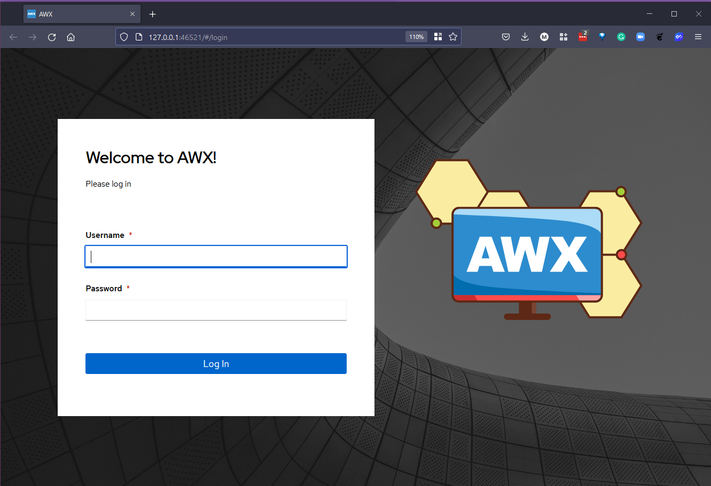

## Tất cả những thứ còn lại của Ansible - Automation Controller, AWX, Vault

Để kết thúc phần về Quản lý cấu hình, tôi muốn xem xét các lĩnh vực khác mà bạn có thể gặp phải khi làm việc với Ansible.

Có rất nhiều sản phẩm tạo nên nền tảng tự động hoá sử dụng Ansible

Red Hat Ansible Automation Platform là nền tảng để xây dựng và vận hành tự động hoá trong toàn tổ chức. Nền tảng này bao gồm tất cả các công cụ cần thiết để tự động hoá toàn doanh nghiệp.


Tôi sẽ cố gắng và trình bày một số trong các công cụ này ở bài viết này. Nhưng để biết thêm các thông tin đầy đủ thì các bạn nên tham khảo trang web chính thức của Red Hat Ansible. [Ansible.com](https://www.ansible.com/?hsLang=en-us)

### Ansible Automation Controller | AWX

Tôi đã kết hợp hai công cụ này với nhau vì Automation Controller và AWX có chức năng tương tự nhau.

Dự án AWX hay viết tắt là AWX là một dự án cộng đồng mã nguồn mở, được tài trợ bởi Red Hat, cho phép bạn kiểm soát tốt hơn các dự án Ansible trong môi trường của mình. AWX là dự án mà từ đó automation controller được tạo ra.

Nếu bạn đang tìm kiếm một giải pháp cho doanh nghiệp thì bạn nên xem xét Automation Controller hoặc bạn có thể đã nghe tới cái tên Ansible Tower. Ansible Automation Controller là control plan cho nền tảng tự động của Ansible (Ansible Automation Platform).

Cả AWX và Automation Controller có những tính năng sau trong tất cả những tính năng khác mà chúng ta đã đề cập trong loạt bài viết này cho tới thời điểm hiện tại.

- Giao diện người dùng
- Kiểm soát truy cập dựa trên role (Role-Based Access Control)
- Quy trình làm việc (Workflows)
- Tích hợp CI/CD

Automation Controller là giải pháp cho doanh nghiệp mà bạn cần trả tiền cho sự hỗ trợ từ Red Hat.

Chúng ta sẽ nói tới việc triển khai AWX trong môi trường Kubernetes sử dụng minikube.

### Triển khai Ansible AWX

AWX không cần phải triển khai trên một Kubernetes cluster, [github](https://github.com/ansible/awx) của AWX sẽ cung cấp các bạn các thông tin chi tiết. Tuy nhiên, bắt đầu từ phiên bản 18.0, AWX Operator là cách cài đặt được khuyến nghị.

Trước hết, chúng ta cần một minikube cluster. Chúng ta có thể làm điều này giống như trong phần Kubernetes bằng cách tạo một minikube cluster bằng lệnh `minikube start --cpus=4 --memory=6g --addons=ingress`.


Bạn có thể xem tài liệu chính thức của [Ansible AWX Operator](https://github.com/ansible/awx-operator) tại đây. Theo như hướng dẫn cài đặt, bạn nên sao chép repository này rồi chạy các deployment trong đó.

Tôi đã fork repo ở trên và để nó tại `git clone https://github.com/MichaelCade/awx-operator.git`, lời khuyên của tôi là bạn nên làm điều tương tự nhưng không sử dụng repository của tôi vì có thể tôi đã thay đổi một số thứ cũng như xoá repository đó.

Trong repository, bạn sẽ thấy tệp awx-demo.yml, chúng ta cần đổi từ `NodePort` thành `ClusterIP` như bên dưới:

```Yaml
---
apiVersion: awx.ansible.com/v1beta1
kind: AWX
metadata:
  name: awx-demo
spec:
  service_type: ClusterIP
```

Bước tiếp theo là khai báo namespace, nơi chúng ta sẽ triển khai awx operator, sử dụng lệnh `export NAMESPACE=awx` sau đó là `make deploy` để bắt đầu triển khai.


Khi kiểm tra, chúng ta đã có namespace mới và awx-operator-controller pod chạy trong name space đó. `kubectl get pods -n awx`


Trong repo được clone, bạn sẽ tìm thấy một tệp có tên awx-demo.yml mà chúng ta muốn triển khai trên Kubernetes cluster và awx namespace. `kubectl create -f awx-demo.yml -n awx`


Bạn có thể theo dõi quá trình với lệnh `kubectl get pods -n awx -w`.

Bạn sẽ thấy gì đó giống với ảnh mà bạn nhìn thấy mọi dưới khi mọi thứ chạy một cách bình thường.


Bây giờ, chúng ta có thể truy cập tới awx deployment của mình khi chạy lệnh sau trên một terminal mới `minikube service awx-demo-service --url -n $NAMESPACE` để có thể truy cập từ một minikube ingress.


Sau đó, nếu chúng ta mởi trình duyệt và truy cập đến địa chỉ đó, bạn có thể thấy chúng ta phải nhập tên người dùng và mật khẩu.



Tên người dùng mặc định là admin, để lấy mật khẩu, chúng ta có thể chạy lệnh sau đây `kubectl get secret awx-demo-admin-password -o jsonpath="{.data.password}" -n awx| base64 --decode`


Nó sẽ cung cấp cho bạn một giao diện người dùng để quản lý các playbook, tasks quản lý cấu hình của bạn tại một địa điểm tập trung, nó cũng cho phép bạn làm việc theo nhóm với tất cả những tác vụ chúng ta đã làm cho đến nay trong loạt bài viết này, nó giống với một ansible controler.

Đây là một trong những phần mà bạn có thể thử và dành một khoảng thời gian sử dụng để xem qua các chức năng khác của công cụ này.

Tôi sẽ nhắc tới một tài nguyên rất chất lượng từ Jeff Geerling, nó sẽ có rất nhiều chi tiết cụ thể khi sử dụng Ansible AWX. [Ansible 101 - Episode 10 - Ansible Tower and AWX](https://www.youtube.com/watch?v=iKmY4jEiy_A&t=752s)

Trong video này, anh ấy cũng đi sâu, chi tiết về sự khác biệt giữa Automation Controller (trước đây là Ansible Tower) và Ansible AWX (miễn phí và mã nguồn mở).

### Ansible Vault

`ansible-vault` cho phép chúng ta mã hoá và giải mã các tệp dữ liệu Ansible. Trong suốt phần này, chúng ta đã bỏ qua việc này và đã để một số thông tin nhạy cảm của chúng ta dưới dạng text.

Được tích hợp trong tệp nhị phân của Ansible binary, chúng ta có `ansible-vault` cho phép chúng ta có thể giấu đi những thông tin nhạy cảm.


Secrets Management đã trở thành một lĩnh vực khác mà đáng ra chúng ta nên dành ra nhiều thời gian hơn với một số công cụ khác như HashiCorp Vault hay AWS Key Management Service. Tôi sẽ đánh đầu đây là một lĩnh vực cần được tìm hiểu sâu hơn.

Chúng ta cũng có một tài liệu chất lượng cùng demo để theo dõi từ Jeff Geerling [Ansible 101 - Episode 6 - Ansible Vault and Roles](https://www.youtube.com/watch?v=JFweg2dUvqM)

### Ansible Galaxy (Docs)

Bây giờ, chúng ta đã từng sử dụng `ansible-galaxy` để tạo một số roles và cấu trúc tệp cho dự án demo. Tuy nhiên, chúng ta cũng có [Ansible Galaxy documentation](https://galaxy.ansible.com/docs/)

"Galaxy là một hub để tìm kiếm và chia sẻ nội dung của Ansible."

### Kiểm thử với Ansible

- [Ansible Molecule](https://molecule.readthedocs.io/en/latest/) - Dự án được thiết kế để hỗ trợ việc phát triển và kiểm thử Ansible roles

- [Ansible Lint](https://ansible-lint.readthedocs.io/en/latest/) - Công cụ CLI cho việc linting playbooks, roles và collections

### Các tài nguyên khác

- [Ansible Documentation](https://docs.ansible.com/ansible/latest/index.html)

## Tài liệu tham khảo

- [What is Ansible](https://www.youtube.com/watch?v=1id6ERvfozo)
- [Ansible 101 - Episode 1 - Introduction to Ansible](https://www.youtube.com/watch?v=goclfp6a2IQ)
- [NetworkChuck - You need to learn Ansible right now!](https://www.youtube.com/watch?v=5hycyr-8EKs&t=955s)
- [Your complete guide to Ansible](https://www.youtube.com/playlist?list=PLnFWJCugpwfzTlIJ-JtuATD2MBBD7_m3u)

Playlist cuối cùng được liệt kê ở trên có rất nhiều đoạn mã và ý tưởng cho bài viết này, nó là một video hướng dẫn tuyệt vời.

Bài đăng này kết thúc phần về quản lý cấu hình, tiếp theo chúng ta sẽ chuyển qua phần về CI/CD Pipelines và một số công cụ và quy trình mà chúng ta có thể thấy và sử dụng để đạt được quy trình làm việc cho quá trình phát triển và phát hành ứng dụng.

Hẹn gặp lại vào [ngày 70](day70.md)
